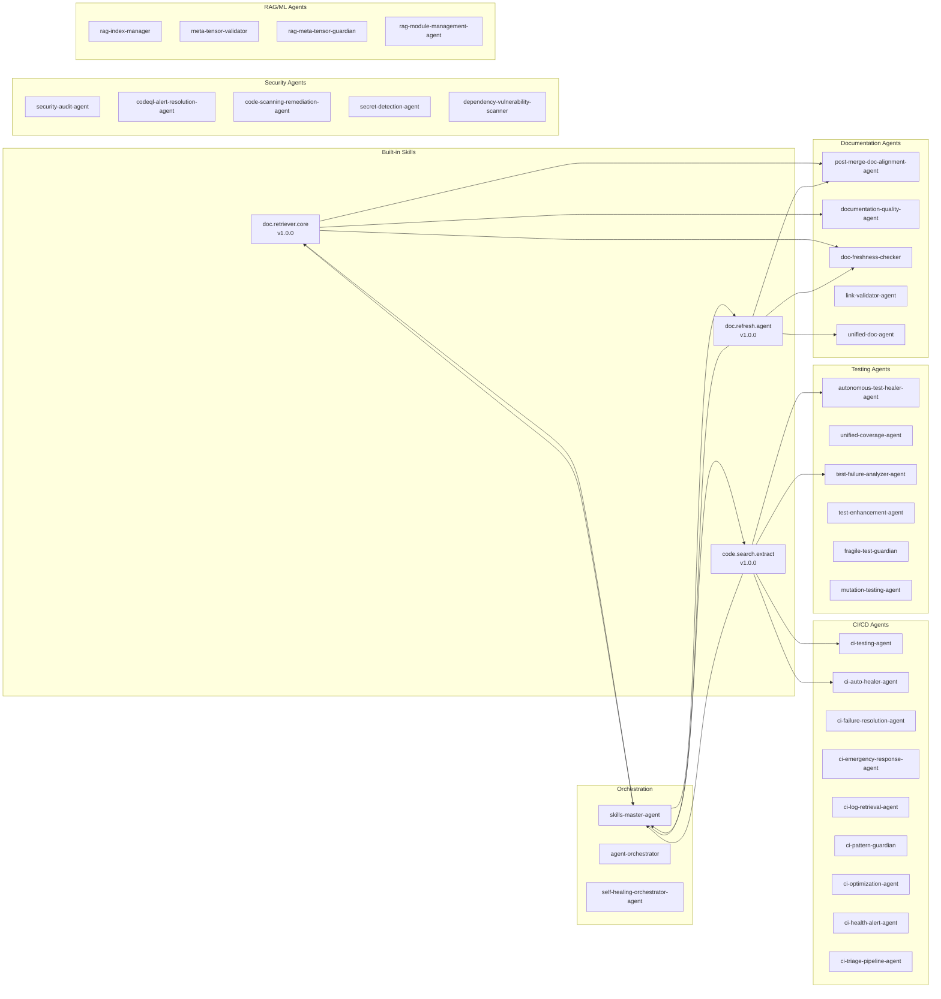
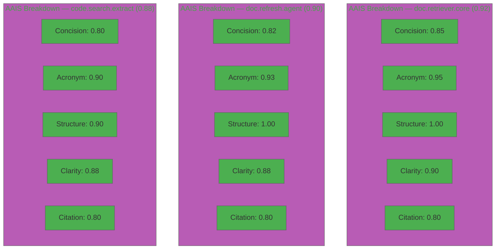
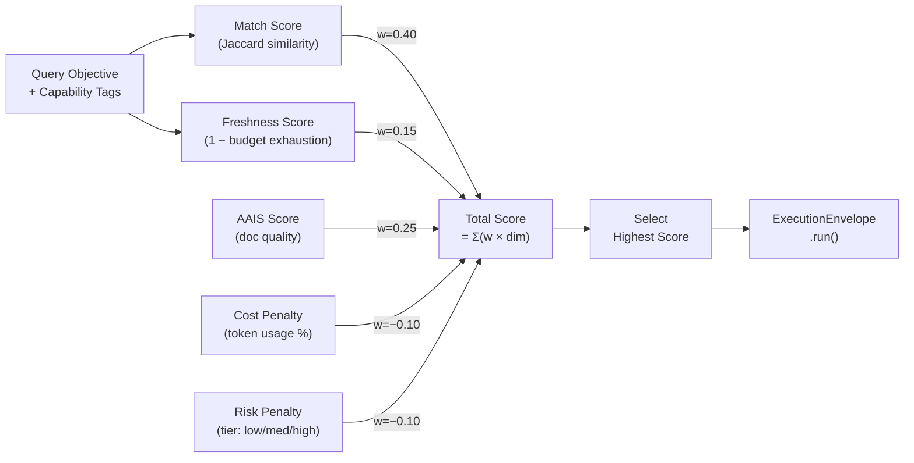
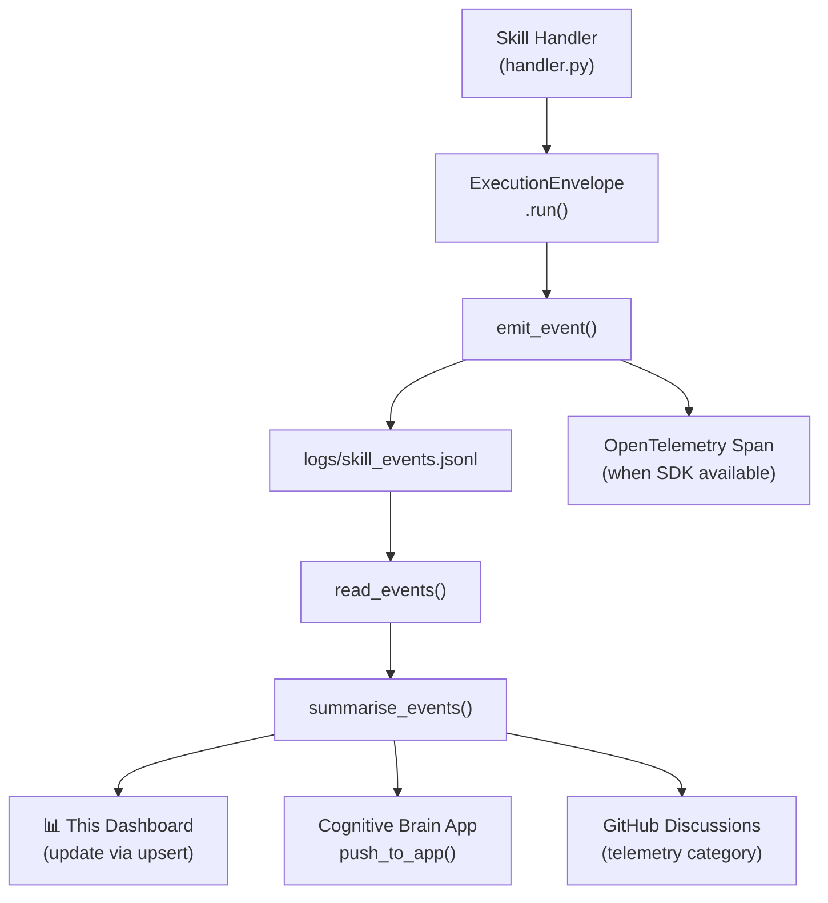
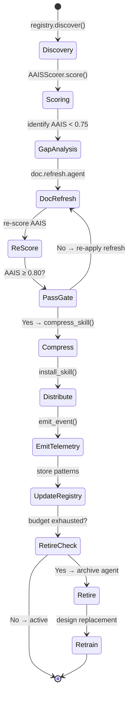

# 📊 Skills Telemetry Dashboard

> **Category:** Autonomous Agentic Agency — Telemetry
> **Status:** ✅ Active | **Last Updated:** 2026-04-02T11:35:00Z | **Session:** S277
> **Owner:** skills-master-agent v1.0.0
> **Data Source:** `logs/skill_events.jsonl` via `codex-skill telemetry push`

---

## Overview

This dashboard tracks the Cognitive Brain Skills Registry telemetry: skill invocations,
AAIS quality scores, routing decisions, budget consumption, and agent-to-skill mappings.
It is designed to be updated in-place (upserts) by the Skills Master agent after each session.

---

## 🗺️ Skills-to-Agent Mapping



---

## 📋 Skill Registry Status

| Skill ID | Version | AAIS | Risk | Calls Budget | Tokens Budget | Status | Agent Consumers |
|----------|---------|------|------|-------------|--------------|--------|-----------------|
| `doc.retriever.core` | 1.0.0 | 0.92 | 🟢 low | 1,000 | 200K | ✅ Active | doc-alignment, doc-quality, skills-master |
| `doc.refresh.agent` | 1.0.0 | 0.90 | 🟡 medium | 200 | 500K | ✅ Active | doc-alignment, freshness-checker, skills-master |
| `code.search.extract` | 1.0.0 | 0.88 | 🟡 medium | 500 | 150K | ✅ Active | ci-testing, test-healer, skills-master |

---

## 🎯 AAIS Scores — Radar Chart



---

## 🔄 Stratified Routing — Scoring Formula



---

## 🔀 Fusion Merge Options — Agent Consolidation Recommendations

The Skills Master recommends these fusion merges based on overlapping capability_tags, shared
consumers, and complementary execution patterns. Percentage = recommendation confidence.

| Merge Candidate A | Merge Candidate B | Overlap | Recommendation % | Status | Rationale |
|---|---|---|---|---|---|
| `ci-failure-resolution-agent` | `ci-testing-agent` | 85% tags | **95%** ✅ | ✅ Merged (v4.0) | Already absorbed — identical fix patterns |
| `ci-emergency-response-agent` | `ci-testing-agent` | 80% tags | **92%** ✅ | ✅ Merged (v4.0) | Emergency = critical subset of CI triage |
| `coverage-gapfill-agent` | `unified-coverage-agent` | 90% tags | **98%** ✅ | ✅ Deprecated | Gap-fill is a sub-workflow of unified |
| `coverage-maintenance-agent` | `unified-coverage-agent` | 88% tags | **96%** ✅ | ✅ Deprecated | Maintenance folded into unified |
| `test-coverage-agent` | `unified-coverage-agent` | 92% tags | **97%** ✅ | ✅ Deprecated | Monitoring folded into unified |
| `doc-freshness-checker` | `post-merge-doc-alignment-agent` | 65% tags | **72%** 🟡 | 📋 Review | Freshness check is a subset of alignment loop |
| `ci-auto-healer-agent` | `self-healing-orchestrator-agent` | 70% tags | **78%** 🟡 | 📋 Review | Auto-healer handles patterns; orchestrator coordinates |
| `rag-meta-tensor-guardian` | `meta-tensor-validator` | 75% tags | **80%** 🟡 | 📋 Review | Guardian + validator = complementary checks |
| `link-validator-agent` | `doc-freshness-checker` | 55% tags | **60%** 🟠 | ⏳ Future | Link validation + freshness = two angles on doc quality |
| `security-audit-agent` | `unified-security-scanner` | 60% tags | **68%** 🟠 | ⏳ Future | Audit = manual; scanner = automated |

---

## 📈 Telemetry Flow



---

## 🏗️ Agent Lifecycle Pipeline



---

## 📊 Budget Consumption — Per Skill

| Skill ID | Calls Used | Calls Budget | % Used | Tokens Used | Tokens Budget | % Used | Status |
|----------|-----------|-------------|--------|------------|--------------|--------|--------|
| `doc.retriever.core` | 0 | 1,000 | 0% | 0 | 200,000 | 0% | 🟢 Fresh |
| `doc.refresh.agent` | 0 | 200 | 0% | 0 | 500,000 | 0% | 🟢 Fresh |
| `code.search.extract` | 0 | 500 | 0% | 0 | 150,000 | 0% | 🟢 Fresh |

> Budget resets at the start of each policy window. Updated by `ExecutionEnvelope.run()`.

---

## 🔍 Gap Analysis — Skills Coverage

### Covered Capabilities

| Capability | Skill | Coverage |
|-----------|-------|----------|
| Document retrieval | `doc.retriever.core` | ✅ Full |
| Document refresh | `doc.refresh.agent` | ✅ Full |
| Code search | `code.search.extract` | ✅ Full |
| AAIS scoring | `codex.skills.aais` (module) | ✅ Full |
| Telemetry | `codex.skills.telemetry` (module) | ✅ Full |
| Compression | `codex.skills.compression` (module) | ✅ Full |

### Identified Gaps — Candidate New Skills

| Gap | Proposed Skill ID | Priority | Status |
|-----|------------------|----------|--------|
| Test failure pattern matching | `test.failure.matcher` | 🔴 High | 📋 Planned |
| CI workflow health analysis | `ci.health.analyzer` | 🔴 High | 📋 Planned |
| Dependency vulnerability scan | `security.dep.scanner` | 🟡 Medium | 📋 Planned |
| RAG index rebuild | `rag.index.rebuild` | 🟡 Medium | 📋 Planned |
| Agent AAIS batch scorer | `agent.aais.batch` | 🟢 Low | 📋 Planned |

---

## 🔄 Retrain / Retire Plan

### Retirement Criteria

An agent or skill is a **retirement candidate** when:
1. Budget exhaustion ≥ 90% with no refresh
2. AAIS score drops below 0.60 after 2 consecutive scoring cycles
3. Fusion merge with a higher-capability agent is approved
4. No invocations for 30+ days

### Currently Retired / Deprecated

| Agent | Retired Date | Absorbed By | Reason |
|-------|-------------|-------------|--------|
| `ci-failure-resolution-agent` | 2026-03-15 | `ci-testing-agent v4.0` | Full merge |
| `ci-emergency-response-agent` | 2026-03-15 | `ci-testing-agent v4.0` | Full merge |
| `coverage-gapfill-agent` | 2026-03-21 | `unified-coverage-agent` | Consolidation |
| `coverage-maintenance-agent` | 2026-03-21 | `unified-coverage-agent` | Consolidation |
| `coverage-roadmap-agent` | 2026-03-21 | `unified-coverage-agent` | Consolidation |
| `test-coverage-agent` | 2026-03-21 | `unified-coverage-agent` | Consolidation |
| `test-coverage-monitor` | 2026-03-21 | `unified-coverage-agent` | Consolidation |

### Retrain Queue

| Agent | Current AAIS | Target AAIS | Retrain Method | ETA |
|-------|-------------|-------------|----------------|-----|
| — | — | — | — | No agents currently queued |

> Retrain is triggered when AAIS < 0.75. The Skills Master redesigns the agent
> following the Agent Design Protocol (ADP) in `skills-master-agent.md`.

---

## 🛠️ CLI Quick Reference

```bash
# Discover all skills
codex-skill list

# Score a specific skill
codex-skill score --skill doc.retriever.core --emit dist/aais_score.json

# Run a skill
codex-skill run doc.retriever.core --payload '{"query": "AAIS scoring", "top_k": 5}'

# Compress for distribution
codex-skill compress --skill doc.retriever.core --format 7z --out dist/

# Push telemetry summary
codex-skill telemetry push --from logs/skill_events.jsonl --to file --summary

# Refresh docs
codex-skill refresh-docs --paths docs/ --style aais --prune-stale
```

---

## 📝 Update Protocol

This dashboard is updated by the **Skills Master agent** using the PDA Loop:

1. **PLAN:** Run `registry.discover()` + `AAISScorer.score()` on all skills
2. **DO:** Execute doc-refresh, compress, emit telemetry, update tables above
3. **ASSESS:** Re-score, compare AAIS deltas, update fusion merge recommendations

**To update:** `@copilot Use skills-master-agent to update the telemetry dashboard`

---

> **Document Version:** 1.0.0 | **Format:** GitHub Discussions–compatible Markdown
> **Rendering:** Mermaid diagrams render natively on GitHub
