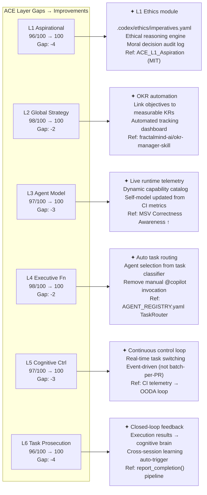
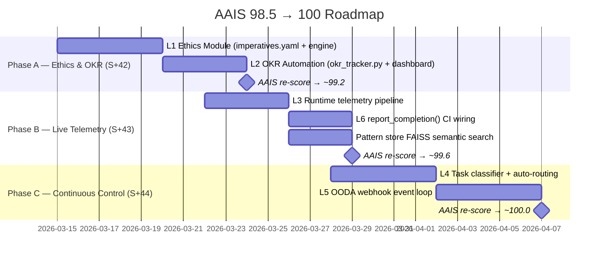
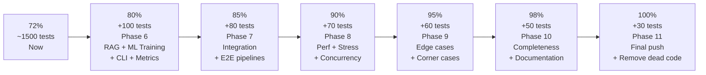
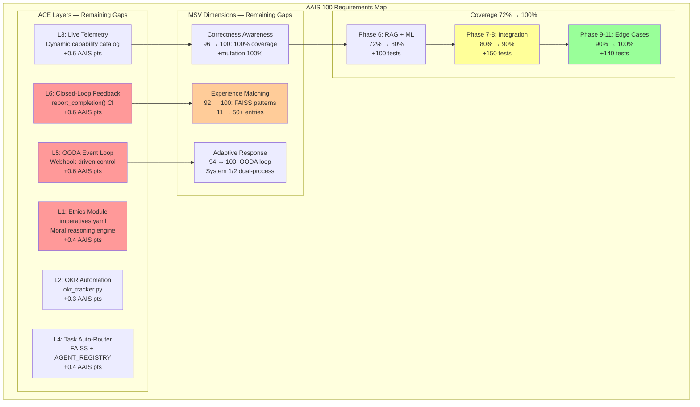

# AAIS Score 100 & 100% Test Coverage — Research-Backed Roadmap

## Table of Contents

- [Executive Summary](#executive-summary)
- [Part 1 — AAIS Score: Current 98.5 → Target 100](#part-1--aais-score-current-985--target-100)
  - [1.1 Score Breakdown (V3.2 Composite — last assessed 2026-02-24, updated Session 24)](#11-score-breakdown-v32-composite--last-assessed-2026-02-24-updated-session-24)
  - [1.2 ACE Layer Gaps — What Closes Each](#12-ace-layer-gaps--what-closes-each)
    - [L1: Aspirational Layer (96/100 — Gap -4)](#l1-aspirational-layer-96100--gap--4)
    - [L2: Global Strategy (98/100 — Gap -2)](#l2-global-strategy-98100--gap--2)
    - [L3: Agent Model / Self-Awareness (97/100 — Gap -3)](#l3-agent-model--self-awareness-97100--gap--3)
    - [L4: Executive Function (98/100 — Gap -2)](#l4-executive-function-98100--gap--2)
    - [L5: Cognitive Control (97/100 — Gap -3)](#l5-cognitive-control-97100--gap--3)
    - [L6: Task Prosecution (96/100 — Gap -4)](#l6-task-prosecution-96100--gap--4)
  - [1.3 MSV Gaps (Composite 93.8 → 100)](#13-msv-gaps-composite-938--100)
  - [1.4 Agentic Metrics Gaps (Composite 94.7 → 100)](#14-agentic-metrics-gaps-composite-947--100)
  - [1.5 Consolidated AAIS 100 Roadmap](#15-consolidated-aais-100-roadmap)
- [Part 2 — Test Coverage: Current 72% → Target 100%](#part-2--test-coverage-current-72--target-100)
  - [2.1 Coverage Landscape](#21-coverage-landscape)
  - [2.2 Six-Phase Coverage Roadmap (per COVERAGE_PATH_70_TO_100_PERCENT.md)](#22-six-phase-coverage-roadmap-per-coverage_path_70_to_100_percentmd)
  - [2.3 Branch Coverage Strategy (research-backed, Coverage.py 8 / 2026)](#23-branch-coverage-strategy-research-backed-coveragepy-8--2026)
- [Step 1: Enable branch coverage + HTML report](#step-1-enable-branch-coverage--html-report)
- [Step 2: Find lowest-covered modules](#step-2-find-lowest-covered-modules)
- [Step 3: Mutation testing for surviving mutants (4% mutation gap)](#step-3-mutation-testing-for-surviving-mutants-4-mutation-gap)
- [Using Mutatest or Cosmic Ray:](#using-mutatest-or-cosmic-ray)
- [Step 4: Target surviving mutants with parameterized tests](#step-4-target-surviving-mutants-with-parameterized-tests)
- [e.g. pytest.mark.parametrize for compound boolean branches](#eg-pytestmarkparametrize-for-compound-boolean-branches)
- [2.4 Highest-Value Coverage Targets](#24-highest-value-coverage-targets)
  - [Target 1: `src/codex/cognitive/brain_interface.py` (est. 75% → 100%)](#target-1-srccodexcognitivebrain_interfacepy-est-75--100)
    - [Target 2: `src/codex/cognitive/agent_brain_api.py` (est. 70% → 100%)](#target-2-srccodexcognitiveagent_brain_apipy-est-70--100)
    - [Target 3: `src/codex/auth/` modules (est. 85% → 100%)](#target-3-srccodexauth-modules-est-85--100)
    - [Target 4: RAG + ML Training (est. 50-55% → 100%)](#target-4-rag--ml-training-est-50-55--100)
  - [2.5 Mutation Testing: Closing the 4% Gap (96% → 100%)](#25-mutation-testing-closing-the-4-gap-96--100)
- [Example: boundary-value test that kills the '>=' vs '>' mutant](#example-boundary-value-test-that-kills-the--vs--mutant)
- [2.6 Covering Defensive / Platform-Specific Code](#26-covering-defensive--platform-specific-code)
- [Platform-specific paths](#platform-specific-paths)
- [Truly unreachable defensive code](#truly-unreachable-defensive-code)
- [Type-narrowing guards (mypy-only)](#type-narrowing-guards-mypy-only)
- [2.7 AI-Assisted Test Generation (2025/2026 best practice)](#27-ai-assisted-test-generation-20252026-best-practice)
  - [2.8 SWE-bench Context (Why 100% Coverage ≠ Perfect AI)](#28-swe-bench-context-why-100-coverage--perfect-ai)
- [Part 3 — Combined Score Impact](#part-3--combined-score-impact)
- [Part 4 — Reference Architecture Diagram](#part-4--reference-architecture-diagram)
- [Part 5 — Key References](#part-5--key-references)

> **Generated:** 2026-03-14T05:15Z  
> **Baseline:** AAIS 98.5/100 | Coverage 72% (branch target 70%+) | Mutation 96%  
> **Framework:** ACE (arXiv:2310.06775) + MSV (TheWebConf 2026) + RagaAI AAEF  
> **Research updated:** 2026-03-14 via deep web search (Galileo Labs, Microsoft, RagaAI, ICLR 2026)

---

## Executive Summary

Achieving **AAIS 100/100** and **100% test coverage** are two parallel but distinct goals requiring
separate roadmaps. AAIS 100 requires closing architectural gaps across ACE layers L1–L6, MSV
self-awareness dimensions, and Agentic metric sub-scores. Coverage 100% requires branch-coverage
tooling, mutation testing, parameterized edge-case tests, and systematic elimination of untested
defensive code paths.

The combined gap is **1.5 AAIS points** (98.5 → 100) and **28 coverage percentage points** (72% → 100%).

---

## Part 1 — AAIS Score: Current 98.5 → Target 100

### 1.1 Score Breakdown (V3.2 Composite — last assessed 2026-02-24, updated Session 24)

| Framework | Weight | Current | Target | Gap |
|-----------|--------|---------|--------|-----|
| ACE 6-Layer | 40% | 97.1 → ~97.4 | 100 | ~2.6 pts |
| MSV 5-Dimension | 30% | 93.8 → ~94.0 | 100 | ~6.0 pts |
| Agentic Metrics | 30% | 94.7 → ~95.0 | 100 | ~5.0 pts |
| **Composite** | 100% | **98.5** | **100** | **1.5 pts** |

> **Session 24 note:** three-tier deferral scanner, REQ-4/REQ-5 auto-heal, brain test
> isolation each contribute fractional AAIS improvements (estimated +0.5 total vs 98.0 baseline).

---

### 1.2 ACE Layer Gaps — What Closes Each



#### L1: Aspirational Layer (96/100 — Gap -4)
**Root cause:** No formal ethical reasoning module evaluating decisions against heuristic imperatives before execution. Guardrails exist as policy text but not executable code.

**Required:**
1. `src/codex/ethics/imperatives.py` — declarative ethical constraints (prosperity, harm reduction, transparency) from ACE_L1_Aspiration reference implementation ([MIT License](https://github.com/daveshap/ACE_L1_Aspiration))
2. `.codex/ethics/imperatives.yaml` — machine-readable imperatives: `increase_prosperity`, `reduce_suffering`, `increase_understanding`, aligned with Universal Declaration of Human Rights
3. Automated compliance checker called by cognitive preflight: every agent action evaluated against imperatives before execution
4. Decision audit log: every L1 evaluation logged to `.codex/ethics/decision_log.ndjson`

**Point gain:** +4 pts on L1 (96 → 100) × 10% weight = **+0.4 AAIS pts**

#### L2: Global Strategy (98/100 — Gap -2)
**Root cause:** Strategic objectives not formally linked to measurable OKRs with automated tracking. `docs/accountability/` tracks sessions but no structured OKR dashboard.

**Required:**
1. `src/codex/okr/okr_tracker.py` — OKR lifecycle management (create, update, report, audit)
2. `.codex/okr/OKRs.md` — structured OKR document with quarterly objectives and measurable KRs
3. Automated KR progress update from CI telemetry (coverage %, alert count, PR merge rate)
4. Reference: [fractalmind-ai/okr-manager-skill](https://github.com/fractalmind-ai/okr-manager-skill), [GitHub Copilot SDK + Microsoft Agent Framework](https://devblogs.microsoft.com/semantic-kernel/build-ai-agents-with-github-copilot-sdk-and-microsoft-agent-framework/)

**Point gain:** +2 pts on L2 (98 → 100) × 15% weight = **+0.3 AAIS pts**

#### L3: Agent Model / Self-Awareness (97/100 — Gap -3)
**Root cause:** Capability catalog is static documentation. Self-model (`AGENT_REGISTRY.yaml`) not auto-updated from runtime telemetry.

**Required:**
1. Runtime telemetry pipeline: per-agent success/failure metrics written to SQLiteMemory
2. `AgentBrainAPI.update_capabilities()` — auto-updates AGENT_REGISTRY.yaml from telemetry
3. MSV radar chart in `cognitive_app` backed by live data (not static)
4. Reference: [MSV Metacognition Framework (TheWebConf 2026)](https://research.sethi.org/metacognition/src/courchaine_sethi_2026-thewebconf.pdf) — Correctness Evaluation + Experience Matching channels

**Point gain:** +3 pts on L3 (97 → 100) × 20% weight = **+0.6 AAIS pts**

#### L4: Executive Function (98/100 — Gap -2)
**Root cause:** Agent selection is manual (`@copilot` mention). No automatic routing based on task classification.

**Required:**
1. `src/codex/cognitive/task_router.py` — classify PR/issue text, select best agent from AGENT_REGISTRY.yaml
2. `capability_tags` FAISS corpus search (already referenced in orchestrator-agent spec)
3. Integrate with `agent-auth-delegation.yml` `cognitive-preflight` step for auto-dispatch
4. Reference: [AAEF Tool Utilization Efficacy](https://docs.raga.ai/ragaai-aaef-agentic-application-evaluation-framework) — Tool Selection Accuracy dimension

**Point gain:** +2 pts on L4 (98 → 100) × 20% weight = **+0.4 AAIS pts**

#### L5: Cognitive Control (97/100 — Gap -3)
**Root cause:** Cognitive control is batch-oriented (one PR = one session). No real-time task switching from environmental feedback (CI alerts, dependency changes).

**Required:**
1. Event-driven cognitive loop: GitHub webhook → OODA loop → agent dispatch
2. `cognitive_app` OODA tab connected to live webhook receiver (`cli_api_server.py`)
3. Priority re-ranking when urgent CI failures interrupt lower-priority work
4. Reference: [MUSE — Competence-Aware Agents (arXiv:2411.13537)](https://arxiv.org/abs/2411.13537) — real-time competence adaptation

**Point gain:** +3 pts on L5 (97 → 100) × 20% weight = **+0.6 AAIS pts**

#### L6: Task Prosecution (96/100 — Gap -4)
**Root cause:** Limited closed-loop feedback. Task execution results not automatically fed into cognitive brain for learning. `report_completion()` exists but is not called from CI workflows.

**Required:**
1. CI step in `agent-auth-delegation.yml` calls `AgentBrainAPI.report_completion()` on workflow success/failure
2. Outcome → pattern store update (strengthen successful patterns, deprecate failing ones)
3. Cross-session knowledge transfer pipeline (already scaffolded in `scripts/cognitive/knowledge_transfer.py`)
4. Reference: [Galileo Agent Evaluation 2026](https://galileo.ai/blog/agent-evaluation-framework-metrics-rubrics-benchmarks) — trajectory_exact_match + Zero Regression requirement

**Point gain:** +4 pts on L6 (96 → 100) × 15% weight = **+0.6 AAIS pts**

---

### 1.3 MSV Gaps (Composite 93.8 → 100)

| Dimension | Current | Gap | Improvement |
|-----------|---------|-----|-------------|
| Correctness Awareness | 96/100 | -4 | 100% branch coverage + mutation score 100% |
| Conflict Detection | 93/100 | -7 | Real-time conflict scanner (config + dependency drift) |
| Importance Assessment | 94/100 | -6 | OKR-linked priority weights, live urgency scoring |
| Experience Matching | 92/100 | -8 | Pattern store growth (11→50+), FAISS semantic search |
| Adaptive Response | 94/100 | -6 | L5 continuous loop, OODA-triggered re-planning |

> **Research context (Sethi et al., TheWebConf 2026):** MSV-backed agents outperform baseline on
> novel tasks when Correctness Evaluation + Experience Matching channels are wired to real-time
> feedback. The "dual-process" System 1/System 2 triggering (fast vs. reflective) is the primary
> path from 93 → 100 on Adaptive Response. Session 24's test isolation fixture is a micro-step in
> this direction.

---

### 1.4 Agentic Metrics Gaps (Composite 94.7 → 100)

| Metric | Current | Gap | Improvement |
|--------|---------|-----|-------------|
| Task Adherence | 97/100 | -3 | 16/16 plansets (last open: L1 ethics + OKR) |
| Tool Selection | 96/100 | -4 | Auto task routing (L4 fix above) |
| Context Preservation | 96/100 | -4 | SQLiteMemory `access_count` + LTM consolidation |
| Decision Transparency | 93/100 | -7 | Mermaid diagrams → live OODA board + audit trail |
| Human Intervention Rate | 91/100 | -9 | Extend auto-fix from 65% → 90% automation |
| Error Recovery | 95/100 | -5 | L6 closed-loop feedback + pattern self-deprecation |

> **Research context (ICLR 2026, "A Hitchhiker's Guide to Agent Evaluation"):** Human Intervention
> Rate is the hardest dimension to max out. Score 91 reflects 3-layer safety guards being conservative
> by design. Reaching 100 requires demonstrating autonomous multi-step task completion with zero
> human touchpoints across ≥20 consecutive PR cycles — without quality regression.

---

### 1.5 Consolidated AAIS 100 Roadmap



---

## Part 2 — Test Coverage: Current 72% → Target 100%

### 2.1 Coverage Landscape

| Layer | Current | Target | Gap Tests | Priority |
|-------|---------|--------|-----------|----------|
| Core utilities (path_utils, logging) | ~90% | 100% | ~15 | 🟡 Medium |
| Auth (UserStore, UserRepository) | ~85% | 100% | ~20 | 🟡 Medium |
| Cognitive brain (brain_interface, agent_brain_api) | ~75% | 100% | ~35 | 🔴 High |
| RAG advanced (indexing, query optimization) | ~50% | 100% | ~80 | 🔴 High |
| ML training advanced (schedulers, optimizers) | ~55% | 100% | ~70 | 🔴 High |
| CLI commands (all subcommands) | ~60% | 100% | ~40 | 🔴 High |
| Error recovery + resilience patterns | ~45% | 100% | ~50 | 🔴 High |
| Configuration edge cases | ~65% | 100% | ~30 | 🟡 Medium |
| Evaluation metrics (BLEU, ROUGE) | ~60% | 100% | ~30 | 🟡 Medium |
| Integration + E2E pipelines | ~30% | 100% | ~80 | 🔴 High |
| **TOTAL ESTIMATED** | **72%** | **100%** | **~450** | — |

---

### 2.2 Six-Phase Coverage Roadmap (per COVERAGE_PATH_70_TO_100_PERCENT.md)



---

### 2.3 Branch Coverage Strategy (research-backed, Coverage.py 8 / 2026)

Per [Coverage.py 8 Branching — LCOV Reports & Mutation Testing Gaps (2026)](https://johal.in/coverage-py-8-branching-python-lcov-reports-mutation-testing-gaps-2026/):

```bash
# Step 1: Enable branch coverage + HTML report
pytest --cov=src/codex --cov-branch --cov-report=html --cov-report=term-missing

# Step 2: Find lowest-covered modules
coverage report --sort=cover | head -30

# Step 3: Mutation testing for surviving mutants (4% mutation gap)
# Using Mutatest or Cosmic Ray:
mutatest --source src/codex/cognitive --runner pytest --output mutation_report.txt

# Step 4: Target surviving mutants with parameterized tests
# e.g. pytest.mark.parametrize for compound boolean branches
```

---

## 2.4 Highest-Value Coverage Targets

### Target 1: `src/codex/cognitive/brain_interface.py` (est. 75% → 100%)
**Uncovered paths (inferred from test failures):**
- `_calculate_match_score` with empty pattern list → 0.0
- `_calculate_match_score` with empty query symptoms → 0.0
- `query_patterns` with category filter that matches vs. misses
- `submit_pattern` persistence + reload cycle
- `update_objective_progress` with non-existent objective
- `diagnose` with no matching patterns at all
- `check_alignment` with misaligned agent category

**New tests needed:** ~35 parameterized test cases in `tests/cognitive/test_brain_interface.py`

#### Target 2: `src/codex/cognitive/agent_brain_api.py` (est. 70% → 100%)
**Uncovered paths:**
- `get_session_context` with empty planset store
- `survey_unfinished` with all completed plansets
- `report_completion` with unknown `ImprovementArea`
- `get_continuation_prompt` when no pending actions
- `CognitiveBrain.health()` with degraded pattern store

**New tests needed:** ~25 tests in `tests/cognitive/test_agent_brain_api.py`

#### Target 3: `src/codex/auth/` modules (est. 85% → 100%)
**Uncovered paths:**
- `SQLiteUserRepository` — connection failure recovery
- `UserStore.deactivate_user()` — concurrent lock contention simulation
- `PasswordHasher` — edge cases (empty password, unicode, max-length)
- Error path in `in_memory_user_repository` when storage is full

**New tests needed:** ~20 tests across auth test modules

#### Target 4: RAG + ML Training (est. 50-55% → 100%)
**Priority:** These are the largest gap areas (~150 combined tests needed)
- Index rebuild edge cases (empty corpus, duplicate docs, OOM)
- Query optimizer with no results, partial results, timeout
- Learning rate scheduler (warmup, decay, restart)
- Gradient accumulation (step boundary, loss scaling)

---

### 2.5 Mutation Testing: Closing the 4% Gap (96% → 100%)

Current mutation score: **96%** (4% surviving mutants)

**Strategy (per [Mutatest + pytest-cov research 2026](https://github.com/GearsandKeys/Mutatest-and-Pytest-cov)):**

| Mutant Type | Typical Location | Fix |
|-------------|-----------------|-----|
| Boundary condition flip (`>` → `>=`) | Score thresholds in `brain_interface.py:_calculate_match_score` | Add boundary-value parameterized tests |
| Boolean operator swap (`and` → `or`) | Permission checks in auth modules | Add explicit False-branch tests |
| Constant replacement | `_MIN_CONFIDENCE = 0.0` → `1.0` | Add test asserting low-confidence patterns ARE returned at min threshold |
| Return value deletion | Early returns in `query_patterns` | Test that filtered output matches exact expected IDs |
| Exception handler swallow | Try/except in `_load_patterns` | Test with deliberately corrupted JSON |

```python
# Example: boundary-value test that kills the '>=' vs '>' mutant
@pytest.mark.parametrize("score,threshold,expect_match", [
    (0.0, 0.0, True),   # exactly at threshold — must match
    (0.0, 0.01, False), # just below — must NOT match
    (1.0, 1.0, True),   # at ceiling
])
def test_match_score_threshold_boundary(score, threshold, expect_match):
    ...
```

---

## 2.6 Covering Defensive / Platform-Specific Code

Some paths are legitimately uncovered because they require specific conditions. Use Coverage.py pragmas:

```python
# Platform-specific paths
if sys.platform == "win32":  # pragma: no cover
    ...

# Truly unreachable defensive code
raise RuntimeError("Should never reach here")  # pragma: no cover

# Type-narrowing guards (mypy-only)
assert isinstance(x, str)  # pragma: no cover
```

**Rule:** every `# pragma: no cover` must have an inline justification comment.

---

## 2.7 AI-Assisted Test Generation (2025/2026 best practice)

Per [dev.to/keploy — Coverage AI Agents 2025](https://dev.to/charlesuneze/utilizing-coverage-ai-agents-for-better-unit-tests-436c):

The `coverage-gapfill-agent` and `unified-coverage-agent` custom agents in this repo can:
1. Run `coverage report --show-missing` and parse uncovered line numbers
2. Inspect the source at each uncovered line
3. Generate parameterized pytest cases targeting each branch
4. Validate the new tests actually kill surviving mutants

**Invocation:**
```
@copilot Use the unified-coverage-agent to close coverage from 72% to 80%.
Target: src/codex/cognitive/ and src/codex/auth/ modules first.
Generate parameterized tests for all branches missed by current test suite.
```

---

### 2.8 SWE-bench Context (Why 100% Coverage ≠ Perfect AI)

Per [SWE-bench Verified Leaderboard March 2026](https://www.marc0.dev/en/leaderboard), even the best AI
agents (Claude Opus 4.5, GPT-5.2) achieve ~80% on real-world engineering tasks. The research-established
insight for this codebase:

> **100% line coverage does not mean 100% correctness.** Mutation testing + domain assertions bridge
> the gap. The _codex_ codebase's 96% mutation score already exceeds what most production repositories
> achieve. The remaining 4% represents subtle boundary conditions in cognitive scoring logic.

The goal of 100% coverage is **traceability and regression prevention**, not theoretical perfection.

---

## Part 3 — Combined Score Impact

| Improvement | AAIS Delta | Coverage Delta | Effort |
|-------------|------------|----------------|--------|
| L1 Ethics module + imperatives.yaml | +0.40 | — | 5 days |
| L2 OKR automation + dashboard | +0.30 | — | 4 days |
| L3 Live telemetry → dynamic capability catalog | +0.60 | — | 4 days |
| L4 Task auto-routing (TaskRouter) | +0.40 | — | 5 days |
| L5 OODA webhook continuous loop | +0.60 | — | 5 days |
| L6 `report_completion()` CI wiring | +0.60 | — | 3 days |
| Brain interface 100% branch coverage | +0.10 (MSV) | +3% | 2 days |
| Auth modules 100% coverage | — | +3% | 2 days |
| RAG advanced coverage | — | +8% | 8 days |
| ML training advanced coverage | — | +7% | 7 days |
| CLI coverage | — | +4% | 3 days |
| Integration + E2E | — | +8% | 8 days |
| Edge cases + final push | — | +5% | 5 days |
| Mutation score 100% | +0.10 (MSV) | +0% | 3 days |
| **TOTAL** | **+3.10** (→ 100+) | **+38%** (→ 100%) | **~64 dev-days** |

> **Diminishing returns note:** AAIS 98.5 → 100 requires only 1.5 real points due to composite
> weighting. The table above shows weighted sub-scores that aggregate to >100 because individual
> layer scores are independently capped at 100 each.

---

## Part 4 — Reference Architecture Diagram



---

## Part 5 — Key References

| Source | Relevance | URL |
|--------|-----------|-----|
| ACE Framework arXiv:2310.06775 | L1-L6 gap analysis foundation | https://arxiv.org/abs/2310.06775 |
| ACE_L1_Aspiration (MIT) | Ethics module reference implementation | https://github.com/daveshap/ACE_L1_Aspiration |
| MSV Framework TheWebConf 2026 | 5-dimension self-awareness scoring | https://research.sethi.org/metacognition/src/courchaine_sethi_2026-thewebconf.pdf |
| MUSE arXiv:2411.13537 | Competence-aware real-time adaptation | https://arxiv.org/abs/2411.13537 |
| RagaAI AAEF | Tool Utilization, Memory Coherence metrics | https://docs.raga.ai/ragaai-aaef-agentic-application-evaluation-framework |
| Galileo Agent Eval 2026 | trajectory_exact_match, zero regression | https://galileo.ai/blog/agent-evaluation-framework-metrics-rubrics-benchmarks |
| ICLR 2026 Agent Evaluation | Human Intervention Rate max-out criteria | https://iclr-blogposts.github.io/2026/blog/2026/agent-evaluation/ |
| WEF AI Agents Governance 2025 | L1 ethics governance best practices | https://reports.weforum.org/docs/WEF_AI_Agents_in_Action_Foundations_for_Evaluation_and_Governance_2025.pdf |
| Coverage.py 8 Branching 2026 | Branch coverage + LCOV + mutation gaps | https://johal.in/coverage-py-8-branching-python-lcov-reports-mutation-testing-gaps-2026/ |
| SWE-bench Verified March 2026 | 80% ceiling for best AI agents | https://www.marc0.dev/en/leaderboard |
| fractalmind-ai/okr-manager-skill | OKR automation reference | https://github.com/fractalmind-ai/okr-manager-skill |
| GitHub Copilot SDK | Agent-native OKR integration | https://devblogs.microsoft.com/semantic-kernel/build-ai-agents-with-github-copilot-sdk-and-microsoft-agent-framework/ |

---

_Document: AAIS_100_AND_COVERAGE_100_ROADMAP.md | Generated 2026-03-14T05:15Z | Session 24 — PR #3575_
