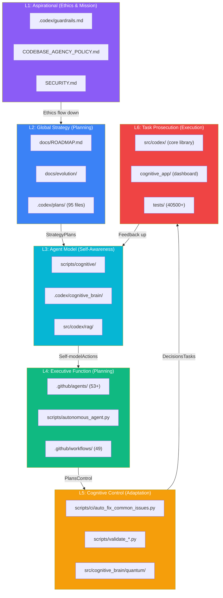

# Cognitive Codebase Map — AI Intuitiveness by Component
**Last Updated:** 2026-07-11
**Version:** v0.2.0

**Last Updated**: 2026-06-22
**Version**: 1.0.0
**Purpose**: Component-level cognitive mapping of the _codex_ codebase for AI intuitiveness, enabling agents to navigate, understand, and operate autonomously.
**Methodology**: ACE-aligned scoring per component, cross-referenced with [AAIS V3.0](AI_AGENCY_INTUITIVENESS_SCORE_V3.md)

---

## Cognitive Architecture Overview



---

## Component Intuitiveness Scores

### Source Code (`src/`)

| Component | Path | AI Intuitiveness | ACE Layer | Key Strengths | Improvement Area |
|-----------|------|:----------------:|-----------|---------------|------------------|
| **Codex Core** | `src/codex/` | 94/100 | L6 | Clear module boundaries, type hints, docstrings | API auto-docs |
| **RAG Pipeline** | `src/codex/rag/` | 95/100 | L3 | Safe meta-tensor handling, device='cpu' default | Inline examples |
| **CI Cache Manager** | `src/codex/ci/` | 92/100 | L5 | Unified key generation, rfind pattern | Integration tests |
| **CLI** | `src/codex/cli.py` | 90/100 | L6 | Entry point clear, argparse structured | --help expansion |
| **Interpretability** | `src/codex/interpretability/` | 88/100 | L3 | Attention/MLP scorers well-named | Visualization |
| **Cognitive Brain** | `src/cognitive_brain/` | 93/100 | L3 | Quantum scoring, adaptive learning | Dynamic self-update |
| **ML Safety** | `src/codex_ml/safety/` | 91/100 | L1 | Risk scoring, safety checks | Formal verification |
| **MCP** | `src/mcp/` | 89/100 | L4 | Config, auth, rate limiting | Advanced CLI flags |

### Scripts (`scripts/`)

| Component | Path | AI Intuitiveness | ACE Layer | Key Strengths | Improvement Area |
|-----------|------|:----------------:|-----------|---------------|------------------|
| **Cognitive Core** | `scripts/cognitive/` | 95/100 | L3 | 22 modules, brain core, meta-learning | Live telemetry |
| **CI Auto-Fix** | `scripts/ci/` | 93/100 | L5 | 8 fix patterns, JSON output, Copilot helper | Pattern expansion |
| **Validation** | `scripts/validate_*.py` | 91/100 | L5 | Links, tables, code fences, --fix flag | Central registry |
| **Autonomous Agent** | `scripts/autonomous_agent.py` | 88/100 | L4 | Full API, test-compatible | Needs activation |
| **Space Traversal** | `scripts/space_traversal/` | 86/100 | L3 | Capability scoring | Documentation |

### Agents (`.github/agents/`)

| Component | Count | AI Intuitiveness | ACE Layer | Key Strengths | Improvement Area |
|-----------|:-----:|:----------------:|-----------|---------------|------------------|
| **CI/CD Agents** | 18 | 94/100 | L5 | Comprehensive coverage, auto-fix | Auto-routing |
| **Testing Agents** | 12 | 93/100 | L5 | Alignment fixer, QA walkthrough | Mutation testing |
| **Security Agents** | 6 | 95/100 | L1 | Bridge monitor, code scanning | Formal proofs |
| **Documentation Agents** | 6 | 92/100 | L2 | Quality, link validation, freshness | Auto-generation |
| **RAG/ML Agents** | 4 | 91/100 | L3 | Meta tensor, RAG index | Model versioning |
| **Repository Agents** | 4 | 90/100 | L4 | Hygiene, reference updates | Predictive cleanup |
| **Config Agents** | 2 | 93/100 | L5 | Migration assistant, validator | Schema evolution |

### Documentation (`docs/`)

| Component | Path | AI Intuitiveness | ACE Layer | Key Strengths | Improvement Area |
|-----------|------|:----------------:|-----------|---------------|------------------|
| **Evolution Center** | `docs/evolution/` | 97/100 | L2 | Queryable, Mermaid diagrams, cross-refs | Auto-update |
| **Roadmap** | `docs/ROADMAP.md` | 96/100 | L2 | Verified phases, current state table | OKR linkage |
| **Doc Index** | `docs/DOCUMENTATION_INDEX.md` | 94/100 | L2 | 693+ files cataloged | Auto-indexing |
| **Cognitive Brain** | `docs/cognitive_brain/` | 93/100 | L3 | Status history, continuation prompts | Consolidation |
| **Architecture** | `docs/architecture/` | 91/100 | L2 | Pipeline diagrams, Mermaid | Interactive |
| **Cognitive App** | `docs/cognitive_app.md` | 92/100 | L6 | Feature catalog, live link | API reference |

### Cognitive App (`cognitive_app/`)

| Component | Path | AI Intuitiveness | ACE Layer | Key Strengths | Improvement Area |
|-----------|------|:----------------:|-----------|---------------|------------------|
| **Dashboard** | `src/App.tsx` | 93/100 | L6 | Tab-based, 4 panels | AAIS integration |
| **Quantum Viz** | `src/components/quantum/` | 94/100 | L3 | Brain metrics, k₁ factor | MSV display |
| **Agent Panel** | `src/components/quantum/AgentOrchestrationPanel.tsx` | 92/100 | L4 | 6 physics paradigms, workflow tokens | Live agent status | <!-- pragma: allowlist secret -->
| **Metrics Hook** | `src/hooks/use-dashboard-metrics.ts` | 91/100 | L6 | Auto-refresh, error handling | AAIS V3 metrics |
| **Memory Mgmt** | `src/components/quantum/MemoryManagementDashboard.tsx` | 93/100 | L3 | STM/LTM, compression | RAG integration |

### Infrastructure

| Component | Path | AI Intuitiveness | ACE Layer | Key Strengths | Improvement Area |
|-----------|------|:----------------:|-----------|---------------|------------------|
| **GitHub Workflows** | `.github/workflows/` | 92/100 | L5 | 49 workflows, auto-fix PR check | Parallel decomposition |
| **Cognitive Brain Data** | `.codex/cognitive_brain/` | 95/100 | L3 | 100+ files, 31 status snapshots | Query interface |
| **Plans** | `.codex/plans/` | 94/100 | L2 | 95 plan files, phase tracking | Completion automation |
| **Tests** | `tests/` | 93/100 | L5 | 21,500+ tests, 10.7% coverage | Property-based tests |
| **Configuration** | `conf/`, `configs/` | 90/100 | L5 | Hydra, dual-path fallback | Schema validation |
| **MkDocs** | `mkdocs.yml` | 91/100 | L6 | Mermaid, search, dark mode | Nav auto-generation |

---

## Intuitiveness Heatmap

```text
Component Intuitiveness Distribution (N=35 components scored)

97 Evolution Center
96 Roadmap
95 RAG Pipeline, Cognitive Core, Cognitive Brain Data, Security Agents
94 Codex Core, Doc Index, Plans, CI/CD Agents, Quantum Viz
93 Cognitive Brain, Testing Agents, Config Agents, App Dashboard, Memory, Tests
92 CI Cache, Doc Agents, Agent Panel, Workflows, Cognitive App Doc
91 Validation Scripts, RAG/ML Agents, Metrics Hook, Architecture, MkDocs
90 CLI, Repository Agents, Configuration, Aspirational (L1)
89 MCP
88 Interpretability, Autonomous Agent
86 Space Traversal

Mean: 92.4/100 | Median: 93/100 | Std Dev: 2.5
```

---

## Navigation Guide for AI Agents

### "I need to..." Quick Reference

| Goal | Start Here | ACE Layer |
|------|-----------|-----------|
| Understand the codebase | `docs/evolution/INDEX.md` `docs/ROADMAP.md` | L2 |
| Run tests | `tests/` `nox -s tests` | L5 |
| Fix CI failures | `scripts/ci/auto_fix_common_issues.py` `scripts/validate_*.py` | L5 |
| Understand architecture | `docs/architecture/` `docs/ARCHITECTURE_BLUEPRINT.md` | L2 |
| Work with RAG | `src/codex/rag/` (device='cpu' initialization, no safe_model_to_device needed) | L3 |
| Manage agents | `.github/agents/` `.codex/archive/deprecated/AGENTS.md` | L4 |
| Update documentation | `docs/` `mkdocs.yml` `scripts/validate_docs_links.py` | L2 |
| Check security | `SECURITY.md` `.codex/guardrails.md` | L1 |
| Track evolution | `docs/evolution/EVOLUTION_TIMELINE.md` | L2 |
| Score AI intuitiveness | `docs/evolution/AI_AGENCY_INTUITIVENESS_SCORE_V3.md` | L3 |
| Create a planset | `.codex/cognitive_brain/ps01_status.md` (template) | L4 |

### Critical Patterns for AI Agents

```text
Pattern Where Why

device='cpu' initialization src/codex/rag/*.py Prevents meta-tensor creation
Hydra dual-path config conf/ configs/ fallback Backward compatibility
rfind("-") for cache keys src/codex/ci/cache_manager.py Preserves hyphenated components
--check (not --check-only) scripts/validate_*.py Correct validation flag
Pre-commit auto-fix scripts/ci/auto_fix_common_issues.py Run before committing
Windows-safe timestamps codex.utils.path_utils No colons in filenames
```

---

## Score Aggregation

### By ACE Layer

| Layer | Components | Avg Score | Status |
|-------|:----------:|:---------:|--------|
| L1: Aspirational | 3 | 90.7 | Solid |
| L2: Global Strategy | 6 | 94.5 | Excellent |
| L3: Agent Model | 9 | 93.2 | Excellent |
| L4: Executive Function | 5 | 91.4 | Solid |
| L5: Cognitive Control | 8 | 92.4 | Solid |
| L6: Task Prosecution | 5 | 91.8 | Solid |

### By Domain

| Domain | Components | Avg Score |
|--------|:----------:|:---------:|
| Documentation | 6 | 93.8 |
| Security | 4 | 93.0 |
| Testing | 3 | 93.0 |
| Core Library | 5 | 92.0 |
| Infrastructure | 4 | 91.5 |
| cognitive_app | 5 | 92.6 |

---

## Cross-References

- [AAIS V3.0](AI_AGENCY_INTUITIVENESS_SCORE_V3.md) — Composite scoring methodology
- [Evolution Timeline](EVOLUTION_TIMELINE.md) — Phase history
- [Planset Registry](PLANSET_REGISTRY.md) — Completed plansets as evidence
- [cognitive_app](../cognitive_app.md) — Human-facing dashboard
- [Agent Evolution Map](../.codex/cognitive_brain/COGNITIVE_BRAIN_AGENT_EVOLUTION_MAP.md) — Agent lineage
