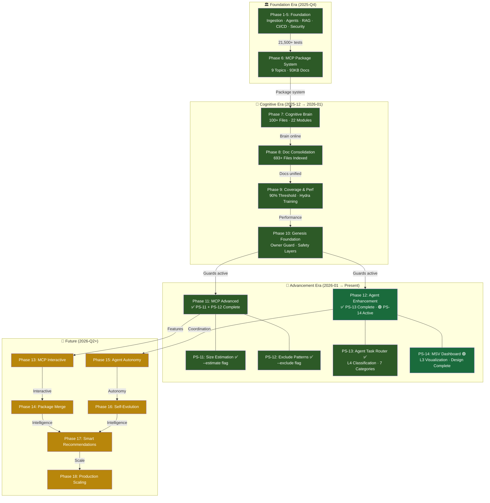
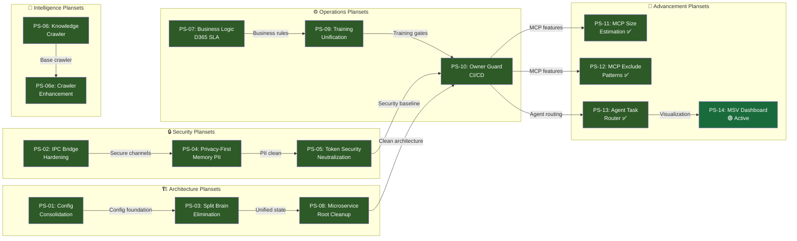
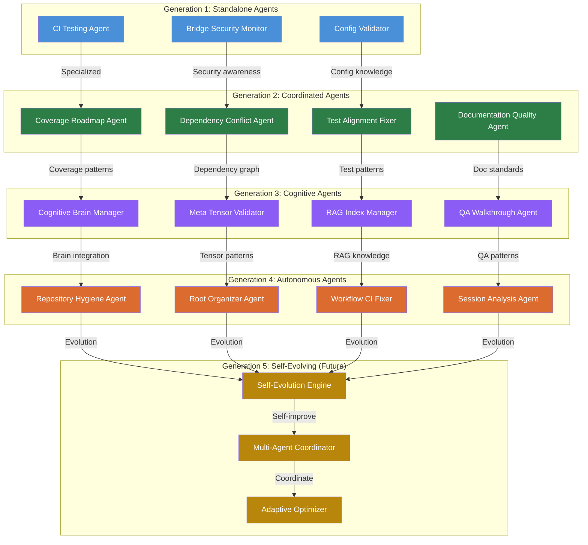
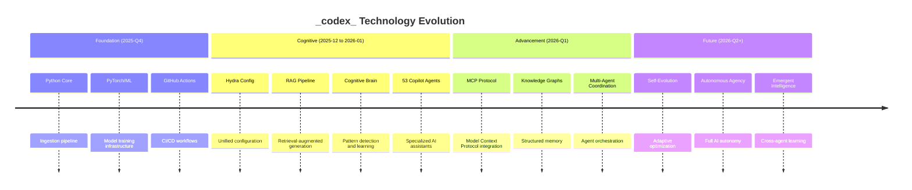

# Cognitive Evolution Tree — Process Mapping

**Last Updated**: 2026-06-22
**Version**: 3.0.0  
**Purpose**: Visual evolutionary process mapping of the _codex_ AI cognitive agency — from conception through emergence to autonomous operation.

---

## 🌳 Master Evolution Tree

---

## 🧬 Planset Dependency Graph

---

## 🤖 Agent Evolution Lineage

---

## 📊 Capability Maturity Model

```mermaid
graph LR
    subgraph L1["Level 1: Reactive"]
        L1a[Code Suggestions]
        L1b[Bug Detection]
    end

    subgraph L2["Level 2: Managed"]
        L2a[CI/CD Automation]
        L2b[Test Generation]
        L2c[Doc Updates]
    end

    subgraph L3["Level 3: Defined"]
        L3a[Agent Orchestration]
        L3b[Pattern Recognition]
        L3c[Knowledge Extraction]
    end

    subgraph L4["Level 4: Quantified ← Current"]
        L4a[Cognitive Brain]
        L4b[Self-Healing]
        L4c[Metrics-Driven]
    end

    subgraph L5["Level 5: Optimizing (Target)"]
        L5a[Self-Evolution]
        L5b[Autonomous Agency]
        L5c[Emergent Behavior]
    end

    L1 --> L2 --> L3 --> L4 --> L5

    style L1 fill:#666,color:#fff
    style L2 fill:#555,color:#fff
    style L3 fill:#444,color:#fff
    style L4 fill:#2d5a27,color:#fff
    style L5 fill:#b8860b,color:#fff
```

---

## 🧪 Technology Stack Evolution

---

## 🔗 Cross-References

- [Evolution Timeline](EVOLUTION_TIMELINE.md) — Detailed phase history
- [Planset Registry](PLANSET_REGISTRY.md) — Queryable planset catalog
- [AI Emergence Storyboard](AI_EMERGENCE_STORYBOARD.md) — Narrative context
- [Agent Evolution Map](https://github.com/Aries-Serpent/_codex_/blob/main/.codex/cognitive_brain/COGNITIVE_BRAIN_AGENT_EVOLUTION_MAP.md) — Detailed agent lineage
