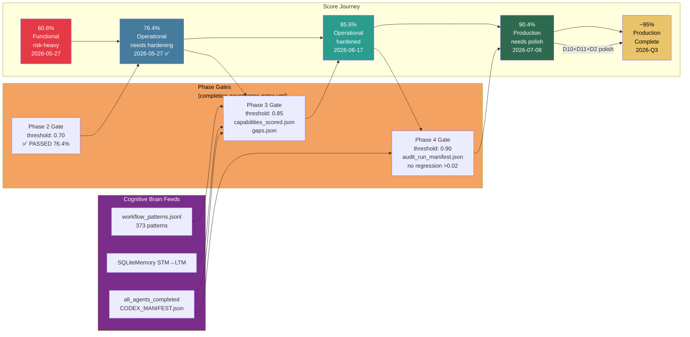
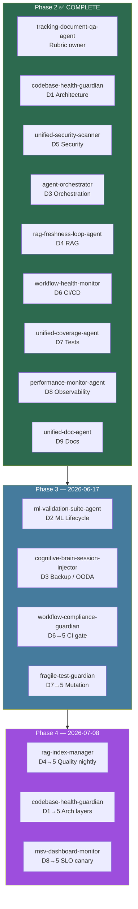

# Completion Governance Framework

This framework closes the remaining Phase 2-4 governance gaps by defining the score inputs, required artifacts, and explicit completion checks used for remediation validation.

## Assigned-agent completion validation

The assigned-agent completion requirement is tracked in `.codex/config/completion_governance.json`.

Validated completed agents:

- `phase1-gap-discovery` → `recon-scout-agent`
- `phase2-agent-assignment` → `agent-orchestrator`
- `phase3-completion-gate` → `qa-walkthrough-agent`

These agent records must remain `completed` before any Phase 2-4 completion gate is treated as valid.

## Governance inputs

The governance inputs file defines:

- per-phase score thresholds
- required audit artifacts
- baseline regression settings
- assigned-agent completion status

Current phase thresholds:

| Phase | Threshold | Extra requirement |
| --- | --- | --- |
| Phase 2 Stabilisation | `0.70` | `audit_artifacts/capabilities_scored.json` |
| Phase 3 Hardening | `0.85` | gap artifacts present |
| Phase 4 Completion Governance | `0.90` | no regression beyond `0.02` vs baseline |

## Workflow gate

Use `.github/workflows/completion-governance-gates.yml` to run the explicit completion gate.

Supported runs:

- `phase-2-stabilisation`
- `phase-3-hardening`
- `phase-4-completion-governance`
- `score-regression`
- `all`

## Validation sequence

1. Validate assigned-agent completion.
2. Generate the required audit artifacts.
3. Enforce the configured threshold for the selected phase.
4. Enforce regression limits when a baseline is configured.
5. Report a complete/partial/incomplete outcome from the selected gate run.

---

## Governance Lifecycle & Score Journey

---

## Assigned-Agent Phase Map

