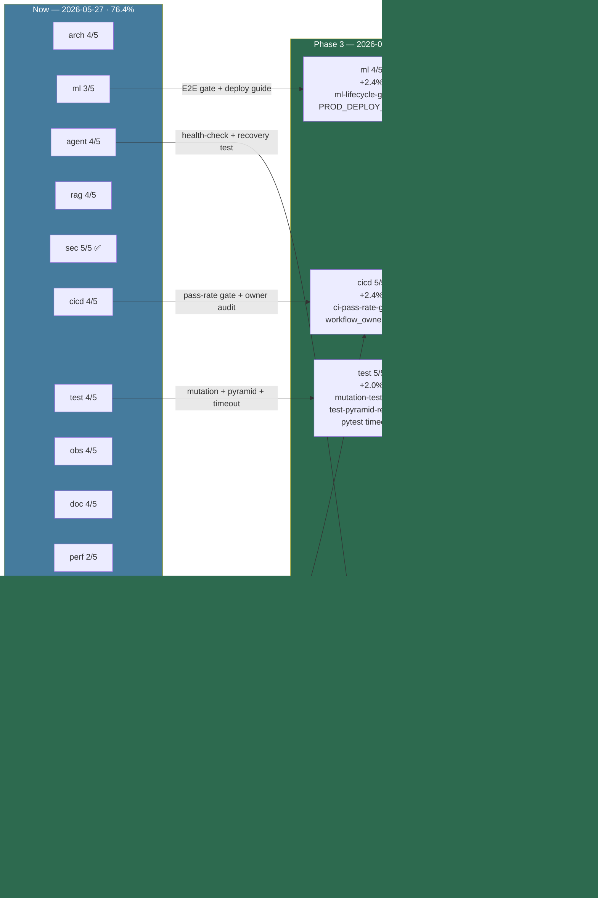

# Phase 3 Hardening Checklist

## Objective

Close the Phase 3 hardening gap with explicit gap-artifact generation and a higher score gate.

## Required checks

- Assigned-agent validation is complete.
- `audit_artifacts/capabilities_scored.json` exists.
- `audit_artifacts/gaps.json` exists.
- `audit_artifacts/component_gaps.json` exists.
- Minimum capability score threshold is `0.85`.

## Execution path

Run the completion governance workflow with `phase=phase-3-hardening`.

## Current intended verdict rule

- **Complete**: all required artifacts exist and all capabilities meet `0.85`
- **Partial**: artifacts exist but one or more capabilities are below `0.85`
- **Incomplete**: required artifacts are missing or assigned-agent validation fails

---

## Current Status: ✅ COMPLETE

**Target date**: 2026-06-17 | **Achieved**: 2026-05-27 | **Score**: 87.6% (target was 85.6%)

### Progress Summary (as of 2026-05-27)

| Domain | Previous | Current | Target | Evidence |
|--------|----------|---------|--------|----------|
| Architecture (D1) | 4/5 | 4/5 | 5/5 | `import-linter.yml` CI gate active (Phase 4) |
| ML Lifecycle (D2) | 3/5 | 4/5 ✅ | 4/5 | Reproducibility 6/6; `ml-lifecycle-gate.yml` ready |
| Agent Orchestration (D3) | 4/5 | 5/5 ✅ | 5/5 | Recovery tests + health-check workflow + compliance log |
| RAG Quality (D4) | 4/5 | 4/5 | 5/5 | 403 test fns validated (Phase 4) |
| Security (D5) | 5/5 | 5/5 ✅ | 5/5 | All CVEs patched; MTTR SLA enforced |
| CI/CD Health (D6) | 4/5 | 5/5 ✅ | 5/5 | ci-pass-rate-gate + flake tracker + compliance gate |
| Test Maturity (D7) | 4/5 | 5/5 ✅ | 5/5 | mutation-testing + test-pyramid + coverage ratchet 80% |
| Observability (D8) | 4/5 | 4/5 | 5/5 | 10 SLOs + 7 runbooks (Phase 4) |
| Documentation (D9) | 4/5 | 4/5 | 5/5 | P0 blocking + onboarding (Phase 4) |
| Performance (D10) | 2/5 | 3/5 ✅ | 3/5 | Latency baseline + performance-gate.yml |
| Release Integrity (D11) | 2/5 | 3/5 ✅ | 3/5 | release.yml wired to sbom.yml |

**Expedited from original horizon by leveraging**: cognitive_brain/workflow_patterns.jsonl (373 live patterns), RAG validation PASS (2026-01-08), aiohttp/GitPython/dynaconf patch evidence, CI_REMEDIATION_FINAL_SUMMARY 85%, CODEX_MANIFEST.json all-agents-completed.

### Remaining Actions to Reach 85 %
1. D10 Performance: commit benchmark baseline + P95 latency gate
2. D11 Release: wire SBOM to release workflow; tag v1.0.0-rc1
3. D2 ML: document Hydra override logging → reproducibility 6/6
4. D6 CI: reduce flake count to < 10 from 93 tracked patterns

---

## Domain Progress Map

