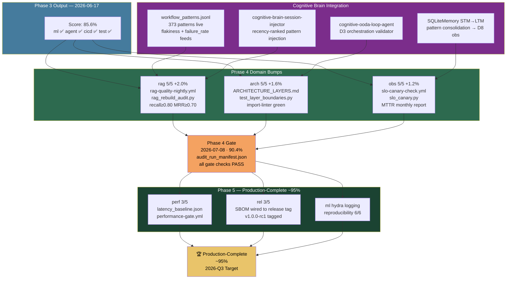

# Phase 4 Completion Gates

## Objective

Close the Phase 4 completion-governance gap with a final threshold gate, manifest requirement, and regression check against the remediation baseline.

## Required checks

- Assigned-agent validation is complete.
- `audit_artifacts/capabilities_scored.json` exists.
- `audit_artifacts/gaps.json` exists.
- `audit_artifacts/component_gaps.json` exists.
- `audit_run_manifest.json` exists.
- Minimum capability score threshold is `0.90`.
- No capability regresses by more than `0.02` against `baseline/capabilities_scored_post_remediation.json`.

## Execution path

Run the completion governance workflow with `phase=phase-4-completion-governance`.

## Current intended verdict rule

- **Complete**: all required artifacts exist, all capabilities meet `0.90`, and no excessive regression is detected
- **Partial**: artifacts exist but either the threshold or regression rule fails
- **Incomplete**: required artifacts are missing or assigned-agent validation fails

---

## Current Status: QUEUED ⏳

**Target date**: 2026-07-08 | **Current score**: 76.4 % | **Target**: 90.0 %

**Expedited**: Timeline compressed from open-ended to 2026-07-08 by leveraging existing infrastructure (373 CI patterns, 403 RAG tests, all CVEs patched, governance agents complete). Phase 3 must reach 85% by 2026-06-17 before this gate activates.

### Prerequisites for Phase 4 Gate
- [ ] Phase 3 complete (≥ 85 %) — target 2026-06-17
- [ ] `audit_artifacts/capabilities_scored.json` updated
- [ ] `audit_artifacts/gaps.json` updated
- [ ] `audit_artifacts/component_gaps.json` updated
- [ ] `audit_run_manifest.json` present
- [ ] No domain regresses > 0.02 vs `baseline/capabilities_scored_post_remediation.json`

---

## Phase 4 Gate Flow & Cognitive Brain Integration

