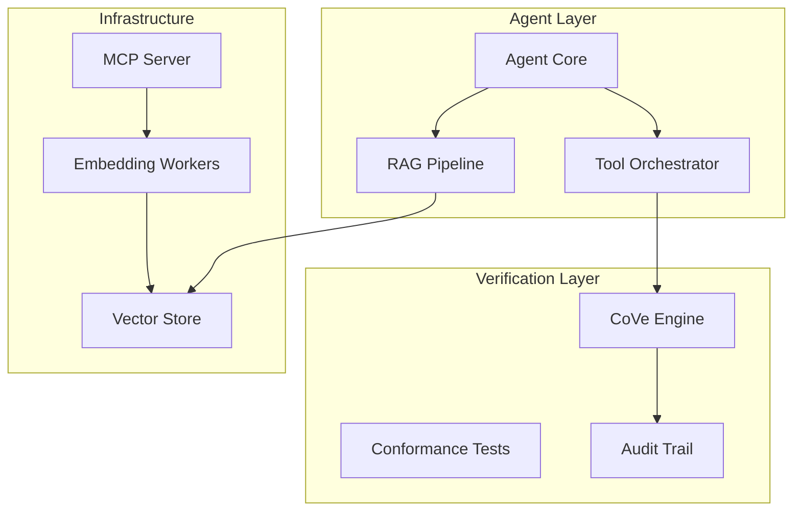

# Architecture Overview

> Last Updated: 2025-12-24

This document describes the high-level architecture of the _codex_ system.

## System Components

## Core Components

### 1. Agent Core (`src/agent/core.py`)

The central orchestration layer that:
- Receives tasks from users or automation
- Decomposes complex tasks into subtasks
- Routes to appropriate tools and models
- Aggregates results and formats responses

### 2. RAG Pipeline (`src/rag/pipelines/`)

Retrieval-Augmented Generation system:
- **Chunking**: Splits documents into semantic chunks
- **Embedding**: Converts text to vector representations
- **Retrieval**: Finds relevant context for queries
- **Augmentation**: Enriches prompts with retrieved context

### 3. Verification Engine (`src/verification/`)

Chain-of-Verification (CoVe) implementation:
- **Claim Extraction**: Identifies factual claims in responses
- **Verification**: Validates claims against sources
- **Scoring**: Assigns confidence scores
- **Audit**: Maintains verification trail

### 4. MCP Integration (`src/mcp/`)

Model Context Protocol for tool integration:
- **Adapters**: Connect to external services (Pinecone, etc.)
- **API**: FastAPI façade for JSON-RPC
- **Workers**: Background processing for embeddings

## Data Flow

1. **Ingest**: Documents are chunked and embedded
2. **Store**: Embeddings saved to vector store
3. **Query**: User query triggers retrieval
4. **Generate**: LLM produces response with context
5. **Verify**: CoVe validates factual claims
6. **Return**: Verified response with confidence

## Security Boundaries

- API keys stored in environment variables only
- All external calls use HTTPS
- Rate limiting on all endpoints
- Audit logging for compliance

## Configuration

All system configuration lives in `configs/`:
- `models.yaml` - Model selection and routing
- `rag_config.yaml` - RAG pipeline settings
- `verification_policy.yaml` - CoVe thresholds
- `security_policies.yaml` - Access control

## See Also

- [Deployment Guide](deployment.md)
- [Security & Risks](security_and_risks.md)
- [Evals & Metrics](evals_and_metrics.md)
