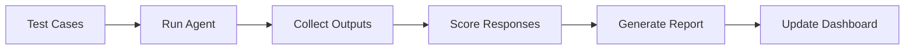

# Evals & Metrics

> Last Updated: 2025-12-24

This document describes the evaluation framework and metrics for the _codex_ system.

## Evaluation Framework

### Evaluation Types

1. **Correctness Evals**
   - Factual accuracy of responses
   - Code correctness (syntax, logic)
   - Task completion rate

2. **Quality Evals**
   - Response coherence
   - Helpfulness ratings
   - User satisfaction scores

3. **Safety Evals**
   - Harmful content detection
   - PII leakage testing
   - Prompt injection resistance

4. **Performance Evals**
   - Latency percentiles (p50, p95, p99)
   - Token efficiency
   - Cost per task

## Key Metrics

### Correctness Metrics

| Metric | Target | Current |
|--------|--------|---------|
| Task Success Rate | >90% | - |
| Factual Accuracy | >95% | - |
| Code Compile Rate | >98% | - |
| Test Pass Rate | >85% | - |

### Quality Metrics

| Metric | Target | Current |
|--------|--------|---------|
| User Satisfaction | >4.0/5.0 | - |
| Response Coherence | >0.85 | - |
| Context Relevance | >0.80 | - |

### Safety Metrics

| Metric | Target | Current |
|--------|--------|---------|
| Harmful Content Rate | <0.1% | - |
| PII Leakage Rate | 0% | - |
| Injection Success Rate | <0.5% | - |

### Performance Metrics

| Metric | Target | Current |
|--------|--------|---------|
| p50 Latency | <2s | - |
| p95 Latency | <10s | - |
| Cost per Task | <$0.05 | - |
| Token Efficiency | >0.8 | - |

## Evaluation Pipeline



### Running Evaluations

```bash
# Run all evals
python -m src.evals.run_all

# Run specific eval suite
python -m src.evals.run --suite correctness

# Generate eval report
python -m src.evals.report --format markdown
```

## Verification Metrics

The Chain-of-Verification (CoVe) system tracks:

- **Verification Coverage**: % of claims verified
- **Verification Accuracy**: Correct verifications / Total
- **False Positive Rate**: Incorrect rejections
- **False Negative Rate**: Missed errors

## Cost Tracking

API usage and costs are tracked via `scripts/analytics/openai_usage_dashboard.py`:

- Daily/weekly/monthly spending
- Per-model cost breakdown
- Token usage trends
- Cost anomaly detection

## Alerting

Alerts trigger when metrics breach thresholds:

- Task success rate < 85%
- p95 latency > 15s
- Error rate > 5%
- Daily cost > $100

## Dashboard

The eval dashboard is available at:
- Internal: `http://localhost:8080/evals`
- Generated: `.github/audit/usage_dashboard.md`

## Configuration

Eval settings in `configs/evals_config.yaml`:

```yaml
evals:
  correctness:
    enabled: true
    threshold: 0.90
  quality:
    enabled: true
    threshold: 0.80
  safety:
    enabled: true
    threshold: 0.99
```

## See Also

- [Architecture](architecture.md)
- [Security & Risks](security_and_risks.md)
