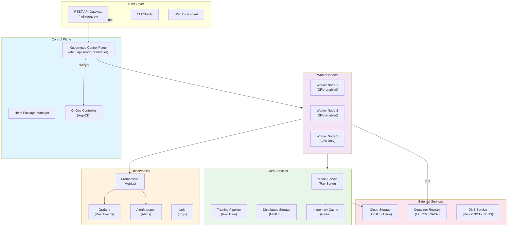
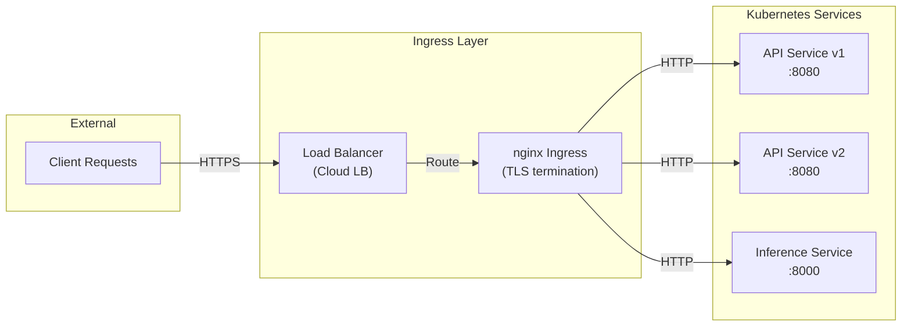
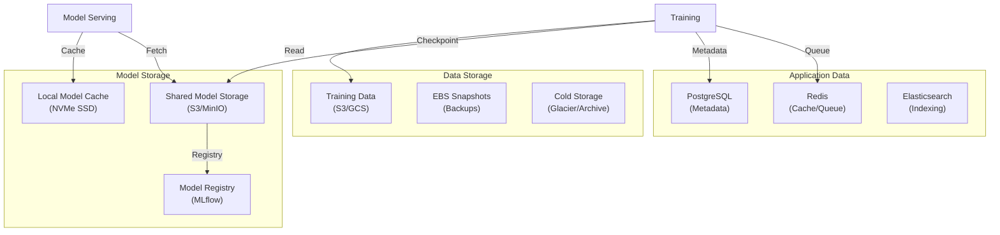
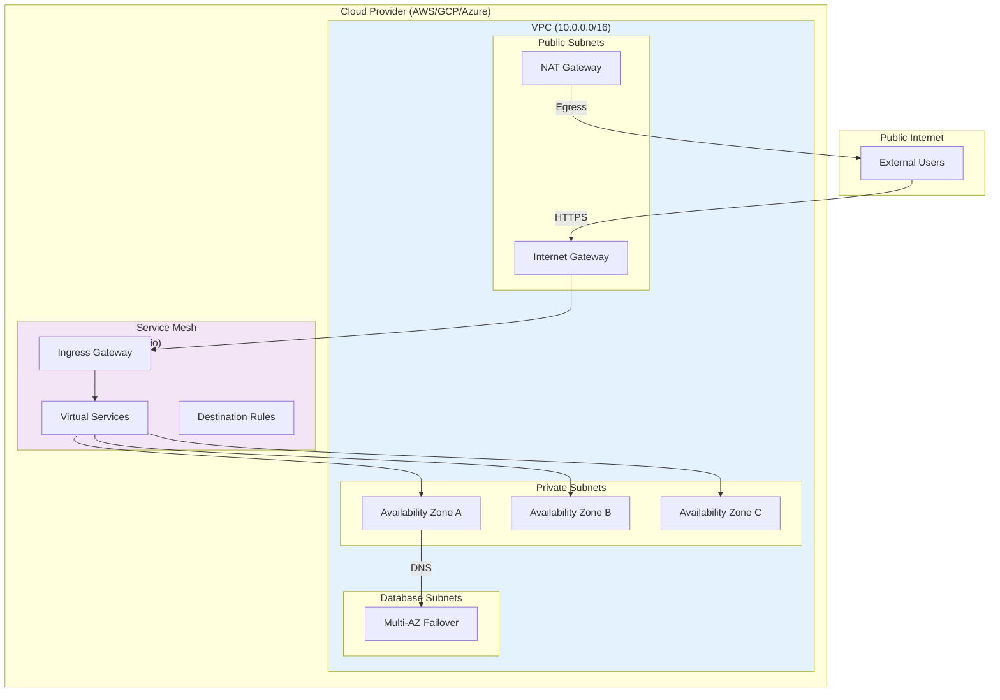
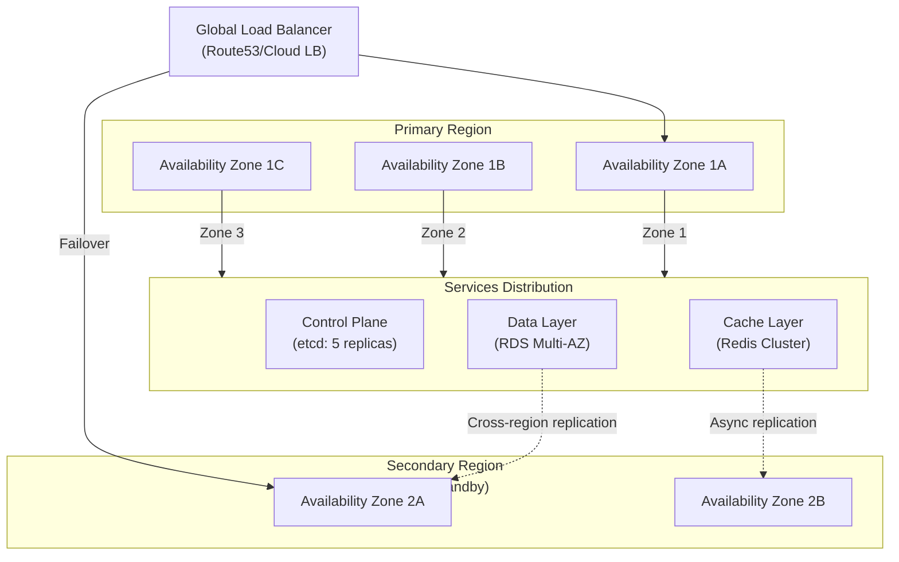
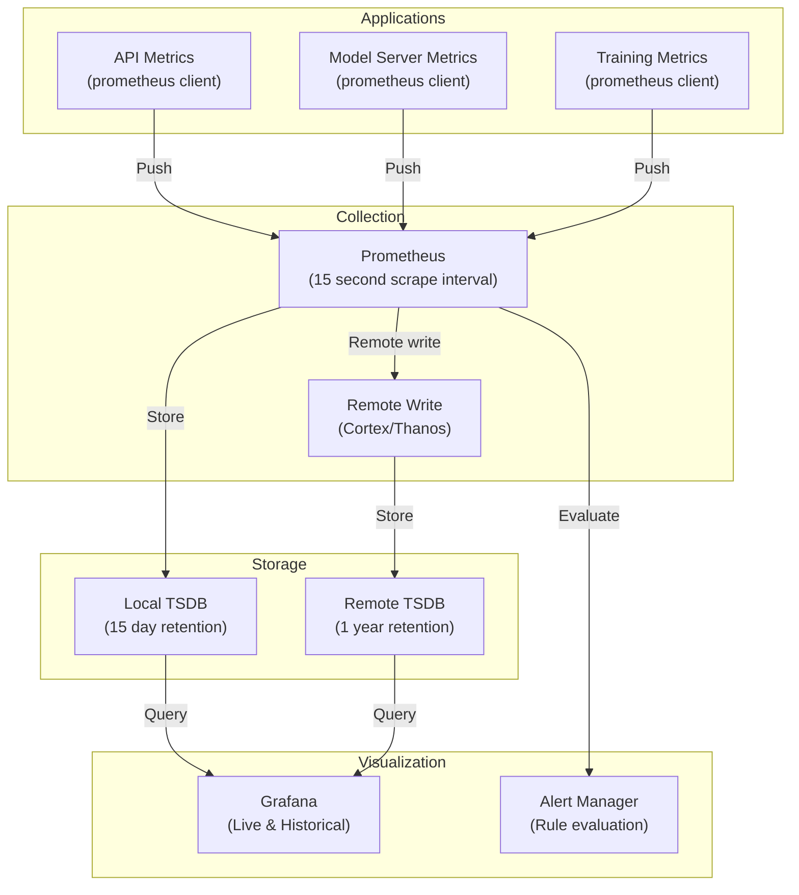

# Infrastructure Architecture - Codex ML Framework
**Last Updated:** 2026-07-11
**Version:** v0.2.1

**Document Version:** 1.0.0
**Last Updated: 2026-07-08
**Authority:** Phase 12 WS3 Documentation Lane 8
**Audience:** DevOps Engineers, Platform Architects, SREs
**Status:** Production Reference

---

## Executive Summary

The Codex ML Framework infrastructure is designed as a distributed, cloud-native architecture supporting production ML workloads at scale. The system provides:

- **Multi-cloud deployment** support (AWS, GCP, Azure, On-premise)
- **Containerized architecture** with Kubernetes orchestration
- **Distributed training** via Ray framework
- **Stateful serving** with Ray Serve for inference
- **Observable infrastructure** with Prometheus/Grafana/AlertManager
- **Auto-scaling** based on compute demand and model serving requirements
- **HA/DR** with multi-region failover and backup strategies

---

## Table of Contents

1. [System Architecture Overview](#system-architecture-overview)
2. [Component Architecture](#component-architecture)
3. [Network Architecture](#network-architecture)
4. [Storage Architecture](#storage-architecture)
5. [Compute Architecture](#compute-architecture)
6. [High Availability & Disaster Recovery](#high-availability--disaster-recovery)
7. [Observability Stack](#observability-stack)
8. [Deployment Environments](#deployment-environments)
9. [Architecture Decision Records](#architecture-decision-records)

---

## System Architecture Overview

### High-Level System Diagram



### Architecture Layers

| Layer | Components | Purpose | Technologies |
|-------|-----------|---------|---------------|
| **Ingress** | API Gateway, Load Balancer | Route external traffic | nginx, Envoy, AWS ALB |
| **Orchestration** | Kubernetes Control Plane | Container orchestration | K8s 1.28+, etcd |
| **Compute** | Worker Nodes | Execute workloads | Docker, containerd, GPU drivers |
| **Application** | Services, Pods, Deployments | Run ML workloads | Ray, FastAPI, TensorFlow |
| **Storage** | Persistent volumes, Object storage | Data persistence | EBS/GCS/Azure Disk, S3/MinIO |
| **Networking** | Service mesh, Network policies | Inter-service communication | Istio/Linkerd, Calico |
| **Observability** | Metrics, logs, traces | System monitoring | Prometheus, Loki, Jaeger |
| **Security** | RBAC, TLS, secrets management | Access control | Kubernetes RBAC, Vault |

---

## Component Architecture

### 1. API Gateway & Ingress



**Specifications:**

- **Protocol**: HTTPS with TLS 1.3
- **Certificate Management**: cert-manager with Let's Encrypt
- **Rate Limiting**: 1000 req/s per API key
- **Timeout**: 30s for inference, 60s for training
- **Compression**: gzip for responses >1KB

### 2. Core Application Services

#### Model Serving (Ray Serve)

```yaml
Service: codex-model-server
Type: StatefulSet
Replicas: 3 (auto-scaling 1-10)
Port: 8000
Memory: 8Gi per replica
GPU: A100 1x per replica (optional)
Health Check:
 - Liveness: /health/live (10s interval)
 - Readiness: /health/ready (5s interval)
```

#### Training Pipeline (Ray Train)

```yaml
Service: codex-training-controller
Type: Deployment
Replicas: 1 (singleton)
Port: 6379
Memory: 4Gi
Job Scheduling: 
 - Max concurrent: 4
 - Queue timeout: 24h
 - Checkpoint interval: 1h
```

#### API Service

```yaml
Service: codex-api-server
Type: Deployment
Replicas: 3 (auto-scaling 2-10)
Port: 8080
Memory: 2Gi per replica
CPU: 2 cores per replica
Features:
 - Rate limiting per API key
 - Request/response logging
 - Distributed tracing
```

### 3. Storage Layer Architecture



**Storage Specifications:**

| Component | Storage Type | Capacity | SLA |
|-----------|--------------|----------|-----|
| PostgreSQL | EBS gp3, 3 AZs | 1TB | 99.99% |
| Redis | Cluster, 6 nodes | 256GB | 99.95% |
| Model Cache | NVMe SSD | 500GB/node | N/A |
| S3/MinIO | Object storage | Unlimited | 99.99% |
| EBS Snapshots | Incremental | 10TB | 99.99% |

### 4. Networking Architecture



**Network Policies:**

- **Pod-to-Pod**: Allow within namespace, deny cross-namespace by default
- **Ingress**: Only HTTP/HTTPS (80, 443) from internet
- **Egress**: Allow to cloud services, deny external by default
- **DNS**: Internal CoreDNS, external DNS via Route53

---

## Compute Architecture

### Node Configuration

```yaml
Node Types:
 - GPU Nodes (A100/H100):
 Instance Type: p4d.24xlarge (AWS) / a100-80gb-pcie (GCP)
 Count: 4-8
 vCPU: 96
 Memory: 1152GB
 GPU: 8x A100 80GB
 Network: 400 Gbps
 Use Cases: Model training, large batch inference
 
 - GPU Nodes (L4):
 Instance Type: g6-standard-48 (GCP) / ml.g4dn.12xlarge (AWS)
 Count: 4-8
 vCPU: 48
 Memory: 192GB
 GPU: 4x L4
 Use Cases: Medium training, inference serving
 
 - CPU Nodes:
 Instance Type: c6i.4xlarge (AWS) / c2-standard-16 (GCP)
 Count: 6-12
 vCPU: 16
 Memory: 32GB
 Use Cases: API servers, metadata services, monitoring
 
 - Memory-Optimized Nodes:
 Instance Type: r6i.4xlarge (AWS) / m2-ultramem-416 (GCP)
 Count: 2-4
 vCPU: 16
 Memory: 128GB
 Use Cases: Cache, data processing
```

### Resource Quotas & Limits

```yaml
Namespace Quotas:
 requests.cpu: 100 cores
 requests.memory: 400Gi
 limits.cpu: 200 cores
 limits.memory: 800Gi
 pods: 200
 persistentvolumeclaims: 50

Pod Limits:
 Model Server:
 cpu: 4-8 cores
 memory: 8-16Gi
 gpu: 1x GPU
 
 API Server:
 cpu: 2 cores
 memory: 2-4Gi
 gpu: none
 
 Training Job:
 cpu: 16-32 cores
 memory: 64-128Gi
 gpu: 4-8x GPUs
```

---

## High Availability & Disaster Recovery

### HA Architecture



**HA Guarantees:**

| Component | Replicas | Strategy | RTO | RPO |
|-----------|----------|----------|-----|-----|
| K8s Control Plane | 5 | Multi-AZ, etcd HA | <1 min | 0 |
| API Service | 3-10 | Auto-scaling | <30s | <5s |
| Model Server | 3-10 | Auto-scaling | <30s | <5s |
| PostgreSQL | 3 | Primary + 2 replicas | <1 min | <5s |
| Redis | 6 | Redis Cluster | <30s | <1s |

### Disaster Recovery Strategy

```yaml
Backup Strategy:
 Database:
 - Frequency: Hourly
 - Retention: 30 days
 - Type: Automated RDS snapshots + point-in-time recovery
 - Location: Multi-region S3
 
 Application State:
 - Frequency: Continuous
 - Type: GitOps (ArgoCD) + Helm charts
 - Location: Git repository
 
 Model Artifacts:
 - Frequency: On model save
 - Type: S3 versioning
 - Location: S3 + cross-region replication
 
 Training Checkpoints:
 - Frequency: Hourly
 - Type: Distributed checkpoints to S3
 - Location: S3 with lifecycle policies

Recovery Procedures:
 Regional Failover:
 - Manual trigger via console/API
 - DNS failover: <5 minutes
 - Service restoration: <10 minutes
 - Data loss: RTO-dependent
 
 Point-in-Time Recovery:
 - Available for last 30 days
 - Estimated duration: 30-60 minutes
 - Data consistency: Full
 
 Disaster Recovery Site:
 - Standby in secondary region
 - Infrastructure as Code deployment
 - Database: Cross-region replica
 - Models: Replicated in S3
```

---

## Observability Stack

### Metrics Architecture



**Metrics Coverage:**

- **Application Metrics**: Request latency, throughput, errors (Histogram, Counter)
- **Model Serving**: Inference latency, batch size, GPU utilization
- **Training**: Loss, accuracy, throughput, GPU memory, checkpoint time
- **Infrastructure**: CPU/Memory/GPU utilization, disk I/O, network
- **Custom Metrics**: Business KPIs, model quality metrics

### Logging Architecture

```yaml
Logging Stack:
 Collection:
 - Containers: stdout/stderr Docker logs
 - Host: Prometheus node exporter for system logs
 - Application: Structured JSON logging
 - Format: JSON with trace IDs
 
 Processing:
 - Fluent Bit: Lightweight log shipper
 - LogQL transformations: Field extraction, aggregation
 - JSON parsing: All application logs
 
 Storage:
 - Loki: TSDB for logs (7 day retention)
 - S3: Long-term storage (30 day retention)
 - Elasticsearch: Full-text search (90 day retention)
 
 Querying:
 - Grafana Loki: Live log exploration
 - LogQL: Prometheus-like query language
 - Elasticsearch: Full-text search
 - Tracing: Jaeger integration for distributed tracing
```

### Alerting Rules

```yaml
Alert Categories:
 Critical (Page):
 - Kubernetes control plane down
 - Data loss detected
 - Service unavailable (5min+)
 - Model serving SLA breach (10min+)
 
 Warning (Email):
 - High error rate (>5%)
 - Disk usage >80%
 - Memory pressure
 - Long training job queue (>1h)
 
 Info (Slack):
 - Deployment events
 - Model updates
 - Backup completion
```

---

## Deployment Environments

### Environment Configuration

```yaml
Development:
 Cloud: Minikube / Kind (local)
 Nodes: 1-2 CPU-only
 Storage: Local volumes
 Replicas: 1
 Scaling: Disabled
 Monitoring: Prometheus + Grafana
 
Staging:
 Cloud: Same provider as prod
 Nodes: 3 mixed (1 GPU, 2 CPU)
 Storage: EBS/GCS Persistent Disks
 Replicas: 2-3
 Scaling: Enabled with lower thresholds
 Monitoring: Full observability stack
 
Production:
 Cloud: Multi-region (Primary + Standby)
 Nodes: 6-20 mixed
 Storage: Multi-AZ RDS, S3, EBS
 Replicas: 3-10 (auto-scaling)
 Scaling: Aggressive thresholds
 Monitoring: Full observability + SLA tracking
 DR: Cross-region replication
```

---

## Architecture Decision Records

### ADR-001: Kubernetes as Container Orchestration

**Decision**: Use Kubernetes 1.28+ for container orchestration

**Rationale:**
- Industry standard for distributed systems
- Excellent GPU support via NVIDIA device plugin
- Rich ecosystem (Helm, ArgoCD, Istio)
- Multi-cloud portability

**Alternatives Considered:**
- Docker Swarm: Simpler but less feature-rich
- Nomad: HashiCorp platform, proprietary ecosystem
- Cloud-native (Lambda, Cloud Run): Less control, higher costs

**Consequences:**
- Operational complexity increases
- Requires Kubernetes expertise
- Cost: ~$5K/month per control plane


### ADR-002: Ray for Distributed Training & Serving

**Decision**: Use Ray Train/Tune/Serve for ML workloads

**Rationale:**
- Native Kubernetes integration
- Fault tolerance with checkpointing
- Unified training/serving framework
- Strong GPU support

**Consequences:**
- Ray cluster management overhead
- Requires monitoring Ray metrics separately
- Learning curve for developers


### ADR-003: PostgreSQL + Redis for Metadata

**Decision**: PostgreSQL for transactional metadata, Redis for caching/queues

**Rationale:**
- PostgreSQL: ACID compliance, mature ecosystem
- Redis: Sub-millisecond latency, high throughput
- Complementary strengths

**Consequences:**
- Operational complexity of 2 systems
- Redis requires active memory management
- Data consistency considerations between systems


### ADR-004: S3-Compatible Object Storage

**Decision**: S3 API for all object storage (AWS S3, GCS, MinIO, Azure Blob)

**Rationale:**
- Multi-cloud compatibility
- Open standard (S3 API)
- Cost-effective
- Unlimited scalability

**Consequences:**
- Need compatibility layer for cloud-specific features
- S3 consistency model implications
- No strong consistency guarantees

---

## Performance Characteristics

### Latency SLAs

```yaml
API Endpoints:
 Health Check: <10ms
 Model List: <50ms
 Single Inference: <500ms (p50), <1s (p99)
 Batch Inference: <2s per 32 samples (p50)
 Metadata Query: <100ms

Model Serving:
 Cold start: <5s
 Warm start: <100ms
 Batch size 1: <200ms
 Batch size 32: <800ms
```

### Throughput Capacity

```yaml
API Service:
 Concurrent connections: 10,000
 RPS: 1,000 (with 3 replicas)
 RPS: 10,000 (with 10 replicas)

Model Serving:
 Single GPU: 10-100 inferences/sec (model-dependent)
 Single node (8 GPUs): 80-800 inferences/sec
 Cluster (10 nodes): 800-8,000 inferences/sec

Training:
 GPU throughput: 1000-10000 samples/sec per GPU
 Multi-GPU: Linear scaling (with distributed training)
```

---

## Security Architecture

### Network Security

- **Ingress**: TLS 1.3, valid certificates only
- **Service-to-Service**: mTLS via service mesh (Istio)
- **Pod-to-Pod**: Network policies enforce least privilege
- **Egress**: Whitelist cloud services, deny unknown

### Data Security

- **Encryption at Rest**: AES-256 via cloud provider KMS
- **Encryption in Transit**: TLS 1.3 for all connections
- **Secrets Management**: Kubernetes secrets (etcd encrypted) + HashiCorp Vault
- **Access Control**: RBAC with service accounts per workload

### Compliance

- **Audit Logging**: All API calls logged to CloudTrail
- **Data Retention**: 30-day default, 1-year for sensitive
- **Access Logs**: Available for audit
- **Compliance**: SOC2, HIPAA-ready architecture

---

## Scalability

### Horizontal Scaling

```yaml
API Service:
 Min: 2 replicas
 Max: 10 replicas
 Metric: CPU >70% for 2 minutes scale up
 Metric: CPU <30% for 10 minutes scale down
 Time to scale: <30s

Model Server:
 Min: 1 replica
 Max: 10 replicas
 Metric: Request queue >100 scale up
 Time to scale: 1-2 minutes (model loading)

Training Controller:
 Singleton (no scaling)
 Job queue: FIFO, auto-backoff for resource contention
```

### Vertical Scaling

- Node upgrades: Rolling update with pod eviction
- GPU upgrades: Supported via node replacement
- Database: Managed service scale-up (no downtime)

---

## Cost Optimization

### Resource Allocation

```yaml
Monthly Cost Breakdown (Estimated):
 Compute:
 - GPU nodes (4x A100): $30,000
 - CPU nodes (10x CPU): $5,000
 - Memory nodes (2x): $1,500
 
 Storage:
 - EBS/Disks: $1,000
 - S3/Object: $500
 - Snapshots: $300
 
 Services:
 - RDS: $2,000
 - Kubernetes (managed): $500
 - Data transfer: $1,000
 
 Observability:
 - Prometheus/Grafana: $200
 - Log storage: $500
 
 Total: ~$42,000/month for production cluster
```

### Cost Reduction Strategies

- **Spot Instances**: Use for training workloads (30-70% savings)
- **Reserved Instances**: For predictable baselines (20-40% savings)
- **Data Tiering**: Archive cold data to Glacier (80% cheaper)
- **Resource Optimization**: Right-size instances, remove unused components

---

## Conclusion

The Codex ML infrastructure is designed for:
- **Reliability**: 99.99% SLA via HA and multi-region DR
- **Performance**: Sub-second API latency, high-throughput training
- **Scalability**: Auto-scaling to 10K+ concurrent requests
- **Observability**: Complete metrics, logs, traces
- **Security**: Multi-layer defense (network, data, access control)
- **Cost-Effectiveness**: ~$40-50K/month for production deployment

For implementation details, see:
- [Deployment Guides](../deployment/)
- [Operational Procedures](OPERATIONS.md)
- [Troubleshooting Guide](../deployment/TROUBLESHOOTING_GUIDE.md)

---

**Next Steps:**
- Review [Network Architecture Details](#network-architecture)
- Study [Component Specifications](#component-architecture)
- Implement [Deployment Checklist](../deployment/PRODUCTION_READINESS_CHECKLIST.md)
