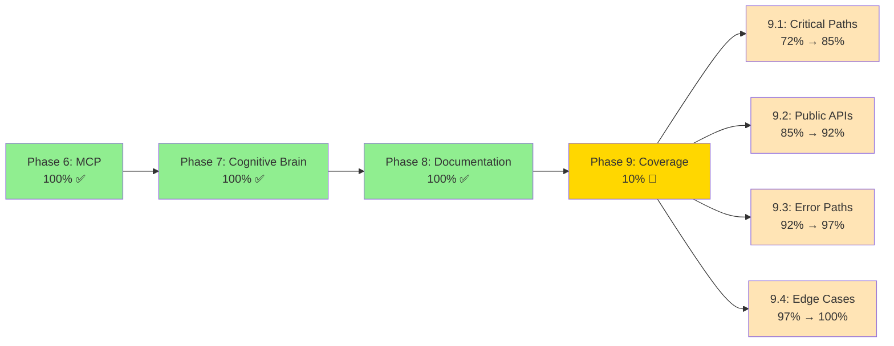
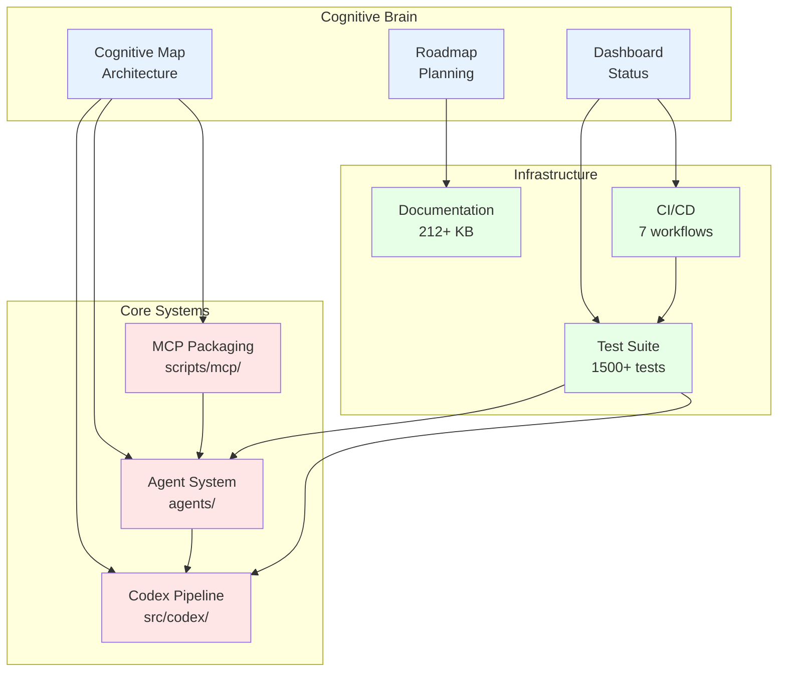
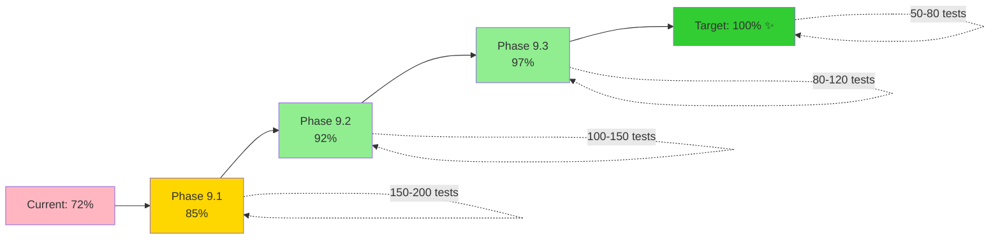
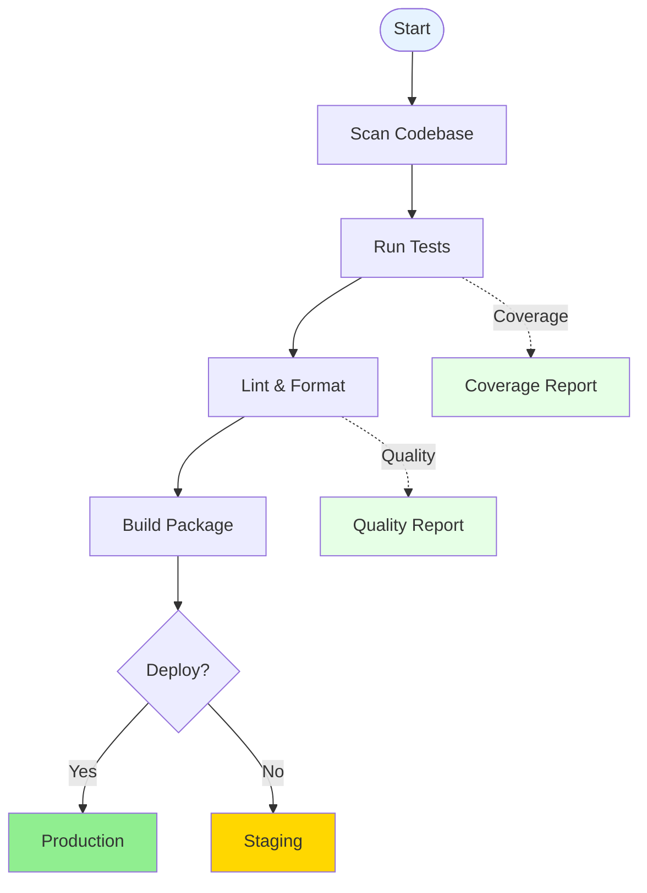

# Diagram and Visualization Update System

**Version**: 1.0.0  
**Created**: 2025-12-30  
**Purpose**: Systematic approach to maintaining diagrams and visualizations  
**Tool**: `scripts/maintenance/update_diagrams.py`

---

## 🎯 Overview

This system ensures all diagrams, Mermaid charts, and visual representations in the codebase remain current and accurate.

### Why Systematic Updates Matter
- **Accuracy**: Diagrams drift from reality over time
- **Onboarding**: New contributors rely on visual guides
- **Documentation**: Visual representations aid understanding
- **Maintenance**: Outdated diagrams mislead and confuse

---

## 🛠️ Automated Update Tool

### Usage

```bash
# Scan repository for all diagrams
python scripts/maintenance/update_diagrams.py --scan

# Generate update report
python scripts/maintenance/update_diagrams.py --scan --output docs/maintenance/DIAGRAM_UPDATE_REPORT.md

# Validate diagram syntax
python scripts/maintenance/update_diagrams.py --validate

# Update diagrams automatically (future)
python scripts/maintenance/update_diagrams.py --update
```

### What It Scans

1. **Mermaid Diagrams** - Flow charts, graphs, sequences
2. **PlantUML Diagrams** - UML diagrams
3. **Graphviz/DOT** - Network graphs
4. **ASCII Art** - Text-based diagrams

### What It Checks

- ✅ Phase status accuracy (Phase 6-9 completion percentages)
- ✅ Workflow diagram currency (reflects actual workflows)
- ✅ Architecture diagram accuracy (matches current structure)
- ✅ Coverage percentages (reflects current test coverage)
- ✅ Component references (all mentioned components exist)

---

## 📊 Standard Diagrams

### Phase Status Diagram

**Location**: Should be in `docs/system/CODEBASE_DASHBOARD.md` and `docs/ROADMAP.md`

**Current Version**:


**Update Trigger**: When any phase changes status or completion percentage

### Architecture Diagram

**Location**: Should be in `docs/system/CODEBASE_COGNITIVE_MAP.md` and `README.md`

**Current Version**:


**Update Trigger**: When new components added or architecture changes

### Coverage Progress Diagram

**Location**: Should be in `docs/testing/COVERAGE_100_ROADMAP.md`

**Current Version**:


**Update Trigger**: After each phase 9 sub-phase completion, update percentages

### Workflow Diagram

**Location**: Should be in `docs/workflows/` or `.github/workflows/README.md`

**Current Version**:


**Update Trigger**: When CI/CD workflows change

---

## 📋 Update Process

### Manual Update Process

1. **Run Scanner**
   ```bash
   python scripts/maintenance/update_diagrams.py --scan
   ```

2. **Review Report**
   - Open `docs/maintenance/DIAGRAM_UPDATE_REPORT.md`
   - Identify diagrams needing updates
   - Note update reasons

3. **Update Diagrams**
   - Use standard diagrams from this guide
   - Modify percentages, names, or structure as needed
   - Maintain consistent styling

4. **Validate**
   ```bash
   python scripts/maintenance/update_diagrams.py --validate
   ```

5. **Commit Changes**
   ```bash
   git add <modified_files>
   git commit -m "docs: Update diagrams to reflect current state"
   ```

### Automated Update Process (Future)

```bash
# Automatically update all diagrams
python scripts/maintenance/update_diagrams.py --update --auto-commit
```

This will:
- Scan for outdated diagrams
- Apply standard updates
- Generate commit with changes
- Optionally create PR

---

## 🔄 Update Triggers

### Phase Status Changes
**Trigger**: Phase completion percentage changes
**Files to Update**:
- `docs/system/CODEBASE_DASHBOARD.md`
- `docs/ROADMAP.md`
- `.github/CONTINUATION_PROMPT_*.md`

**Action**: Update phase status diagram with new percentages

### Architecture Changes
**Trigger**: New components added or removed
**Files to Update**:
- `docs/system/CODEBASE_COGNITIVE_MAP.md`
- `README.md`
- Component-specific README files

**Action**: Update architecture diagram with new components

### Coverage Changes
**Trigger**: Test coverage significantly changes (>5%)
**Files to Update**:
- `docs/testing/COVERAGE_100_ROADMAP.md`
- `docs/system/CODEBASE_DASHBOARD.md`
- Test-related documentation

**Action**: Update coverage diagrams and percentages

### Workflow Changes
**Trigger**: New workflows added or modified
**Files to Update**:
- `.github/workflows/README.md`
- `docs/workflows/`
- CI/CD documentation

**Action**: Update workflow diagrams

---

## 📊 Diagram Standards

### Naming Conventions
- Use descriptive, kebab-case filenames for diagram files
- Prefix with diagram type: `mermaid-`, `plantuml-`, etc.
- Include date in version history: `architecture-Previous Cycle-12-30`

### Styling Guidelines
- **Completed**: Green (#90EE90)
- **In Progress**: Yellow/Gold (#FFD700)
- **Pending**: Light colors (#FFE4B5)
- **Infrastructure**: Light green (#E6FFE6)
- **Core Systems**: Light red (#FFE6E6)
- **Cognitive Brain**: Light blue (#E6F3FF)

### Mermaid Best Practices
1. Use subgraphs for logical groupings
2. Add descriptions with `<br/>` for multi-line labels
3. Use appropriate graph types (TB, LR, etc.)
4. Apply consistent styling
5. Add legends when needed

---

## 🔧 Integration with CI/CD

### Pre-Commit Hook (Future)
```bash
# .git/hooks/pre-commit
python scripts/maintenance/update_diagrams.py --validate
if [ $? -ne 0 ]; then
    echo "❌ Diagram validation failed"
    exit 1
fi
```

### GitHub Actions Workflow (Future)
```yaml
name: Diagram Validation
on: [pull_request]
jobs:
  validate-diagrams:
    runs-on: ubuntu-latest
    steps:
      - uses: actions/checkout@v4
      - name: Validate diagrams
        run: python scripts/maintenance/update_diagrams.py --validate
```

---

## 📈 Maintenance Schedule

| Task | Frequency | Trigger | Owner |
|------|-----------|---------|-------|
| **Phase Diagrams** | After each phase completion | Phase status change | AI Agent |
| **Architecture** | Quarterly or on major changes | New component | DevOps |
| **Coverage** | After Phase 9 sub-phases | Coverage +5% | AI Agent |
| **Workflows** | On workflow changes | Workflow modified | DevOps |
| **Full Scan** | Monthly | First Monday | AI Agent |

---

## ✅ Acceptance Criteria

Diagram system is well-maintained when:
- [ ] All diagrams reflect current state (0 outdated)
- [ ] Automated scanner runs successfully
- [ ] Update reports generated monthly
- [ ] Standard diagrams used consistently
- [ ] Validation passes for all diagrams
- [ ] Update process documented
- [ ] Integration with CI/CD (future)

---

## 📚 References

### Documentation
- [Cognitive Map](../system/CODEBASE_COGNITIVE_MAP.md) - Architecture
- [Dashboard](../system/CODEBASE_DASHBOARD.md) - Current status
- [Roadmap](../ROADMAP.md) - Phase planning
- [Coverage Roadmap](../testing/COVERAGE_100_ROADMAP.md) - Testing plan

### Tools
- [Mermaid Documentation](https://mermaid.js.org/)
- [PlantUML Guide](https://plantuml.com/)
- [Graphviz Documentation](https://graphviz.org/)

### Scripts
- `scripts/maintenance/update_diagrams.py` - Diagram updater
- `scripts/maintenance/check_doc_links.py` - Link validator
- `scripts/mcp/mcp-package` - MCP packager

---

## 🎯 Future Enhancements

### Phase 1 (Phase 1 (Current Cycle))
- [ ] Automatic diagram updates
- [ ] CI/CD integration
- [ ] Pre-commit validation

### Phase 2 (Phase 2 (Current Cycle))
- [ ] Diagram versioning system
- [ ] Diff visualization
- [ ] Historical diagram viewer

### Phase 3 (Phase 3 (Current Cycle))
- [ ] AI-powered diagram generation
- [ ] Real-time diagram updates
- [ ] Interactive diagram editor

---

**Status**: System operational  
**Last Updated**: 2025-12-30  
**Next Review**: 2026-01-30  
**Maintainer**: AI Agent + DevOps Team
