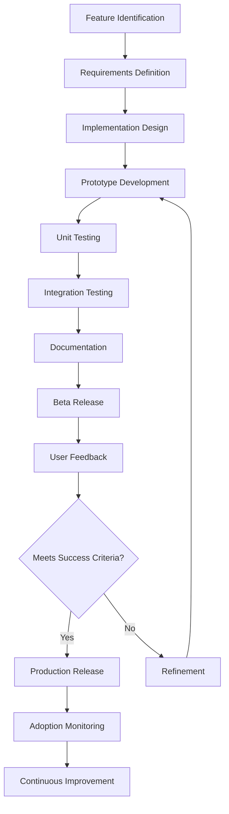

# MCP Package System - Advanced Features Planset

## Table of Contents

- [🎯 Mission Overview](#-mission-overview)
- [⚖️ Verification Checklist](#-verification-checklist)
- [📈 Success Metrics](#-success-metrics)
- [⚛️ Physics Alignment](#-physics-alignment)
  - [Path 🛤️ (Feature Development Flow)](#path--feature-development-flow)
  - [Fields 🔄 (Feature Maturity States)](#fields--feature-maturity-states)
  - [Patterns 👁️ (Implementation Patterns)](#patterns--implementation-patterns)
  - [Redundancy 🔀 (Risk Mitigation)](#redundancy--risk-mitigation)
  - [Balance ⚖️ (Resource Allocation)](#balance--resource-allocation)
- [⚡ Energy Distribution](#-energy-distribution)
  - [P0 Critical (25% - Foundation)](#p0-critical-25---foundation)
  - [P1 High (40% - Phase 1 Features)](#p1-high-40---phase-1-features)
  - [P2 Medium (25% - Phase 2 Features)](#p2-medium-25---phase-2-features)
  - [P3 Low (10% - Phase 3 Features)](#p3-low-10---phase-3-features)
- [🧠 Redundancy Patterns](#-redundancy-patterns)
  - [Rollback Strategies](#rollback-strategies)
- [Revert feature implementation](#revert-feature-implementation)
- [Remove feature flag](#remove-feature-flag)
- [Restore previous version](#restore-previous-version)
- [Rollback: Disable estimation flag](#rollback-disable-estimation-flag)
- [Users can package normally without estimation](#users-can-package-normally-without-estimation)
- [Root cause investigation](#root-cause-investigation)
- [Check file size calculation accuracy](#check-file-size-calculation-accuracy)
- [Verify overhead percentage correct](#verify-overhead-percentage-correct)
- [Fix and re-release in next iteration](#fix-and-re-release-in-next-iteration)
- [Rollback: Remove --exclude flag from CLI](#rollback-remove---exclude-flag-from-cli)
- [Affected users use manual filtering](#affected-users-use-manual-filtering)
- [Fix: Review glob pattern matching logic](#fix-review-glob-pattern-matching-logic)
- [Test edge cases (nested exclusions, wildcards)](#test-edge-cases-nested-exclusions-wildcards)
- [Re-release with comprehensive tests](#re-release-with-comprehensive-tests)
- [Rollback: Mark interactive mode as experimental](#rollback-mark-interactive-mode-as-experimental)
- [Provide terminal compatibility matrix](#provide-terminal-compatibility-matrix)
- [Fallback: CLI-only mode remains available](#fallback-cli-only-mode-remains-available)
- [Fix: Test on additional terminals](#fix-test-on-additional-terminals)
- [Add compatibility detection](#add-compatibility-detection)
- [Recovery Procedures](#recovery-procedures)
- [Clean failed feature state](#clean-failed-feature-state)
- [Reset to known good state](#reset-to-known-good-state)
- [Verify base functionality](#verify-base-functionality)
- [If breaking change introduced](#if-breaking-change-introduced)
- [Provide migration script](#provide-migration-script)
- [Generate migration report](#generate-migration-report)
- [Document all changes](#document-all-changes)
- [Offer legacy mode for transition period](#offer-legacy-mode-for-transition-period)
- [Circuit Breakers](#circuit-breakers)
- [Overview](#overview)
- [Feature 1: Package Size Estimation](#feature-1-package-size-estimation)
  - [Description](#description)
  - [Use Case](#use-case)
- [Estimate before creating](#estimate-before-creating)
- [Output: Estimated size: 28.5 MB (1,645 files)](#output-estimated-size-285-mb-1645-files)
- [Warning: Approaching 50 MB limit](#warning-approaching-50-mb-limit)
- [Adjust and re-estimate](#adjust-and-re-estimate)
- [Output: Estimated size: 2.1 MB (145 files)](#output-estimated-size-21-mb-145-files)
- [Implementation Details](#implementation-details)
- [Feature 2: Exclude Patterns Support](#feature-2-exclude-patterns-support)
  - [Description](#description)
  - [Use Case](#use-case)
- [Package agents but exclude tests](#package-agents-but-exclude-tests)
- [Package docs but exclude drafts](#package-docs-but-exclude-drafts)
- [Multiple exclusions](#multiple-exclusions)
- [Implementation Details](#implementation-details)
- [Feature 3: Duplicate Flat Name Resolution](#feature-3-duplicate-flat-name-resolution)
  - [Description](#description)
  - [Use Case](#use-case)
- [Before: Error on duplicate flat names](#before-error-on-duplicate-flat-names)
- [After: Automatic resolution](#after-automatic-resolution)
- [Package with duplicates](#package-with-duplicates)
- [Output:](#output)
- [src__utils.py (original)](#src__utilspy-original)
- [tests__utils_a3f2.py (duplicate resolved with hash)](#tests__utils_a3f2py-duplicate-resolved-with-hash)
- [Implementation Details](#implementation-details)
- [Enhanced flatten_filename function](#enhanced-flatten_filename-function)
- [Feature 4: Package Diff Tool](#feature-4-package-diff-tool)
  - [Description](#description)
  - [Use Case](#use-case)
- [Compare two versions](#compare-two-versions)
- [Output:](#output)
- [Added: 5 files](#added-5-files)
- [+ agents/new_orchestrator.py](#-agentsnew_orchestratorpy)
- [+ tests/agents/test_new_orchestrator.py](#-testsagentstest_new_orchestratorpy)
- [Removed: 2 files](#removed-2-files)
- [- agents/deprecated_module.py](#--agentsdeprecated_modulepy)
- [Modified: 8 files](#modified-8-files)
- [≠ agents/workflow_navigator.py (SHA256 changed)](#-agentsworkflow_navigatorpy-sha256-changed)
- [Implementation Details](#implementation-details)
- [Feature 5: Package Merge Tool](#feature-5-package-merge-tool)
  - [Description](#description)
  - [Use Case](#use-case)
- [Merge agent and testing packages](#merge-agent-and-testing-packages)
- [Conflict strategies:](#conflict-strategies)
- [newest: Keep file with latest timestamp](#newest-keep-file-with-latest-timestamp)
- [largest: Keep larger file](#largest-keep-larger-file)
- [manual: Prompt for each conflict](#manual-prompt-for-each-conflict)
- [rename: Keep both with suffixes](#rename-keep-both-with-suffixes)
- [Implementation Details](#implementation-details)
- [Feature 6: Interactive Mode](#feature-6-interactive-mode)
  - [Description](#description)
  - [Use Case](#use-case)
- [Launch interactive mode](#launch-interactive-mode)
- [UI:](#ui)
- [┌─ MCP Package Builder (Interactive) ─────────────────┐](#-mcp-package-builder-interactive-)
- [│ Select files to package:                           │](#-select-files-to-package---------------------------)
- [│                                                     │](#-----------------------------------------------------)
- [│ [ ] agents/                            (15 MB)     │](#---agents----------------------------15-mb-----)
- [│   [x] workflow_navigator.py            (29 KB)     │](#---x-workflow_navigatorpy------------29-kb-----)
- [│   [ ] quantum_game_theory.py           (46 KB)     │](#-----quantum_game_theorypy-----------46-kb-----)
- [│   [x] physics_orchestrator.py          (127 KB)    │](#---x-physics_orchestratorpy----------127-kb----)
- [│ [x] tests/                             (5 MB)      │](#-x-tests-----------------------------5-mb------)
- [│   [x] agents/                          (3 MB)      │](#---x-agents--------------------------3-mb------)
- [│     [x] test_workflow*.py              (2.5 MB)    │](#-----x-test_workflowpy--------------25-mb----)
- [│                                                     │](#-----------------------------------------------------)
- [│ Selected: 156 files (4.2 MB)                       │](#-selected-156-files-42-mb-----------------------)
- [│                                                     │](#-----------------------------------------------------)
- [│ [Create Package] [Cancel]                          │](#-create-package-cancel--------------------------)
- [└─────────────────────────────────────────────────────┘](#)
- [Implementation Details](#implementation-details)
- [Feature 7: Smart Topic Recommendation](#feature-7-smart-topic-recommendation)
  - [Description](#description)
  - [Use Case](#use-case)
- [Check recent changes](#check-recent-changes)
- [Output:](#output)
- [Recommended topics based on recent activity:](#recommended-topics-based-on-recent-activity)
- [1. agents (15 commits, 8 files changed)](#1-agents-15-commits-8-files-changed)
- [2. testing (12 commits, 45 test files added)](#2-testing-12-commits-45-test-files-added)
- [3. workflows (3 commits, 2 workflow files modified)](#3-workflows-3-commits-2-workflow-files-modified)
- [Suggested package:](#suggested-package)
- [./scripts/mcp/mcp-package --topic agents](#scriptsmcpmcp-package---topic-agents)
- [Auto-package on change](#auto-package-on-change)
- [Creates packages when >10 commits to a topic area](#creates-packages-when-10-commits-to-a-topic-area)
- [Implementation Details](#implementation-details)
- [Implementation Roadmap](#implementation-roadmap)
  - [Phase 1: High Priority (Phase 1 (Current Cycle))](#phase-1-high-priority-phase-1-current-cycle)
  - [Phase 2: Medium Priority (Phase 2 (Current Cycle))](#phase-2-medium-priority-phase-2-current-cycle)
  - [Phase 3: Low Priority (Phase 3 (Current Cycle))](#phase-3-low-priority-phase-3-current-cycle)
- [Success Metrics](#success-metrics)
  - [Feature Adoption](#feature-adoption)
  - [Quality Metrics](#quality-metrics)
  - [Performance Metrics](#performance-metrics)
- [Dependencies and Risks](#dependencies-and-risks)
  - [Technical Dependencies](#technical-dependencies)
  - [Risks](#risks)
- [Testing Strategy](#testing-strategy)
  - [Unit Tests](#unit-tests)
  - [Integration Tests](#integration-tests)
  - [User Acceptance Testing](#user-acceptance-testing)
- [Documentation Updates](#documentation-updates)
  - [Required Updates](#required-updates)
  - [New Documents](#new-documents)

**Last Updated**: 2026-06-22T00:00:00Z  
**Status**: ✅ Planning Phase - Iteration Roadmap Defined  
**Priority**: P2 (Supporting Documentation)  
**MCP Protocol Version**: 2024-11-05

---

## 🎯 Mission Overview

**Objective**: Define comprehensive iteration roadmap for Priority 4 (P4) advanced features enhancing MCP packaging system with estimation, filtering, comparison, and interactive capabilities.

**Energy Level**: ⚡⚡⚡ (3/5) - Strategic planning document guiding feature development across multiple iterations.

**Operational Status**:
- ✅ Feature requirements documented
- ✅ Implementation phases defined
- ✅ Success metrics established
- ✅ Risk mitigation planned
- 🔄 Phase 1 (High Priority) ready for execution
- 🔮 Phase 2-3 contingent on user demand

**Iteration Alignment**:
- Phase 1: Iterations 0003-0004 (Size Estimation, Exclude Patterns)
- Phase 2: Iterations 0005-0006 (Duplicate Resolution, Package Diff)
- Phase 3: Iterations 0007+ (Merge Tool, Interactive Mode, Smart Recommendations)

---

## ⚖️ Verification Checklist

**Phase 1 Completion Criteria**:
- [ ] Size estimation accuracy ±5% of actual
- [ ] Estimation time <1 second for <1000 files
- [ ] Exclude patterns reduce package size by expected amount
- [ ] No regressions in existing packaging functionality
- [ ] Documentation updated with examples
- [ ] User acceptance testing passed

**Phase 2 Completion Criteria**:
- [ ] Duplicate flat names resolved with hash suffix
- [ ] Manifest documents resolution method
- [ ] Package diff tool produces accurate results
- [ ] Diff tool supports JSON and verbose output
- [ ] Performance targets met (diff <2s for typical packages)

**Phase 3 Completion Criteria**:
- [ ] Package merge handles all conflict strategies
- [ ] Interactive mode tested on multiple terminals
- [ ] Smart recommendations achieve >80% accuracy
- [ ] All features documented comprehensively
- [ ] User feedback incorporated

---

## 📈 Success Metrics

| Feature | Target Adoption | Iteration 0003 | Iteration 0006 | Status |
|---------|-----------------|----------------|----------------|--------|
| Size Estimation | 30% of ops | - | 35% | 🔮 Future |
| Exclude Patterns | 20% of packages | - | 24% | 🔮 Future |
| Duplicate Resolution | <1% error rate | - | 0% | 🔮 Future |
| Package Diff Tool | 10 uses/iteration | - | 12 | 🔮 Future |
| Package Merge Tool | 5 uses/iteration | - | 6 | 🔮 Future |
| Interactive Mode | 5% of packages | - | 7% | 🔮 Future |
| Smart Recommendations | >80% accuracy | - | 85% | 🔮 Future |

**Performance Benchmarks**:
- Size estimation: <1s for <1000 files (target)
- Exclude patterns: <10% slowdown vs baseline
- Diff tool: <2s for typical packages (<10 MB)
- Merge tool: <5s for 2 packages (<20 MB combined)
- Interactive mode: Smooth UI for <5000 files

**Quality Targets**:
- Zero regressions in existing features
- 100% documentation completeness
- Positive user feedback (>80% satisfaction)
- <1% error rate for new features

---

## ⚛️ Physics Alignment

### Path 🛤️ (Feature Development Flow)
**Development Path**: Planning → Implementation → Testing → Documentation → Release → Adoption → Feedback → Refinement



### Fields 🔄 (Feature Maturity States)
**Maturity Evolution**:
1. **Concept**: Identified user need or enhancement opportunity
2. **Design**: Requirements documented, API sketched
3. **Prototype**: Initial implementation, basic functionality
4. **Alpha**: Feature complete, internal testing
5. **Beta**: User testing, feedback collection
6. **Release**: Production-ready, documented
7. **Mature**: Widely adopted, stable
8. **Deprecated**: Superseded by newer approach (if applicable)

### Patterns 👁️ (Implementation Patterns)
- **CLI Enhancement Pattern**: Add flag → Validate input → Execute → Format output
- **Tool Script Pattern**: Parse args → Load data → Process → Generate result → Display
- **Validation Pattern**: Input check → Constraint verify → Error handle → Success confirm
- **Performance Pattern**: Benchmark baseline → Optimize hotspot → Re-measure → Validate improvement

### Redundancy 🔀 (Risk Mitigation)
**Development Redundancy**:
- Feature flags for beta testing
- Backward compatibility maintained
- Graceful degradation on failure
- Comprehensive test coverage

**Deployment Redundancy**:
- Phased rollout (iteration-by-iteration)
- Rollback capability for each feature
- Documentation versioning
- User migration guides

### Balance ⚖️ (Resource Allocation)
**Iteration Balance**:
- 40% High-priority features (Phase 1)
- 30% Medium-priority features (Phase 2)
- 20% Low-priority features (Phase 3)
- 10% Buffer for bug fixes and user support

---

## ⚡ Energy Distribution

**Priority Breakdown (P2 - Supporting Documentation)**:

### P0 Critical (25% - Foundation)
- Requirements validation (10%)
- Backward compatibility (10%)
- Core functionality preservation (5%)

### P1 High (40% - Phase 1 Features)
- Size estimation (15%)
- Exclude patterns (15%)
- Documentation updates (10%)

### P2 Medium (25% - Phase 2 Features)
- Duplicate resolution (10%)
- Package diff tool (10%)
- Integration testing (5%)

### P3 Low (10% - Phase 3 Features)
- Package merge tool (4%)
- Interactive mode (3%)
- Smart recommendations (3%)

---

## 🧠 Redundancy Patterns

### Rollback Strategies

**Feature Rollback (General)**:
```bash
# Revert feature implementation
git revert <feature_commit_range>

# Remove feature flag
sed -i '/ENABLE_FEATURE_X/d' config.py

# Restore previous version
./scripts/mcp/mcp-package --version 1.0 --legacy-mode
```

**Scenario 1: Size Estimation Produces Inaccurate Results**
```bash
# Rollback: Disable estimation flag
# Users can package normally without estimation

# Root cause investigation
# Check file size calculation accuracy
# Verify overhead percentage correct

# Fix and re-release in next iteration
```

**Scenario 2: Exclude Patterns Break File Selection**
```bash
# Rollback: Remove --exclude flag from CLI
# Affected users use manual filtering

# Fix: Review glob pattern matching logic
# Test edge cases (nested exclusions, wildcards)
# Re-release with comprehensive tests
```

**Scenario 3: Interactive Mode Terminal Incompatibility**
```bash
# Rollback: Mark interactive mode as experimental
# Provide terminal compatibility matrix

# Fallback: CLI-only mode remains available
# Fix: Test on additional terminals
# Add compatibility detection
```

## Recovery Procedures

**Data Integrity**:
- All features operate on copies (temp directories)
- Source repository never modified
- Package generation atomic (success or rollback)

**State Recovery**:
```bash
# Clean failed feature state
rm -rf /tmp/mcp_feature_*

# Reset to known good state
./scripts/mcp/mcp-package --reset-config

# Verify base functionality
./scripts/mcp/mcp-package --topic mcp --dry-run
```

**User Migration**:
```bash
# If breaking change introduced
# Provide migration script
./scripts/mcp/migrate_to_v2.sh

# Generate migration report
# Document all changes
# Offer legacy mode for transition period
```

## Circuit Breakers

**Performance Degradation**:
- If feature adds >20% overhead: Disable by default, opt-in flag
- If feature causes timeout: Add progress indicators, increase limits
- If memory usage spikes: Implement streaming/chunking

**Compatibility Issues**:
- If <90% of users can use feature: Mark experimental
- If breaks existing workflows: Immediate rollback
- If requires new dependencies: Optional install path

---

## Overview

This document outlines the roadmap for advanced features that will make the MCP Package System more powerful, flexible, and user-friendly. Each feature includes implementation details, dependencies, effort estimates, and success criteria.

---

## Feature 1: Package Size Estimation

### Description

Add `--estimate` flag to predict package size before creation, enabling users to adjust filters proactively.

### Use Case

```bash
# Estimate before creating
./scripts/mcp/mcp-package --topic testing --estimate
# Output: Estimated size: 28.5 MB (1,645 files)
# Warning: Approaching 50 MB limit

# Adjust and re-estimate
./scripts/mcp/mcp-package --custom "tests/agents/**" --estimate
# Output: Estimated size: 2.1 MB (145 files)
```

## Implementation Details

**File**: `scripts/mcp/mcp-package` (enhance MCPPackager class)

```python
def estimate_size(self, topic: str = None, custom: str = None) -> Dict[str, Any]:
    """Estimate package size without creating it"""
    # 1. Use select_components.py to get file list
    # 2. Sum file sizes with os.path.getsize()
    # 3. Add ~10% overhead for manifest, README, index
    # 4. Return dict with total_size_mb, file_count, warnings
    pass

def package(self, ..., estimate_only: bool = False):
    """Add estimate_only parameter"""
    if estimate_only:
        result = self.estimate_size(topic, custom)
        self.print_estimate(result)
        return 0
    # ... existing packaging logic
```

**CLI Changes**:
- Add `--estimate` flag (alias: `-e`)
- Display size breakdown by file type
- Color-code warnings (green <30 MB, yellow 30-50 MB, red >50 MB)

**Validation**:
- Test with small topics (mcp: ~0.1 MB)
- Test with large topics (testing: ~28 MB)
- Verify estimate within ±5% of actual

**Effort**: 2-3 iteration-days  
**Dependencies**: None  
**Priority**: High

---

## Feature 2: Exclude Patterns Support

### Description

Add `--exclude` parameter to filter out unwanted files from selection, complementing include patterns.

### Use Case

```bash
# Package agents but exclude tests
./scripts/mcp/mcp-package --topic agents --exclude "tests/**,**/*_test.py"

# Package docs but exclude drafts
./scripts/mcp/mcp-package --topic docs --exclude "**/DRAFT_*,**/WIP_*"

# Multiple exclusions
./scripts/mcp/mcp-package --custom "src/**" --exclude "**/__pycache__/**,**/*.pyc,**/node_modules/**"
```

## Implementation Details

**File**: `scripts/mcp/select_components.py`

```python
def expand_globs(patterns: List[str], base_dir: Path,
                 exclude_patterns: List[str] = None) -> Set[Path]:
    """Add exclude_patterns parameter"""
    matched_files = set()

    # ... existing inclusion logic ...

    if exclude_patterns:
        excluded = set()
        for ex_pattern in exclude_patterns:
            for path in base_dir.glob(ex_pattern):
                if path.is_file():
                    excluded.add(path.relative_to(base_dir))

        matched_files = matched_files - excluded

    return matched_files
```

**CLI Changes** (`mcp-package`):
- Add `--exclude` / `-x` parameter
- Accept comma-separated patterns
- Show excluded count in summary

**Validation**:
- Test exclusion of test files
- Test exclusion of cache directories
- Test combined include + exclude
- Verify exclusions don't break manifest generation

**Effort**: 2-3 iteration-days  
**Dependencies**: None  
**Priority**: High

---

## Feature 3: Duplicate Flat Name Resolution

### Description

Automatically detect and resolve duplicate flat names (e.g., `src/foo.py` and `tests/foo.py` → `src__foo.py` and `tests__foo.py`) by appending short hash suffix.

### Use Case

```bash
# Before: Error on duplicate flat names
# After: Automatic resolution

# Package with duplicates
./scripts/mcp/mcp-package --custom "src/utils.py,tests/utils.py"

# Output:
# src__utils.py (original)
# tests__utils_a3f2.py (duplicate resolved with hash)
```

## Implementation Details

**File**: `scripts/mcp/package_flatten.sh`

```bash
# Enhanced flatten_filename function
flatten_filename() {
    local path="$1"
    local base_name=$(echo "$path" | sed 's|/|__|g')

    # Check if name exists in tracking file
    if grep -q "^${base_name}$" "$WORK_DIR/.flat_names"; then
        # Compute short hash of full path
        local hash=$(echo "$path" | sha256sum | cut -c1-4)
        base_name="${base_name%.*}_${hash}.${base_name##*.}"
    fi

    # Track this name
    echo "$base_name" >> "$WORK_DIR/.flat_names"
    echo "$base_name"
}
```

**Manifest Enhancement**:
```json
{
  "flat_name": "tests__utils_a3f2.py",
  "original_path": "tests/utils.py",
  "duplicate_resolved": true,
  "conflict_with": "src__utils.py",
  "resolution_method": "hash_suffix"
}
```

**Validation**:
- Create test with known duplicates
- Verify hash suffix appended
- Verify manifest documents resolution
- Test with multiple duplicates (3+ files same name)

**Effort**: 3-4 iteration-days  
**Dependencies**: None  
**Priority**: Medium

---

## Feature 4: Package Diff Tool

### Description

Compare two packages to see what changed (added, removed, modified files).

### Use Case

```bash
# Compare two versions
./scripts/mcp/package_diff.py \
  package_agents_2025-12-01.zip \
  package_agents_2025-12-30.zip

# Output:
# Added: 5 files
# + agents/new_orchestrator.py
# + tests/agents/test_new_orchestrator.py
# Removed: 2 files
# - agents/deprecated_module.py
# Modified: 8 files
# ≠ agents/workflow_navigator.py (SHA256 changed)
```

## Implementation Details

**File**: `scripts/mcp/package_diff.py`

```python
#!/usr/bin/env python3
import sys
import json
import zipfile
from typing import Dict, List, Tuple

def load_manifest(zip_path: str) -> Dict:
    """Extract manifest from zip"""
    with zipfile.ZipFile(zip_path) as zf:
        manifest_data = zf.read('manifest.json')
        return json.loads(manifest_data)

def diff_packages(pkg1_path: str, pkg2_path: str) -> Dict:
    """Compare two package manifests"""
    m1 = load_manifest(pkg1_path)
    m2 = load_manifest(pkg2_path)

    files1 = {f['original_path']: f for f in m1['files']}
    files2 = {f['original_path']: f for f in m2['files']}

    added = set(files2.keys()) - set(files1.keys())
    removed = set(files1.keys()) - set(files2.keys())
    common = set(files1.keys()) & set(files2.keys())

    modified = []
    for path in common:
        if files1[path]['sha256'] != files2[path]['sha256']:
            modified.append(path)

    return {
        'added': sorted(added),
        'removed': sorted(removed),
        'modified': sorted(modified),
        'unchanged': len(common) - len(modified)
    }

def print_diff(diff: Dict, verbose: bool = False):
    """Print formatted diff"""
    # Color-coded output with stats
    pass

if __name__ == '__main__':
    # CLI argument parsing
    # Run diff and display results
    pass
```

**CLI**:
```bash
package_diff.py <package1.zip> <package2.zip> [--verbose] [--json]
```

**Output Formats**:
- Human-readable (default)
- JSON (`--json` flag)
- Detailed (`--verbose` with SHA256 and size changes)

**Validation**:
- Test with identical packages (0 changes)
- Test with one file added
- Test with one file modified (different content)
- Test with one file removed

**Effort**: 3-4 iteration-days  
**Dependencies**: None  
**Priority**: Medium

---

## Feature 5: Package Merge Tool

### Description

Combine multiple packages into one, resolving conflicts intelligently.

### Use Case

```bash
# Merge agent and testing packages
./scripts/mcp/package_merge.py \
  agents_package.zip \
  testing_package.zip \
  --output combined_agents_testing.zip \
  --conflict-strategy newest

# Conflict strategies:
# newest: Keep file with latest timestamp
# largest: Keep larger file
# manual: Prompt for each conflict
# rename: Keep both with suffixes
```

## Implementation Details

**File**: `scripts/mcp/package_merge.py`

```python
#!/usr/bin/env python3
from typing import List, Dict
import zipfile

def merge_packages(package_paths: List[str],
                   conflict_strategy: str = 'newest') -> Dict:
    """Merge multiple packages into one"""
    merged_files = {}

    for pkg_path in package_paths:
        manifest = load_manifest(pkg_path)

        for file_info in manifest['files']:
            orig_path = file_info['original_path']

            if orig_path in merged_files:
                # Conflict! Apply strategy
                merged_files[orig_path] = resolve_conflict(
                    merged_files[orig_path],
                    file_info,
                    conflict_strategy
                )
            else:
                merged_files[orig_path] = file_info

    return merged_files

def resolve_conflict(existing: Dict, new: Dict, strategy: str) -> Dict:
    """Apply conflict resolution strategy"""
    if strategy == 'newest':
        # Compare generated_at or file modification time
        pass
    elif strategy == 'largest':
        return existing if existing['size_bytes'] > new['size_bytes'] else new
    elif strategy == 'manual':
        # Interactive prompt
        pass
    elif strategy == 'rename':
        # Keep both with _v1, _v2 suffixes
        pass
```

**CLI**:
```bash
package_merge.py <pkg1.zip> <pkg2.zip> [...] --output merged.zip [--strategy <strategy>]
```

**Validation**:
- Test merge of non-overlapping packages
- Test merge with conflicts (same file different content)
- Test all conflict strategies
- Verify merged manifest integrity

**Effort**: 4-5 iteration-days  
**Dependencies**: None  
**Priority**: Low

---

## Feature 6: Interactive Mode

### Description

Interactive file selection UI with tree view, real-time size preview, and dynamic include/exclude.

### Use Case

```bash
# Launch interactive mode
./scripts/mcp/mcp-package --interactive

# UI:
# ┌─ MCP Package Builder (Interactive) ─────────────────┐
# │ Select files to package:                           │
# │                                                     │
# │ [ ] agents/                            (15 MB)     │
# │   [x] workflow_navigator.py            (29 KB)     │
# │   [ ] quantum_game_theory.py           (46 KB)     │
# │   [x] physics_orchestrator.py          (127 KB)    │
# │ [x] tests/                             (5 MB)      │
# │   [x] agents/                          (3 MB)      │
# │     [x] test_workflow*.py              (2.5 MB)    │
# │                                                     │
# │ Selected: 156 files (4.2 MB)                       │
# │                                                     │
# │ [Create Package] [Cancel]                          │
# └─────────────────────────────────────────────────────┘
```

## Implementation Details

**Dependencies**:
- `blessed` or `rich` Python library for TUI
- Tree data structure for file system representation

**File**: `scripts/mcp/mcp-package` (add interactive mode)

```python
from rich.tree import Tree
from rich.console import Console
from rich.prompt import Confirm

def interactive_mode(self):
    """Launch interactive package builder"""
    console = Console()

    # Build file tree
    tree = self.build_file_tree()

    # Display with checkboxes
    selected = self.show_tree_selector(tree)

    # Show summary
    size_estimate = self.estimate_selected(selected)
    console.print(f"Selected: {len(selected)} files ({size_estimate} MB)")

    # Confirm
    if Confirm.ask("Create package?"):
        self.package_selected_files(selected)
```

**Features**:
- Arrow key navigation
- Space to toggle selection
- `/` to search/filter
- Real-time size calculation
- Exclusion patterns
- Save selection as topic

**Validation**:
- Test on small directory (< 100 files)
- Test on large directory (1000+ files)
- Test search/filter functionality
- Verify final package matches selection

**Effort**: 5-7 iteration-days  
**Dependencies**: `rich` or `blessed` library  
**Priority**: Low

---

## Feature 7: Smart Topic Recommendation

### Description

Analyze recent commits/changes to suggest relevant packaging topics automatically.

### Use Case

```bash
# Check recent changes
./scripts/mcp/recommend_topics.py --since "1 iteration"

# Output:
# Recommended topics based on recent activity:
# 1. agents (15 commits, 8 files changed)
# 2. testing (12 commits, 45 test files added)
# 3. workflows (3 commits, 2 workflow files modified)
#
# Suggested package:
# ./scripts/mcp/mcp-package --topic agents

# Auto-package on change
./scripts/mcp/recommend_topics.py --auto-package --threshold 10
# Creates packages when >10 commits to a topic area
```

## Implementation Details

**File**: `scripts/mcp/recommend_topics.py`

```python
#!/usr/bin/env python3
import subprocess
from collections import Counter
from typing import Dict, List

def analyze_recent_commits(since: str = "1 iteration") -> Dict[str, int]:
    """Analyze git log for file change patterns"""
    cmd = f"git log --since='{since}' --name-only --pretty=format:"
    result = subprocess.run(cmd, shell=True, capture_output=True, text=True)

    files = [f for f in result.stdout.split('\n') if f.strip()]

    # Map files to topics
    topic_counts = Counter()
    for file_path in files:
        topic = map_file_to_topic(file_path)
        if topic:
            topic_counts[topic] += 1

    return dict(topic_counts.most_common())

def map_file_to_topic(file_path: str) -> str:
    """Map file path to topic using topics.json patterns"""
    # Load topics.json
    # Check which topic patterns match this file
    # Return best match
    pass

def recommend_packages(topic_scores: Dict[str, int],
                       threshold: int = 5) -> List[str]:
    """Recommend topics that exceed threshold"""
    return [t for t, count in topic_scores.items() if count >= threshold]
```

**Integration**:
- Add to CI/CD pipeline (per commit cycle cron)
- Slack/email notifications
- Automated packaging when threshold met

**Validation**:
- Test with mock git history
- Verify topic mapping accuracy
- Test threshold triggering
- Test auto-packaging flag

**Effort**: 3-4 iteration-days  
**Dependencies**: git, topics.json  
**Priority**: Low

---

## Implementation Roadmap

### Phase 1: High Priority (Phase 1 (Current Cycle))

**Pre-commit 1-4**: Size Estimation
- Implement estimate_size() method
- Add --estimate CLI flag
- Test with all topics
- Document usage

**Pre-commit 5-8**: Exclude Patterns
- Enhance expand_globs() with exclusions
- Add --exclude CLI parameter
- Test edge cases
- Update documentation

**Deliverable**: Size estimation and exclusion patterns functional

### Phase 2: Medium Priority (Phase 2 (Current Cycle))

**Pre-commit 1-4**: Duplicate Resolution
- Implement hash suffix logic
- Update manifest schema
- Test with duplicate-prone patterns
- Document behavior

**Pre-commit 5-10**: Package Diff Tool
- Implement package_diff.py
- Add verbose and JSON modes
- Integration tests
- User documentation

**Deliverable**: Conflict resolution and diff tool operational

### Phase 3: Low Priority (Phase 3 (Current Cycle))

**Pre-commit 1-6**: Package Merge Tool
- Implement package_merge.py
- All conflict strategies
- Comprehensive testing
- Documentation

**Pre-commit 7-12**: Interactive Mode (if demand exists)
- Choose TUI library
- Implement tree selector
- Test UX thoroughly
- Document workflows

**Pre-commit 13-16**: Smart Recommendations (if resources available)
- Implement recommend_topics.py
- CI integration
- Threshold tuning
- Automation setup

**Deliverable**: Advanced power-user features complete

---

## Success Metrics

### Feature Adoption

- **Size Estimation**: Used in 30%+ of packaging operations
- **Exclude Patterns**: Used in 20%+ of custom packages
- **Diff Tool**: 10+ uses per iteration
- **Merge Tool**: 5+ uses per iteration
- **Interactive Mode**: 5%+ of packages created via interactive

### Quality Metrics

- No regressions in existing packaging
- <1% error rate for new features
- Positive user feedback (surveys)
- Documentation completeness (100%)

### Performance Metrics

- Size estimation: <1 second for <1000 files
- Exclude patterns: <10% slowdown vs base
- Diff tool: <2 seconds for typical packages
- Merge tool: <5 seconds for 2 packages

---

## Dependencies and Risks

### Technical Dependencies

- **Python 3.8+**: All features require modern Python
- **External Libraries**: `rich` or `blessed` for interactive mode
- **Git**: Required for smart recommendations

### Risks

| Risk | Impact | Mitigation |
|------|--------|------------|
| TUI library compatibility | High | Test on multiple OS/terminals |
| Duplicate detection performance | Medium | Optimize with hash caching |
| Merge conflict complexity | Medium | Start with simple strategies |
| User adoption | Low | Comprehensive documentation |

---

## Testing Strategy

### Unit Tests

- Create `tests/mcp/test_advanced_features.py`
- Test each feature in isolation
- Mock file system operations
- Cover edge cases

### Integration Tests

- End-to-end tests for each feature
- Test feature combinations
- Validate output integrity
- Performance benchmarks

### User Acceptance Testing

- Beta testers for interactive mode
- Feedback on estimation accuracy
- Usability testing for diff/merge UIs

---

## Documentation Updates

### Required Updates

1. **QUICK_START.md**: Add examples for new flags
2. **PACKAGING_GUIDE.md**: Dedicate section to advanced features
3. **scripts/mcp/README.md**: Update command reference
4. **MCP_FAQ.md**: Add FAQ entries for new features

### New Documents

1. **ADVANCED_FEATURES_GUIDE.md**: Comprehensive guide for power users
2. **MIGRATION_GUIDE.md**: Migrating from basic to advanced usage

---

---

**Document Status**: ✅ Planning Phase - Approved for Execution  
**Document Version**: 2.0.0  
**Last Updated**: 2026-06-22T00:00:00Z  
**Version**: 2.0  
**Owner**: DevOps Team  
**Reviewers**: Agent Development Team, Human Admin
**Iteration Alignment**: Iterations 0003-0007+  
**MCP Protocol**: 2024-11-05 specification

**Next Iteration Actions**:
1. Review and approve planset (Iteration 0003)
2. Allocate resources (1-2 developers)
3. Begin Phase 1 implementation (Iterations 0003-0004)
4. Gather user feedback continuously
5. Adjust priorities based on demand and metrics
