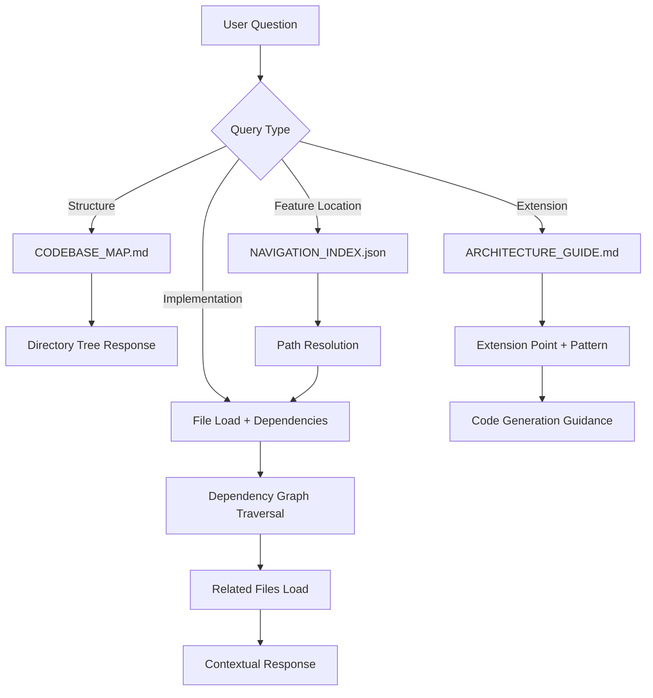

# Generic ChatGPT Project Navigation System

**Last Updated**: 2026-06-22T00:00:00Z  
**Status**: ✅ Framework Ready - Implementation Pending  
**Priority**: P2 (Supporting Documentation)  
**MCP Protocol Version**: 2024-11-05

---

## 🎯 Mission Overview

**Objective**: Establish universal navigation framework for ChatGPT Assistant to intuitively navigate complete zipped codebases through standardized index structures, relationship graphs, and architecture guides.

**Energy Level**: ⚡⚡⚡⚡ (4/5) - High-impact framework enabling ChatGPT understanding of any repository structure.

**Operational Status**:
- ✅ Framework specification complete
- ✅ JSON schema defined (NAVIGATION_INDEX.json)
- ✅ Markdown templates created (CODEBASE_MAP.md, ARCHITECTURE_GUIDE.md)
- ✅ System prompt protocol documented
- 🔄 Generation tool (generate_navigation_system.py) in development
- 🔮 Full codebase packaging workflow pending

---

## ⚖️ Verification Checklist

**Navigation System Prerequisites**:
- [ ] Repository analyzed for module structure
- [ ] Entry points identified (files with `__main__`)
- [ ] Core modules cataloged with purposes
- [ ] File relationships mapped (imports/dependencies)
- [ ] Naming conventions documented
- [ ] Common patterns identified

**Generated Artifact Validation**:
- [ ] NAVIGATION_INDEX.json validates against schema
- [ ] All file_relationships keys exist in files list
- [ ] CODEBASE_MAP.md renders correctly in Markdown viewers
- [ ] ARCHITECTURE_GUIDE.md contains architecture diagrams
- [ ] archive/sessions/2026-01/QUICK_REFERENCE.md includes frequently accessed patterns
- [ ] README_dataset.md provides clear overview

**ChatGPT Integration Verification**:
- [ ] Navigation index parses successfully
- [ ] File path mappings (flat ↔ original) resolve correctly
- [ ] System prompt loads and guides behavior
- [ ] Test query: "Show repository structure" returns accurate tree
- [ ] Test query: "Where is X feature?" resolves to correct files
- [ ] Test query: "How do I add Y?" follows extension points

---

## 📈 Success Metrics

| Metric | Target | Current | Status |
|--------|--------|---------|--------|
| Navigation Index Generation Time | <30s for 1000 files | - | 🔮 Pending Implementation |
| File Relationship Accuracy | >95% | - | 🔮 Pending Implementation |
| ChatGPT Navigation Success Rate | >90% | - | 🔮 Pending Testing |
| Structure Query Response Time | <3s | - | 🔮 Pending Testing |
| Extension Point Identification | 100% | - | 🔮 Pending Validation |
| System Prompt Comprehension | >85% | - | 🔮 Pending User Testing |

**Framework Adoption KPIs** (Post-Implementation):
- Repositories packaged with navigation: 0 (baseline)
- Average assistant query accuracy: TBD
- Developer onboarding time reduction: TBD
- Code review efficiency improvement: TBD

---

## ⚛️ Physics Alignment

### Path 🛤️ (Navigation Flow)
**User Navigation Path**: Question → Index Lookup → File Localization → Relationship Traversal → Context Assembly → Response Generation



### Fields 🔄 (Navigation State Evolution)
**Assistant Mental Model States**:
1. **Uninitialized**: No codebase context
2. **Indexed**: Navigation index loaded, file map created
3. **Structured**: Directory tree and module hierarchy understood
4. **Relational**: File dependencies and relationships mapped
5. **Architectural**: Design patterns and extension points recognized
6. **Operational**: Capable of navigation, code generation, refactoring guidance

### Patterns 👁️ (Observable Navigation Patterns)
- **Naming Convention Pattern**: `test_*.py` → tests, `*__init__.py` → packages
- **Directory Pattern**: `src/` → implementation, `tests/` → validation, `docs/` → documentation
- **Import Pattern**: `from X import Y` → dependency relationship
- **Entry Point Pattern**: `if __name__ == "__main__":` → executable entry
- **Module Grouping Pattern**: Top-level directories = core modules

### Redundancy 🔀 (Multi-Path Navigation)
**Navigation Redundancy**:
- **Path 1**: Direct index lookup (fast, structured)
- **Path 2**: Codebase map scan (human-readable context)
- **Path 3**: Architecture guide (design-level understanding)
- **Path 4**: File content search (fallback for missing index entries)

**Verification Paths**:
- Index says file X depends on Y → Verify by parsing imports
- Map says module Z handles feature → Verify by checking key files
- Architecture guide says pattern P → Verify by finding examples

### Balance ⚖️ (Information Density vs. Accessibility)
**Index Completeness vs. File Size**:
- Full relationship graph: 100% accuracy, larger index
- Core relationships only: 95% coverage, compact index
- **Balance**: Include direct dependencies, lazy-load transitive

**Documentation Depth vs. Clarity**:
- Exhaustive architecture details: Complete but overwhelming
- High-level patterns: Accessible but may miss nuances
- **Balance**: Layered documentation (overview → detail on demand)

---

## ⚡ Energy Distribution

**Priority Breakdown (P2 - Supporting Documentation)**:

### P0 Critical (30% - Core Infrastructure)
- NAVIGATION_INDEX.json schema (10%)
- File relationship accuracy (10%)
- Index generation correctness (10%)

### P1 High (35% - User Experience)
- CODEBASE_MAP.md clarity (15%)
- ARCHITECTURE_GUIDE.md completeness (12%)
- System prompt effectiveness (8%)

### P2 Medium (25% - Enhancement)
- archive/sessions/2026-01/QUICK_REFERENCE.md utility (10%)
- Generation tool automation (10%)
- Documentation templates (5%)

### P3 Low (10% - Future)
- Multi-language support (beyond Python)
- Interactive navigation visualization
- AI-driven architecture analysis

---

## 🧠 Redundancy Patterns

### Rollback Strategies

**Scenario 1: Incorrect File Relationships**
```bash
# Rollback: Regenerate with manual relationship curation
# 1. Identify incorrect relationships
jq '.file_relationships' NAVIGATION_INDEX.json | grep <incorrect_file>

# 2. Edit relationships manually or fix generation logic
python scripts/mcp/generate_navigation_system.py --manual-review

# 3. Validate corrections
python scripts/mcp/validate_navigation_index.py
```

**Scenario 2: ChatGPT Confused by Navigation Index**
```bash
# Rollback: Simplify index structure
# Remove complex relationship chains
# Focus on direct dependencies only

# Regenerate with simplified mode
python scripts/mcp/generate_navigation_system.py --simple-mode

# Test with basic navigation queries
```

**Scenario 3: Generation Tool Fails on Large Repository**
```bash
# Rollback: Manual navigation index creation
# Use template and populate key sections manually

# Partial automation for file listing
find . -name "*.py" > file_list.txt

# Manual relationship mapping for core modules
# Document in CODEBASE_MAP.md
```

### Recovery Procedures

**Index Corruption**:
```bash
# Validate JSON structure
jq . NAVIGATION_INDEX.json > /dev/null && echo "Valid" || echo "Corrupt"

# If corrupt, regenerate from repository
rm NAVIGATION_INDEX.json
python scripts/mcp/generate_navigation_system.py /path/to/repo

# Verify key sections present
jq '.repository, .architecture, .file_relationships' NAVIGATION_INDEX.json
```

**Missing Relationships**:
```bash
# Detect missing relationships
# (files with imports but no relationships documented)
python scripts/mcp/audit_navigation_relationships.py

# Regenerate with comprehensive import analysis
python scripts/mcp/generate_navigation_system.py --deep-analysis
```

**Inconsistent Documentation**:
```bash
# Cross-validate navigation artifacts
# Ensure NAVIGATION_INDEX.json matches CODEBASE_MAP.md

python scripts/mcp/validate_navigation_consistency.py \
  --index NAVIGATION_INDEX.json \
  --map CODEBASE_MAP.md \
  --architecture ARCHITECTURE_GUIDE.md
```

### Circuit Breakers

**Repository Size Limits**:
- <1000 files: Full relationship graph
- 1000-5000 files: Core module relationships
- >5000 files: Entry points + top-level modules only

**Generation Timeout**:
- <1 min: Proceed normally
- 1-5 min: Warn user, allow continuation
- >5 min: Abort, suggest manual index creation

**Complexity Threshold**:
- If circular dependencies detected: Flag for manual review
- If >10 levels of nesting: Simplify in CODEBASE_MAP
- If >100 modules: Group related modules in index

---

## Overview

This system provides a **standardized approach** for packaging entire codebases so ChatGPT Assistant can:
1. Understand repository structure instantly
2. Navigate to relevant code sections
3. Understand relationships between components
4. Apply learned patterns to new problems
5. Generate code that fits the existing architecture

---

## Universal Package Structure

### Core Components

Every ChatGPT Project package should include:

1. **`NAVIGATION_INDEX.json`** - Machine-readable navigation structure
2. **`CODEBASE_MAP.md`** - Human-readable repository overview
3. **`ARCHITECTURE_GUIDE.md`** - System architecture and design patterns
4. **`manifest.json`** - File mappings (from MCP package system)
5. **`README_dataset.md`** - Dataset overview
6. **`archive/sessions/2026-01/QUICK_REFERENCE.md`** - Frequently accessed patterns and utilities

---

## 1. NAVIGATION_INDEX.json

**Purpose**: Machine-readable index for ChatGPT to build mental model of codebase.

### Structure

```json
{
  "repository": {
    "name": "repository_name",
    "description": "Repository purpose",
    "primary_language": "python",
    "framework": "framework_name",
    "version": "1.0.0"
  },
  "architecture": {
    "pattern": "modular|monolithic|microservices|layered",
    "entry_points": [
      {
        "file": "src__main.py",
        "original_path": "src/main.py",
        "purpose": "Main application entry"
      }
    ],
    "core_modules": [
      {
        "name": "agents",
        "path": "src__agents__",
        "purpose": "Agent system implementation",
        "key_files": ["workflow_navigator.py", "quantum_game_theory.py"]
      }
    ]
  },
  "navigation_hints": {
    "to_find_feature_implementation": "src__feature_name__",
    "to_find_tests": "tests__feature_name__",
    "to_find_documentation": "docs__feature_name__",
    "to_find_configuration": "config__",
    "to_find_utilities": "src__utils__"
  },
  "file_relationships": {
    "src__agents__workflow_navigator.py": {
      "depends_on": [
        "src__agents__base.py",
        "src__utils__state_management.py"
      ],
      "used_by": [
        "tests__agents__test_workflow_navigator.py",
        "src__main.py"
      ],
      "documentation": "docs__agents__workflow_navigator.md"
    }
  },
  "naming_conventions": {
    "classes": "PascalCase",
    "functions": "snake_case",
    "constants": "UPPER_SNAKE_CASE",
    "private": "_prefix",
    "test_files": "test_*.py"
  },
  "common_patterns": {
    "error_handling": "Use custom exceptions from src__exceptions.py",
    "logging": "Use logger from src__utils__logging.py",
    "configuration": "Use config from src__config.py",
    "testing": "Use fixtures from tests__conftest.py"
  }
}
```

### Generation Script

Location: `scripts/mcp/generate_navigation_index.py`

---

## 2. CODEBASE_MAP.md

**Purpose**: Human-readable overview of repository structure.

### Template

```markdown
# Codebase Map: [Repository Name]

## Overview
[Brief description of what this codebase does]

## Directory Structure

\`\`\`
repository/
├── src/                    # Source code
│   ├── agents/            # Agent implementations
│   │   ├── workflow_navigator.py
│   │   └── quantum_game_theory.py
│   ├── utils/             # Utility functions
│   └── main.py            # Application entry
├── tests/                 # Test suite
│   ├── agents/           # Agent tests
│   └── integration/      # Integration tests
├── docs/                  # Documentation
├── config/               # Configuration files
└── scripts/              # Build and utility scripts
\`\`\`

## Module Overview

### Core Modules

#### Agents (`src/agents/`)
**Purpose**: Autonomous agent system implementation  
**Key Files**:
- `workflow_navigator.py` - Workflow state management
- `quantum_game_theory.py` - Quantum-inspired decision making  
**Tests**: `tests/agents/`  
**Documentation**: `docs/agents/`

[... repeat for each module ...]

## Navigation Guide

### Finding Features
- Feature implementation: `src/<feature_name>/`
- Feature tests: `tests/<feature_name>/`
- Feature docs: `docs/<feature_name>/`

### Common Tasks
- **Add new agent**: Create in `src/agents/`, follow `base_agent.py` pattern
- **Add new test**: Create in `tests/`, use fixtures from `conftest.py`
- **Update config**: Modify `config/settings.py`, follow validation pattern

## File Relationships

### Import Chains
\`\`\`
main.py → agents/workflow_navigator.py → utils/state_management.py
\`\`\`

### Test Coverage
\`\`\`
src/agents/workflow_navigator.py ← tests/agents/test_workflow_navigator.py
\`\`\`

## Key Patterns

### Error Handling
All errors inherit from `src.exceptions.BaseError`. Use specific error types.

### Logging
Import logger: `from src.utils.logging import get_logger`

### Configuration
Access config: `from src.config import settings`

## Quick Reference

### Most Modified Files
1. `src/agents/workflow_navigator.py` - Workflow engine
2. `src/main.py` - Application entry
3. `tests/agents/test_workflow_navigator.py` - Workflow tests

### Utility Functions
- State management: `src/utils/state_management.py`
- Data validation: `src/utils/validators.py`
- File operations: `src/utils/file_ops.py`
```

---

## 3. ARCHITECTURE_GUIDE.md

**Purpose**: Explain system architecture and design decisions.

### Template

```markdown
# Architecture Guide: [Repository Name]

## System Architecture

### High-Level Design

[Architecture diagram or description]

**Pattern**: [e.g., Layered Architecture, Hexagonal, etc.]

### Layers

1. **Presentation Layer** (`src/api/`)
   - REST API endpoints
   - Request/response handling

2. **Business Logic Layer** (`src/agents/`)
   - Core business logic
   - Agent implementations

3. **Data Layer** (`src/data/`)
   - Database access
   - Data models

### Design Principles

1. **Separation of Concerns**: Each module has single responsibility
2. **Dependency Injection**: Use constructor injection
3. **Interface Segregation**: Small, focused interfaces
4. **Open/Closed**: Extend via inheritance, not modification

## Component Relationships

### Agent System
\`\`\`
BaseAgent (base.py)
    ├── WorkflowNavigator (workflow_navigator.py)
    ├── QuantumGameTheory (quantum_game_theory.py)
    └── [Other agents]
\`\`\`

### Data Flow
\`\`\`
Request → API Layer → Business Layer → Data Layer → Database
         ↓            ↓                ↓
      Validation   Processing      Storage
\`\`\`

## Design Patterns Used

### 1. Factory Pattern
**Location**: `src/factories/`  
**Purpose**: Object creation abstraction  
**Example**: `AgentFactory.create_agent(type="workflow")`

### 2. Observer Pattern
**Location**: `src/observers/`  
**Purpose**: Event notification  
**Example**: Agents observe workflow state changes

### 3. Strategy Pattern
**Location**: `src/strategies/`  
**Purpose**: Algorithm selection at runtime  
**Example**: Different quantum calculation strategies

## Extension Points

### Adding New Agent Type
1. Inherit from `BaseAgent` in `src/agents/base.py`
2. Implement required methods: `execute()`, `validate()`
3. Register in `AgentFactory`
4. Add tests in `tests/agents/`

### Adding New API Endpoint
1. Create route in `src/api/routes/`
2. Define schema in `src/api/schemas/`
3. Add business logic in relevant agent
4. Add integration test in `tests/integration/`

## Testing Strategy

### Unit Tests
- Location: `tests/<module>/test_<file>.py`
- Coverage target: 80%+
- Fixtures in `conftest.py`

### Integration Tests
- Location: `tests/integration/`
- Test workflows end-to-end
- Use test database/mocks

### Property-Based Tests
- Location: `tests/property/`
- Use Hypothesis library
- Test invariants and edge cases

## Configuration

### Environment-Based Config
- Development: `config/dev.py`
- Production: `config/prod.py`
- Testing: `config/test.py`

### Secrets Management
- Never commit secrets
- Use environment variables
- Documented in `.env.example`

## Performance Considerations

### Caching Strategy
- Redis for session data
- In-memory for computed results
- File system for static assets

### Database Optimization
- Indexes on frequently queried fields
- Query optimization patterns
- Connection pooling

## Security Patterns

### Input Validation
- All inputs validated at API boundary
- Use `validators.py` utilities
- Sanitize for SQL injection, XSS

### Authentication
- JWT tokens
- Refresh token rotation
- Role-based access control (RBAC)

## Common Pitfalls

### Don't
- ❌ Import from `tests/` in `src/`
- ❌ Circular imports between modules
- ❌ Hardcode configuration values
- ❌ Skip input validation

### Do
- ✅ Use dependency injection
- ✅ Follow naming conventions
- ✅ Write comprehensive tests
- ✅ Document public APIs
```

---

## 4. Enhanced System Prompt for Full Codebase

**File**: `docs/mcp/FULL_CODEBASE_SYSTEM_PROMPT.md`

```markdown
# ChatGPT Assistant System Prompt - Full Codebase Navigation

You are ChatGPT Assistant with access to a COMPLETE codebase uploaded as a flat-structure dataset. Follow this protocol:

## Startup Sequence

1. **Load Navigation Index FIRST**
   - Parse `NAVIGATION_INDEX.json`
   - Build mental model of:
     - Repository structure
     - Module relationships
     - Naming conventions
     - Common patterns

2. **Read Codebase Map**
   - Parse `CODEBASE_MAP.md`
   - Understand directory structure
   - Identify key modules and their purposes
   - Note file relationships

3. **Study Architecture Guide**
   - Parse `ARCHITECTURE_GUIDE.md`
   - Understand system architecture
   - Learn design patterns used
   - Identify extension points

4. **Load Manifest**
   - Parse `manifest.json`
   - Map flat names to original paths
   - Build file index with metadata

5. **Scan Quick Reference**
   - Parse `archive/sessions/2026-01/QUICK_REFERENCE.md`
   - Identify frequently used patterns
   - Note utility locations

## Navigation Protocol

### When User Asks "How does [feature] work?"

1. **Locate Feature**:
   - Check `NAVIGATION_INDEX.json` → `core_modules`
   - Find in `CODEBASE_MAP.md` → Module Overview
   - Identify key files

2. **Analyze Implementation**:
   - Load main implementation file
   - Check dependencies in `file_relationships`
   - Review tests for usage examples

3. **Explain**:
   - Show file location (both flat and original path)
   - Explain core logic
   - Reference related components
   - Show test examples

### When User Asks "Where is [functionality]?"

1. **Use Navigation Hints**:
   - Check `NAVIGATION_INDEX.json` → `navigation_hints`
   - Apply naming conventions
   - Search relevant modules

2. **Provide Path**:
   - Original path: `src/module/file.py`
   - Flat name: `src__module__file.py`
   - Line number if applicable

### When User Requests "Add new [component]"

1. **Find Extension Point**:
   - Check `ARCHITECTURE_GUIDE.md` → Extension Points
   - Identify base class/interface
   - Note required methods

2. **Follow Patterns**:
   - Review similar existing components
   - Apply naming conventions
   - Use common patterns (error handling, logging, etc.)

3. **Generate Code**:
   - Follow existing style
   - Include proper imports
   - Add docstrings
   - Reference related tests

4. **Suggest Tests**:
   - Location: `tests/<module>/test_<new_component>.py`
   - Follow existing test patterns
   - Use appropriate fixtures

## Context Management

### File Loading Strategy
- **Always load**: Navigation index, codebase map, architecture guide
- **Load on demand**: Implementation files
- **Lazy load**: Large data files, generated files

### Memory Optimization
- Keep navigation index in memory
- Cache frequently accessed files
- Summarize large files before full load

## Response Format

### Code Location References
Always provide:
```
📂 Original: src/agents/workflow_navigator.py
📄 Flat name: src__agents__workflow_navigator.py
📍 Lines: 45-120 (if specific section)
🔗 Related: tests/agents/test_workflow_navigator.py
```

### Code Snippets
Include context:
```python
# src/agents/workflow_navigator.py
# Part of Agent System (see CODEBASE_MAP.md § Core Modules)

class WorkflowNavigator(BaseAgent):
    """Navigate through workflow states."""
    # ...
```

### Provenance
Always include:
- File location (original and flat)
- Module context
- Related files (tests, docs, dependencies)
- Design pattern used (if applicable)

## Common Tasks

### Debugging
1. Locate error source using stack trace
2. Find relevant file in manifest
3. Check tests for expected behavior
4. Review error handling patterns
5. Suggest fix with rationale

### Refactoring
1. Identify code smell
2. Find similar patterns in codebase
3. Suggest refactoring following architecture guide
4. Show before/after with tests

### Feature Addition
1. Find appropriate module using navigation index
2. Identify extension point in architecture guide
3. Generate implementation following patterns
4. Create tests following test strategy
5. Update relevant documentation

## Quality Standards

### Code Generation
- Follow naming conventions from navigation index
- Use patterns from architecture guide
- Include error handling (common_patterns)
- Add logging (common_patterns)
- Write docstrings (follow existing style)

### Documentation
- Update CODEBASE_MAP.md if adding module
- Update ARCHITECTURE_GUIDE.md if changing architecture
- Update archive/sessions/2026-01/QUICK_REFERENCE.md if adding utility
- Maintain provenance in all suggestions

## Error Handling

If File Not Found:
- Check manifest for correct flat name
- Suggest similar filenames
- Check if file moved (look for imports)

If Pattern Unclear:
- Review ARCHITECTURE_GUIDE.md
- Find similar existing implementations
- Ask for clarification if needed

If Navigation Confused:
- Return to NAVIGATION_INDEX.json
- Review CODEBASE_MAP.md structure
- Clarify module boundaries

## Security

- Never expose secrets from config files
- Validate all generated code for security
- Follow security patterns from architecture guide
- Warn about potential vulnerabilities

## Limitations

- Dataset is snapshot; may not reflect latest
- Cannot execute code (suggest user tests)
- Large files may need summarization
- Cross-repository dependencies not included
```

---

## 5. Generation Tools

### Auto-Generate Navigation Files

**Script**: `scripts/mcp/generate_navigation_system.py`

```python
#!/usr/bin/env python3
"""
Generate complete navigation system for full codebase package
"""

import json
import ast
from pathlib import Path
from typing import Dict, List, Set
import subprocess


class NavigationSystemGenerator:
    """Generate NAVIGATION_INDEX.json and CODEBASE_MAP.md"""

    def __init__(self, repo_root: Path):
        self.repo_root = repo_root
        self.modules = {}
        self.relationships = {}

    def analyze_codebase(self):
        """Analyze repository structure"""
        # Find all Python files
        py_files = list(self.repo_root.rglob("*.py"))

        # Build module map
        for py_file in py_files:
            rel_path = py_file.relative_to(self.repo_root)
            module_info = self.analyze_file(py_file)
            self.modules[str(rel_path)] = module_info

        # Analyze relationships
        self.analyze_relationships()

    def analyze_file(self, file_path: Path) -> Dict:
        """Analyze single Python file"""
        try:
            with open(file_path) as f:
                tree = ast.parse(f.read())

            return {
                "classes": [node.name for node in ast.walk(tree)
                           if isinstance(node, ast.ClassDef)],
                "functions": [node.name for node in ast.walk(tree)
                             if isinstance(node, ast.FunctionDef)],
                "imports": self.extract_imports(tree)
            }
        except Exception as e:
            return {"error": str(e)}

    def extract_imports(self, tree) -> List[str]:
        """Extract import statements"""
        imports = []
        for node in ast.walk(tree):
            if isinstance(node, ast.Import):
                imports.extend(alias.name for alias in node.names)
            elif isinstance(node, ast.ImportFrom):
                if node.module:
                    imports.append(node.module)
        return imports

    def analyze_relationships(self):
        """Build file relationship graph"""
        for file_path, info in self.modules.items():
            deps = []
            for imp in info.get("imports", []):
                # Try to resolve to local file
                # Simple heuristic: convert import to file path
                potential_path = imp.replace(".", "/") + ".py"
                if potential_path in self.modules:
                    deps.append(potential_path)

            self.relationships[file_path] = {
                "depends_on": deps,
                "used_by": []  # Will be filled in next pass
            }

        # Fill in "used_by"
        for file_path, rels in self.relationships.items():
            for dep in rels["depends_on"]:
                if dep in self.relationships:
                    self.relationships[dep]["used_by"].append(file_path)

    def generate_navigation_index(self) -> Dict:
        """Generate NAVIGATION_INDEX.json content"""
        # Identify entry points (files with if __name__ == "__main__")
        entry_points = self.find_entry_points()

        # Identify core modules (top-level directories)
        core_modules = self.identify_core_modules()

        return {
            "repository": {
                "name": self.repo_root.name,
                "description": "Auto-generated navigation index",
                "primary_language": "python"
            },
            "architecture": {
                "pattern": "modular",
                "entry_points": entry_points,
                "core_modules": core_modules
            },
            "file_relationships": self.relationships,
            "naming_conventions": {
                "classes": "PascalCase",
                "functions": "snake_case",
                "constants": "UPPER_SNAKE_CASE",
                "test_files": "test_*.py"
            }
        }

    def find_entry_points(self) -> List[Dict]:
        """Find main entry points"""
        entry_points = []
        for file_path in self.modules.keys():
            try:
                with open(self.repo_root / file_path) as f:
                    if 'if __name__ == "__main__":' in f.read():
                        entry_points.append({
                            "file": file_path.replace("/", "__"),
                            "original_path": file_path,
                            "purpose": "Entry point"
                        })
            except:
                pass
        return entry_points

    def identify_core_modules(self) -> List[Dict]:
        """Identify core modules from directory structure"""
        # Get top-level directories with Python files
        modules = {}
        for file_path in self.modules.keys():
            parts = Path(file_path).parts
            if len(parts) > 1 and parts[0] in ["src", "lib"]:
                module_name = parts[1]
                if module_name not in modules:
                    modules[module_name] = []
                modules[module_name].append(file_path)

        result = []
        for module_name, files in modules.items():
            result.append({
                "name": module_name,
                "path": f"src__{module_name}__",
                "file_count": len(files),
                "key_files": [Path(f).name for f in files[:5]]
            })

        return result

    def generate_codebase_map(self) -> str:
        """Generate CODEBASE_MAP.md content"""
        # Generate tree structure
        tree = self.generate_tree()

        # Generate module overview
        module_overview = self.generate_module_overview()

        return f"""# Codebase Map: {self.repo_root.name}

## Directory Structure

```
{tree}
```

## Module Overview

{module_overview}

## Navigation Guide

### Finding Features
- Feature implementation: `src/<feature_name>/`
- Feature tests: `tests/<feature_name>/`
- Feature docs: `docs/<feature_name>/`

### Quick Reference
See archive/sessions/2026-01/QUICK_REFERENCE.md for common patterns and utilities.
"""

    def generate_tree(self) -> str:
        """Generate directory tree"""
        # Simple tree generation
        result = [f"{self.repo_root.name}/"]

        # Get unique directories
        dirs = set()
        for file_path in self.modules.keys():
            parts = Path(file_path).parts
            for i in range(len(parts)):
                dirs.add("/".join(parts[:i+1]))

        for d in sorted(dirs)[:20]:  # Limit for readability
            depth = d.count("/")
            result.append("  " * depth + "├── " + d.split("/")[-1] + "/")

        return "\n".join(result)

    def generate_module_overview(self) -> str:
        """Generate module overview section"""
        # Group files by top-level module
        # ... (implementation details)
        return "### Core Modules\n\n[Auto-generated module descriptions]"

    def save(self, output_dir: Path):
        """Save generated files"""
        output_dir.mkdir(parents=True, exist_ok=True)

        # Save NAVIGATION_INDEX.json
        nav_index = self.generate_navigation_index()
        with open(output_dir / "NAVIGATION_INDEX.json", "w") as f:
            json.dump(nav_index, f, indent=2)

        # Save CODEBASE_MAP.md
        codebase_map = self.generate_codebase_map()
        with open(output_dir / "CODEBASE_MAP.md", "w") as f:
            f.write(codebase_map)

        print(f"✅ Generated navigation system in {output_dir}")


if __name__ == "__main__":
    import sys
    repo_root = Path(sys.argv[1]) if len(sys.argv) > 1 else Path.cwd()
    output_dir = Path(sys.argv[2]) if len(sys.argv) > 2 else Path(".github/tmp")

    generator = NavigationSystemGenerator(repo_root)
    generator.analyze_codebase()
    generator.save(output_dir)
```

---

## 6. Full Codebase Packaging Command

**Enhanced `mcp-package` with `--full` flag**:

```bash
# Package entire codebase with navigation system
./scripts/mcp/mcp-package --full --output complete_codebase.zip

# This will:
# 1. Select ALL code files (respecting .gitignore)
# 2. Generate NAVIGATION_INDEX.json
# 3. Generate CODEBASE_MAP.md
# 4. Copy ARCHITECTURE_GUIDE.md if exists
# 5. Generate archive/sessions/2026-01/QUICK_REFERENCE.md
# 6. Create manifest.json
# 7. Create README_dataset.md
# 8. Package everything with flat structure
```

---

## Usage Example

### For Human Admin

```bash
# 1. Package entire codebase
cd /path/to/repository
./scripts/mcp/mcp-package --full --output repository_complete.zip

# 2. Upload to ChatGPT Project

# 3. Use system prompt from docs/mcp/FULL_CODEBASE_SYSTEM_PROMPT.md

# 4. Test ChatGPT's understanding:
#    "Show me the repository structure"
#    "Where is the workflow navigation implemented?"
#    "How do I add a new agent?"
```

### For ChatGPT Assistant

When loaded with full codebase + navigation system:

**User**: "Show me the repository structure"

**Assistant**:
```
📂 Repository: _codex_

Based on NAVIGATION_INDEX.json and CODEBASE_MAP.md:

Core Modules:
1. agents/ - Autonomous agent system
   - workflow_navigator.py - Workflow state management
   - quantum_game_theory.py - Quantum decision making

2. utils/ - Utility functions
   - state_management.py - State handling
   - logging.py - Logging utilities

3. api/ - REST API layer
   - routes.py - API endpoints
   - schemas.py - Request/response schemas

Entry Points:
- src__main.py (src/main.py) - Main application

[Shows full structure from CODEBASE_MAP.md]
```

**User**: "How do I add a new agent?"

**Assistant**:
```
Based on ARCHITECTURE_GUIDE.md § Extension Points:

To add a new agent:

1. Create file: src/agents/my_new_agent.py
2. Inherit from BaseAgent:

   ```python
   # src/agents/my_new_agent.py
   from src.agents.base import BaseAgent

   class MyNewAgent(BaseAgent):
       def execute(self, task):
           # Implementation
           pass

       def validate(self, input_data):
           # Validation
           pass
   ```

3. Register in AgentFactory (src/factories/agent_factory.py)
4. Add tests in tests/agents/test_my_new_agent.py

See existing agent src__agents__workflow_navigator.py for reference.
```

---

## Benefits

### For ChatGPT Assistant
- ✅ Instant understanding of codebase structure
- ✅ Efficient navigation to relevant code
- ✅ Context-aware code generation
- ✅ Consistent with existing patterns

### For Developers
- ✅ Onboarding documentation generated automatically
- ✅ Codebase understanding via ChatGPT
- ✅ Pattern discovery and reuse
- ✅ Architecture validation

### For Teams
- ✅ Shared understanding via ChatGPT analysis
- ✅ Code review assistance
- ✅ Refactoring guidance
- ✅ Knowledge transfer tool

---

**Document Version**: 2.0.0  
**Last Updated**: 2026-06-22T00:00:00Z  
**Version**: 2.0  
**Status**: Framework Ready - Implementation Pending  
**Related**: PACKAGEABLE_CAPABILITIES.md, PACKAGING_GUIDE.md
**Iteration Alignment**: Implementation target: Iterations 0004-0006  
**MCP Protocol**: 2024-11-05 specification

**Implementation Roadmap**:
- Iteration 0004: Complete generation tool development
- Iteration 0005: Beta testing with _codex_ repository
- Iteration 0006: Production release with user documentation
