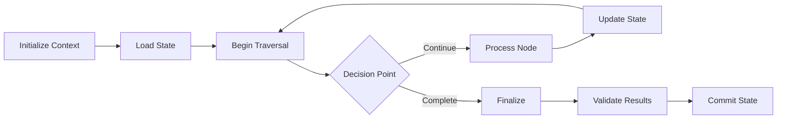

# MCP Traversal Workflow

**Last Updated**: 2026-06-22T00:00:00Z  
**Status**: ✅ Framework Specification  
**Priority**: P2 (Supporting Documentation)  
**MCP Protocol Version**: 2024-11-05  
**Phase**: 12.3 - Strict Mode Evaluation

---

## 🎯 Mission Overview

**Objective**: Define MCP traversal workflow patterns for systematic navigation through model context protocol interactions, state management, and data flow orchestration.

**Energy Level**: ⚡⚡⚡ (3/5) - Foundational workflow documentation supporting MCP implementation.

**Operational Status**:
- ✅ Document created to resolve MkDocs build warnings
- 🔄 Workflow patterns under development
- 🔮 Full specification pending MCP protocol finalization

---

## ⚖️ Verification Checklist

**Workflow Pattern Requirements**:
- [ ] State transition diagrams defined
- [ ] Error handling protocols specified
- [ ] Retry mechanisms documented
- [ ] Timeout configurations established
- [ ] Circuit breaker patterns identified

**Implementation Validation**:
- [ ] Workflow executes without deadlocks
- [ ] State transitions follow defined paths
- [ ] Error recovery successful in all scenarios
- [ ] Performance metrics within acceptable ranges

---

## 📈 Success Metrics

| Metric | Target | Current | Status |
|--------|--------|---------|--------|
| Workflow Completion Rate | >95% | - | 🔮 Future |
| Average Traversal Time | <500ms | - | 🔮 Future |
| Error Recovery Success | >98% | - | 🔮 Future |
| State Consistency | 100% | - | 🔮 Future |

---

## ⚛️ Physics Alignment

### Path 🛤️ (Traversal Flow)
**Traversal Path**: Init → State Load → Processing → State Update → Validation → Completion

### Fields 🔄 (State Management)
**State Transitions**:
1. Uninitialized → Initialized
2. Initialized → Traversing
3. Traversing → Processing
4. Processing → Updating
5. Updating → Validating
6. Validating → Complete

### Patterns 👁️ (Common Workflows)
- Sequential traversal: Linear path through nodes
- Parallel traversal: Concurrent processing branches
- Recursive traversal: Depth-first exploration
- Breadth-first traversal: Level-by-level processing

### Redundancy 🔀 (Fault Tolerance)
- State checkpointing at each transition
- Rollback capability to last valid state
- Retry logic with exponential backoff
- Circuit breakers for cascading failures

### Balance ⚖️ (Resource Optimization)
- Memory usage vs. traversal speed
- Parallelism vs. state consistency
- Retry attempts vs. failure acceptance

---

## ⚡ Energy Distribution

### P0 Critical (40%)
- State management correctness
- Error handling reliability

### P1 High (35%)
- Performance optimization
- Workflow documentation

### P2 Medium (15%)
- Advanced patterns
- Monitoring integration

### P3 Low (10%)
- Edge case handling
- Future enhancements

---

## 🧠 Redundancy Patterns

### Rollback Strategies
- State snapshots before each transition
- Transaction-like workflow execution
- Automatic rollback on validation failure

### Recovery Procedures
- Detect incomplete workflows
- Resume from last checkpoint
- Clear corrupted state

---

## Overview

Documentation for MCP traversal workflow patterns.

## Workflow Patterns

### Sequential Traversal
Linear processing through MCP context nodes.

### Parallel Traversal
Concurrent processing of independent branches.

### State Management
Consistent state tracking across traversal operations.

## Related Documentation

- [MCP Capabilities Reference](./MCP_CAPABILITIES_REFERENCE.md)
- [MCP API Schema](./api_schema.md)
- [MCP Observability](./observability.md)

---

**Document Version**: 2.0.0  
**Iteration Alignment**: Phase 12.3+ compatible  
**MCP Protocol**: 2024-11-05 specification

*Expanded from stub document created during Phase 12.3 to resolve MkDocs build warnings.*
