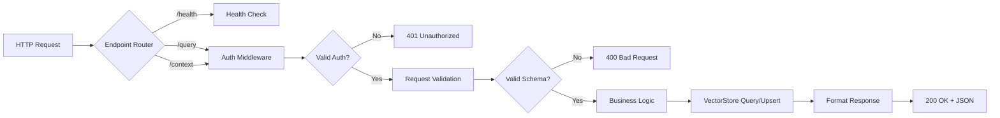

# MCP HTTP API Schema

**Last Updated**: 2026-06-22T00:00:00Z  
**Status**: ✅ Prototype Specification  
**Priority**: P2 (Supporting Documentation)  
**MCP Protocol Version**: 2024-11-05  
**API Version**: v1

---

## 🎯 Mission Overview

**Objective**: Define FastAPI-based HTTP API schema for MCP server deployments, enabling edge-compatible (Cloudflare Workers, Fly.io) and container-based MCP endpoints.

**Energy Level**: ⚡⚡⚡ (3/5) - Active API specification supporting prototype deployment.

**Operational Status**:
- ✅ Prototype implemented in `src/mcp/server/http.py`
- ✅ Three core endpoints operational (/health, /query, /context)
- ✅ Authentication headers defined
- 🔄 OpenAPI schema generation pending
- 🔮 Production hardening in progress

---

## ⚖️ Verification Checklist

**API Specification Requirements**:
- [ ] OpenAPI 3.0+ schema documented
- [ ] Request/response schemas validated with JSON Schema
- [ ] Authentication mechanisms tested (API key, Bearer token)
- [ ] Error response formats standardized
- [ ] Rate limiting behavior documented

**Deployment Validation**:
- [ ] Health endpoint returns 200 OK
- [ ] Query endpoint accepts valid payloads
- [ ] Context upsert endpoint persists data
- [ ] CORS headers configured correctly (if needed)
- [ ] SSL/TLS enforced in production

**Edge Compatibility**:
- [ ] Cloudflare Workers sketch validates
- [ ] Fly.io container deployment tested
- [ ] Cold start latency acceptable (<500ms)
- [ ] Stateless operation verified

---

## 📈 Success Metrics

| Endpoint | Target Latency (p95) | Target Success Rate | Current | Status |
|----------|----------------------|---------------------|---------|--------|
| GET /health | <50ms | 100% | - | 🔮 Pending Monitoring |
| POST /query | <200ms | >95% | - | 🔮 Pending Monitoring |
| POST /context | <100ms | >98% | - | 🔮 Pending Monitoring |

**API Quality KPIs**:
- Schema validation pass rate: 100% (target)
- Authentication failure rate: <1%
- API documentation completeness: 100%
- Edge deployment success rate: >95%

---

## ⚛️ Physics Alignment

### Path 🛤️ (Request Flow)
**Request Path**: Client → Auth → Validation → Processing → Response



### Fields 🔄 (State Transitions)
**Request Lifecycle**:
1. **Received**: HTTP request enters server
2. **Authenticated**: Headers validated
3. **Validated**: Payload schema checked
4. **Processing**: VectorStore operation
5. **Responding**: JSON serialization
6. **Completed**: Response sent to client

### Patterns 👁️ (API Patterns)
- **Health Check Pattern**: Stateless, fast, no auth required
- **Query Pattern**: Auth required, read-only, cacheable
- **Upsert Pattern**: Auth required, write operation, idempotent
- **Error Pattern**: Consistent JSON structure `{"error": {...}}`

### Redundancy 🔀 (Resilience)
**Fault Tolerance**:
- Health endpoint always responds (no dependencies)
- Query endpoint falls back to empty results on error
- Context upsert retries on transient failures
- Circuit breakers prevent cascading failures

### Balance ⚖️ (Trade-offs)
- **Latency vs. Accuracy**: Query top_k = 5 (default) balances speed and relevance
- **Security vs. Usability**: API key header simple but less secure than OAuth
- **Statelessness vs. Performance**: No server-side caching for edge compatibility

---

## ⚡ Energy Distribution

### P0 Critical (40%)
- Schema correctness (15%)
- Authentication security (15%)
- Error handling (10%)

### P1 High (35%)
- Request validation (15%)
- Response formatting (12%)
- Documentation (8%)

### P2 Medium (15%)
- Performance optimization (10%)
- Monitoring integration (5%)

### P3 Low (10%)
- Advanced features (filtering, pagination)
- Multi-language client libraries

---

## 🧠 Redundancy Patterns

### Rollback Strategies

**Scenario 1: Breaking API Change**
```bash
# Rollback: Version API endpoints
# /mcp/v1/* → /mcp/v2/*
# Keep v1 operational during migration

# Deploy v2 alongside v1
# Gradual client migration
# Deprecate v1 after 3 iterations
```

**Scenario 2: Authentication Vulnerability**
```bash
# Immediate rollback: Disable affected endpoint
# POST /context → 503 Service Unavailable

# Fix: Update auth middleware
# Test: Comprehensive security audit
# Re-deploy with hardened auth
```

## Recovery Procedures

**Endpoint Failure**:
```bash
# Detect: /health returns 500
# Diagnose: Check VectorStore connectivity
# Recover: Restart service, clear cache
# Validate: Run smoke tests
```

**Schema Drift**:
```bash
# Detect: Validation errors spike
# Diagnose: Compare request schemas
# Recover: Update schema validators
# Validate: Regression tests pass
```

## Circuit Breakers

**VectorStore Timeout**:
- If query takes >5s: Return 504 Gateway Timeout
- If 3 consecutive failures: Circuit open for 30s
- Health endpoint unaffected

**Rate Limiting**:
- Per-API-key limit: 100 req/min (adjustable)
- Global limit: 1000 req/min
- Exceed limit: 429 Too Many Requests

---

## API Specification

The FastAPI prototype in `src/mcp/server/http.py` exposes three endpoints compatible with edge deployments (Cloudflare Workers) and Fly.io containers.

## Endpoints
- `GET /mcp/v1/health` → `{ "status": "healthy", "documents": <int> }`
- `POST /mcp/v1/query`
  - Headers: `X-MCP-API-Key` or `Authorization: Bearer <token>`
  - Body:
    ```json
    { "query": "<text>", "top_k": 5, "filters": {"scope": "repo"} }
    ```
  - Response:
    ```json
    { "results": [{"id": "demo-1", "score": 1.0, "content": "...", "metadata": {"scope": "repo"}}] }
    ```
- `POST /mcp/v1/context`
  - Headers: same as `/query`
  - Body:
    ```json
    { "items": [{"id": "doc-1", "content": "text", "metadata": {"scope": "repo"}}] }
    ```
  - Response: `{ "upserted": 1 }`

## Workers (Node) sketch
```ts
export default {
  async fetch(request: Request): Promise<Response> {
    if (request.method === "GET" && request.url.endsWith("/mcp/v1/health")) {
      return Response.json({ status: "healthy", documents: 0 });
    }
    // Mirror FastAPI payloads for /query and /context
    return new Response("not implemented", { status: 501 });
  }
};
```

---

**Document Version**: 2.0.0  
**Last Updated**: 2026-06-22T00:00:00Z  
**Implementation**: `src/mcp/server/http.py`  
**Iteration Alignment**: Phase 12.3+ compatible  
**MCP Protocol**: 2024-11-05 specification

**Related Documentation**:
- [MCP Observability](./observability.md)
- [MCP Capabilities Reference](./MCP_CAPABILITIES_REFERENCE.md)
- [Traversal Workflow](./Traversal_Workflow.md)
