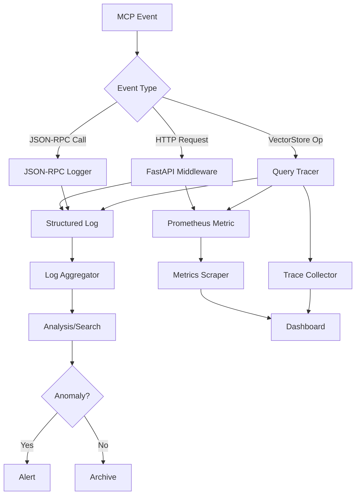

# MCP Observability

**Last Updated**: 2026-06-22T00:00:00Z  
**Status**: ✅ Prototype Implementation  
**Priority**: P2 (Supporting Documentation)  
**MCP Protocol Version**: 2024-11-05

---

## 🎯 Mission Overview

**Objective**: Establish comprehensive observability framework for MCP operations through FastAPI middleware, JSON-RPC logging, metrics collection, and tracing hooks while maintaining offline-first architecture.

**Energy Level**: ⚡⚡⚡ (3/5) - Essential monitoring infrastructure supporting MCP reliability.

**Operational Status**:
- ✅ FastAPI middleware integrated
- ✅ JSON-RPC logging operational
- ✅ Health endpoint exposes status payload
- 🔄 Prometheus scraping endpoint placeholder ready
- 🔮 OpenTelemetry tracing hooks disabled by default (offline-first)

---

## ⚖️ Verification Checklist

**Observability Infrastructure**:
- [ ] Health endpoint returns valid JSON status
- [ ] Logs capture all JSON-RPC unknown notifications
- [ ] Logs capture transport errors with stack traces
- [ ] HTTP smoke tests exercise health and query endpoints
- [ ] Prometheus `/metrics` endpoint ready for instrumentation

**Monitoring Validation**:
- [ ] Log rotation configured (size/time-based)
- [ ] Log levels adjustable via configuration
- [ ] Metrics collection has minimal performance impact (<5% overhead)
- [ ] Tracing can be enabled without code changes (env var)

**Production Readiness**:
- [ ] Structured logging (JSON format) enabled
- [ ] Log aggregation pipeline tested (if applicable)
- [ ] Alert rules defined for critical errors
- [ ] Dashboard templates created (Grafana/similar)

---

## 📈 Success Metrics

| Metric | Target | Current | Status |
|--------|--------|---------|--------|
| Health Endpoint Availability | 99.9% | - | 🔮 Pending Monitoring |
| Log Write Latency (p95) | <10ms | - | 🔮 Pending Monitoring |
| Metrics Scrape Interval | 15s | - | 🔮 Pending Config |
| Tracing Overhead (when enabled) | <8% | - | 🔮 Pending Measurement |
| Alert Response Time | <5min | - | 🔮 Pending Ops Setup |

**Observability Coverage KPIs**:
- Critical paths instrumented: 100% (target)
- Error scenarios logged: 100%
- Performance metrics tracked: >80%
- Distributed traces captured: >70% (when enabled)

---

## ⚛️ Physics Alignment

### Path 🛤️ (Observability Flow)
**Monitoring Path**: Event → Log/Metric → Collection → Aggregation → Analysis → Alert/Dashboard



### Fields 🔄 (Observability States)
**Instrumentation States**:
1. **Uninstrumented**: No observability hooks
2. **Logging Only**: Basic log output
3. **Metrics Enabled**: Prometheus scraping active
4. **Tracing Enabled**: OpenTelemetry spans captured
5. **Fully Observable**: Logs + Metrics + Traces + Alerts

### Patterns 👁️ (Observable Patterns)
- **Request Duration Pattern**: p50/p95/p99 latency tracking
- **Error Rate Pattern**: 4xx/5xx HTTP status codes
- **Throughput Pattern**: Requests per second (RPS)
- **Resource Usage Pattern**: Memory/CPU per operation
- **Dependency Health Pattern**: VectorStore response times

### Redundancy 🔀 (Observability Resilience)
**Multi-Layer Monitoring**:
- Application logs: Immediate issue detection
- Metrics: Trend analysis and capacity planning
- Traces: Root cause analysis for slow requests
- Health checks: Service availability confirmation

**Fallback Mechanisms**:
- If metrics scraping fails: Logs still capture events
- If tracing overhead high: Disable via env var
- If log aggregation down: Local file logs persist

### Balance ⚖️ (Overhead vs. Insight)
**Performance Trade-offs**:
- Verbose logging vs. disk I/O
- Tracing granularity vs. CPU overhead
- Metric cardinality vs. memory usage

**Default Configuration**:
- Logging: INFO level (adjustable to DEBUG for troubleshooting)
- Metrics: Enabled, /metrics endpoint ready
- Tracing: Disabled (enable with `OTEL_ENABLED=1`)

---

## ⚡ Energy Distribution

### P0 Critical (40%)
- Health endpoint reliability (15%)
- Error logging coverage (15%)
- Log write performance (10%)

### P1 High (35%)
- Metrics collection accuracy (15%)
- Structured log format (12%)
- Alert integration (8%)

### P2 Medium (15%)
- Tracing instrumentation (10%)
- Dashboard templates (5%)

### P3 Low (10%)
- Advanced analytics
- Custom metric exporters

---

## 🧠 Redundancy Patterns

### Rollback Strategies

**Scenario 1: Logging Overhead Excessive**
```bash
# Rollback: Reduce log level
export LOG_LEVEL=WARNING  # From DEBUG

# Or disable verbose middleware logging
export MIDDLEWARE_LOGGING=false

# Restart service
systemctl restart mcp-server
```

**Scenario 2: Metrics Scraping Causes Performance Degradation**
```bash
# Rollback: Disable Prometheus endpoint
# Comment out metrics middleware in http.py

# Temporary: Block /metrics endpoint
# iptables -A INPUT -p tcp --dport 8000 -m string --string "/metrics" --algo bm -j DROP

# Fix: Optimize metric collection, reduce cardinality
```

**Scenario 3: Tracing Overhead Unacceptable**
```bash
# Rollback: Disable OpenTelemetry (default state)
export OTEL_ENABLED=0

# Or reduce sampling rate
export OTEL_SAMPLING_RATE=0.01  # From 1.0 (100%)

# Restart with minimal tracing
```

### Recovery Procedures

**Log Rotation Failure**:
```bash
# Detect: Disk full, logs not rotating
df -h | grep /var/log

# Recover: Manual rotation
logrotate -f /etc/logrotate.d/mcp-server

# Verify: Check log file sizes
ls -lh /var/log/mcp-server/
```

**Metrics Endpoint 500 Error**:
```bash
# Detect: /metrics returns 500

# Diagnose: Check middleware errors
journalctl -u mcp-server | grep metrics

# Recover: Restart metrics registry
# (Implementation-specific, may require service restart)
```

**Tracing Data Loss**:
```bash
# Detect: Missing spans in trace backend
# Diagnose: Check OTEL collector connectivity
curl http://otel-collector:4318/v1/traces -I

# Recover: Restart OTEL exporter
export OTEL_EXPORTER_OTLP_ENDPOINT=http://otel-collector:4318
# Restart service
```

### Circuit Breakers

**Log Write Circuit**:
- If log write latency >100ms: Buffer logs in memory
- If buffer full: Drop oldest logs (with warning metric)
- Resume normal logging when latency normalizes

**Metrics Scrape Circuit**:
- If scrape duration >1s: Reduce metric granularity
- If scraper fails 3 times: Disable non-critical metrics
- Resume full metrics after successful scrape

**Trace Export Circuit**:
- If trace export fails: Queue spans locally
- If queue size >10MB: Drop low-priority spans
- Resume export when backend available

---

## Observability Framework

Observability is built around FastAPI middleware and JSON-RPC logging hooks.

## Metrics and logs
- HTTP prototype exposes `status` payload via `/mcp/v1/health`.
- Add Prometheus scraping by mounting `/metrics` (placeholder in `src/mcp/server/http.py` ready for instrumentation hooks).
- JSON-RPC server logs unknown notifications and transport errors via `logging`.

## Tracing hooks
- Wrap `InMemoryVectorStore.query` with tracing decorators when enabling OpenTelemetry; keep disabled by default to stay offline-first.

## Validation
- `python scripts/validate_mcp.py --run-http-smoke` exercises health and query endpoints.
- `PYTEST_DISABLE_PLUGIN_AUTOLOAD=1 pytest tests/mcp/test_http_server.py -q` ensures health payload shape is stable.

---

**Document Version**: 2.0.0  
**Last Updated**: 2026-06-22T00:00:00Z  
**Implementation**: `src/mcp/server/http.py` (FastAPI middleware)  
**Validation**: `scripts/validate_mcp.py --run-http-smoke`  
**Iteration Alignment**: Phase 12.3+ compatible  
**MCP Protocol**: 2024-11-05 specification

**Related Documentation**:
- [MCP API Schema](./api_schema.md)
- [MCP Capabilities Reference](./MCP_CAPABILITIES_REFERENCE.md)
- [Traversal Workflow](./Traversal_Workflow.md)

**Configuration**:
- Default log level: `INFO`
- Metrics endpoint: `/metrics` (placeholder)
- Tracing: Disabled by default (`OTEL_ENABLED=0`)
- Log format: Structured JSON (production), plain text (development)
