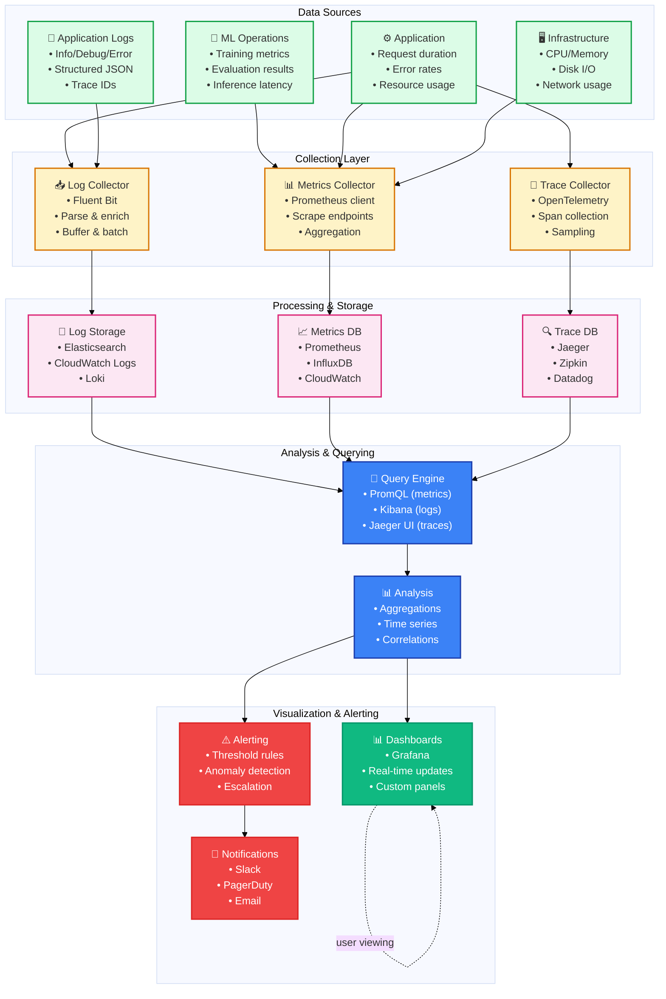

# Monitoring & Observability Architecture

**Last Updated**: 2026-01-20  
**Version**: v0.9.0  
**Status**: Production-Ready

---

## Monitoring Stack Overview



---

## Observability Pillars

### 1. Metrics (Time Series Data)

**What**: Quantitative measurements over time  
**Tools**: Prometheus, InfluxDB, CloudWatch

**Key Metrics**:
```yaml
ml_metrics:
  - training/loss
  - training/accuracy
  - eval/f1_score
  - inference/latency_ms
  - inference/throughput
  
app_metrics:
  - http_request_duration_seconds
  - http_request_count
  - http_errors_total
  - database_query_duration_seconds
  
infra_metrics:
  - cpu_usage_percent
  - memory_usage_bytes
  - disk_io_bytes
  - network_bytes_in/out
```

**Query Example**:
```promql
# 95th percentile inference latency over 5 minutes
histogram_quantile(0.95, rate(inference_latency_ms[5m]))

# Error rate trend
rate(http_errors_total[5m]) / rate(http_request_count[5m])
```

### 2. Logging (Event Streams)

**What**: Detailed event records with context  
**Tools**: Elasticsearch, CloudWatch Logs, Loki

**Log Levels**:
```python
# DEBUG - Detailed diagnostic info
logger.debug("Batch loaded", batch_size=32, num_batches=100)

# INFO - General information
logger.info("Training started", model="gpt2", epochs=30)

# WARNING - Warning conditions
logger.warning("High loss detected", loss=5.23, threshold=3.0)

# ERROR - Error conditions  
logger.error("Training failed", error="OOM", gpu_memory="24GB")

# CRITICAL - Critical conditions
logger.critical("Database unavailable", service="postgres")
```

**Structured Logging**:
```json
{
  "timestamp": "2026-01-20T10:30:45Z",
  "level": "INFO",
  "service": "training",
  "message": "Epoch complete",
  "metadata": {
    "epoch": 5,
    "loss": 2.34,
    "accuracy": 0.78,
    "duration_seconds": 3600
  },
  "trace_id": "abc123def456"
}
```

### 3. Tracing (Execution Flows)

**What**: Distributed request tracing across services  
**Tools**: Jaeger, Zipkin, Datadog

**Trace Example**:
```
Request: POST /api/predict

Span 1: [0ms - 50ms] Request validation
  ├─ Span 1.1: [5ms - 15ms] Input parsing
  └─ Span 1.2: [15ms - 45ms] Schema validation

Span 2: [50ms - 150ms] Model inference
  ├─ Span 2.1: [55ms - 75ms] Model loading
  ├─ Span 2.2: [75ms - 130ms] Forward pass
  └─ Span 2.3: [130ms - 145ms] Post-processing

Span 3: [150ms - 160ms] Response formatting

Total Latency: 160ms
```

### 4. Events (Discrete Occurrences)

**What**: Important events and state changes  
**Tools**: Event streaming, audit logs

**Event Types**:
- Deployment events
- Configuration changes
- User actions
- Error escalations
- Policy violations

---

## Alert Configuration

### Alert Rules

```yaml
groups:
  - name: training
    rules:
      - alert: TrainingLossHigh
        expr: training_loss > 5.0
        for: 5m
        annotations:
          summary: "Training loss is abnormally high"
      
      - alert: TrainingStalled
        expr: rate(training_steps[5m]) == 0
        for: 10m
        annotations:
          summary: "Training process appears stalled"

  - name: serving
    rules:
      - alert: HighInferenceLatency
        expr: histogram_quantile(0.95, inference_latency_ms) > 1000
        for: 5m
        annotations:
          summary: "95% of predictions take >1s"
      
      - alert: HighErrorRate
        expr: rate(http_errors_total[5m]) / rate(http_request_count[5m]) > 0.05
        for: 2m
        annotations:
          summary: "Error rate exceeds 5%"

  - name: infrastructure
    rules:
      - alert: HighCPUUsage
        expr: cpu_usage_percent > 80
        for: 10m
        
      - alert: LowDiskSpace
        expr: disk_free_bytes / disk_total_bytes < 0.1
        for: 5m
```

### Escalation Policy

```
Level 1 (15 min):
  ├─ Slack #alerts channel
  └─ PagerDuty incident (low urgency)

Level 2 (30 min):
  ├─ Page on-call engineer
  ├─ Escalate in PagerDuty
  └─ Post to #incident-response

Level 3 (60 min):
  ├─ Page incident commander
  ├─ Alert manager
  └─ Post incident update

Level 4 (Critical):
  ├─ Immediate page
  ├─ Conference bridge setup
  └─ Customer notification
```

---

## Dashboard Examples

### ML Operations Dashboard
```
┌─────────────────────────────────────┐
│ Training Metrics (Real-time)         │
├─────────────────────────────────────┤
│ Loss: 2.34 ↘️ (target: <2.0)         │
│ Accuracy: 78% ↗️ (target: >85%)      │
│ Epoch: 15/30 [━━━━━━━▯▯▯] 50%       │
│ Time Elapsed: 5h 30m                │
│ Est. Completion: 2h 30m             │
└─────────────────────────────────────┘

┌─────────────────────────────────────┐
│ Resource Usage                      │
├─────────────────────────────────────┤
│ GPU Memory: 22GB / 24GB [████████▯] │
│ CPU Usage: 65% [██████▯▯▯]          │
│ Network: 450Mbps / 1Gbps            │
└─────────────────────────────────────┘

┌─────────────────────────────────────┐
│ Training Progress (Last 7 days)     │
├─────────────────────────────────────┤
│ Loss Trend:     ▁▂▃▄▅▄▃▂ ← improving│
│ Accuracy:       ▂▃▄▅▆▇▇ ← improving│
└─────────────────────────────────────┘
```

### Application Health Dashboard
```
┌─────────────────────────────────────┐
│ API Health (Last 24h)               │
├─────────────────────────────────────┤
│ Uptime: 99.98% ✅                   │
│ Avg Latency: 145ms (target: <200ms) │
│ Error Rate: 0.02% ✅ (target: <0.1%)│
│ Throughput: 1,250 req/s             │
└─────────────────────────────────────┘

┌─────────────────────────────────────┐
│ Database Performance                │
├─────────────────────────────────────┤
│ Query Latency: 12ms (p95)           │
│ Connection Pool: 45/100 active      │
│ Slow Queries: 0 (alert if >5/hour)  │
└─────────────────────────────────────┘

┌─────────────────────────────────────┐
│ Recent Incidents                    │
├─────────────────────────────────────┤
│ None in last 24h ✅                 │
└─────────────────────────────────────┘
```

---

## SLO/SLI Framework

### Service Level Objectives (SLOs)

```yaml
availability:
  sli: "uptime > 99.9%"
  slo: "99.9% (9h downtime/month)"
  
latency:
  sli: "p95 latency < 200ms"
  slo: "200ms for 95% of requests"
  
error_rate:
  sli: "error rate < 0.1%"
  slo: "0.1% maximum error rate"
  
model_accuracy:
  sli: "accuracy > 90%"
  slo: "90% minimum on eval set"
```

---

## Retention Policies

| Data Type | Retention | Storage |
|-----------|-----------|---------|
| **Metrics** | 15 days high-res, 1 year low-res | Prometheus |
| **Logs** | 30 days hot, 1 year cold | Elasticsearch + S3 |
| **Traces** | 7 days | Jaeger |
| **Audit Logs** | 1 year | Immutable storage |

---

## Next Steps

- 👉 See [Monitoring Guide](../monitoring/MONITORING_GUIDE.md) for setup
- 👉 See [Alert Configuration](../monitoring/ALERTS.md) for alert rules
- 👉 See [Dashboard Setup](../monitoring/DASHBOARDS.md) for Grafana config

---

**Related Documentation**:
- [5-Layer Architecture](5_LAYER_ARCHITECTURE.md) - System architecture
- [Logging Guide](../logging/LOGGING_GUIDE.md) - Structured logging
- [Performance Optimization](../performance/OPTIMIZATION.md) - Performance metrics
