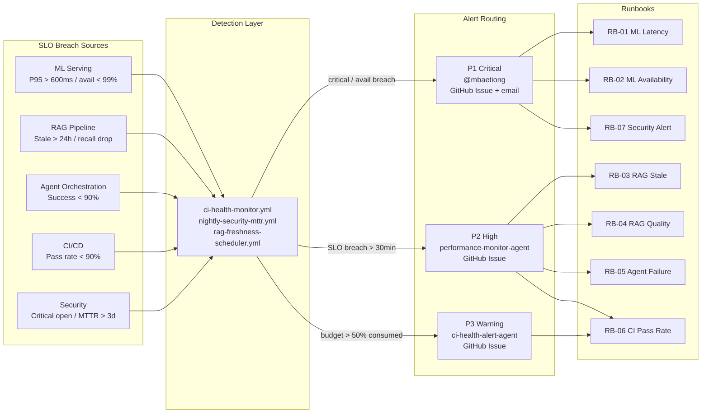

# Codex Platform — SLO Definitions

**Version**: 1.0  
**Created**: 2026-05-27  
**Owner**: `performance-monitor-agent` (primary), `msv-dashboard-monitor` (backup)  
**Dashboard**: [`../../.codex/COMPLETION_DASHBOARD.md`](../../.codex/COMPLETION_DASHBOARD.md)  
**Monitoring config**: [`../../.codex/config/monitoring.yaml`](../../.codex/config/monitoring.yaml)  
**Runbooks**: [`RUNBOOKS.md`](RUNBOOKS.md)

---

## Purpose

This document defines Service-Level Objectives (SLOs) for each critical surface of
the Codex platform.  SLOs are the measurable targets we commit to; they drive alerting
thresholds in `.codex/config/monitoring.yaml` and runbook selection when breached.

---

## Alert Routing Flow

---

## SLO Table

| # | Service | SLO | Measurement | Alert Threshold |
|---|---------|-----|-------------|-----------------|
| 1 | **ML Serving** | Latency P95 ≤ 500 ms | `ci-health-monitor.yml` | > 600 ms for 5 min |
| 2 | **ML Serving** | Availability ≥ 99.5 % | Smoke test every 15 min | < 99 % over 1 h |
| 3 | **RAG Pipeline** | Index freshness ≤ 24 h | `rag-freshness-scheduler.yml` | Age > 24 h |
| 4 | **RAG Pipeline** | Retrieval recall ≥ 0.70 | `test-rag.yml` | Drop > 10 % vs. baseline |
| 5 | **Agent Orchestration** | Success rate ≥ 95 % | `cognitive-action-decision.yml` | < 90 % over 24 h |
| 6 | **Agent Orchestration** | Policy compliance | Compliance log | Any violation |
| 7 | **CI/CD** | 7-day pass rate ≥ 95 % | `ci-health-monitor.yml` | < 90 % |
| 8 | **CI/CD** | Median run ≤ 5 min | `ci-health-monitor.yml` | > 8 min |
| 9 | **Security** | Open critical alerts = 0 | `nightly-security-mttr.yml` | Any critical open |
| 10 | **Security** | MTTR critical ≤ 3 days | `nightly-security-mttr.yml` | > 3 days |

---

## Error Budget

Error budget = allowed downtime / degraded runs within the SLO measurement window.

| SLO | Window | Error Budget |
|-----|--------|-------------|
| ML Serving P95 | 30 days | 4 h (99.5 % availability) |
| RAG freshness | 7 days | 24 h (1 missed rebuild) |
| CI pass rate | 7 days | 8.4 h (95 %) |
| Agent success rate | 7 days | 8.4 h (95 %) |

---

## Alert Routing

| Severity | Condition | Recipient | Channel |
|----------|-----------|-----------|---------|
| P1 (Critical) | Critical security open; ML serving down | `@mbaetiong` | GitHub Issue + email |
| P2 (High) | SLO breach for > 30 min | `performance-monitor-agent` | GitHub Issue |
| P3 (Warning) | Approaching error budget (> 50 % consumed) | `ci-health-alert-agent` | GitHub Issue |

---

## Review Cadence

| Activity | Cadence | Owner |
|----------|---------|-------|
| SLO review | Monthly | `performance-monitor-agent` |
| Error budget review | Weekly | `msv-dashboard-monitor` |
| SLO definition update | Quarterly | `@mbaetiong` |
| Runbook review | Quarterly | `unified-doc-agent` |
