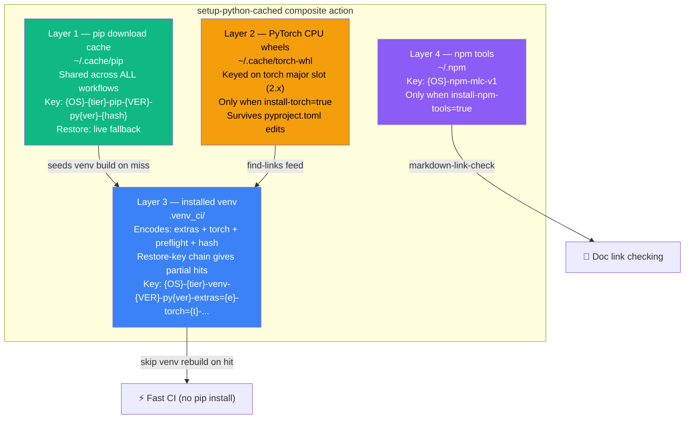
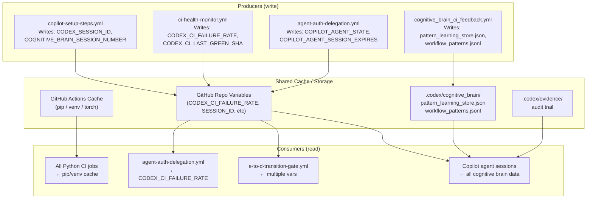
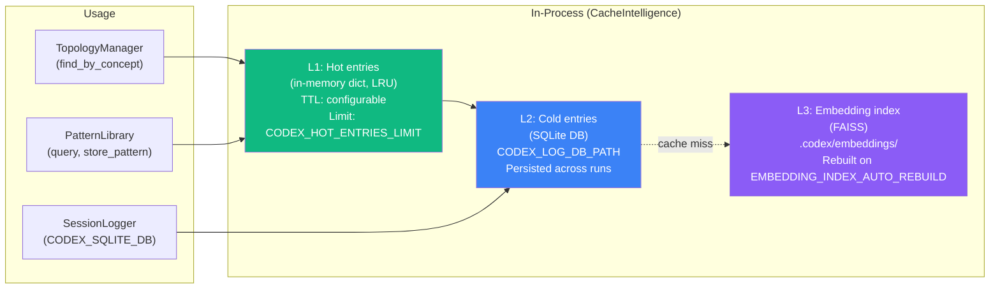
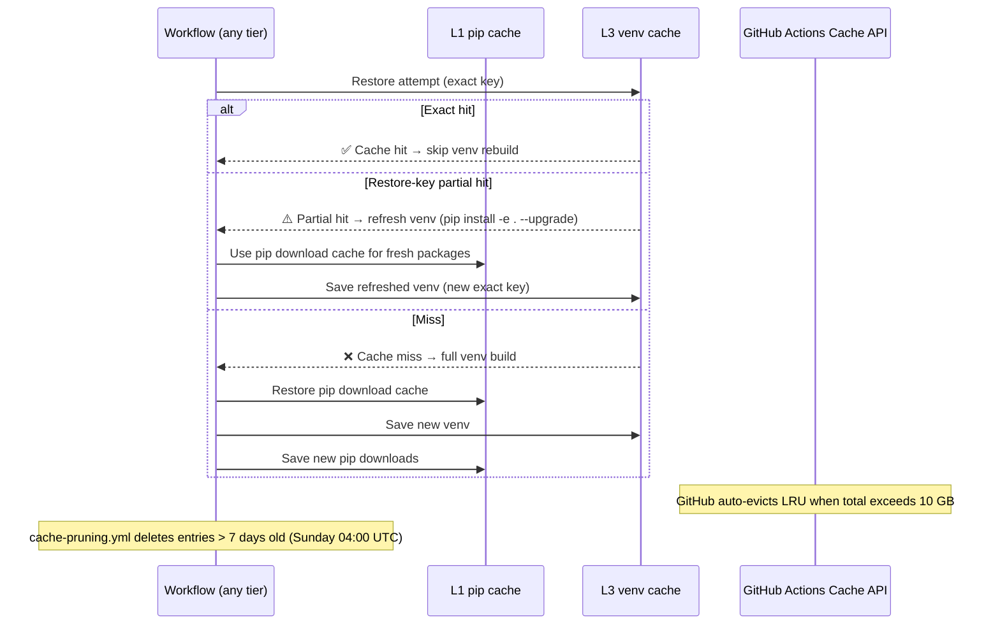

# Cache Shared Datasets — Aries-Serpent/_codex_

**Last Updated:** 2026-06-22

> **Version**: 1.0.0 | **Created**: 2026-06-22 (W-132) | **Owner**: @mbaetiong
> **Purpose**: Single reference for every cache layer, shared dataset, and cross-agent
> sync protocol used across GitHub Actions workflows, composite actions, and cognitive agents.

---

## Table of Contents

1. [4-Layer GitHub Actions Cache Hierarchy](#1-4-layer-github-actions-cache-hierarchy)
2. [Cache Tier System (LIVE / COMMON / EPHEMERAL)](#2-cache-tier-system)
3. [Shared Datasets Between Workflows](#3-shared-datasets-between-workflows)
4. [Cognitive Brain In-Process Cache](#4-cognitive-brain-in-process-cache)
5. [Agent-Level Cache Awareness](#5-agent-level-cache-awareness)
6. [Cache Sync Protocol](#6-cache-sync-protocol)
7. [Gaps & Recommendations](#7-gaps--recommendations)
8. [Cache Management Operations](#8-cache-management-operations)

---

## 1. 4-Layer GitHub Actions Cache Hierarchy

Implemented in `.github/actions/setup-python-cached/action.yml`.
All layers are keyed with `CODEX_CACHE_VERSION` (repo variable, currently `v2`) and
`cache-tier` so the entire hierarchy can be busted by bumping the version, and separate
tiers never collide.



### Key Format Summary

| Layer | Path | Key Pattern | Bust with |
|-------|------|-------------|-----------|
| L1 pip | `~/.cache/pip` | `{OS}-{tier}-pip-{VER}-py{ver}-{pyproject_hash}` | `CODEX_CACHE_VERSION` |
| L2 torch | `~/.cache/torch-whl` | `{OS}-torch-cpu-py{ver}-slot2x` | Manual delete |
| L3 venv | `.venv_ci/` | `{OS}-{tier}-venv-{VER}-py{ver}-extras={e}-torch={t}-preflight={p}-{hash}` | `CODEX_CACHE_VERSION` |
| L4 npm | `~/.npm` | `{OS}-npm-mlc-v1` | Bump `mlc-v1` suffix |

### Cache-Busting

```bash
# Bust L1 + L3 for all tiers simultaneously:
gh variable set CODEX_CACHE_VERSION --body "v3" --repo Aries-Serpent/_codex_
# All workflows using setup-python-cached will get a cache miss on next run.
# L2 (PyTorch) and L4 (npm) are unaffected — bust those manually if needed.
```

### Composite Action Usage

```yaml
# Recommended: pass CODEX_CACHE_VERSION and explicit tier
- uses: ./.github/actions/setup-python-cached
  with:
    python-version: '3.12'
    extras: 'dev'
    cache-tier: live        # live | common | ephemeral
    cache-version: ${{ vars.CODEX_CACHE_VERSION || 'v2' }}
```

---

## 2. Cache Tier System

Defined in `.github/WORKFLOW_CACHE_TIERS.md`. Now **functional** — tier is embedded in
L1/L3 keys, not just informational.


### Fallback Chain

For any tier, restore-keys always include the `live` prefix as a final fallback:

```
1. {OS}-{tier}-pip-v2-py3.12-{exact hash}   ← exact match in tier
2. {OS}-{tier}-pip-v2-py3.12-               ← any in tier (version match)
3. {OS}-live-pip-v2-py3.12-                 ← live tier seed (always populated)
```

---

## 3. Shared Datasets Between Workflows

These are **data artifacts** (not pip caches) that workflows read and write to enable
shared state across runs.



### Variable-Based Shared State

| Variable | Producer | Consumers | Update frequency |
|----------|----------|-----------|-----------------|
| `CODEX_CI_FAILURE_RATE` | `ci-health-monitor.yml` | `agent-auth-delegation.yml`, `e-to-d-transition-gate.yml` | On every completed workflow |
| `CODEX_CI_LAST_GREEN_SHA` | `ci-health-monitor.yml` | `e-to-d-transition-gate.yml`, cognitive brain | On green build |
| `COGNITIVE_BRAIN_SESSION_NUMBER` | `agent-auth-delegation.yml` activate-delegation | All Copilot agent sessions | On every token delegation |
| `CODEX_SESSION_ID` | `copilot-setup-steps.yml` | CLI API server, brain_client.py | On Copilot session start |
| `WEBHOOK_RECEIVER_URL` | `.devcontainer/scripts/post-start.sh` | `webhook_configurator.py`, `agent_infrastructure_manager.yml` | On Codespace start/resume |
| `COPILOT_RUNNER_PROFILE` | `copilot-setup-steps.yml` AAIS step | `copilot-setup-steps.yml` `runs-on` | On AAIS runner recommendation |

### File-Based Shared Datasets

| Dataset | Path | Format | Shared By |
|---------|------|--------|-----------|
| Cognitive brain patterns | `.codex/cognitive_brain/pattern_learning_store.json` | JSON | All Copilot agents, `cognitive_brain_ci_feedback.yml` |
| Workflow patterns | `.codex/cognitive_brain/workflow_patterns.jsonl` | NDJSON | `cognitive_brain_ci_feedback.yml`, cognitive agents |
| Agent registry | `.github/agents/AGENT_REGISTRY.yaml` | YAML | `agent-registry-validation.yml`, E→D gate, all agents |
| CODEX manifest | `CODEX_MANIFEST.json` | JSON (sha256-signed) | `agent-registry-validation.yml`, E→D gate |
| CI failure patterns | `.codex/patterns/ci_failure_patterns.yaml` | YAML | `iterative-self-healing-ci.yml`, ci-testing-agent |
| Webhook config | `.codex/webhook_config.json` | JSON | `webhook_configurator.py`, `agent_infrastructure_manager.yml` |
| Webhook registry | `.codex/webhook_registry.json` | JSON | `webhook_configurator.py` (live hook IDs) |
| Embedding index meta | `.codex/embeddings/codex_index_meta.json` | JSON | RAG index workflows, `rag-index-manager` agent |

---

## 4. Cognitive Brain In-Process Cache

The `CacheIntelligence` class (`scripts/cognitive/cache_manager.py`) provides a
**Python-level LRU + TTL cache** that runs inside the cognitive agent process.
This is separate from the GitHub Actions file cache and manages in-memory data
like topology maps, pattern query results, and embedding lookups.



### Relevant Environment Variables

| Variable | Default | Purpose |
|----------|---------|---------|
| `CODEX_HOT_ENTRIES_LIMIT` | 1000 | LRU eviction threshold for hot tier |
| `CODEX_STM_HOT_THRESHOLD` | 5 | Promotion score to move entry to hot tier |
| `CODEX_LOG_DB_PATH` / `CODEX_DB_PATH` | `.codex/sessions/codex.db` | SQLite path for cold tier |
| `CODEX_SQLITE_POOL` | `0` | Enable per-session SQLite connection pooling |
| `EMBEDDING_INDEX_AUTO_REBUILD` | `true` | Rebuild FAISS index when source files change |

---

## 5. Agent-Level Cache Awareness

Custom agents defined under `.github/agents/` can declare cache tier affinity
and signal their cache requirements. The `cache-management-agent` coordinates
cross-agent cache optimization.

### Agent Cache Tier Matrix (as of 2026-03-06)

| Agent | Tier | Cache Usage | Datasets |
|-------|------|-------------|---------|
| `copilot-swe-agent` | LIVE | L1+L3 venv via copilot-setup-steps | Session state, cognitive brain patterns |
| `ci-testing-agent` | LIVE | L1+L3 | CI failure patterns |
| `agent-auth-delegation` | LIVE | L1+L3 | Token chain, repo variables |
| `cognitive-brain-manager` | COMMON | L1 only (lightweight) | All `.codex/cognitive_brain/` data |
| `qa-walkthrough-agent` | COMMON | L1+L3 dev | QA walkthrough JSON dataset |
| `rag-index-manager` | COMMON | L3 preflight (ML stack) | FAISS index, embedding model |
| `html_visual_regression` | EPHEMERAL | L1 only | Playwright screenshots |
| `build-preview-image` | EPHEMERAL | Docker layer cache (buildx) | Container layers |

### Agents NOT Yet Wired to Shared Cache (Gap)

The following 51 Python workflows use `pip install` without leveraging
`setup-python-cached` or even basic `actions/cache`. They are candidates for
adding `cache-tier: common` with `setup-python-cached`:

- `audit-qa-suite.yml`, `code-quality-coverage-suite.yml`, `nox_gates.yml`
- `pre-flight-validation.yml`, `iterative-self-healing-ci.yml`
- `copilot-evolution-suite.yml`, `cognitive_brain_ci_feedback.yml`
- `dependency-scan.yml`, `semgrep_sarif.yml`, `sbom.yml`
- (see full list: run `scripts/ci/auto_fix_common_issues.py --check-only`)

---

## 6. Cache Sync Protocol

How caches are kept coherent across concurrent workflow runs:



### Cache Invalidation Events

| Trigger | Effect | Recovery |
|---------|--------|---------|
| `pyproject.toml` changed | L3 partial hit (restore-key) → venv refresh | Automatic (pip upgrade) |
| `requirements/lock.txt` changed | L3 exact miss → full venv rebuild | Automatic |
| `CODEX_CACHE_VERSION` bumped | L1+L3 full miss (all tiers) | Automatic rebuild on next run |
| GitHub 10 GB limit hit | LRU eviction of oldest entries | `cache-pruning.yml` prevents this |
| Manual branch cache delete | Only that branch's caches deleted | Next run rebuilds |

---

## 7. Gaps & Recommendations

### Gap 1 — 51 Python Workflows Missing Cache (HIGH IMPACT)

**Finding**: 51 workflows install Python packages without any caching.
**Impact**: ~2–5 minutes wasted per run × 51 workflows × daily triggers.
**Fix**: Add `setup-python-cached` with `cache-tier: common` to high-frequency workflows.

Priority additions (Tier: COMMON):
```yaml
# Add to each of these workflows:
- uses: ./.github/actions/setup-python-cached
  with:
    python-version: '3.12'
    cache-tier: common
    cache-version: ${{ vars.CODEX_CACHE_VERSION || 'v2' }}
```

Workflows needing this most urgently:
1. `audit-qa-suite.yml` — runs on every PR
2. `code-quality-coverage-suite.yml` — runs on every PR
3. `nox_gates.yml` — critical test gate
4. `pre-flight-validation.yml` — critical CI gate (runs on every PR)
5. `iterative-self-healing-ci.yml` — self-healing requires fast startup
6. `copilot-evolution-suite.yml` — AAIS scoring runs frequently

### Gap 2 — `CODEX_CACHE_VERSION` Disconnected (FIXED in W-132)

**Finding**: `CODEX_CACHE_VERSION = v2` repo variable existed but was NOT wired into
any workflow cache keys. Cache busting via the variable was non-functional.
**Fix (W-132)**: Added `cache-version` input to `setup-python-cached`. L1/L3 keys now
include `{VER}` segment. Bumping `CODEX_CACHE_VERSION` to `v3` will bust all caches.

### Gap 3 — Cache Tier Was Informational Only (FIXED in W-132)

**Finding**: `cache-tier` input in `setup-python-cached` had zero effect on cache keys.
LIVE/COMMON/EPHEMERAL tiers shared identical keys and could corrupt each other.
**Fix (W-132)**: Tier is now a prefix segment in L1/L3 keys. Fallback restore-keys
retain the `live` prefix so all tiers can seed from the most-populated cache.

### Gap 4 — `setup-python-cached` and `setup-python-uv` Used `actions/cache@v4` (FIXED in W-132)

**Finding**: 7 cache steps in the composite actions and `copilot-setup-steps.yml`
used `actions/cache@v4` while 17 other workflows had already upgraded to `@v5`.
**Fix (W-132)**: All upgraded to `@v5` via `sed`.

### Gap 5 — Cognitive Brain In-Process Cache Not Persisted to Actions Cache

**Finding**: `CacheIntelligence` / SQLite data lives only in `.codex/sessions/`
(committed files). There is no GitHub Actions cache step that persists the
SQLite DB between runs. Each PR checkout starts cold on cognitive DB queries.
**Recommendation**: Add optional L5 layer to `setup-python-cached`:
```yaml
- name: 'Cache L5: Cognitive brain SQLite (~/.codex/sessions/)'
  if: inputs.persist-cognitive-cache == 'true'
  uses: actions/cache@v5
  with:
    path: .codex/sessions
    key: ${{ runner.os }}-cognitive-db-${{ vars.CODEX_CACHE_VERSION || 'v2' }}
    restore-keys: |
      ${{ runner.os }}-cognitive-db-
```

---

## 8. Cache Management Operations

### List current GitHub Actions caches

```bash
gh api /repos/Aries-Serpent/_codex_/actions/caches \
  --jq '.actions_caches[] | [.key, .size_in_bytes, .last_accessed_at] | @tsv' | \
  sort -k3 -r | head -20
```

### Prune stale caches (workflow trigger)

```bash
# Dry run — see what would be deleted (caches > 7 days old):
gh workflow run cache-pruning.yml --field dry_run=true --field max_age_days=7

# Real prune:
gh workflow run cache-pruning.yml --field dry_run=false --field max_age_days=7
```

### Bust entire cache hierarchy

```bash
# 1. Bump version (invalidates L1 + L3 for all tiers):
gh variable set CODEX_CACHE_VERSION --body "v3" --repo Aries-Serpent/_codex_

# 2. Optionally prune old v2 entries immediately:
gh workflow run cache-pruning.yml --field dry_run=false --field max_age_days=0
```

### Check which workflows share a cache key

```bash
grep -rh "key:.*pip\|key:.*venv" .github/workflows/ .github/actions/ | \
  sort | uniq -c | sort -rn | head -20
```

---

## Related Documents

| Document | Purpose |
|----------|---------|
| `.github/actions/setup-python-cached/action.yml` | **Primary implementation** — 4-layer composite action |
| `.github/actions/setup-python-uv/action.yml` | UV-based alternative (5–10× faster installs) |
| `.github/WORKFLOW_CACHE_TIERS.md` | Tier assignments for all workflows |
| `.github/workflows/cache-pruning.yml` | Weekly automated stale cache cleanup |
| `.github/workflows/CACHE_ANALYSIS_REPORT.md` | Historical optimization analysis |
| `.github/workflows/CACHE_OPTIMIZATION_REPORT.md` | Phase 2 conflict elimination report |
| `docs/admin/GITHUB_VARIABLES_MASTER_GUIDE.md §6e` | `CODEX_CACHE_VERSION` variable entry |
| `scripts/cognitive/cache_manager.py` | In-process CacheIntelligence (LRU + TTL) |

---

*Created: 2026-03-06 W-132 | Maintainer: @mbaetiong*
