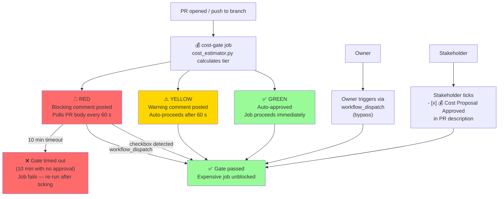

# Cost Governance Policy

**Last Updated:** 2026-06-22

> **Subscription:** GitHub Team ($4/user/mo) + Copilot Pro Plus ($39/mo)
> **Budget:** 3,000 Linux-equivalent Actions minutes/month · 2 GB artifact storage
> **Policy version:** 1.0 | **Effective:** 2026-03-14 | **Owner:** @mbaetiong
> **OKR:** OBJ-001 (POC: 2026-03-22 · Production: 2026-04-01)

---

## 1 — Why This Policy Exists

GitHub Team provides **3,000 Actions minutes per month** at no extra cost for Linux runners.
Minutes beyond that, non-standard runners (macOS = 10×, Windows = 2×, ubuntu-latest-m = 2×),
and GHCR data-transfer are **billed directly**. Without a gate, a single matrix build on a
medium runner can consume 120+ effective minutes — 4% of the monthly budget in one run.

This policy installs a lightweight approval gate that:
- Makes cost visible *before* a job runs
- Blocks high-cost jobs until a stakeholder explicitly approves
- Auto-approves low-cost jobs with zero friction
- Keeps the repository within its subscription without requiring an Enterprise upgrade

---

## 2 — Runner Minute Multipliers

| Runner | Cores | Effective minutes multiplier | Notes |
|--------|-------|------------------------------|-------|
| `ubuntu-latest` | 2 | **1×** | Default — included in 3,000 min |
| `ubuntu-latest-m` | 4 | **2×** | Medium runner — costs 2 min per real min |
| `ubuntu-latest-l` | 8 | **4×** | Large runner — 4 min per real min |
| `ubuntu-latest-xl` | 16 | **8×** | XL — not recommended on Team plan |
| `windows-latest` | 2 | **2×** | Billed at 2× Linux rate |
| `macos-latest` | 3 | **10×** | Most expensive — use sparingly |
| `self-hosted` | any | **0×** | No Actions minutes billed |

> **Source:** [GitHub Actions billing](https://docs.github.com/en/billing/concepts/product-billing/github-actions)

---

## 3 — Cost Tiers

```
Effective minutes = timeout_minutes × runner_multiplier × matrix_job_count

GREEN  → < 30 effective min, no GHCR push  → Auto-approved
YELLOW → 30–90 effective min               → Warning posted; auto-proceeds after 60 s
RED    → > 90 effective min OR GHCR push   → Blocked until stakeholder checkbox ticked
```

### Budget impact per tier (worst case, per run)

| Tier | Max effective min | % of monthly budget |
|------|-----------------|---------------------|
| GREEN | 30 | 1.0% |
| YELLOW | 90 | 3.0% |
| RED | 180+ | 6.0%+ |

---

## 4 — Covered Workflows

| Workflow | Tier | Reason | Added |
|----------|------|--------|-------|
| `build-preview-image.yml` | 🔴 RED | `ubuntu-latest-m` × 30 min × 2 matrix + GHCR push = 120 eff-min + transfer cost | PR #3575 |
| `data-quality-suite.yml` | 🔴 RED | 3 jobs × 60 min = 180 eff-min | PR #3575 |
| `scheduled-archival.yml` | 🔴 RED | 3 jobs × 60 min = 180 eff-min, runs on schedule | PR #3575 |
| `rust_swarm_ci.yml` | 🔴 RED | 3 jobs × 60 min = 180 eff-min | PR #3575 |
| `embedding-index-rebuild.yml` | ⚠️ YELLOW | 15 min, scheduled (frequent trigger risk) | PR #3575 |

**Workflows intentionally not gated (GREEN tier, < 30 effective min):**

| Workflow | Effective min | Reason not gated |
|----------|-------------|-----------------|
| `deferral-language-gate.yml` | ~3 min | Lightweight Python script |
| `agent-auth-delegation.yml` | ~15 min active | Most of 120 min is idle approval wait |
| `pre-merge-validation.yml` | ~10 min | Fast pytest subset |
| `auto-fix-pr-check.yml` | ~8 min | Script only |

---

## 5 — Approval Flow



---

## 6 — Stakeholder Approval Instructions

When the Cost Gate posts a 🔴 RED comment on your PR:

1. **Read the comment** — it shows the estimated effective minutes and cost tier reason
2. **Decide** — is the spend justified for this PR?
3. **Approve** — in the PR description, find the Cost Governance section and change:
   ```
   - [ ] 💰 Cost Proposal Approved
   ```
   to:
   ```
   - [x] 💰 Cost Proposal Approved
   ```
4. **Wait** — the gate polls every 60 seconds and unblocks within ~60 s of your tick
5. **Alternative** — trigger the workflow manually via `Actions → Run workflow` to bypass the PR gate

---

## 7 — Subscription Boundaries (Do Not Cross)

| Limit | Value | Action if approaching |
|-------|-------|----------------------|
| Actions minutes | 3,000 min/mo | Alert at 2,500 min (83%); defer non-critical scheduled jobs |
| Artifact storage | 2 GB | Reduce `retention-days` to 7 for non-critical artifacts |
| GHCR transfer | 10 GB/mo free | Limit image push to main branch merges only |
| Copilot premium requests | 1,500/mo | Reserve for coding agent; use base model for completions |
| GHAS (CodeQL on branches) | **Not purchased** | CodeQL on feature branches = expected failure, not a bug |

**To increase limits without upgrading plan:**
- Reduce matrix job count from 3 → 2 where test isolation allows
- Move scheduled workflows from `schedule:` to `workflow_dispatch:` only
- Set `cancel-in-progress: true` on all PR-triggered workflows

---

## 8 — Adding a New Workflow to the Gate

When adding a new workflow that may incur cost, add a `cost-gate` job as the first entry
in `jobs:` using the reusable workflow:

```yaml
jobs:
  cost-gate:
    name: "💰 Cost Gate"
    uses: ./.github/workflows/cost-gate.yml
    with:
      workflow_name:   "My Expensive Workflow"
      runner:          "ubuntu-latest"    # adjust to actual runner
      timeout_minutes: 60                 # adjust to job timeout
      matrix_count:    2                  # set to number of parallel jobs
      pushes_to_ghcr:  false              # true if job pushes to GHCR
    permissions:
      contents:      read
      pull-requests: write

  my-expensive-job:
    needs: cost-gate                      # gate must pass first
    ...
```

---

## 9 — Roadmap

| Item | OKR Task | Due | Status |
|------|---------|-----|--------|
| Unit tests for `cost_estimator.py` | OBJ-001 T-001 | 2026-03-20 | ⬜ |
| Branch protection: `cost-gate` as required check | OBJ-001 T-003 | 2026-03-28 | ⬜ (admin) |
| Monthly usage NDJSON logger | OBJ-001 T-004 | 2026-03-28 | ⬜ |
| 2,500-min budget alert in Self-Healing CI | OBJ-001 T-005 | 2026-03-30 | ⬜ |
| Gate `docker-build-push.yml` (consistency) | OBJ-001 T-006 | 2026-03-30 | ⬜ |
| Production sign-off @mbaetiong | OBJ-001 T-007 | **2026-04-01** | ⬜ |

---

_Policy: docs/ops/COST_GOVERNANCE.md | v1.0 | 2026-03-14 Session 24 PR #3575_
_Subscription: GitHub Team + Copilot Pro Plus | OBJ-001_
