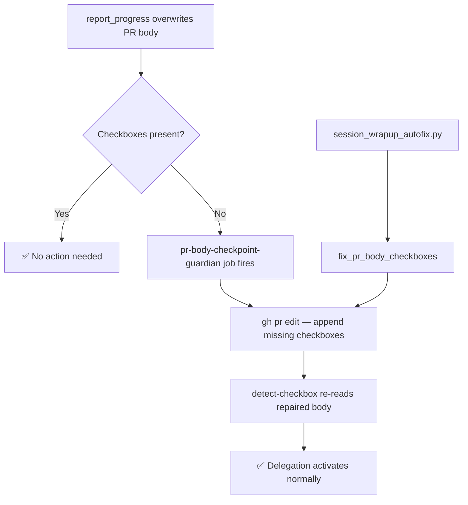

# GitHub Copilot No-Auto-PR Policy

> **Effective:** 2026-03 (GitHub change)
> **Status:** ✅ Codebase fully adapted (PR #3661 / S173)

## 🔍 What Changed

GitHub Copilot Coding Agent **no longer creates pull requests by default** when a
session completes.

> *"Sessions no longer create pull requests by default. Ask for a pull request in your
> prompt or open one when the session is complete."*
> — [GitHub docs](https://docs.github.com/en/early-access/github/articles/plan-ask-questions-and-iterate-on-code-with-copilot-coding-agent)

### Before (old behavior)
- Session started by `@copilot fix X` on an **issue** → Copilot created a branch + PR
  automatically when done

### After (new behavior)
- Session started on an **issue** → Copilot works but does **not** create a PR
- Session started on an **existing PR** → no change (Copilot still commits to the branch)
- Must explicitly say "open a pull request" in the prompt OR run `gh pr create` manually

---

## 📊 Impact on This Repository

| Workflow | Context | Impact | Fix Applied |
|----------|---------|--------|-------------|
| `copilot-session-chain.yml` | Posts `@copilot` on **pre-created PR** | ✅ Not affected | Trigger comments updated with "work on this PR branch" note |
| `ci-failure-issue-creator.yml` | Posts `@copilot` on **pre-created PR** | ✅ Not affected | PR instruction updated with "commit to this PR branch" note |
| `branch-divergence-monitor.yml` | Posts `@copilot` on an **ISSUE** | ❌ Affected | Added "open a PR targeting `0D_base_`" instruction |
| `agent-auth-delegation.yml` | Preflight on existing PRs | ✅ Not affected | Added "PR requirement" row to enforcement table |
| `chatops_copilot_trigger.yml` | Posts `@copilot continue` on existing PRs | ✅ Not affected | No change needed |
| Agent documentation | Various agent `.md` files | ⚠️ Documentation | Updated guidance |

---

## ⚠️ Why Required PR Checkboxes Go Missing

**Root cause:** The `report_progress` tool used by the Copilot coding agent **overwrites
the entire PR description** with the agent's task checklist. This strips two mandatory
sections from the PR body:

```
### 💰 Cost Governance
- [ ] **💰 Cost Proposal Approved**

### 🔐 Agent Token Delegation
- [x] **Enable Agent Token Delegation** (`COPILOT_AGENT_AUTH_ENABLED`)
```

**Why this matters:**
- `cost-gate.yml` reads the `💰 Cost Proposal Approved` checkbox from the PR body. If
  missing, the cost gate blocks indefinitely (no checkbox to tick → RED tier stays
  blocked forever).
- `agent-auth-delegation.yml` reads the `COPILOT_AGENT_AUTH_ENABLED` checkbox from the
  PR body. If missing (unchecked) → delegation never activates → `copilot-setup-steps`
  doesn't inject secrets → agent session runs without CODEX_MASTER_KEY.

**Three-layer fix applied:**

1. **`agent-auth-delegation.yml` → `pr-body-checkpoint-guardian` job** (Job 0):
   Runs on every `pull_request` event, detects missing checkboxes, and appends them via
   `gh pr edit` BEFORE `detect-checkbox` reads the PR body.

2. **`session_wrapup_autofix.py` → `fix_pr_body_checkboxes()`**:
   Called automatically at the end of every auto-fix session to restore checkboxes via
   `gh pr edit`.

3. **`copilot-session-chain.yml` → pre-created PR**:
   The PR is created by the workflow with the full template (including both checkboxes)
   before `@copilot` is triggered. Even if `report_progress` overwrites the description,
   Job 0 will restore the checkboxes on the next push.

---

## 📋 Rule for Agents and Automation

### When posting `@copilot` on an ISSUE

Always include an explicit PR creation instruction:

```markdown
@copilot Fix the XYZ issue.

After implementing the fix, **open a pull request targeting `0D_base_`** with your
changes using:
```bash
gh pr create --base 0D_base_ --title "fix: XYZ" --body "Fixes #<issue>"
```
Do NOT leave changes on a branch without a PR.
```

### When using `report_progress` (agent-internal)

Always include the full required sections in `prDescription`:

```markdown
- [x] Task 1 completed
- [ ] Task 2 pending

### 💰 Cost Governance

- [ ] **💰 Cost Proposal Approved**

### 🔐 Agent Token Delegation

- [x] **Enable Agent Token Delegation** (`COPILOT_AGENT_AUTH_ENABLED`)
```

---

## 🔄 Self-Healing Architecture



---

## 🔗 Related Files

| File | Role |
|------|------|
| `.github/workflows/agent-auth-delegation.yml` | Checkbox detection + PR body guardian |
| `.github/workflows/copilot-session-chain.yml` | Pre-creates PR before triggering Copilot |
| `.github/workflows/ci-failure-issue-creator.yml` | Pre-creates fix PR before triggering Copilot |
| `.github/workflows/branch-divergence-monitor.yml` | Updated escalation to include "open a PR" |
| `scripts/ci/session_wrapup_autofix.py` | Auto-restores checkboxes via `fix_pr_body_checkboxes()` |
| `.github/PULL_REQUEST_TEMPLATE.md` | Full template with both checkbox sections |

---

*Last updated: 2026-03-21 (S173) | Author: copilot-swe-agent[bot]*
