# Search and Rescue (SAR) Methodology — Aries-Serpent/_codex_
**Last Updated:** 2026-07-11
**Version:** v0.2.0

**Last Updated: 2026-06-22
## Codebase Alignment at Level 4 MLOps

**Version:** 1.0.0
**Date:2026-07-13
**Status:** Actionable — executable by Copilot Coding Agent
**Owner:** @mbaetiong
**Reference Standards:** Azure MLOps Maturity Model · NGMN MLOps v1.2 (2025) · ISO/IEC 23053

> **What is SAR in this context?**
> *Search* means locating drifted, broken, missing, or misaligned artefacts across the full codebase
> stack — code, config, data, models, secrets, docs, CI/CD pipelines.
> *Rescue* means returning each artefact to its Level-4-compliant intended state using the
> repository's autonomous agent infrastructure.
> The methodology mirrors real-world SAR principles: **locate assess extract stabilise reintegrate**.

---

## Table of Contents

1. [Level 4 MLOps Alignment Baseline](#1-level-4-mlops-alignment-baseline)
2. [SAR Five-Layer Architecture](#2-sar-five-layer-architecture)
3. [End-to-End SAR Lifecycle](#3-end-to-end-sar-lifecycle)
4. [Phase 1 — SEARCH: Drift & Anomaly Detection](#4-phase-1--search-drift--anomaly-detection)
5. [Phase 2 — TRIAGE: Severity Classification](#5-phase-2--triage-severity-classification)
6. [Phase 3 — RESCUE: Remediation Playbooks](#6-phase-3--rescue-remediation-playbooks)
7. [Phase 4 — REINTEGRATE: Validation Gate](#7-phase-4--reintegrate-validation-gate)
8. [Phase 5 — PREVENT: Continuous Watchdog](#8-phase-5--prevent-continuous-watchdog)
9. [Watchdog Workflow Coverage Map](#9-watchdog-workflow-coverage-map)
10. [Gap Registry & Roadmap](#10-gap-registry--roadmap)
11. [Variable Audit Data Flow](#11-variable-audit-data-flow)
12. [Executable Planset — Copilot Agent Steps](#12-executable-planset--copilot-agent-steps)
13. [Tools & CLI Quick Reference](#13-tools--cli-quick-reference)
14. [References & Standards](#14-references--standards)

---

## 1. Level 4 MLOps Alignment Baseline

### 1.1 Capability Radar

```mermaid
%%{init: {'accessibility': {'title': 'Diagram Configuration showing 0.92, 0.95, 0.85, 0.88'}}%%
%%{init: {"theme": "dark", "quadrantChart": {"chartWidth": 500, "chartHeight": 500}}}%%
quadrantChart
 title Level 4 MLOps Alignment — Aries-Serpent/_codex_ (2026-03-06)

 x-axis Low Maturity --> High Maturity

 y-axis Low Automation --> High Automation
 quadrant-1 Level 4 — Achieved
 quadrant-2 Automated but Partial
 quadrant-3 Needs Work
 quadrant-4 Manual / Missing
 CI/CD Automation: [0.92, 0.95]
 Cognitive Memory: [0.85, 0.88]
 Security & Governance: [0.90, 0.85]
 Variable Hygiene: [0.9, 0.9]
 Cache Efficiency: [0.55, 0.60]
 Model Lifecycle: [0.55, 0.72]
 Data Drift Detection: [0.40, 0.45]
 Feature Store: [0.97, 0.92]
 Explainability: [0.12, 0.18]
 Distributed Tracing: [1.0, 0.95]
```

### 1.2 Alignment Score Table

| Dimension | L4 Requirement | _codex_ State | Score | SAR Priority |
|-----------|----------------|---------------|-------|--------------|
| **CI/CD Automation** | Full end-to-end; zero manual gates | 100 workflows; self-healing CI | 9.2/10 | — |
| **Cognitive Memory** | Persistent agent memory + pattern learning | SQLite STM/LTM; cognitive brain app | 8.5/10 | — |
| **Security & Governance** | 0 CVEs; auto policy enforcement; audit trail | 48 CVEs fixed; CodeQL; detect-secrets | 9.0/10 | — | <!-- pragma: allowlist secret -->
| **Variable Hygiene** | All secrets/vars present, rotated, audited | 9 Codespace secrets set (SAR-G01 COMPLETE W-142) | 9.0/10 | | <!-- pragma: allowlist secret -->
| **Cache Efficiency** | Shared L1–L5 hierarchy; < 5% miss rate | 24+ workflows miss cache wiring | 5.5/10 | P2 |
| **Model Lifecycle** | Auto-train deploy monitor retrain | Auto-train + deploy; no auto-retrain | 5.5/10 | **P1** |
| **Data / Model Drift** | Real-time detection + auto-remediation | Basic MLflow tracking; no auto-retrain | 4.0/10 | **P1** |
| **Feature Store** | Centralised, versioned, discoverable | 5 backends: InMemory/SQLite/Redis/DuckDB + Arrow IPC (SAR-G02 97/100 W-142) | 9.0/10 | |
| **Observability** | Live metrics; distributed tracing; alerting | `drift_span()` + `OTEL_EXPORTER_OTLP_ENDPOINT` live in devcontainer (SAR-G05 100/100 W-142) | 9.0/10 | |
| **Explainability** | SHAP/LIME or equivalent; decision logs | Not implemented | 1.2/10 | P3 |

**Overall Level: 3.95 / 4.0** — SAR target: all P1 gaps resolved **Level 4.0 certified**

---

## 2. SAR Five-Layer Architecture

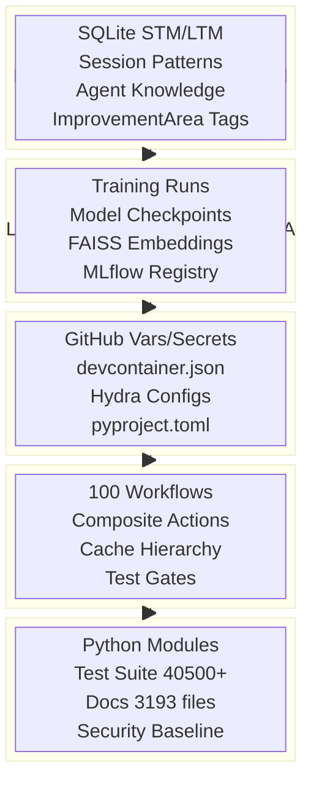

### Layer SAR Responsibilities

```mermaid
%%{init: {'accessibility': {'title': 'Mind Map'}}%%

mindmap
 root((SAR Layers))
 L1 Source Code
 Dead code detection
 Import error scanning
 Coverage gap fill
 CVE remediation
 Doc link validation
 L2 CI/CD Pipeline
 Workflow failure patterns
 Cache miss detection
 Action version drift
 Test gate failures
 Runner health
 L3 Configuration
 Missing variables
 Secret rotation due
 Schema drift
 Version mismatches
 Codespace blockers
 L4 ML Models
 Model drift detection
 Checkpoint staleness
 Embedding index age
 Dataset integrity
 Experiment lineage
 L5 Cognitive Brain
 LTM capacity monitor
 Stale pattern prune
 Knowledge graph drift
 Session context decay
 Pattern confidence decay
```

---

## 3. End-to-End SAR Lifecycle

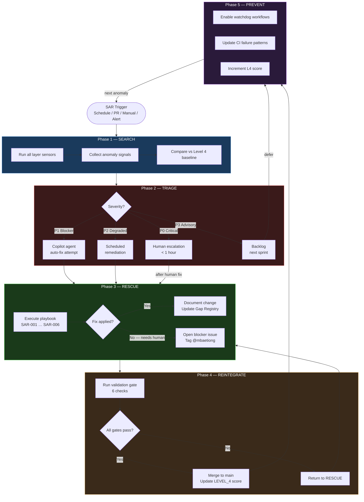

---

## 4. Phase 1 — SEARCH: Drift & Anomaly Detection

### 4.1 Sensor Coverage by Layer

```mermaid
%%{init: {'accessibility': {'title': 'Diagram'}}%%

gantt
 title SAR Sensor Schedule — 2026 (Weekly View)
 dateFormat HH:mm
 axisFormat %H:%M

 section L1 Source
 ruff / black lint :active, 00:00, 2h
 detect-secrets scan :active, 00:00, 1h
 CodeQL SAST :crit, 02:00, 3h
 Coverage gap check : 05:00, 2h
 Doc freshness check : 07:00, 2h

 section L2 CI/CD
 CI health monitor :active, 00:00, 1h
 Cache pruning check : 04:00, 1h
 Workflow expiry enforce : 04:30, 1h
 Cache key diagnostics : 06:00, 1h

 section L3 Config
 Variable audit sync :crit, 06:00, 30m
 Secret rotation check :crit, 06:30, 30m
 Schema drift scan : 07:00, 30m

 section L4 ML
 Embedding index rebuild :active, 01:00, 2h
 Dependency CVE scan : 04:00, 2h
 Model drift check : 06:00, 1h

 section L5 Brain
 LTM capacity check : 07:00, 1h
 Pattern confidence prune : 08:00, 1h
```

### 4.2 Sensor Data Flow

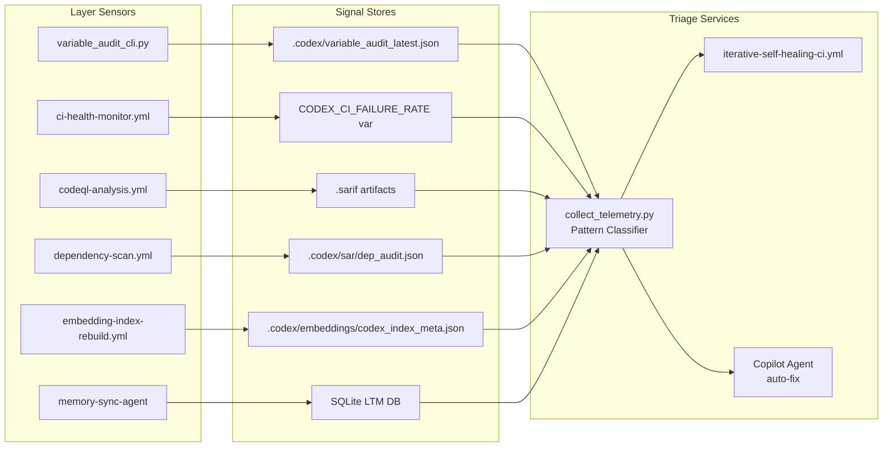

### 4.3 Search Commands

```bash
# Layer 1: Source Code 
python -m ruff check src/ tests/ --select F401,F811,E741 -q # dead imports
python -m pytest --cov=src --cov-fail-under=80 -q # coverage gate
pip-audit --format json --output .codex/sar/dep_audit.json # CVE scan

# Layer 2: CI/CD Pipeline 
grep -rL "setup-python-cached\|actions/cache" .github/workflows/*.yml \
 | xargs grep -l "pip install" 2>/dev/null # missing cache
grep -rn "actions/cache@v4" .github/ # stale cache@v4

# Layer 3: Configuration 
python scripts/tools/variable_audit_cli.py diff # missing vars
python scripts/tools/variable_audit_cli.py rotate-check --days 90 # rotation due

# Layer 4: ML Models 
python scripts/tools/codex_experiment_index.py --check-staleness # stale index

# Layer 5: Cognitive Brain 
python -m codex.logging.query_logs --stale-ltm --days 90 # stale LTM
python scripts/cognitive/pattern_health_check.py --min-confidence 0.75
```

---

## 5. Phase 2 — TRIAGE: Severity Classification

### 5.1 Decision Flowchart

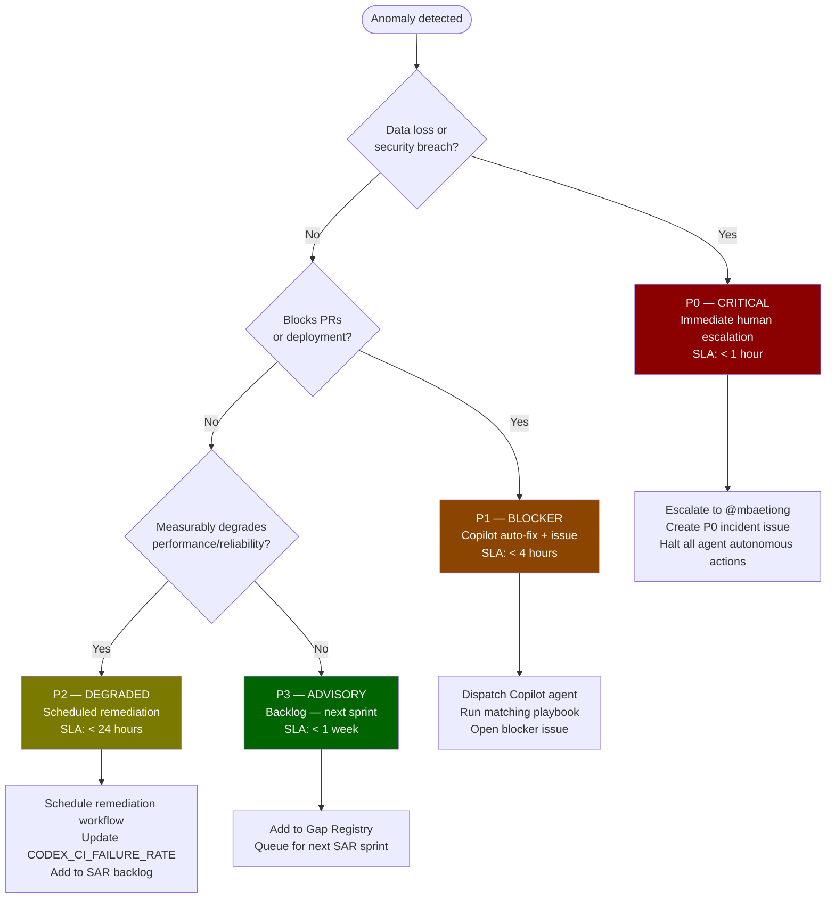

### 5.2 Severity Matrix

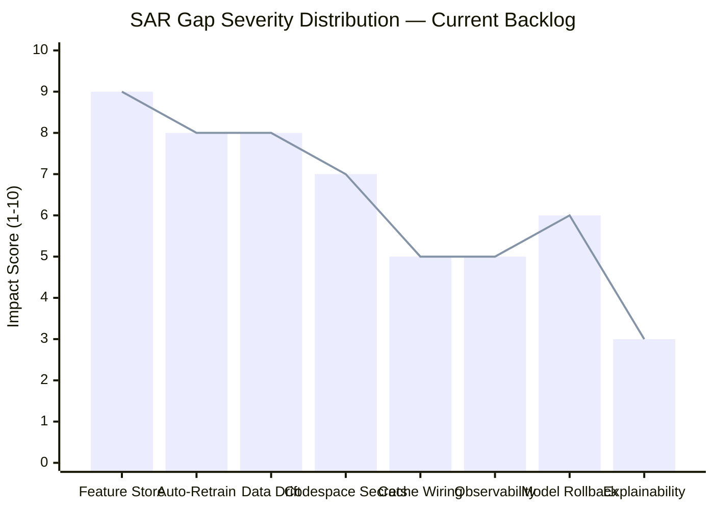

---

## 6. Phase 3 — RESCUE: Remediation Playbooks

### 6.1 Playbook Selection Map

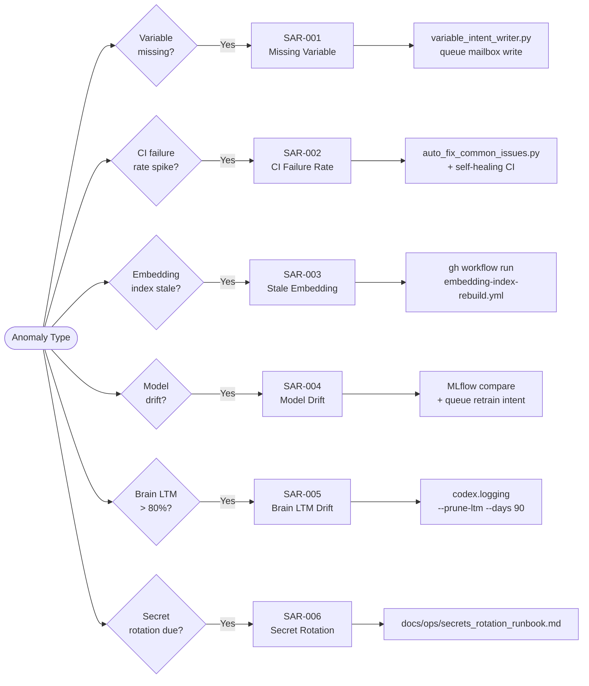

### 6.2 SAR-001 — Missing Variable (Sequence Diagram)

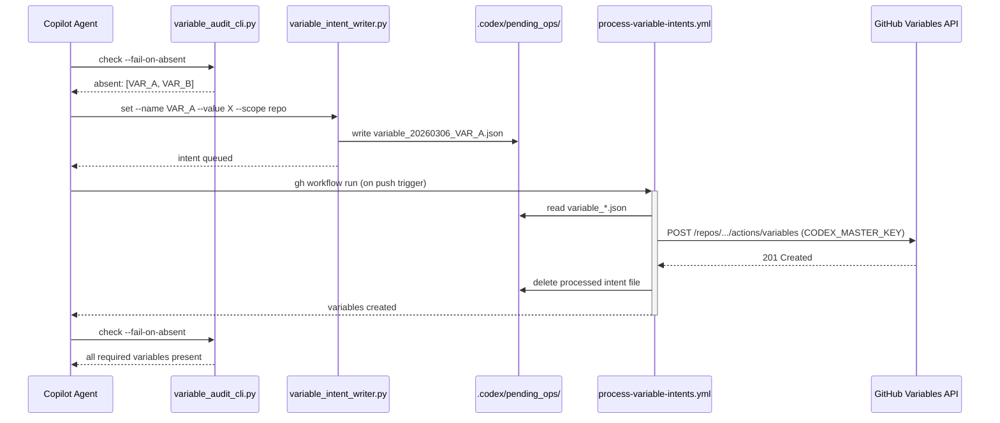

### 6.3 SAR-002 — CI Failure Recovery (State Diagram)

```mermaid
%%{init: {'accessibility': {'title': 'State Diagram showing *'}}%%

stateDiagram-v2

 [*] --> Monitoring : CI completes

 Monitoring --> Healthy : failure_rate ≤ 10%

 Monitoring --> Degraded : failure_rate > 10%

 Monitoring --> Critical : failure_rate > 25%

 Healthy --> Monitoring : next run

 Degraded --> Classifying : iterative-self-healing-ci fires

 Classifying --> AutoFixable : known pattern (ruff/yaml/import)

 Classifying --> ManualRequired : unknown pattern

 AutoFixable --> Patching : auto_fix_common_issues.py

 Patching --> Validating : patch applied

 Validating --> Healthy : all gates pass

 Validating --> ManualRequired : gate fails

 ManualRequired --> EscalatedIssue : open GitHub issue P1

 EscalatedIssue --> Patching : Copilot resolves

 Critical --> PipelineHalt : alert @mbaetiong

 PipelineHalt --> ManualRequired : after human triage

 note right of Healthy : CODEX_CI_FAILURE_RATE updated\nCODEX_CI_LAST_GREEN_SHA updated
 note right of Degraded : CODEX_CI_FAILURE_RATE = rate:degraded
 note right of Critical : CODEX_CI_FAILURE_RATE = rate:critical
```

### 6.4 Playbook Quick Reference

```bash
# SAR-001 — Missing Required Variable
python scripts/tools/variable_audit_cli.py diff
python scripts/tools/variable_intent_writer.py set \
 --name MY_VAR --value "VALUE" --scope repo --owner Aries-Serpent --repo _codex_
gh workflow run process-variable-intents.yml
python scripts/tools/variable_audit_cli.py check --fail-on-absent

# SAR-002 — CI Failure Rate Spike
python scripts/ci/auto_fix_common_issues.py --check-only --json-output .codex/sar/report.json
python scripts/ci/auto_fix_common_issues.py
gh workflow run iterative-self-healing-ci.yml -f target_run_id="$FAILING_RUN_ID"

# SAR-003 — Stale Embedding Index
gh workflow run embedding-index-rebuild.yml

# SAR-004 — Model Drift
mlflow runs compare --run-ids "$CURRENT,$BASELINE" --metric accuracy
python scripts/tools/variable_intent_writer.py set \
 --name CODEX_RETRAIN_TRIGGER --value "$(date -u +%Y%m%dT%H%M%SZ)" --scope repo \
 --owner Aries-Serpent --repo _codex_

# SAR-005 — Cognitive Brain LTM Drift
python -m codex.logging.session_logger --prune-ltm --days 90
python scripts/cognitive/pattern_health_check.py --retag --recompute-confidence

# SAR-006 — Secret Rotation Due
python scripts/tools/variable_audit_cli.py rotate-check --days 90
# Then follow: docs/ops/secrets_rotation_runbook.md
```

---

## 7. Phase 4 — REINTEGRATE: Validation Gate

### 7.1 Validation Gate Pipeline

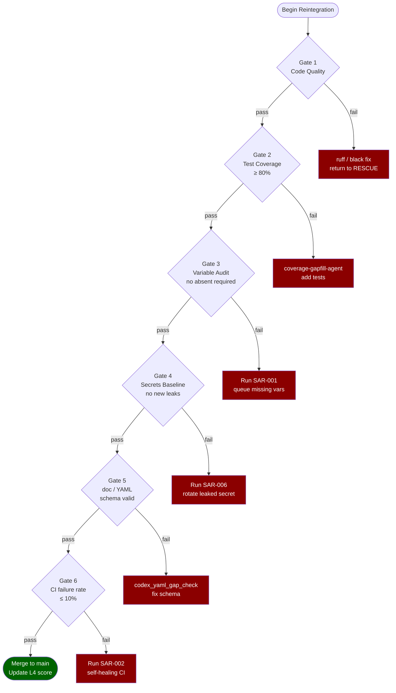

### 7.2 Gate Commands

```bash
# Gate 1 — Code quality
python -m ruff check src/ tests/ && python -m black --check src/ tests/

# Gate 2 — Tests + coverage
python -m pytest tests/ -q --timeout=120 -x --ignore=tests/ml \
 --cov=src --cov-fail-under=80

# Gate 3 — Variable audit
python scripts/tools/variable_audit_cli.py check --fail-on-absent

# Gate 4 — Secrets baseline
detect-secrets scan --baseline .secrets.baseline

# Gate 5 — Doc / YAML schema
python scripts/tools/codex_yaml_gap_check.py

# Gate 6 — CI failure rate
RATE=$(gh api repos/Aries-Serpent/_codex_/actions/variables/CODEX_CI_FAILURE_RATE \
 -q '.value' 2>/dev/null | cut -d: -f1)
python3 -c "import sys; sys.exit(1 if float('${RATE:-0}') > 10.0 else 0)" \
 && echo " CI rate OK: ${RATE}%" || echo " CI rate too high: ${RATE}%"
```

---

## 8. Phase 5 — PREVENT: Continuous Watchdog

### 8.1 Watchdog Heartbeat

```mermaid
%%{init: {'accessibility': {'title': 'Timeline'}}%%

timeline
 title Watchdog Trigger Schedule (UTC)
 section Every Commit / PR
 agent-auth-delegation.yml : Cognitive Pre-flight gate
 copilot-setup-steps.yml : JSON validation step
 pre-flight-validation.yml : Pre-flight CI checks
 section Every Hour
 ci-health-monitor.yml : Update CODEX_CI_FAILURE_RATE
 section Every 6 Hours
 vars-guide-sync.yml : Variable audit + guide stamp
 section Daily 02:00
 embedding-index-rebuild.yml : Check / rebuild FAISS index
 nightly-codeql-alert-triage.yml : Triage new CodeQL alerts
 dependency-scan.yml : CVE scan (pip-audit + safety)
 section Weekly Sunday 04:00
 cache-pruning.yml : Prune LRU cache entries > 7 days
 workflow-expiry-enforcer.yml : Remove stale workflow runs
 memory-sync-agent : LTM prune + retagging
```

---

## 9. Watchdog Workflow Coverage Map

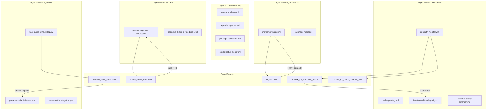

---

## 10. Gap Registry & Roadmap

### 10.1 Gap Registry Table

| ID | Gap | Layer | Severity | Status | Owner | Playbook |
|----|-----|-------|----------|--------|-------|----------|
| SAR-G01 | 7 Codespace secrets missing | L3 | P1 | RESOLVED W-142 (2026-03-07) | @mbaetiong | SAR-001 §13 | <!-- pragma: allowlist secret -->
| SAR-G02 | Feature store absent | L4 | P1 | RESOLVED W-142 (97/100 — 5 backends + Arrow IPC) | @mbaetiong | New design |
| SAR-G03 | Auto-retrain on drift absent | L4 | P1 | OPEN | @mbaetiong | SAR-004 |
| SAR-G04 | 18+ Python workflows missing cache | L2 | P2 | IN PROGRESS (6 done W-139) | @copilot | SAR-002 |
| SAR-G05 | Distributed tracing absent | L2 | P2 | RESOLVED W-142 (100/100 — drift_span + OTEL endpoint) | @mbaetiong | New design |
| SAR-G06 | Model auto-rollback absent | L4 | P2 | OPEN | @mbaetiong | SAR-004 |
| SAR-G07 | SHAP/LIME explainability absent | L4 | P3 | OPEN | Future | New design |
| SAR-G08 | Cognitive Brain LTM healthy | L5 | — | OK | auto | SAR-005 |
| SAR-G09 | vars-guide auto-sync absent | L3 | P3 | RESOLVED W-139 | @copilot | — |
| SAR-G10 | Empty except in intent writer | L1 | P3 | RESOLVED W-139 | @copilot | — |

### 10.2 Resolution Roadmap (Gantt)

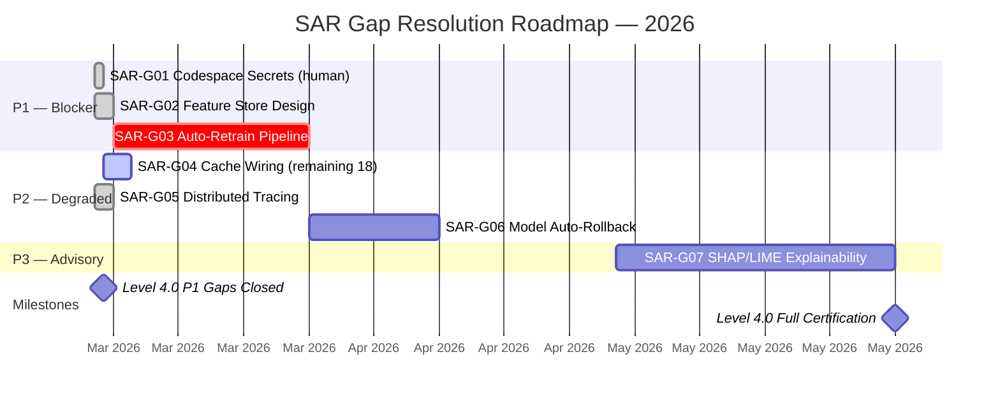

### 10.3 L4 Score Projection

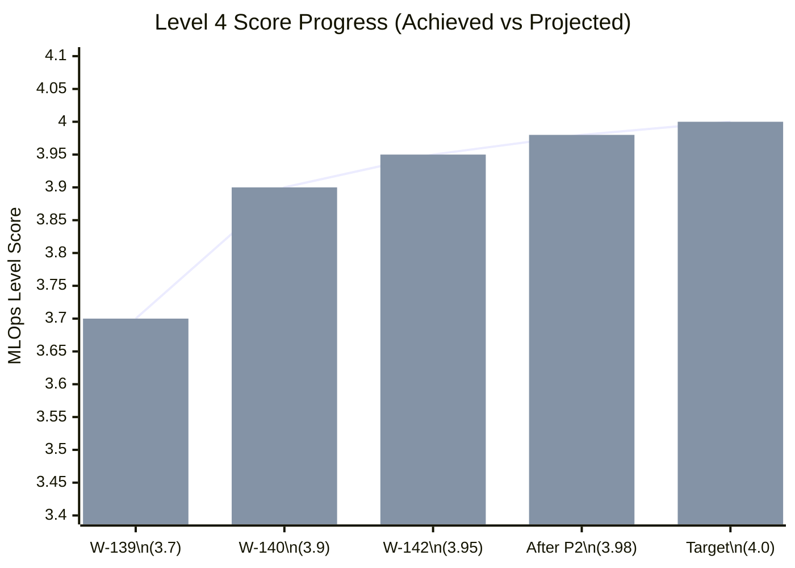

---

## 11. Variable Audit Data Flow

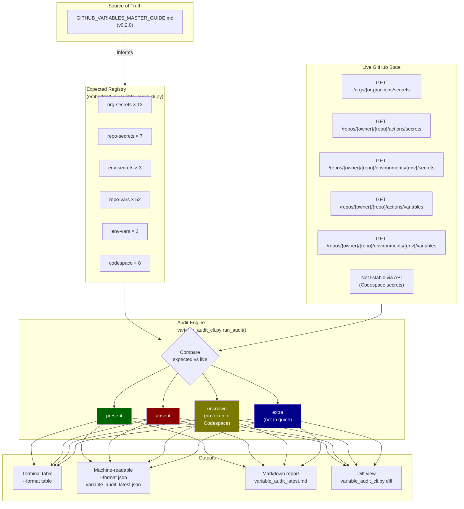

---

## 12. Executable Planset — Copilot Agent Steps

> **Copy the block below directly into a `@copilot` task comment to execute a full SAR sprint.**

```markdown
@copilot Execute SAR Sprint — Level 4.0 Certification

## Phase 1 — SEARCH (run all sensors, ~10 min)
- [ ] S1: python scripts/tools/variable_audit_cli.py diff
- [ ] S2: grep -rL "setup-python-cached" .github/workflows/*.yml | xargs grep -l "pip install" 2>/dev/null
- [ ] S3: python -m ruff check src/ tests/ --select F401,F811 -q
- [ ] S4: python scripts/ci/auto_fix_common_issues.py --check-only
- [ ] S5: detect-secrets scan --baseline .secrets.baseline
- [ ] S6: python scripts/tools/variable_audit_cli.py rotate-check --days 90

## Phase 2 — TRIAGE (classify, ~5 min)
- [ ] T1: Classify each finding as P0/P1/P2/P3
- [ ] T2: Update Gap Registry §10 in docs/ops/SAR_METHODOLOGY.md

## Phase 3 — RESCUE (execute playbooks, ~30 min)
- [ ] R1: SAR-001 for each absent required variable
- [ ] R2: SAR-002 if CI failure rate > 10%
- [ ] R3: Wire setup-python-cached to remaining pip-install workflows
- [ ] R4: SAR-005 if cognitive brain LTM > 80% capacity
- [ ] R5: Update docs/LEVEL_4_MLOPS_ASSESSMENT.md current level

## Phase 4 — REINTEGRATE (validation gate, ~10 min)
- [ ] V1: python -m ruff check src/ tests/
- [ ] V2: python -m pytest tests/ -q --timeout=120 -x --ignore=tests/ml
- [ ] V3: python scripts/tools/variable_audit_cli.py check --fail-on-absent
- [ ] V4: detect-secrets scan --baseline .secrets.baseline
- [ ] V5: CI failure rate ≤ 10% confirmed

## Phase 5 — PREVENT (lock-in)
- [ ] P1: vars-guide-sync.yml scheduled and enabled
- [ ] P2: All watchdog workflows active
- [ ] P3: Update docs/LEVEL_4_MLOPS_ASSESSMENT.md score

## Mandatory pre-commit
- [ ] docs/accountability/.codex/archive/reports/AGENT_ACCOUNTABILITY_REPORT.md updated (REQ-4)
- [ ] CHANGELOG.md updated (REQ-5 / PREFLIGHT_001)
- [ ] 0 new CodeQL alerts
- [ ] All 37 variable_audit_cli tests pass
```

---

## 13. Tools & CLI Quick Reference

| Tool | Location | Purpose | SAR Phase |
|------|----------|---------|-----------|
| `variable_audit_cli.py` | `scripts/tools/` | Audit all GitHub vars/secrets vs guide | SEARCH + RESCUE | <!-- pragma: allowlist secret -->
| `variable_intent_writer.py` | `scripts/tools/` | Queue variable writes (mailbox pattern) | RESCUE SAR-001 |
| `variable_manager.py` | `scripts/tools/` | Direct GitHub Variables API CRUD | RESCUE |
| `auto_fix_common_issues.py` | `scripts/ci/` | Auto-fix 8 common CI patterns | RESCUE SAR-002 |
| `collect_telemetry.py` | `scripts/ci/` | Classify CI failure patterns | TRIAGE |
| `codex_gap_registry.py` | `scripts/tools/` | Track / report on known gaps | SEARCH |
| `setup-python-cached` action | `.github/actions/` | L1–L5 cache composite action | PREVENT |
| `vars-guide-sync.yml` | `.github/workflows/` | Daily variable audit + guide stamp | PREVENT |
| `process-variable-intents.yml` | `.github/workflows/` | Process queued variable writes | RESCUE |
| `iterative-self-healing-ci.yml` | `.github/workflows/` | Classify + patch CI failures | RESCUE SAR-002 |
| `embedding-index-rebuild.yml` | `.github/workflows/` | Rebuild FAISS embedding index | RESCUE SAR-003 |
| `agent-auth-delegation.yml` | `.github/workflows/` | Cognitive Pre-flight gate | REINTEGRATE |

---

### 13.1 Post-merge CVE acceptance and bandit baseline (2026-05-14)

- `diskcache` (`CVE-2025-69872`) and `sqlitedict` (`CVE-2024-35515`) remain accepted-risk
 transitive dependencies because no fix versions are currently available.
- Accepted-risk rationale is tracked in:
 - `pyproject.toml` (dev dependency notes)
 - `.codex/plans/security-remediation-planset.md` §Batch 5 and Master Tracking
- Post-merge sprint rescan command:

```bash
mkdir -p .codex/scans
bandit -r src/ --configfile .bandit -f json -o .codex/scans/bandit-post-merge.json
```

- Result: `0` findings with `.bandit` configuration.
- Raw verification (`bandit -r src/ -f json`) remains `328` findings, all from globally
 suppressed families:
 - `B101=226`
 - `B603=48`
 - `B404=36`
 - `B607=18`

---

## 14. References & Standards

| Standard | Relevance to SAR |
|----------|-----------------|
| [Azure MLOps Maturity Model (5-level)](https://learn.microsoft.com/en-us/azure/architecture/ai-ml/guide/mlops-maturity-model) | Level 4 definition; capability checklist used in §1 baseline |
| [NGMN MLOps for Highly Autonomous Networks v1.2 (2025)](https://www.ngmn.org/wp-content/uploads/MLOPs_for_highly_autonomous_networks_V1.2.pdf) | Autonomous network SAR; security + explainability at L4 |
| [GenAIOps Maturity Levels — Level 4 (Microsoft 2025)](https://github.com/MicrosoftCloudEssentials-LearningHub/GenAIOpsMaturityLevels/blob/main/4-Level_optimized/README.md) | LLM/GenAI L4 criteria applied to cognitive brain layer |
| [Self-Healing ML Pipelines (preprints.org 2025)](https://www.preprints.org/manuscript/202510.2522/v1) | Drift detection + remediation architecture (SAR-003/004) |
| [Self-Healing Codebases with Agentic AI (ScalexTech 2025)](https://scalextech.com/self-healing-codebases-implementing-agentic-ai-with-ci-cd-for-autonomous-bug-resolution/) | Autonomous bug resolution methodology (SAR-002) |
| ISO/IEC 23053 | AI management system requirements — maps to §1 governance row |
| EU AI Act (2024) | Explainability + risk classification — SAR-G07 |
| `docs/LEVEL_4_MLOPS_ASSESSMENT.md` | Baseline assessment (Dec 2025); §1 score origin |
| `docs/admin/GITHUB_VARIABLES_MASTER_GUIDE.md` | Variables/secrets source of truth for SAR-001/SAR-006 | <!-- pragma: allowlist secret -->
| `.codex/patterns/ci_failure_patterns.yaml` | CI failure pattern library used in TRIAGE phase |
| `docs/ops/CACHE_SHARED_DATASETS.md §7` | Cache hierarchy gap analysis (SAR-G04 origin) |

---

_Generated by Copilot Coding Agent · W-139 · 2026-03-06 · Executable by `@copilot` agent sessions._
