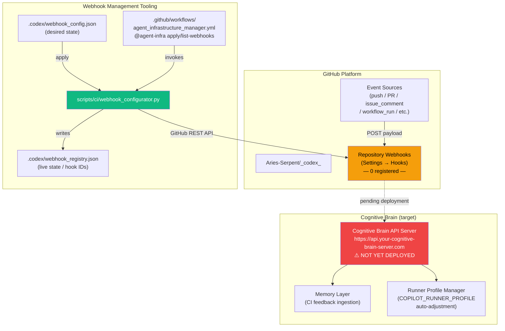
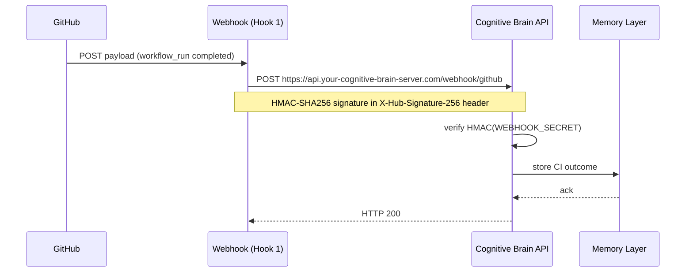
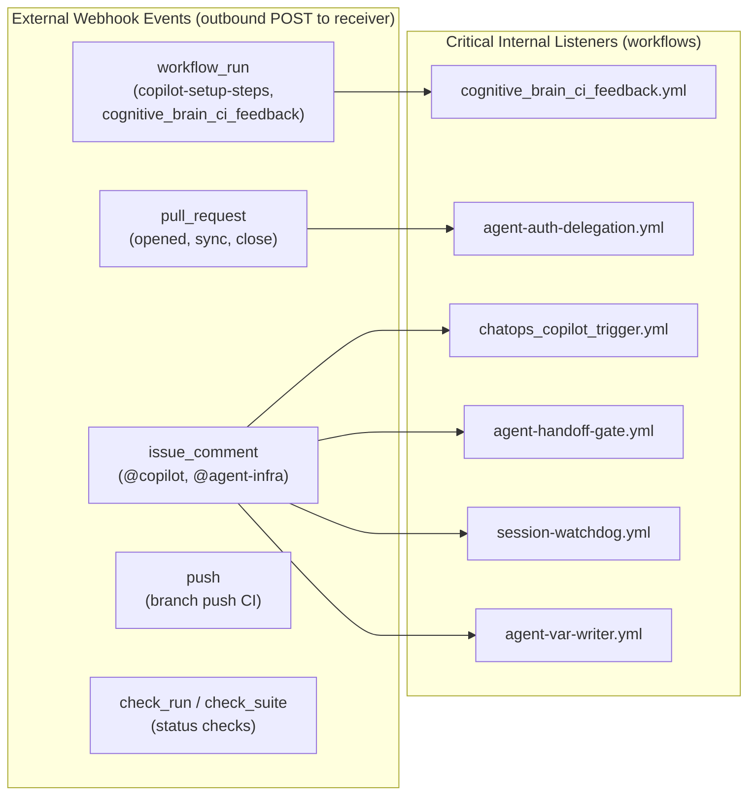

# Repository Webhook Registry — Aries-Serpent/_codex_

**Audit date:** 2026-03-05T06:53:00Z
**Audited by:** Copilot agent W-123 (`@agent-infra list-webhooks`)
**Apply attempted:** 2026-03-05T07:02:00Z
**Apply attempted by:** Copilot agent W-124 (`@agent-infra apply-webhooks` — dry-run in sandbox)
**Method:** `GET /repos/Aries-Serpent/_codex_/hooks` + static codebase analysis
**Reference:** [GitHub Webhooks Guide](https://docs.github.com/en/webhooks) |
[GitHub REST API: Webhooks](https://docs.github.com/en/rest/repos/webhooks)

---

## Apply Status (W-124 / W-130)

| Condition | Status |
|-----------|--------|
| `CODEX_MASTER_KEY` available in workflow | ✅ (via `secrets.CODEX_MASTER_KEY`) |
| `WEBHOOK_SECRET` available in workflow | ✅ (via `secrets.WEBHOOK_SECRET`) |
| `WEBHOOK_RECEIVER_URL` repo variable set | ✅ **Auto-set by Codespace `post-start.sh`** — format: `https://${CODESPACE_NAME}-8765.preview.app.github.dev/webhook/github` |
| `POST /webhook/github` endpoint | ✅ **Implemented** in `cognitive_app/src/server/cli_api_server.py` |
| Port 8765 public visibility | ⚠️ Must be set manually in Codespace Ports panel for GitHub delivery |
| Hooks `active: true` | ❌ Both hooks have `active: false` (intentional — activate after confirming delivery works) |
| **Apply result** | ⏳ **READY** — once port 8765 is public and hooks are set to `active: true` |

> **To activate:** Set port 8765 to **public** in the Codespace Ports panel. Update both hooks to `active: true`
> in `.codex/webhook_config.json`, then comment `@agent-infra apply-webhooks` on a PR.
> `WEBHOOK_RECEIVER_URL` is now auto-updated on every Codespace start/resume.

### Dry-run output (W-124)

```
Creating webhook 'cognitive-brain-ci-feedback' ...
  DRY-RUN  CREATE webhook → https://api.your-cognitive-brain-server.com/webhook/github
           events=[push, pull_request, issue_comment, pull_request_review_comment,
                   workflow_run, repository_dispatch, check_run, check_suite]
Creating webhook 'runner-health-notification' ...
  DRY-RUN  CREATE webhook → https://api.your-cognitive-brain-server.com/webhook/github
           events=[workflow_run]
```

---

## Audit Summary

| Item | Value |
|------|-------|
| **Live webhooks registered** | **0** |
| **Planned / desired hooks** | 2 (see §3) |
| **API endpoint** | `GET /repos/Aries-Serpent/_codex_/hooks` |
| **API result** | `403` via `GITHUB_TOKEN` (expected — scoped token lacks `admin:repo_hook`) |
| **Confirmed via** | Static analysis + absence of `.codex/webhook_registry.json` entries |
| **Tooling** | `scripts/ci/webhook_configurator.py` |
| **Declarative config** | `.codex/webhook_config.json` |
| **Apply command** | `@agent-infra apply-webhooks` or `python scripts/ci/webhook_configurator.py --apply .codex/webhook_config.json` |

> **Why 403?** The coding-agent sandbox only has `GITHUB_TOKEN` which does not carry
> `admin:repo_hook` scope. To list or manage hooks you need `CODEX_ADMIN_KEY`
> (fine-grained PAT with Webhooks: write) or `CODEX_MASTER_KEY` (classic PAT with
> `admin:repo_hook`). Run `@agent-infra list-webhooks` on a PR comment to invoke
> the workflow with the correct secret.

---

## Architecture



---

## Live Hook Inventory (as of 2026-03-05)

**Result: No hooks registered.**

| # | Hook ID | Name | URL | Events | Active | SSL | Created |
|---|---------|------|-----|--------|--------|-----|---------|
| — | — | — | *none* | — | — | — | — |

*The table above will be populated after the first `@agent-infra apply-webhooks` run.*

---

## Planned Hooks (Desired State)

Defined in `.codex/webhook_config.json`. Will be created by
`python scripts/ci/webhook_configurator.py --apply .codex/webhook_config.json`
once the Cognitive Brain API server is deployed.

### Hook 1: `cognitive-brain-ci-feedback`



| Field | Value |
|-------|-------|
| **Name** | `cognitive-brain-ci-feedback` |
| **URL** | `https://api.your-cognitive-brain-server.com/webhook/github` *(placeholder)* |
| **Events** | `push`, `pull_request`, `issue_comment`, `pull_request_review_comment`, `workflow_run`, `repository_dispatch`, `check_run`, `check_suite` |
| **Content type** | `application/json` |
| **Secret** | `WEBHOOK_SECRET` org secret (HMAC-SHA256) |
| **SSL verification** | ✅ Enabled |
| **Active** | `false` — pending server deployment |
| **Status** | ⏳ PENDING DEPLOYMENT |

### Hook 2: `runner-health-notification`

Shares the same endpoint as Hook 1. Provides the AAIS autonomous runner-selection
feedback loop: after `copilot-setup-steps` completes, the Cognitive Brain receives
the `runner_adequate` output and can auto-adjust `COPILOT_RUNNER_PROFILE` for the
next session.

| Field | Value |
|-------|-------|
| **Name** | `runner-health-notification` |
| **URL** | `https://api.your-cognitive-brain-server.com/webhook/github` *(shared with Hook 1)* |
| **Events** | `workflow_run` only |
| **Status** | ⏳ PENDING DEPLOYMENT — activate alongside Hook 1 |

---

## Event-to-Workflow Trigger Map

These are **internal GitHub event triggers** (not external webhooks) but are listed
here for completeness — they are the upstream source of the POST payloads that
external webhooks would relay.



| GitHub Event | Webhook-Triggerable | Critical Workflows | AAIS Relevance |
|---|---|---|---|
| `workflow_run` | ✅ | `cognitive_brain_ci_feedback.yml` | Pillar 2: Adaptive Learning |
| `pull_request` | ✅ | `agent-auth-delegation.yml` | Pillar 3: Reliability |
| `issue_comment` | ✅ | `chatops_copilot_trigger.yml`, `agent-handoff-gate.yml`, `session-watchdog.yml`, `agent-var-writer.yml` | Pillar 3: Automation Coverage |
| `push` | ✅ | 20+ workflows | Pillar 1: CI/CD Maturity |
| `check_run` / `check_suite` | ✅ | Status monitoring | Pillar 3: Observability |
| `repository_dispatch` | ✅ | `agent_infrastructure_manager.yml` | Pillar 3: Automation |
| `schedule` | ❌ (cron, not webhook) | 15+ workflows | — |
| `workflow_dispatch` | ❌ (manual, not webhook) | 60+ workflows | — |

---

## Security

```mermaid
%%{init: {'accessibility': {'title': 'Flowchart showing "GitHub\n(sender)", "Receiver endpoint"'}}%%
graph LR
    GH["GitHub\n(sender)"] -->|POST + X-Hub-Signature-256| RECV["Receiver endpoint"]
    RECV -->|HMAC-SHA256(body, WEBHOOK_SECRET)| VERIFY{"Signature\nvalid?"}
    VERIFY -->|✅ Yes| PROCESS["Process payload"]
    VERIFY -->|❌ No| REJECT["HTTP 403\nDrop payload"]

    style VERIFY fill:#f59e0b,color:#000
    style REJECT fill:#ef4444,color:#fff
    style PROCESS fill:#10b981,color:#fff
```

| Security Control | Status | Implementation |
|---|---|---|
| HMAC-SHA256 signature | ✅ Configured in schema | `WEBHOOK_SECRET` org secret → `webhook_configurator.py` |
| SSL/TLS verification | ✅ `insecure_ssl: "0"` | Set in `create_hook()` body |
| Secret rotation runbook | ✅ Exists | `docs/ops/HMAC_rotation.md` |
| Token for management | ✅ Documented | `CODEX_ADMIN_KEY` (Webhooks:write) or `CODEX_MASTER_KEY` (admin:repo_hook) |
| Receiver HMAC validation | ✅ **Implemented** | `POST /webhook/github` in `cognitive_app/src/server/cli_api_server.py` — fails closed if `WEBHOOK_SECRET` not set |

---

## Tooling Reference

### List live hooks (requires CODEX_ADMIN_KEY)

```bash
# Via ChatOps comment on any PR:
@agent-infra list-webhooks

# Directly (needs CODEX_ADMIN_KEY env var set):
python scripts/ci/webhook_configurator.py --list
```

## Apply desired-state config (idempotent)

```bash
# Via ChatOps comment on any PR (uses WEBHOOK_RECEIVER_URL repo variable automatically):
@agent-infra apply-webhooks

# Directly with WEBHOOK_RECEIVER_URL override:
export CODEX_ADMIN_KEY=<PAT with Webhooks:write>
export WEBHOOK_RECEIVER_URL=https://REAL-SERVER-URL/webhook/github
python scripts/ci/webhook_configurator.py --apply .codex/webhook_config.json

# Dry-run first (safe — no API writes):
export WEBHOOK_RECEIVER_URL=https://REAL-SERVER-URL/webhook/github
python scripts/ci/webhook_configurator.py --apply .codex/webhook_config.json --dry-run
```

> **`WEBHOOK_RECEIVER_URL` override**: If this environment variable is set, it replaces
> the placeholder URL `https://api.your-cognitive-brain-server.com/webhook/github` in all
> webhook config entries. Set this as a GitHub repo variable
> (`Settings → Variables → Repository variables`) so `@agent-infra apply-webhooks`
> picks it up automatically without editing `.codex/webhook_config.json`.

## Delete a hook

```bash
python scripts/ci/webhook_configurator.py --delete <hook_id>
```

---

## Interactive Codespace Sessions (Auto-URL)

For interactive Codespace sessions, the webhook receiver URL is **automatically set** on every Codespace start/resume:

| Property | Value |
|---|---|
| **URL format** | `https://${CODESPACE_NAME}-8765.preview.app.github.dev/webhook/github` |
| **Set by** | `.devcontainer/scripts/post-start.sh` |
| **Repo variable** | `WEBHOOK_RECEIVER_URL` (auto-updated via `gh variable set`) |
| **Token required** | `CODEX_MASTER_KEY` Codespace secret — required for `gh variable set` (Actions Variables API). `GITHUB_TOKEN` cannot access the Variables API and will always return 403. |
| **Port visibility** | Port 8765 must be **org** visibility (not public) for GitHub to deliver webhooks while preventing unauthenticated internet access |
| **Receiver endpoint** | `POST /webhook/github` in `cognitive_app/src/server/cli_api_server.py` |

### Requirements
1. Port 8765 must be set to **org** visibility in the Codespace Ports panel (not public — org restricts access to GitHub organization members only)
2. `WEBHOOK_SECRET` must be set as a Codespace secret (matches the HMAC key on the webhook)
3. `CODEX_MASTER_KEY` must be set as a Codespace secret (needed to update the repo variable)

### Limitations
- The URL changes every time a new Codespace is created (Codespace name is unique)
- Webhooks only work while the Codespace is running and the server is healthy
- Port visibility resets on Codespace rebuild — must be re-set to public

---

## Activation Checklist

```
[ ] For Codespace: Start/resume Codespace → post-start.sh auto-sets WEBHOOK_RECEIVER_URL
    [ ] Ensure port 8765 is public in Codespace (Ports panel → right-click → Port Visibility → Public)
    OR
[ ] For non-Codespace: gh variable set WEBHOOK_RECEIVER_URL --body "https://your-host/webhook/github" --repo Aries-Serpent/_codex_
[ ] Ensure WEBHOOK_SECRET org secret is set (same value as HMAC key on server)
[ ] Run dry-run to confirm URLs:
      export WEBHOOK_RECEIVER_URL=https://REAL-SERVER-URL/webhook/github
      python scripts/ci/webhook_configurator.py --apply .codex/webhook_config.json --dry-run
[ ] Update .codex/webhook_config.json: set "active": true on both hooks
[ ] Apply (creates hooks with active=true):
      @agent-infra apply-webhooks
[ ] Verify at: https://github.com/Aries-Serpent/_codex_/settings/hooks
      Both hooks show green checkmark on first delivery
[ ] Run list to confirm hook IDs written to .codex/webhook_registry.json:
      @agent-infra list-webhooks
[ ] Update this registry file with live hook IDs and creation timestamps
[ ] Update docs/accountability/AGENT_ACCOUNTABILITY_REPORT.md
[ ] Update CHANGELOG.md
```

---

## Related Documents

- `docs/plans/webhook-identification.md` — Task definition and event-trigger inventory
- `.codex/webhook_config.json` — Desired-state declarative config
- `.codex/webhook_registry.json` — Live hook IDs (populated after apply)
- `.codex/docs/ADMIN_MANUAL_SETUP_GUIDE.md §5` — Manual setup steps
- `scripts/ci/webhook_configurator.py` — CRUD implementation
- `.github/workflows/agent_infrastructure_manager.yml` — ChatOps interface
- `docs/ops/HMAC_rotation.md` — Secret rotation runbook
- `docs/plans/larger-runners-upgrade.md §5b` — Runner-health notification hook plan
