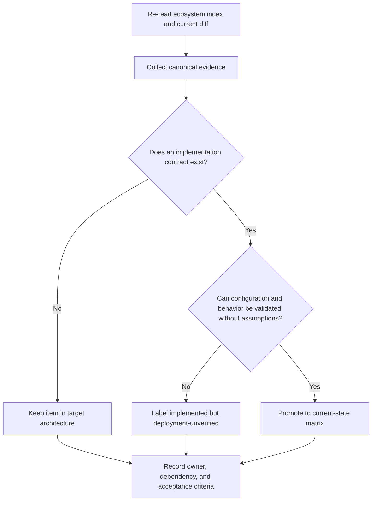

# Architecture Alignment: Next-session Context

> **Prepared:** 2026-09-12  
> **Purpose:** resume architecture work without turning target-state language into current-state claims

## Starting point

Documentation now distinguishes:

- the repository-local, five-layer implementation;
- guarded autonomy from unrestricted or “sovereign” autonomy;
- bootstrap configuration from committed proof of Genesis completion; and
- a proposed federated ecosystem from deployed federation.

Read [the ecosystem index](../ECOSYSTEM_INDEX.md) first. Treat
[`pyproject.toml`](../../pyproject.toml), source modules, policy configuration, and active
runtime definitions as authority. Treat dated reports, diagrams, generated counts, and
roadmap language as historical or aspirational unless independently confirmed.

## Next-session decision flow

## Prioritized follow-up

| Priority | Work item | Evidence to inspect | Completion gate |
|---|---|---|---|
| P0 | Define a federation contract ADR | Existing ADR template plus [`src/aries_serpent_core/governance/rbac.py`](../../src/aries_serpent_core/governance/rbac.py) and [`src/aries_serpent_core/autonomy/registry.py`](../../src/aries_serpent_core/autonomy/registry.py) | ADR defines identity, manifests, envelopes, policy negotiation, versioning, and failure semantics |
| P0 | Reconcile Genesis attestation language | [`.codex/autonomous_agent.yaml`](../../.codex/autonomous_agent.yaml), [bootstrap workflow](../../.github/misc/genesis-bootstrap.yml), and external run evidence supplied by an administrator | Docs state only what committed and externally supplied evidence proves |
| P1 | Replace representative ecosystem metrics with an explicit adapter contract | [`src/aries_serpent_core/brain/ooda_observer.py`](../../src/aries_serpent_core/brain/ooda_observer.py) | Interface distinguishes sample, cached, and live observations |
| P1 | Specify cross-node task/evidence schemas | [`src/aries_serpent_core/cognitive/planset_orchestrator.py`](../../src/aries_serpent_core/cognitive/planset_orchestrator.py) and existing schemas under [`schemas/`](../../schemas/) | Versioned schema and compatibility policy are documented |
| P2 | Map deployment topologies to federation nodes | [`docker/`](../../docker/), [`k8s/`](../../k8s/), and [`infrastructure/`](../../infrastructure/) | Each topology states trust boundary, persistence owner, and failure boundary |

## Guardrails

- Do not infer live deployment from source presence.
- Do not infer completed Genesis from an enabled configuration switch.
- Do not present roadmap dates or desired metrics as achieved.
- Keep package-boundary changes in their owning lane; this plan is documentation-only.
- Add source links beside material architecture claims.
- Use Mermaid for structural and interaction diagrams.

## Handoff record

At the end of the next session, update this section with:

1. exact documents and canonical sources reviewed;
2. decisions accepted, deferred, or rejected;
3. current-versus-target status changes;
4. validation commands and results; and
5. unresolved evidence requests, especially live environment or external run evidence.
