# Codebase-Wide Autonomy: PR Template · WEC · Workflows · Discussions · Elevated Privileges

> **Document:** `docs/plans/AUTONOMOUS_PRIVILEGE_ARCHITECTURE.md`  
> **Status:** ✅ Living document — 2026-05-08  
> **Scope:** How every surface (PR template, WEC, GitHub Actions, Discussions, Webhooks) is wired
> together via elevated token privileges to achieve full codebase-wide agentic autonomy.  
> **Policy anchor:** [`ELEVATED_PRIVILEGES_TOKEN_REVIEW.md`](../reference/ELEVATED_PRIVILEGES_TOKEN_REVIEW.md) · [`CODEBASE_AGENCY_POLICY.md`](../../.codex/CODEBASE_AGENCY_POLICY.md)

---

## Table of Contents

1. [The Five Surfaces — Overview](#1-the-five-surfaces--overview)
2. [Master Privilege Routing Map](#2-master-privilege-routing-map)
3. [PR Template as the Autonomy Entrypoint](#3-pr-template-as-the-autonomy-entrypoint)
4. [WEC as the Declarative Workflow Controller](#4-wec-as-the-declarative-workflow-controller)
5. [Workflow/Actions Privilege Matrix](#5-workflowactions-privilege-matrix)
6. [Discussions as the Async Command Channel](#6-discussions-as-the-async-command-channel)
7. [Webhooks as the Real-Time Event Bus](#7-webhooks-as-the-real-time-event-bus)
8. [Repo/Org Variables as the Control Plane](#8-repoorg-variables-as-the-control-plane)
9. [Full Autonomy Loop — End-to-End Sequence](#9-full-autonomy-loop--end-to-end-sequence)
10. [Autonomy Decision Tree](#10-autonomy-decision-tree)
11. [Failure Modes & Fallback Chains](#11-failure-modes--fallback-chains)
12. [Operator Quick-Reference](#12-operator-quick-reference)

---

## 1. The Five Surfaces — Overview

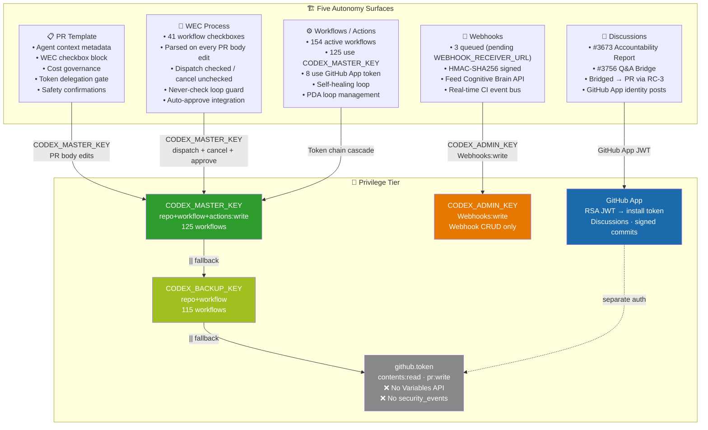

---

## 2. Master Privilege Routing Map

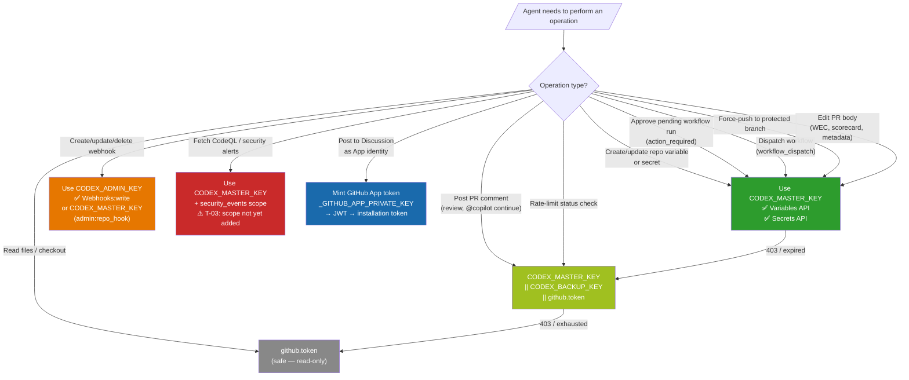

---

## 3. PR Template as the Autonomy Entrypoint

The PR template (`.github/PULL_REQUEST_TEMPLATE.md`) is the **single source of truth** that all autonomous systems read. Every checkbox, metadata table cell, and comment block is machine-parseable.

### 3.1 Template Anatomy

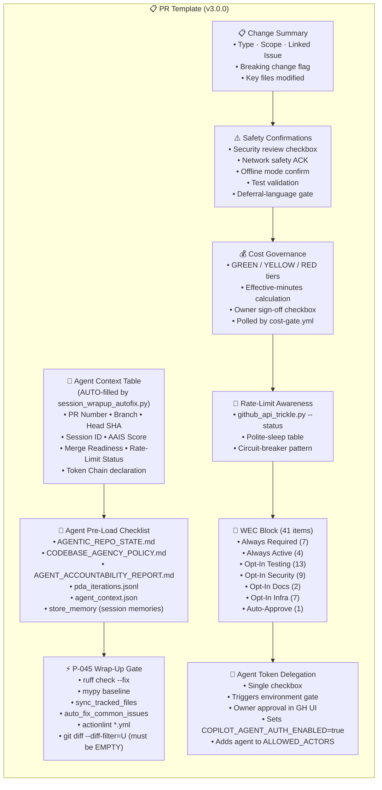

### 3.2 How Machines Read the Template

| Section | Parser | Token Used | Action |
|---------|--------|-----------|--------|
| Agent context `<!-- AUTO: ... -->` comments | `session_wrapup_autofix.py --fix-pr-body` | `CODEX_MASTER_KEY` | PATCH PR body via REST |
| Cost governance checkbox | `cost-gate.yml` (polling) | `github.token` | Block or allow CI spend |
| WEC `- [x]` checkboxes | `wec_enforcer.py --detect-changes` | `CODEX_MASTER_KEY` | Dispatch / cancel workflows |
| Token delegation checkbox | `agent-auth-delegation.yml` detect-checkbox job | `CODEX_MASTER_KEY` | Set `COPILOT_AGENT_AUTH_ENABLED` var |
| Safety confirmations | `comment-review-gate.yml` | `github.token` | Gate merge readiness |
| Deferral-language gate | `deferral-language-gate.yml` | `github.token` | Fail PR if prohibited phrases found |

---

## 4. WEC as the Declarative Workflow Controller

The WEC block is the **runtime control plane** for all 41 optional workflows. Checking a box dispatches a workflow; unchecking cancels any in-progress run.

### 4.1 WEC Item Classification & Token Routing

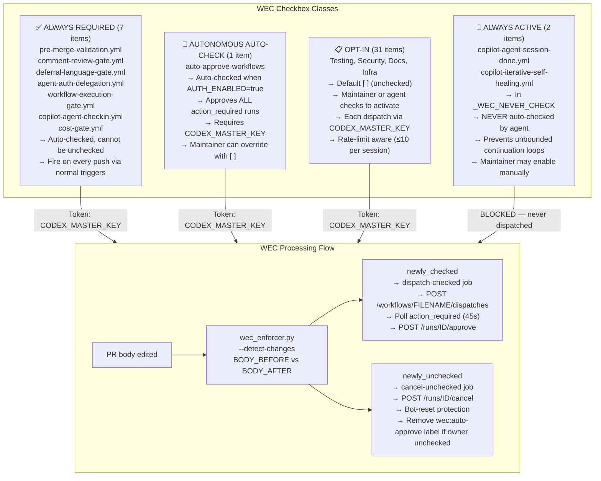

### 4.2 WEC Invariants (Verified at Module Load)

| Invariant | Formula | Status |
|-----------|---------|--------|
| Never-check workflows never in merge-required | `_WEC_NEVER_CHECK ∩ _MERGE_REQUIRED_WORKFLOWS = ∅` | ✅ Verified |
| Always-required never in never-check | `_WEC_ALWAYS_REQUIRED ∩ _WEC_NEVER_CHECK = ∅` | ✅ Verified |
| Autonomous auto-check not in never-check | `_WEC_AUTONOMOUS_AUTO_CHECK ∩ _WEC_NEVER_CHECK = ∅` | ✅ Verified |
| All merge-required items exist in WEC_ITEMS | subset check | ✅ Verified |

---

## 5. Workflow/Actions Privilege Matrix

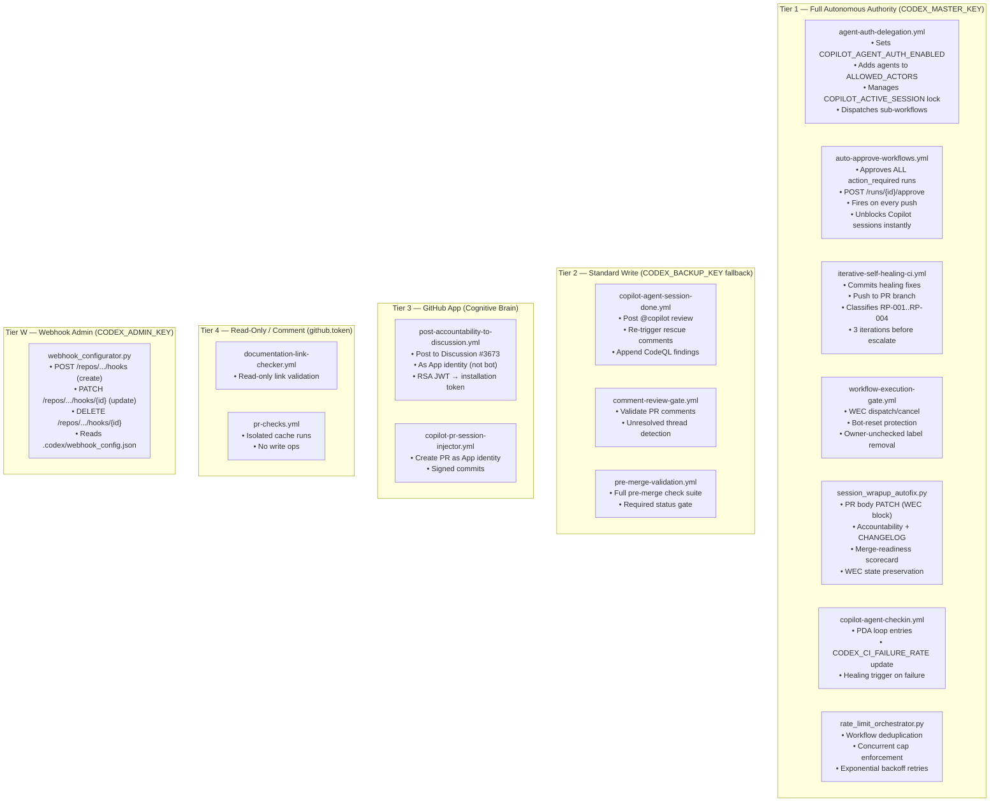

### 5.1 Highest-Risk Workflow Pairs (Cascade Failure Analysis)

| If this fails... | These also fail... | Root cause | Token |
|-----------------|-------------------|------------|-------|
| `auto-approve-workflows.yml` | ALL CI workflows blocked in "Waiting" | `CODEX_MASTER_KEY` expired | T1 |
| `agent-auth-delegation.yml` | No autonomous ops fire at all | `COPILOT_AGENT_AUTH_ENABLED` not set | T1 |
| `iterative-self-healing-ci.yml` | Failures accumulate unchecked | Cannot push fix commits | T1 |
| `session_wrapup_autofix.py` | WEC gate fails; merges blocked | PR body not updated | T1 |
| `workflow-execution-gate.yml` | WEC checkboxes ignored | `detect-wec-changes` not triggering | T1 |

---

## 6. Discussions as the Async Command Channel

Discussions serve two roles: **accountability surface** and **async command inbox**.

### 6.1 Discussion Architecture

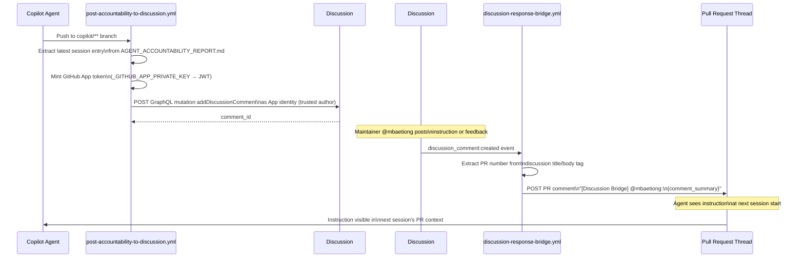

### 6.2 Discussion ↔ PR Privilege Routing

| Operation | Token | Why |
|-----------|-------|-----|
| Post accountability to Discussion #3673 | GitHub App token (JWT mint) | Posts as trusted App identity, not anonymous bot |
| Bridge Discussion comment → PR notification | `CODEX_MASTER_KEY ‖ CODEX_BACKUP_KEY ‖ github.token` | PR comment write needs `issues:write` |
| Read Discussion thread (agent in-session) | MCP GitHub server (read) | `list_workflow_runs` / REST `GET /discussions` |
| Clean up stale discussion threads | `github.token` | `discussion-cleanup.yml` — no write escalation needed |

---

## 7. Webhooks as the Real-Time Event Bus

Webhooks close the **feedback loop latency** from ~5 minutes (polling) to **<2 seconds** (push delivery).

### 7.1 Webhook Architecture (Target State)

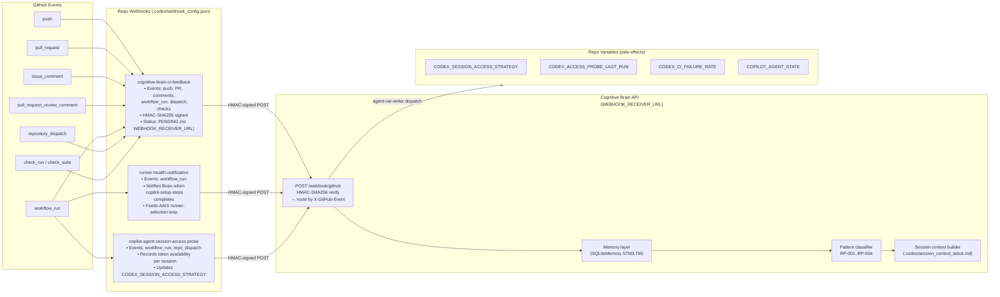

### 7.2 Webhook Deployment Blockers & Required Actions

| Blocker | Current State | Required Action | Token Needed |
|---------|--------------|-----------------|-------------|
| `WEBHOOK_RECEIVER_URL` not set | Placeholder `your-cognitive-brain-server.com` | Deploy CB API server; auto-set by `post-start.sh` in Codespace | — (auto-set) |
| `WEBHOOK_SECRET` org secret missing | Not configured | Create org secret via Settings → Secrets (HMAC key must match server) | Admin console |
| `CODEX_ADMIN_KEY` missing | Not configured | Create fine-grained PAT with `Webhooks: write` for `Aries-Serpent/_codex_` | GitHub PAT settings |
| `active=false` on all 3 webhooks | Intentional | After WEBHOOK_RECEIVER_URL set: run `python scripts/ci/webhook_configurator.py --apply .codex/webhook_config.json` | `CODEX_ADMIN_KEY` |
| Port 8765 not public in Codespace | Manual step | Run `gh codespace ports visibility 8765:org` (done by `post-start.sh`) | Codespace token |

### 7.3 Webhook → Repo Variable Feedback Loop

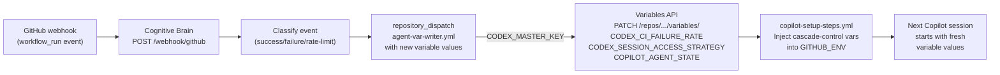

---

## 8. Repo/Org Variables as the Control Plane

Variables are the **persistent shared state** between sessions. The agent reads them via `agent_context.json`; the CI system writes them via `CODEX_MASTER_KEY`.

### 8.1 Variable Registry — Full Inventory

| Variable | Source | Consumer | Privilege to Write |
|----------|--------|----------|--------------------|
| `COPILOT_AGENT_AUTH_ENABLED` | `agent-auth-delegation.yml` | All workflows | `CODEX_MASTER_KEY` |
| `COPILOT_AGENT_STATE` | `copilot-agent-checkin.yml` | `copilot-setup-steps.yml` | `CODEX_MASTER_KEY` |
| `COPILOT_RUNNER_PROFILE` | Manual / Cognitive Brain | `copilot-setup-steps.yml` runs-on | `CODEX_MASTER_KEY` |
| `COPILOT_AGENT_MAX_AUTONOMY_LEVEL` | Manual / agent-auth-delegation | Healing + approval decisions | `CODEX_MASTER_KEY` |
| `CODEX_MASTER_KEY_EXPIRY_DATE` | Manual on token rotation | `token-expiry-monitor.yml` | Manual (admin) |
| `CODEX_BACKUP_KEY_EXPIRY_DATE` | Manual on token rotation | `token-expiry-monitor.yml` | Manual (admin) |
| `CODEX_CI_FAILURE_RATE` | `copilot-agent-checkin.yml` | AAIS Reliability scorer | `CODEX_MASTER_KEY` |
| `CODEX_CI_LAST_GREEN_SHA` | `copilot-agent-checkin.yml` | Session context / healing | `CODEX_MASTER_KEY` |
| `CODEX_MAX_HEALER_RUNS_PER_HOUR` | Manual | `iterative-self-healing-ci.yml` | `CODEX_MASTER_KEY` |
| `CODEX_HEALER_SKIP_SKIPCI` | Manual | Healing loop | `CODEX_MASTER_KEY` |
| `CODEX_SWEEP_SKIP_MAIN` | Manual | Branch sweep jobs | `CODEX_MASTER_KEY` |
| `WEBHOOK_RECEIVER_URL` | `post-start.sh` (Codespace) | `webhook_configurator.py` | Auto (Codespace token) |
| `WEBHOOK_DOMAIN_VARIANT` | `post-start.sh` | Docs / troubleshooting | Auto (Codespace token) |
| `CODEX_ACTIVE_CODESPACE` | `post-start.sh` | Webhook URL construction | Auto (Codespace token) |
| `RATE_LIMIT_MAX_CONCURRENT` | Manual / `pending_var_updates.json` | `rate_limit_orchestrator.py` | `CODEX_MASTER_KEY` |
| `GH_TRICKLE_POLITE_SLEEP` | `pending_var_updates.json` | All trickle-aware scripts | `CODEX_MASTER_KEY` |
| `GH_TRICKLE_MIN_REMAINING` | `pending_var_updates.json` | `github_api_trickle.py` | `CODEX_MASTER_KEY` |
| `CODEX_SESSION_HANDOFF_ENABLED` | `pending_var_updates.json` | `copilot-setup-steps.yml` | `CODEX_MASTER_KEY` |
| `COPILOT_AGENT_SESSION_NUMBER` | `copilot-agent-checkin.yml` | Accountability / logs | `CODEX_MASTER_KEY` |
| `COGNITIVE_BRAIN_SESSION_NUMBER` | Cognitive Brain API | Session chain index | `CODEX_MASTER_KEY` |
| `COGNITIVE_BRAIN_ALLOWED_ACTORS` | `agent-auth-delegation.yml` | All actor-gated workflows | `CODEX_MASTER_KEY` |
| `CODEX_SESSION_ACCESS_STRATEGY` | `session_access_probe.py` | `copilot-setup-steps.yml` | `CODEX_MASTER_KEY` |
| `CODEX_ACCESS_PROBE_LAST_RUN` | `session_access_probe.py` | Skip-probe optimization | `CODEX_MASTER_KEY` |
| `EMBEDDING_INDEX_AUTO_REBUILD` | Manual | RAG index rebuilder | `CODEX_MASTER_KEY` |
| `CODEX_RAG_LAST_REBUILD` | RAG builder | RAG freshness check | `CODEX_MASTER_KEY` |
| `CODEX_RAG_INDEX_VERSION` | RAG builder | Stale index detection | `CODEX_MASTER_KEY` |

### 8.2 Variable Write Path

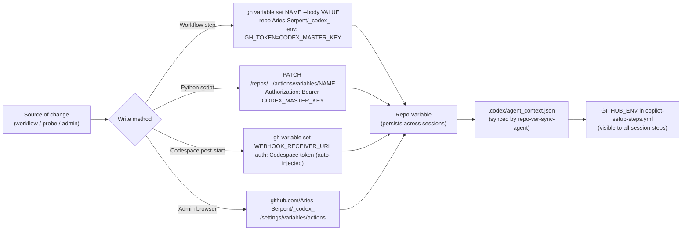

---

## 9. Full Autonomy Loop — End-to-End Sequence

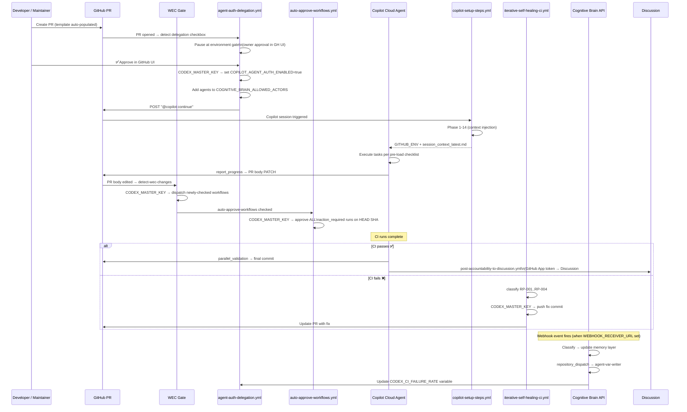

---

## 10. Autonomy Decision Tree

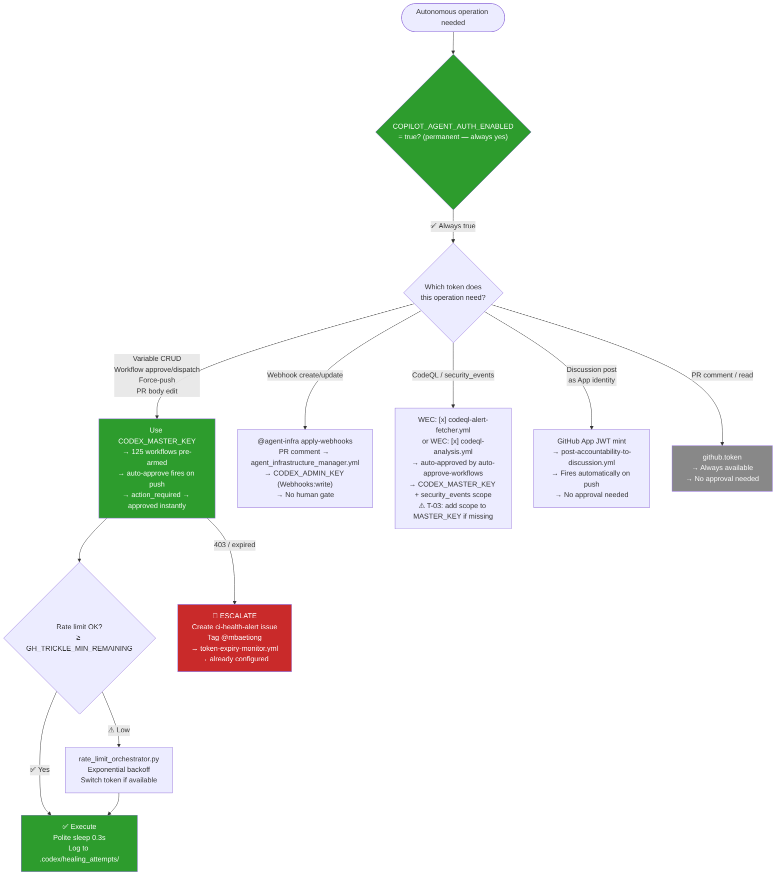

---

## 11. Failure Modes & Fallback Chains

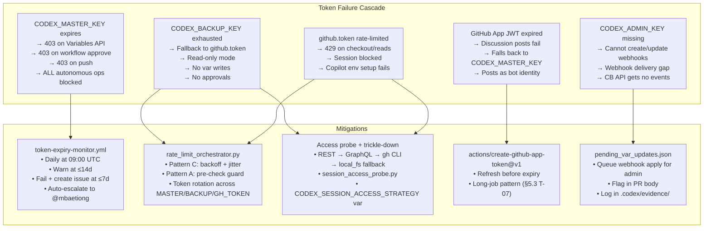

---

## 12. Operator Quick-Reference

> **All operations below are fully autonomous** — no human approval required.
> `COPILOT_AGENT_AUTH_ENABLED=true` + `auto-approve-workflows` armed = zero human gates.

### 12.1 Apply Pending Variables (No Human Needed)

Variables in `.codex/pending_var_updates.json` are applied by posting a single PR comment.
`agent-var-writer.yml` fires on `issue_comment`, validates the provenance session token,
and applies every allowed variable via `CODEX_MASTER_KEY`:

```bash
# Trigger autonomous variable apply — agent posts this as a PR comment:
gh pr comment <PR_NUMBER> --body "@agent-var-writer apply"

# agent-var-writer.yml fires immediately:
#   1. Validates .codex/agent_auth_session.json TTL (4h)
#   2. Reads .codex/pending_var_updates.json
#   3. PATCH /repos/.../actions/variables/{name} via CODEX_MASTER_KEY
#   4. Writes confirmation to .codex/applied_var_updates.json
#   5. Posts success summary as PR comment
```

**Currently queued (will apply on next `@agent-var-writer apply`):**

| Variable | Value | Purpose |
|----------|-------|---------|
| `GH_TRICKLE_POLITE_SLEEP` | `0.3` | API polite-sleep between calls |
| `GH_TRICKLE_MIN_REMAINING` | `20` | Rate-limit circuit-breaker floor |
| `GH_TRICKLE_RETRIES` | `3` | Max retries before method escalation |
| `GH_TRICKLE_MAX_WAIT` | `60` | Max backoff sleep (seconds) |
| `CODEX_RAG_INDEX_VERSION` | `0` | RAG stale-index detection monotonic counter |
| `CODEX_SESSION_ACCESS_STRATEGY` | `REST` | Active trickle-down method |
| `COPILOT_AGENT_SESSION_NUMBER` | `928` | Monotonic session counter |
| `RATE_LIMIT_MAX_CONCURRENT` | `8` | Max concurrent in-progress workflow runs |
| `CODEX_SESSION_HANDOFF_ENABLED` | `true` | Inject WEC+tasks+rate-limit into setup env |
| `WEBHOOK_DOMAIN_VARIANT` | `preview.app.github.dev` | Active Codespaces domain suffix |

### 12.2 Deploy Webhooks (No Human Needed)

`agent_infrastructure_manager.yml` fires on `issue_comment` — post a single PR comment:

```bash
# Trigger autonomous webhook apply:
gh pr comment <PR_NUMBER> --body "@agent-infra apply-webhooks"

# agent_infrastructure_manager.yml fires:
#   1. Auth-check: validates COPILOT_AGENT_AUTH_ENABLED=true
#   2. Reads .codex/webhook_config.json
#   3. Replaces placeholder URL with WEBHOOK_RECEIVER_URL repo variable
#   4. POST /repos/.../hooks via CODEX_ADMIN_KEY (Webhooks:write)
#   5. Updates .codex/webhook_registry.json with live hook IDs
#   6. Posts deployment summary as PR comment

# Verify after deploy:
gh pr comment <PR_NUMBER> --body "@agent-infra list-webhooks"
```

**4 webhooks queued for deployment:**
1. `cognitive-brain-ci-feedback` — push, PR, comments, workflow_run, dispatch, checks
2. `runner-health-notification` — workflow_run (copilot-setup-steps health)
3. `copilot-agent-session-access-probe` — workflow_run, repo_dispatch
4. `rate-limit-orchestration-trigger` — workflow_run, repo_dispatch *(new — added this session)*

### 12.3 Arm WEC Validation Suite (No Human Needed)

Check boxes in the WEC block of the PR body. `workflow-execution-gate.yml` detects
newly-checked items and dispatches each one via `CODEX_MASTER_KEY`. `auto-approve-workflows`
immediately approves all resulting `action_required` runs:

```
Recommended set for a full autonomous validation pass:
- [x] validate.yml
- [x] resilient_validation.yml
- [x] nox_gates.yml
- [x] codeql-analysis.yml
- [x] codeql-alert-fetcher.yml
- [x] reference-integrity.yml
- [x] security-scanning-suite.yml
- [x] copilot-agent-session-done.yml   ← enables auto-review-loop
```

### 12.4 Rate-Limit Orchestration (Live — No Dry-Run)

```bash
# Full orchestration pass — deduplication + cap enforcement (live):
python scripts/ci/rate_limit_orchestrator.py \
    --orchestrate \
    --branch "$(git branch --show-current)" \
    --max-concurrent 8

# Status check only:
python scripts/ci/rate_limit_orchestrator.py --status

# Dedup a single workflow:
python scripts/ci/rate_limit_orchestrator.py \
    --deduplicate \
    --workflow validate.yml \
    --branch "$(git branch --show-current)"
```

### 12.5 Full Autonomy Stack — One-Line Checklist

```
□ COPILOT_AGENT_AUTH_ENABLED=true            → confirmed ✅ (permanent)
□ auto-approve-workflows [x] in WEC          → all action_required runs auto-approved
□ @agent-var-writer apply comment posted     → pending variables deployed
□ @agent-infra apply-webhooks comment posted → 4 webhooks deployed
□ WEC validation suite armed                 → validate + resilient + codeql + nox
□ copilot-agent-session-done.yml [x]         → review loop fires after session ends
□ rate_limit_orchestrator.py --orchestrate   → cascades deduped, cap enforced
```

---

*Document maintained by the Copilot Cloud Agent autonomous system.*  
*Last verified: 2026-05-08 | Token inventory: 5 tiers | WEC items: 41 | Workflows: 154 | Invariants: 5/5 ✅*  
*Next action: Apply `.codex/pending_var_updates.json` via agent-var-writer after PR merge.*
