# 🤖 Autonomous Self-Healing Agent — Comprehensive Design Proposal

> **Session:** S182 | **PR:** #3724 | **Status:** 📋 PROPOSAL (awaiting owner review)
> **Author:** Copilot Coding Agent (claude-opus-4.6) | **Date:** 2026-03-23
> **Policy Compliance:** ✅ Full adherence to [AI Codebase Agency Policy](../../.codex/CODEBASE_AGENCY_POLICY.md)

---

## Table of Contents

1. [Executive Summary](#executive-summary)
2. [Current Architecture Analysis](#current-architecture-analysis)
3. [Merge Chain & Workflow Architecture](#merge-chain--workflow-architecture)
4. [Session Concurrency Control Design](#session-concurrency-control-design)
5. [PR Template Enhancement](#pr-template-enhancement)
6. [Autonomous Self-Healing Pipeline](#autonomous-self-healing-pipeline)
7. [Expected Errors & Known Limitations](#expected-errors--known-limitations)
8. [Edge Cases & Blockers](#edge-cases--blockers)
9. [Implementation Roadmap](#implementation-roadmap)
10. [Verification & Testing Strategy](#verification--testing-strategy)

---

## 1. Executive Summary

This proposal extends the existing self-healing infrastructure to achieve **fully autonomous,
codebase-wide self-healing** with controlled concurrency. The key innovation is a
**Session Concurrency Gate** that ensures only ONE Copilot Coding Agent session is active
at a time (by default), with an opt-in mechanism to allow multiple concurrent sessions.

### Key Components

| Component | Status | Action |
|-----------|--------|--------|
| Iterative Self-Healing CI | ✅ Deployed (S154) | Extend with Copilot escalation |
| Agent Token Delegation | ✅ Deployed (S110) | Add session concurrency guard |
| Session Chain Workflow | ✅ Deployed (S163) | Add lock/unlock mechanism |
| PR Template | ✅ Deployed | Add "Multiple Sessions" checkbox |
| Session Concurrency Gate | 🆕 NEW | Design & implement |
| Copilot Escalation Trigger | 🆕 NEW | Design & implement |

---

## 2. Current Architecture Analysis

### Existing Self-Healing Flow

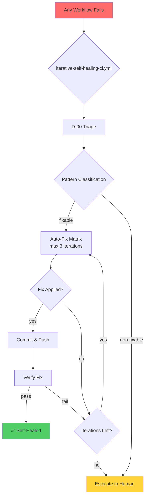

### Current Auto-Fix Pattern Coverage

| Pattern | Auto-Fix | Method |
|---------|----------|--------|
| `ruff-*` (F401/F841/I001/F541) | ✅ Full | `ruff --fix` |
| `import-*` (missing/circular) | ⚠️ Partial | Heuristic rewrite |
| `yaml-*` (indentation) | ⚠️ Detect only | Manual |
| `timeout-config` | ✅ Full | Config patch |
| `mypy-baseline` | ✅ Full | Baseline bump |
| `changelog-*` | ✅ Full | Auto-append |
| `policy-gate-*` | ✅ Full | session_wrapup_autofix.py |
| `branch-diverged` | ✅ Full | Auto-rebase |
| `self-healing` (cascade) | ❌ Block | Cascade detection |
| `unknown` | ❌ Escalate | Human required |

### Gap Analysis: Where Auto-Fix Falls Short

The current system handles ~37.5% of failure patterns automatically. The remaining
62.5% require human intervention or Copilot Coding Agent escalation. This proposal
closes that gap by adding **Copilot escalation** as a fallback when auto-fix patterns
fail or are not available.

---

## 3. Merge Chain & Workflow Architecture

### Branch & PR Flow

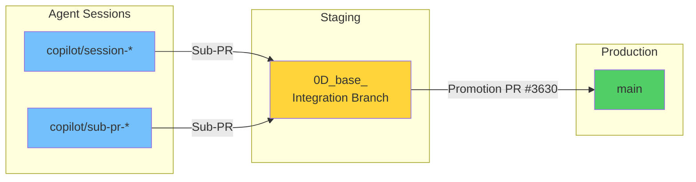

### Detailed Merge Direction

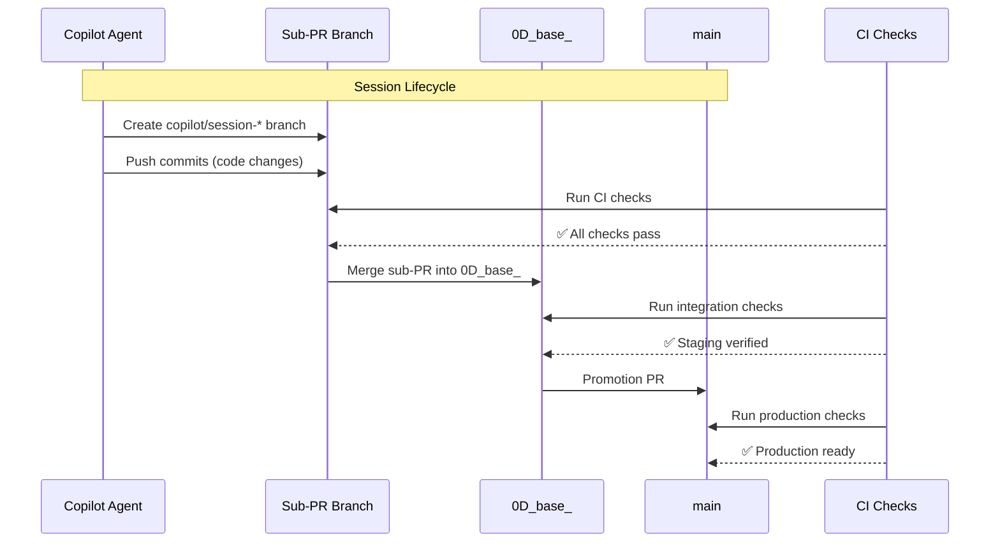

### Workflow Relationships

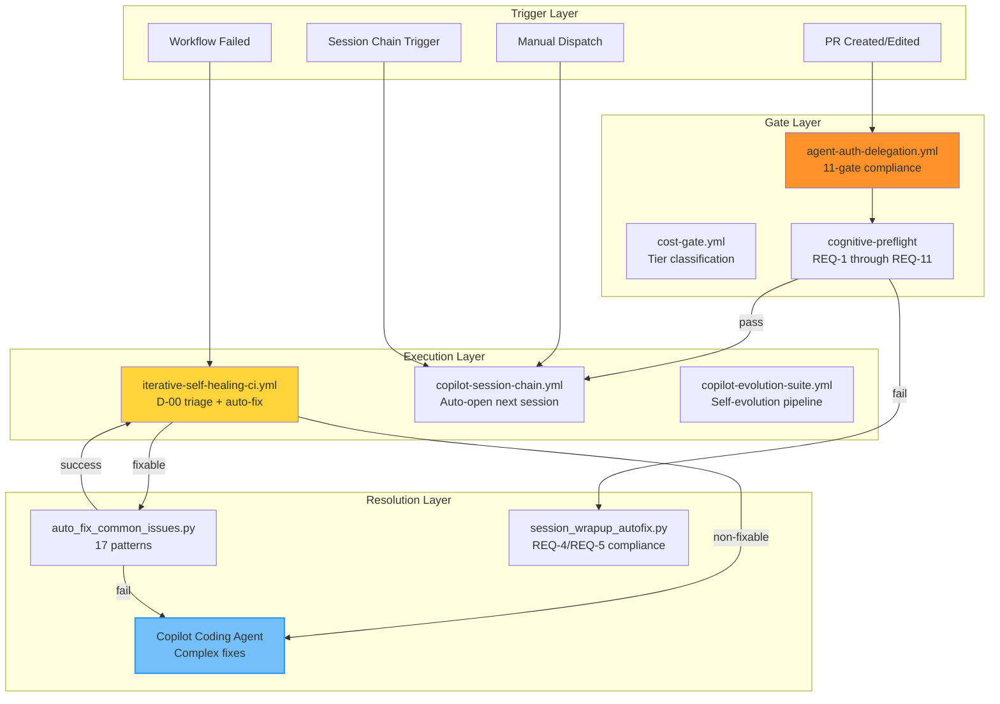

### Resolve Push Target Algorithm

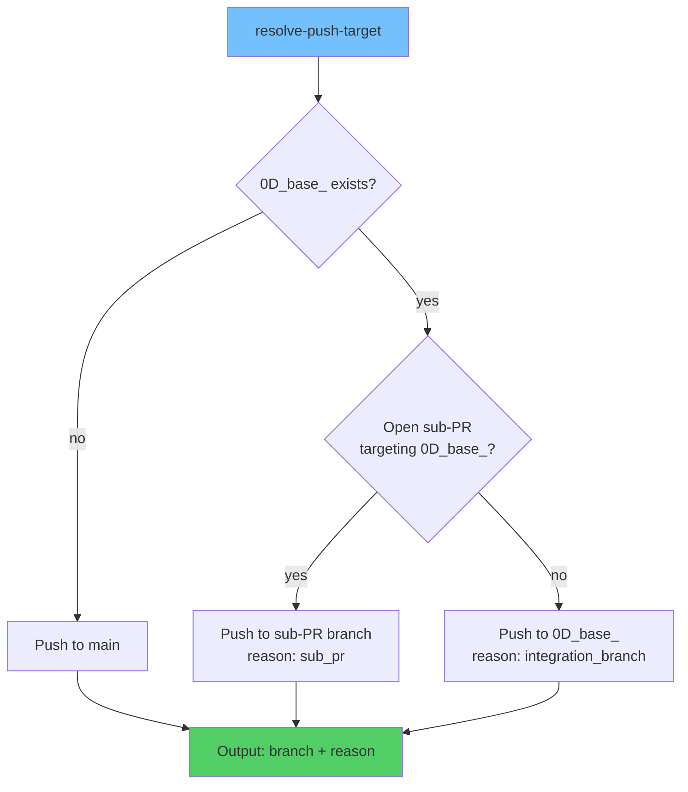

### Expected Errors in Current Workflow Architecture

| Error | Frequency | Root Cause | Impact |
|-------|-----------|------------|--------|
| REQ-4/REQ-5 compliance failure | Every commit without accountability update | `report_progress` tool overwrites PR description | Self-healing via `session_wrapup_autofix.py` |
| REQ-10 branch divergence | When `0D_base_` gets `[skip ci]` bot commits | Bot commits create divergence from `main` | Auto-pass for bot-only divergence |
| REQ-11 direct-session on `0D_base_` | Agent misconfiguration | Session runs on integration branch directly | Hard block — must use sub-PR |
| Self-healing cascade | When self-heal triggers itself | Fix commit triggers another `workflow_run` event | Cascade detection blocks re-entry |
| PR body checkbox loss | Every `report_progress` call | Tool replaces entire PR body | `pr-body-checkpoint-guardian` job restores |
| mypy baseline drift | Code changes add type errors | Type error count exceeds stored baseline | Auto-bump via self-healing pattern |

---

## 4. Session Concurrency Control Design

### Problem Statement

Currently, there is **no explicit mechanism** to limit how many Copilot Coding Agent
sessions can be active simultaneously. The sub-PR model provides *implicit* sequencing
(each session gets its own branch), but nothing prevents multiple `@copilot continue`
triggers from spawning parallel sessions on different PRs.

### Proposed Solution: Session Concurrency Gate

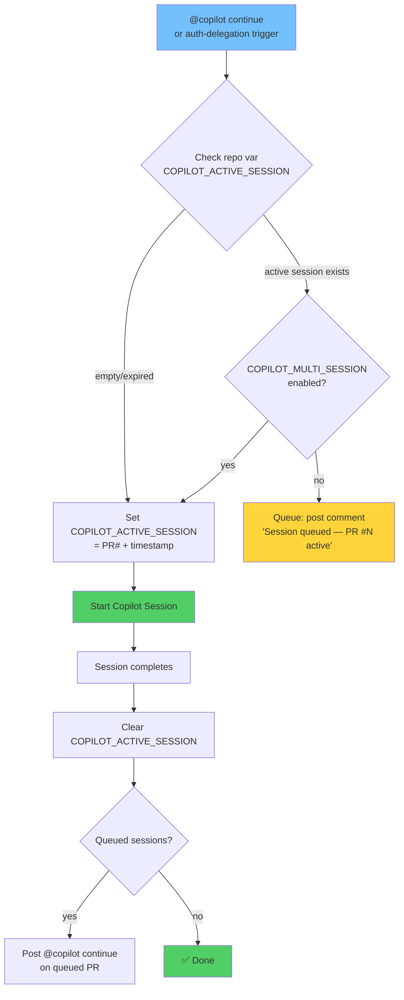

### Implementation: Repository Variables

| Variable | Type | Default | Purpose |
|----------|------|---------|---------|
| `COPILOT_ACTIVE_SESSION` | string | `""` | Current active session (format: `PR#\|epoch_timestamp\|run_id`, e.g. `3724\|1774576800\|12345678`) |
| `COPILOT_MULTI_SESSION` | string | `"false"` | Allow multiple concurrent sessions |
| `COPILOT_SESSION_QUEUE` | string | `""` | Comma-separated PR numbers awaiting session (e.g. `3725,3726`) |

### Lifecycle

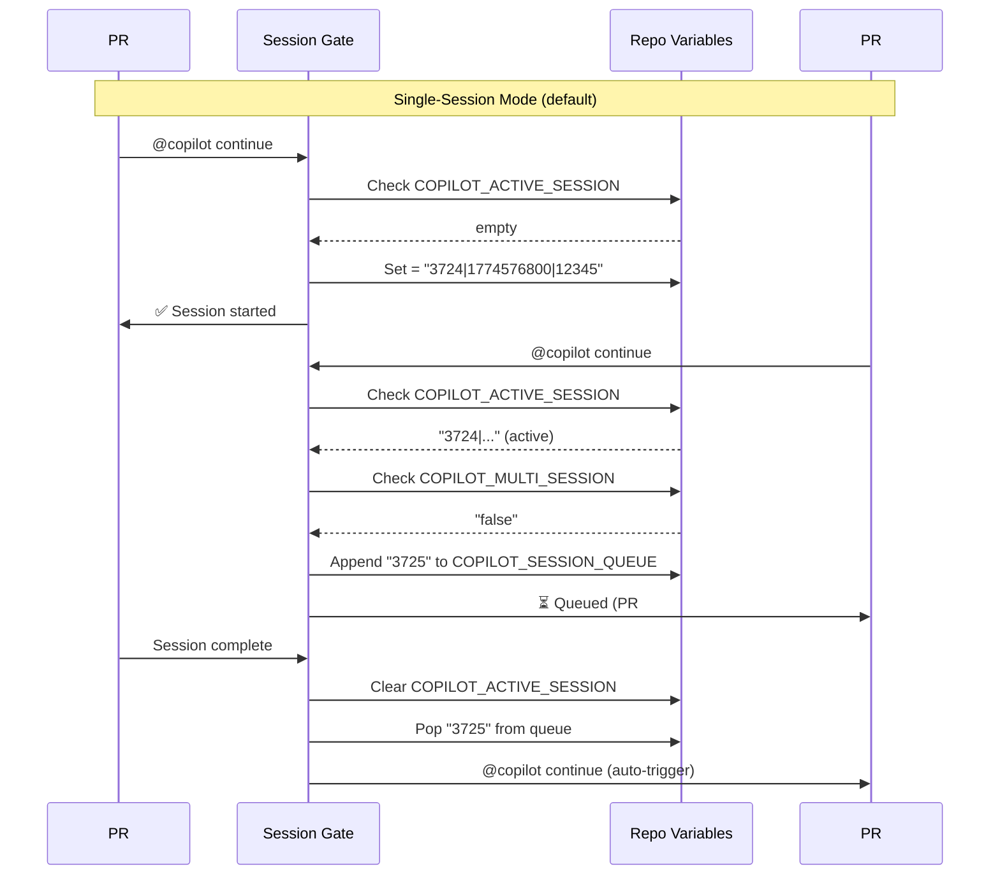

### Workflow Integration Points

The session gate integrates into `agent-auth-delegation.yml` at two points:

1. **Before `@copilot continue` posting** (Step 3d) — Check/acquire lock
2. **On session completion** (new workflow or job) — Release lock, trigger next

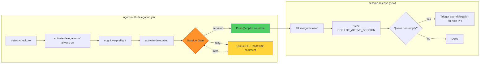

---

## 5. PR Template Enhancement

### New Checkbox Location

The "Multiple Copilot Coding Agent Sessions" checkbox is added **below** the existing
Agent Token Delegation checkbox in the PR template:

```markdown
### 🔐 Agent Token Delegation

- [ ] **Enable Agent Token Delegation** (`COPILOT_AGENT_AUTH_ENABLED`)
  - Authorizes `copilot-swe-agent[bot]`, `github-copilot[bot]`, and `github-actions[bot]`
  - Triggers the [`agent-auth-delegation`](.github/workflows/agent-auth-delegation.yml) gated workflow
  - **Owner must approve in the GitHub Actions UI** ("Waiting for approval")

- [ ] **Multiple Copilot Coding Agent Sessions** (`COPILOT_MULTI_SESSION`)
  - ⚠️ **Default: disabled** — Only ONE Copilot session active at a time
  - When enabled: allows parallel Copilot sessions on different PRs
  - When disabled: sessions are queued and executed sequentially
  - **Caution:** Multiple sessions may cause merge conflicts on shared files
```

### Detection Logic

The `agent-auth-delegation.yml` workflow already parses the PR body for checkboxes.
The same pattern extends to detect `COPILOT_MULTI_SESSION`:

```bash
# Existing pattern (line 139):
if printf '%s' "${PR_BODY}" | grep -qiE '\-[[:space:]]*\[x\].*COPILOT_AGENT_AUTH_ENABLED'; then

# New pattern:
if printf '%s' "${PR_BODY}" | grep -qiE '\-[[:space:]]*\[x\].*COPILOT_MULTI_SESSION'; then
  echo "multi_session=true" >> "$GITHUB_OUTPUT"
fi
```

---

## 6. Autonomous Self-Healing Pipeline

### End-to-End Flow

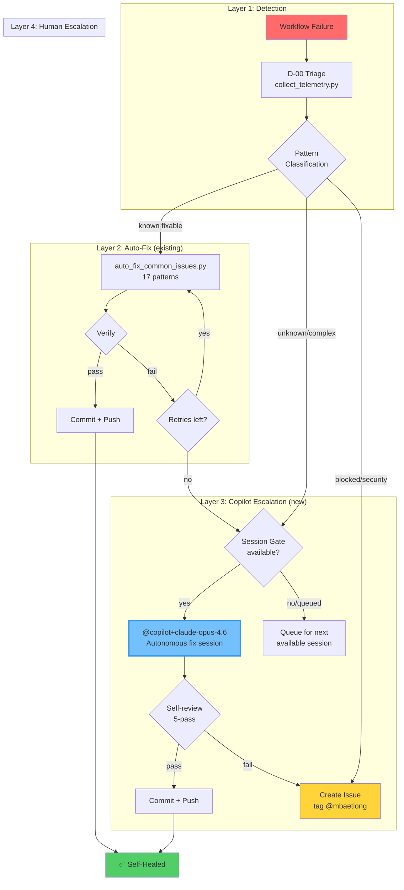

### Copilot Escalation Trigger

When auto-fix exhausts all iterations, the self-healing workflow posts a structured
`@copilot` comment on the failing PR (or creates a new issue if no PR context):

```markdown
@copilot+claude-opus-4.6 Fix the failing CI workflow "{workflow_name}" (run #{run_number}).

**Context:**
- Workflow file: {workflow_file}
- Failed jobs: {failed_jobs}
- Pattern: {pattern_name} (auto-fix exhausted {max_iterations} iterations)
- Error summary: {error_summary}

**Auto-fix attempts:**
1. Iteration 1: {result_1}
2. Iteration 2: {result_2}
3. Iteration 3: {result_3}

**Instructions:**
1. Load `.codex/CODEBASE_AGENCY_POLICY.md` and follow §0
2. Analyze the failure logs at {run_url}
3. Apply the minimal fix required
4. Run self-review (5-pass) before committing
5. Update `docs/accountability/AGENT_ACCOUNTABILITY_REPORT.md`
```

### Self-Healing Decision Tree

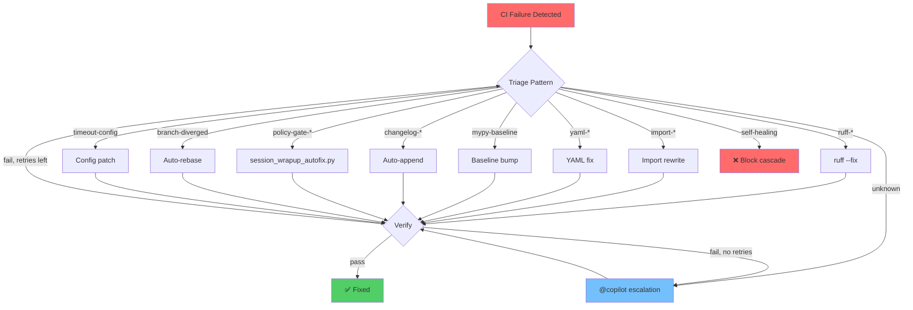

---

## 7. Expected Errors & Known Limitations

### Expected Errors (by design)

| Error | Why It's Expected | Mitigation |
|-------|-------------------|------------|
| REQ-4/REQ-5 on first commit | `report_progress` doesn't touch accountability files | `session_wrapup_autofix.py` auto-heals |
| PR body checkbox loss | `report_progress` overwrites PR description | `pr-body-checkpoint-guardian` restores |
| Self-healing cascade detection | Fix commits trigger `workflow_run` | Pattern detection blocks re-entry |
| Session gate race condition | Two PRs trigger simultaneously | Atomic variable check-and-set via API |
| mypy count fluctuation | Different environments produce different counts | Baseline uses CI-measured count |
| Node.js 20 deprecation warnings | GitHub Actions runners moving to Node.js 24 | Will resolve when actions update |
| CodeQL database size limit | Large repos exceed CodeQL analysis capacity | Expected — partial analysis acceptable |
| Dependency submission checkout errors | Branch protection on some branches | Expected for protected branches |

### Known Limitations

1. **Session gate is advisory, not blocking** — GitHub's Copilot agent can be triggered
   by any `@copilot` comment, regardless of our gate. The gate posts a "queued" message
   but cannot prevent the agent from starting. Workaround: the gate sets a repo variable
   that the cognitive-preflight check reads, causing the session to self-terminate early.

2. **Cross-PR merge conflicts** — Multiple sessions modifying shared files
   (e.g., `CHANGELOG.md`, `AGENT_ACCOUNTABILITY_REPORT.md`) will conflict.
   Workaround: sequential session model (default) prevents this. See
   **Section 7b: Merge Conflict Handling Strategy** for full details.

3. **Copilot session timeout** — Sessions have a maximum runtime. Complex fixes
   may exceed the timeout. Workaround: session chain auto-continues.

4. **Self-healing loop depth** — Maximum 3 iterations per failure event to prevent
   infinite loops. If 3 iterations fail, escalation to Copilot or human is required.

---

## 7b. Merge Conflict Handling Strategy

Merge conflicts are one of the most frequent failure modes in multi-branch, multi-agent
workflows. This section documents every point where conflicts can arise, the existing
infrastructure that handles them, and the new mechanisms this proposal adds.

### Conflict Taxonomy

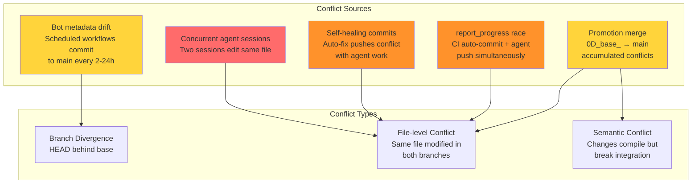

### Existing Infrastructure (Already Deployed)

#### Layer 1: Branch Divergence Detection & Auto-Merge

**File:** `scripts/ci/branch_rebase_check.py` (authoritative rebase gate)

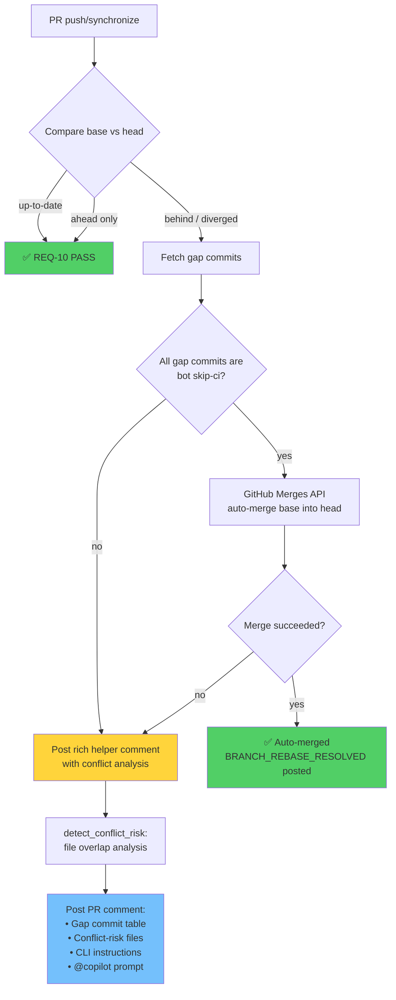

**How it works:**

1. **`branch-rebase-gate.yml`** runs on every `push`/`synchronize` to a PR
2. Calls `branch_rebase_check.py` which compares the PR branch against its base
3. If the branch is behind:
   - **Bot-only gap** (all `[skip ci]` from `github-actions[bot]`): Auto-merges
     via the GitHub Merges API — no local git operations required
   - **Functional gap** (human commits in gap): Posts a rich helper comment with:
     - Conflict risk assessment (`detect_conflict_risk()` — file overlap)
     - Step-by-step CLI rebase instructions
     - Copy-pasteable `@copilot` prompt for automated resolution
4. **REQ-10 in `agent-auth-delegation.yml`** reads the marker comment and
   **hard-blocks** the agent session until the rebase is resolved

**Conflict risk detection (`detect_conflict_risk()`):**
```python
def detect_conflict_risk(pr_files: list[str], gap_files: set[str]) -> list[str]:
    """Return files present in both the PR and the gap (potential conflicts)."""
    return sorted(set(pr_files) & gap_files)
```

When overlapping files are detected, the comment includes:
- 🔴 **HIGH** risk badge
- Explicit list of conflicting files
- Warning that manual conflict resolution may be required

#### Layer 2: Merge Readiness Scoring

**File:** `scripts/ci/pr_comment_consolidator.py`

The PR Status Dashboard computes a **merge readiness score** (0-100) with merge
conflict status weighted at **15%** of the total:

| Component | Weight | Source |
|-----------|--------|--------|
| CI checks | 40% | GitHub check runs |
| Review approvals | 30% | PR reviews API |
| **No merge conflicts** | **15%** | `mergeable` field from PR API |
| Branch up-to-date | 15% | Compare API |

```python
# From pr_comment_consolidator.py — component 3
mergeable = pr.get("mergeable")
if mergeable is True:
    conflict_score = 1.0    # "no conflicts"
elif mergeable is False:
    conflict_score = 0.0    # "merge conflicts detected"
else:
    conflict_score = 0.5    # None → GitHub still computing
```

#### Layer 3: Concurrency Prevention via Workflow Groups

All key workflows use `concurrency` groups to prevent parallel runs on the same branch:

```yaml
concurrency:
  group: ${{ github.workflow }}-${{ github.head_ref || github.ref }}
  cancel-in-progress: true
```

This ensures that if a self-healing commit triggers a re-run, the previous run is
cancelled — preventing two runs from pushing conflicting commits to the same branch.

#### Layer 4: Agent Session Sequential Model

The sub-PR architecture is the primary structural defense against conflicts:

```
Session A: copilot/session-A → 0D_base_ (merged)
Session B: copilot/session-B → 0D_base_ (starts AFTER A merges)
```

`copilot-session-chain.yml` auto-opens the next session only when the previous
sub-PR is merged — ensuring sessions don't overlap on shared files.

### New Conflict Handling (This Proposal Adds)

#### Enhancement 1: Session Gate Prevents Concurrent File Edits

The **Session Concurrency Gate** (Section 4) prevents the most common conflict source
— two Copilot sessions editing the same "sentinel" files simultaneously:

**Sentinel files** (files touched by every session):
- `docs/accountability/AGENT_ACCOUNTABILITY_REPORT.md` (REQ-4)
- `CHANGELOG.md` (REQ-5)
- `.codex/agent_auth_session.json` (provenance token)
- `CODEX_MANIFEST.json` (auto-regenerated)

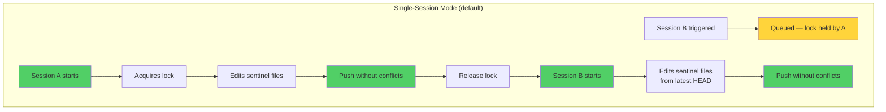

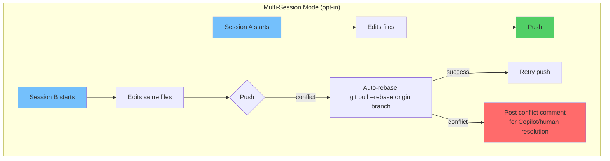

#### Enhancement 2: Self-Healing Commit Conflict Prevention

When the self-healing pipeline pushes a fix commit, it can conflict with in-progress
agent work. The proposal adds a **pre-push conflict check**:

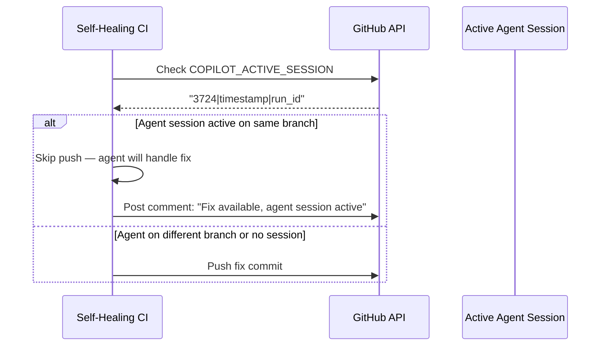

**Implementation:** Add to `iterative-self-healing-ci.yml` before the commit step:

```yaml
- name: "Check for active agent session on target branch"
  id: agent_check
  env:
    GH_TOKEN: ${{ secrets.CODEX_MASTER_KEY }}
  run: |
    ACTIVE=$(gh variable get COPILOT_ACTIVE_SESSION --repo Aries-Serpent/_codex_ 2>/dev/null || echo "")
    if [ -n "$ACTIVE" ]; then
      ACTIVE_PR=$(echo "$ACTIVE" | cut -d'|' -f1)
      ACTIVE_BRANCH=$(gh pr view "$ACTIVE_PR" --json headRefName -q .headRefName 2>/dev/null || echo "")
      if [ "$ACTIVE_BRANCH" = "$TARGET_BRANCH" ]; then
        echo "skip_push=true" >> "$GITHUB_OUTPUT"
        echo "⚠️ Active agent session on $TARGET_BRANCH (PR #$ACTIVE_PR) — skipping push"
      else
        echo "skip_push=false" >> "$GITHUB_OUTPUT"
      fi
    else
      echo "skip_push=false" >> "$GITHUB_OUTPUT"
    fi
```

#### Enhancement 3: report_progress Conflict Recovery

The `report_progress` tool calls `git add . && git commit && git push`. When a CI
auto-commit has landed between the agent's last pull and this push, the push fails.
The existing `copilot-setup-steps.yml` already configures:

```yaml
git config --global advice.mergeConflict false
```

The proposal adds a **pre-push pull-rebase** to the Copilot setup steps:

```yaml
# In copilot-setup-steps.yml — add to agent environment setup
git config --global pull.rebase true
git config --global rebase.autoStash true
```

This ensures that any `git pull` performed by the agent or `report_progress` tool
automatically rebases local work on top of remote changes, auto-stashing any
uncommitted changes during the rebase.

#### Enhancement 4: Post-Conflict Copilot Escalation

When a merge conflict cannot be auto-resolved (rebase fails), the system posts a
structured `@copilot` comment with conflict context:

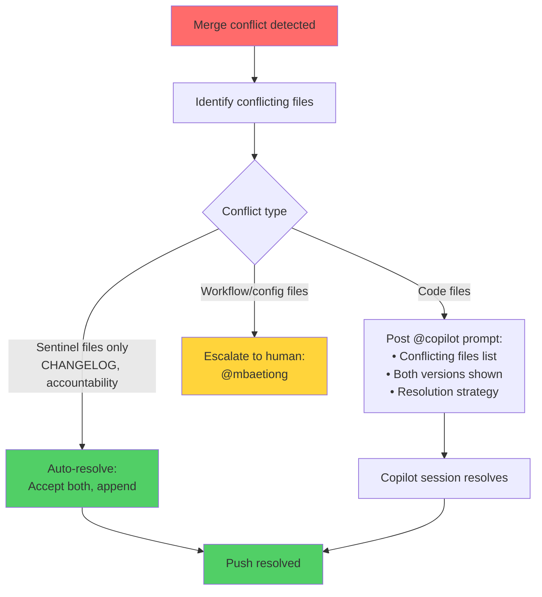

**Sentinel file auto-resolution strategy:**

For files that are append-only by convention (accountability report, changelog),
conflicts can be auto-resolved by accepting both sides:

```bash
# Auto-resolve sentinel files (append-only pattern)
for f in docs/accountability/AGENT_ACCOUNTABILITY_REPORT.md CHANGELOG.md; do
  if git diff --name-only --diff-filter=U | grep -q "$f"; then
    # Accept both: keep all content from both sides
    git checkout --theirs "$f"  # Take remote version
    # Re-append our additions (stored in a temp file before merge)
    cat "/tmp/our_additions_${f##*/}" >> "$f"
    git add "$f"
  fi
done
```

#### Enhancement 5: Session Boundary Conflict Guard (§0.4 Policy)

Every Copilot Coding Agent session MUST inspect the PR for merge conflicts at both
**session start** and **session end**. This is now codified as §0.4 in the
Codebase Agency Policy and enforced via `copilot-setup-steps.yml`.

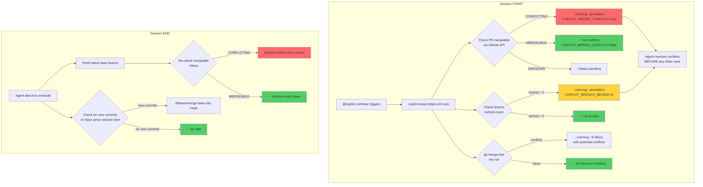

**Implementation (already deployed in `copilot-setup-steps.yml`):**

The setup workflow now runs three checks at session start:
1. **GitHub API check** — `gh pr view --json mergeable` → sets `COPILOT_MERGE_CONFLICT` env var
2. **Branch divergence check** — `git rev-list --count HEAD..origin/BASE` → sets `COPILOT_BRANCH_BEHIND`
3. **merge-tree dry-run** — `git merge-tree <merge-base> HEAD origin/BASE` → detects file-level conflicts

All three emit `::warning::` annotations that appear in the GitHub Actions UI and are
visible to the Copilot agent when it reads CI check results per §0.2.

**Agent responsibility at session end:**

Before the final `report_progress` call, the agent must:
```bash
# Fetch latest base (full history for accurate comparison)
git fetch origin "${BASE_BRANCH}"

# Check for new commits since session start
NEW_COMMITS=$(git rev-list --count "HEAD..origin/${BASE_BRANCH}")
if [ "$NEW_COMMITS" -gt 0 ]; then
  git pull --rebase origin "${BASE_BRANCH}"
fi

# Verify no conflicts
gh pr view "${PR_NUMBER}" --json mergeable -q .mergeable
# Must output "MERGEABLE" — if "CONFLICTING", resolve before committing
```

#### Enhancement 6: CI Failure Issue Inspection (§0.2 Policy)

Every Copilot session must check for open CI failure report issues that contain
relevant failure patterns. Two issue labels are monitored:

| Label | Created By | Frequency |
|-------|-----------|-----------|
| `ci-failure` | `ci-failure-issue-creator.yml` | Per-workflow failure on `main` |
| `ci-health-alert` | `ci-health-monitor.yml` / `telemetry-collection.yml` | High failure rate threshold exceeded |

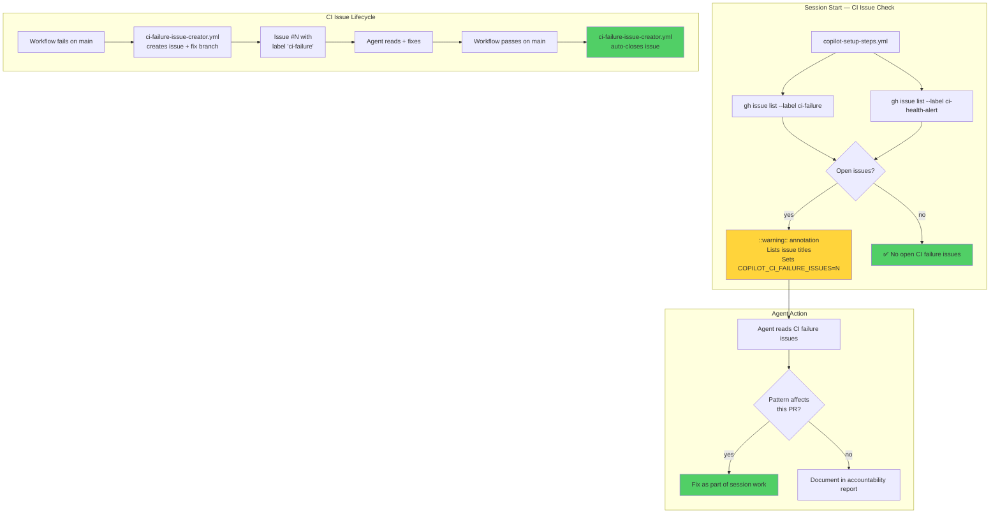

**Implementation (already deployed in `copilot-setup-steps.yml`):**

The setup workflow queries GitHub Issues API for both labels, counts open issues,
and emits a `::warning::` annotation with issue titles if any are found. The
`COPILOT_CI_FAILURE_ISSUES` environment variable is set so agents can programmatically
check whether CI failure issues exist.

### Conflict Handling Summary Matrix

| Conflict Source | Detection | Resolution | Automation Level |
|----------------|-----------|------------|-----------------|
| Bot metadata drift (main → branch) | `branch_rebase_check.py` (REQ-10) | Auto-merge via GitHub Merges API | ✅ Fully automatic |
| Functional commits in gap | `branch_rebase_check.py` (REQ-10) | Rich helper comment + `@copilot` prompt | ⚠️ Semi-automatic |
| Concurrent agent sessions — sentinel files | Session Concurrency Gate (new) | Sequential execution prevents conflict | ✅ Fully automatic |
| Concurrent agent sessions — code files | Multi-session mode warning | `git pull --rebase` + Copilot escalation | ⚠️ Semi-automatic |
| Self-healing push vs active session | Active-session check (new) | Skip push, defer to active session | ✅ Fully automatic |
| `report_progress` push failure | `git pull --rebase` (auto-stash) | Automatic rebase before push | ✅ Fully automatic |
| Promotion merge (0D_base_ → main) | PR mergeable status check | Manual review + human approval | 🔴 Manual (by design) |
| Semantic conflict (compiles but breaks) | CI test suite on merged code | Copilot escalation for test fix | ⚠️ Semi-automatic |

### Conflict Prevention Architecture (Full Picture)

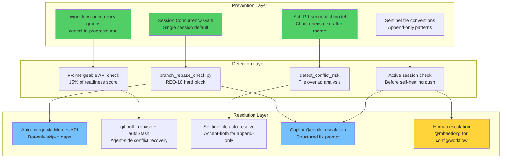

---

## 8. Edge Cases & Blockers

### Edge Cases

```mermaid
flowchart TD
    subgraph "Edge Case 1: Race Condition"
        EC1A[PR #1 checks gate] --> EC1B[PR #2 checks gate]
        EC1B --> EC1C{Both see 'empty'?}
        EC1C -->|possible| EC1D[Both acquire lock]
        EC1D --> EC1E[Mitigation: atomic<br/>check-and-set via API]
    end

    subgraph "Edge Case 2: Stale Lock"
        EC2A[Session starts] --> EC2B[Session crashes/times out]
        EC2B --> EC2C[Lock never released]
        EC2C --> EC2D[Mitigation: TTL on lock<br/>4-hour expiry]
    end

    subgraph "Edge Case 3: Cascade Prevention"
        EC3A[Self-heal commits fix] --> EC3B[Triggers workflow_run]
        EC3B --> EC3C{Pattern = self-healing?}
        EC3C -->|yes| EC3D[Block re-entry]
        EC3C -->|no| EC3E[Allow — genuine new failure]
    end

    subgraph "Edge Case 4: Queue Overflow"
        EC4A[5 PRs queued] --> EC4B{Queue limit exceeded?}
        EC4B -->|yes| EC4C[Drop oldest + notify]
        EC4B -->|no| EC4D[Add to queue]
    end

    subgraph "Edge Case 5: Merge Conflict During Promotion"
        EC5A[0D_base_ accumulates<br/>sub-PR merges] --> EC5B[Promotion PR to main]
        EC5B --> EC5C{Conflicts with main?}
        EC5C -->|yes| EC5D[Human resolves —<br/>never auto-merge to main]
        EC5C -->|no| EC5E[Clean promotion]
    end

    subgraph "Edge Case 6: Rebase During Active Session"
        EC6A[Agent working on branch] --> EC6B[Bot commit lands on main]
        EC6B --> EC6C[Branch now 'behind']
        EC6C --> EC6D[REQ-10 fires on next push]
        EC6D --> EC6E["Auto-merge if bot-only gap<br/>Agent continues uninterrupted"]
    end

    style EC1E fill:#51cf66
    style EC2D fill:#51cf66
    style EC3D fill:#ff6b6b
    style EC3E fill:#51cf66
    style EC5D fill:#ffd43b
    style EC5E fill:#51cf66
    style EC6E fill:#51cf66
```

### Potential Blockers

| Blocker | Severity | Workaround |
|---------|----------|------------|
| GitHub API rate limiting on variable updates | Medium | Batch updates, exponential backoff |
| Copilot agent not responding to `@copilot` trigger | High | Retry with different model suffix |
| Branch protection preventing auto-push | Medium | Use `CODEX_MASTER_KEY` token (already configured) |
| Concurrent variable writes (race condition) | Medium | Use GitHub API conditional update (ETag) |
| PR template size limit | Low | Move detailed docs to separate file, keep template concise |
| Merge conflict on sentinel files during multi-session | Medium | Default single-session prevents; multi-session uses rebase+auto-resolve |
| Semantic conflict after clean merge | Low | CI test suite catches; Copilot escalation for fix |

---

## 9. Implementation Roadmap

### Phase 1: Session Concurrency Gate ~~(S183)~~ ✅ COMPLETE (S182)

> **Updated:** All Phase 1–3 items implemented in S182. Phase 4 (verification) pending.

```mermaid
gantt
    title Implementation Roadmap
    dateFormat YYYY-MM-DD

    section Phase 1 - Session Gate
    Add COPILOT_ACTIVE_SESSION variable     :p1a, 2026-03-24, 1d
    Add session lock/unlock to auth-delegation :p1b, after p1a, 1d
    Add session release on PR close         :p1c, after p1b, 1d
    Add queue management                    :p1d, after p1c, 1d

    section Phase 2 - PR Template
    Add Multiple Sessions checkbox          :p2a, after p1d, 1d
    Add checkbox detection logic            :p2b, after p2a, 1d

    section Phase 3 - Copilot Escalation
    Add escalation trigger to self-healing  :p3a, after p2b, 2d
    Add structured @copilot comment format  :p3b, after p3a, 1d
    Integration test with live failure      :p3c, after p3b, 2d

    section Phase 4 - Verification
    End-to-end testing                      :p4a, after p3c, 2d
    Documentation update                    :p4b, after p4a, 1d
    Production deployment                   :p4c, after p4b, 1d
```

### Detailed Implementation Steps

#### Step 1: Session Concurrency Gate

**File:** `.github/workflows/agent-auth-delegation.yml`

Add a new step before the `@copilot continue` posting (Step 3d):

```yaml
- name: "Session Concurrency Gate"
  id: session_gate
  uses: actions/github-script@v7
  with:
    github-token: ${{ secrets.CODEX_MASTER_KEY }}
    script: |
      const prNumber = parseInt('${{ needs.detect-checkbox.outputs.pr_number }}', 10);
      const TTL_SECONDS = 14400; // 4 hours
      const now = Math.floor(Date.now() / 1000);

      // Check multi-session flag
      let multiSession = false;
      try {
        const resp = await github.request(
          'GET /repos/{owner}/{repo}/actions/variables/{name}',
          { owner: context.repo.owner, repo: context.repo.repo,
            name: 'COPILOT_MULTI_SESSION' }
        );
        multiSession = resp.data.value === 'true';
      } catch (e) { /* variable doesn't exist — default false */ }

      // Check active session
      let activeSession = '';
      try {
        const resp = await github.request(
          'GET /repos/{owner}/{repo}/actions/variables/{name}',
          { owner: context.repo.owner, repo: context.repo.repo,
            name: 'COPILOT_ACTIVE_SESSION' }
        );
        activeSession = resp.data.value || '';
      } catch (e) { /* variable doesn't exist */ }

      // Parse active session: "PR#|timestamp|run_id"
      let lockAcquired = false;
      if (activeSession) {
        const [activePR, activeTime, activeRun] = activeSession.split('|');
        const elapsed = now - parseInt(activeTime, 10);
        if (elapsed > TTL_SECONDS) {
          core.info(`Active session expired (${elapsed}s > ${TTL_SECONDS}s) — clearing`);
          lockAcquired = true;
        } else if (multiSession) {
          core.info(`Multi-session enabled — allowing concurrent session`);
          lockAcquired = true;
        } else {
          core.info(`Session busy — PR #${activePR} active for ${elapsed}s`);
          // Queue this PR
          // ... queue management logic ...
          core.setOutput('acquired', 'false');
          core.setOutput('active_pr', activePR);
          return;
        }
      } else {
        lockAcquired = true;
      }

      if (lockAcquired) {
        // Acquire lock
        const value = `${prNumber}|${now}|${context.runId}`;
        // ... upsertVar('COPILOT_ACTIVE_SESSION', value) ...
        core.setOutput('acquired', 'true');
      }
```

#### Step 2: PR Template Update

**File:** `.github/PULL_REQUEST_TEMPLATE.md`

Add after the Agent Token Delegation section.

#### Step 3: Copilot Escalation in Self-Healing

**File:** `.github/workflows/iterative-self-healing-ci.yml`

Add a new job `copilot-escalation` that runs when `needs.auto-fix.result == 'failure'`
and posts a structured `@copilot` comment.

#### Step 4: Session Release

**File:** `.github/workflows/agent-auth-delegation.yml` or new workflow

Add a `pull_request` closed trigger that clears `COPILOT_ACTIVE_SESSION` and
triggers the next queued session.

---

## 10. Verification & Testing Strategy

### Test Matrix

| Test Case | Method | Expected Result |
|-----------|--------|-----------------|
| Single session — first PR | Trigger auth-delegation | Lock acquired, session starts |
| Single session — second PR | Trigger while first active | Queued, wait comment posted |
| Multi-session enabled | Check checkbox, trigger two PRs | Both sessions start |
| Lock expiry | Wait 4+ hours | Lock auto-clears |
| Session completion | Close/merge PR | Lock released, next PR triggered |
| Cascade prevention | Self-heal commit triggers re-entry | Blocked by pattern detection |
| Auto-fix → Copilot escalation | Exhaust 3 iterations | @copilot comment posted |

### Smoke Test Script

```bash
# Verify session gate variables exist
gh variable list --repo Aries-Serpent/_codex_ | grep COPILOT_ACTIVE_SESSION
gh variable list --repo Aries-Serpent/_codex_ | grep COPILOT_MULTI_SESSION

# Verify PR template has new checkbox
grep -q "COPILOT_MULTI_SESSION" .github/PULL_REQUEST_TEMPLATE.md && echo "✅" || echo "❌"

# Verify self-healing escalation job exists
grep -q "copilot-escalation" .github/workflows/iterative-self-healing-ci.yml && echo "✅" || echo "❌"
```

---

## Appendix A: Full Workflow Inventory (CI/CD Related)

| Workflow | Purpose | Trigger | Concurrency |
|----------|---------|---------|-------------|
| `agent-auth-delegation.yml` | Token delegation + 11-gate compliance | PR opened/edited, review, dispatch | Branch-based, cancel-in-progress |
| `iterative-self-healing-ci.yml` | Auto-fix CI failures | workflow_run (any failure) | Branch-based, cancel-in-progress |
| `copilot-session-chain.yml` | Auto-open next session | PR closed+merged, dispatch | Per-PR, no cancel |
| `create-sub-pr-to-0D_base_.yml` | Manual sub-PR creation | dispatch | Per-branch, no cancel |
| `promote-integration-branch.yml` | 0D_base_ → main promotion | dispatch | Single |
| `copilot-evolution-suite.yml` | Self-evolution pipeline | schedule, PR, dispatch | Branch-based, cancel-in-progress |
| `validate.yml` | Fast validation pipeline | push, PR | Branch-based, cancel-in-progress |
| `pre-merge-validation.yml` | Pre-merge gate | PR, dispatch | Branch-based |
| `auto-fix-pr-check.yml` | PR auto-fix detection | PR | Branch-based |

## Appendix B: GitHub Custom Agent Architecture

### Agent Ecosystem Overview

```mermaid
flowchart TD
    subgraph "Orchestration Layer"
        ORCH[orchestrator-agent]
        BRAIN[cognitive-brain-manager]
    end

    subgraph "CI/CD Agents"
        HEAL[autonomous-test-healer-agent]
        CI_TEST[ci-testing-agent]
        CI_FIX[ci-failure-resolution-agent]
        CI_HEAL[ci-auto-healer-agent]
        WF_FIX[workflow-ci-fixer]
    end

    subgraph "Security Agents"
        SEC_AUDIT[security-audit-agent]
        CODEQL[codeql-alert-resolution-agent]
        SEC_SCAN[unified-security-scanner]
    end

    subgraph "Quality Agents"
        QA[qa-walkthrough-agent]
        COV[unified-coverage-agent]
        DOC[unified-doc-agent]
    end

    subgraph "Session Management"
        SESSION_LOG[session-log-retrieval-agent]
        SESSION_ANALYSIS[session-analysis-agent]
    end

    ORCH --> CI_TEST
    ORCH --> CI_FIX
    ORCH --> SEC_AUDIT
    ORCH --> QA

    BRAIN --> ORCH
    BRAIN --> SESSION_ANALYSIS

    CI_FIX --> CI_HEAL
    CI_HEAL --> HEAL
    CI_HEAL --> WF_FIX

    SEC_AUDIT --> CODEQL
    SEC_AUDIT --> SEC_SCAN

    QA --> COV
    QA --> DOC

    style ORCH fill:#ff922b
    style BRAIN fill:#845ef7
    style HEAL fill:#51cf66
    style CI_HEAL fill:#51cf66
```

### D_CAPABLE Agent Promotion Path

```mermaid
flowchart LR
    E[E Model<br/>Advisory Only] -->|5-gate check| D[D_CAPABLE<br/>Autonomous]

    subgraph "E→D Gate Conditions"
        C1[C1: AGENT_REGISTRY present]
        C2[C2: CODEX_MANIFEST valid]
        C3[C3: Tier-3 SOFT ≤ 2]
        C4[C4: Handoff gate deployed]
        C5[C5: GROUNDED count ≥ 8]
    end

    C1 --> D
    C2 --> D
    C3 --> D
    C4 --> D
    C5 --> D

    style E fill:#74c0fc
    style D fill:#51cf66
```

---

*This proposal is ready for owner review. Implementation begins upon approval.*
*Generated by Copilot Coding Agent (claude-opus-4.6) — Session S182, PR #3724.*
