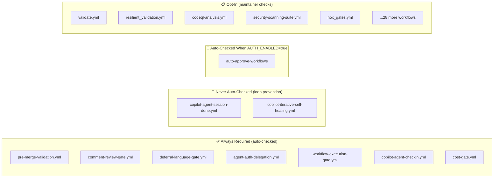
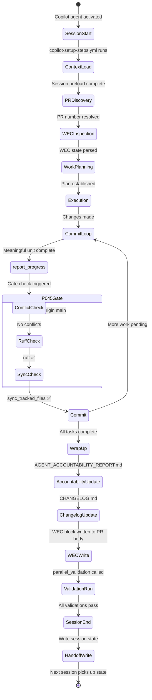
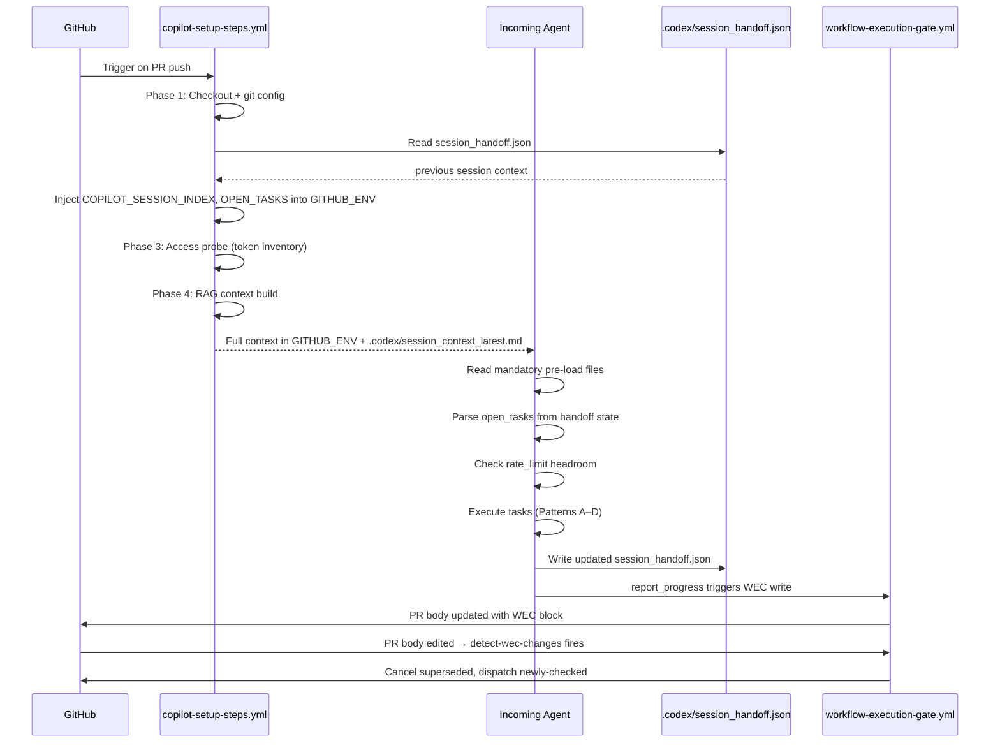
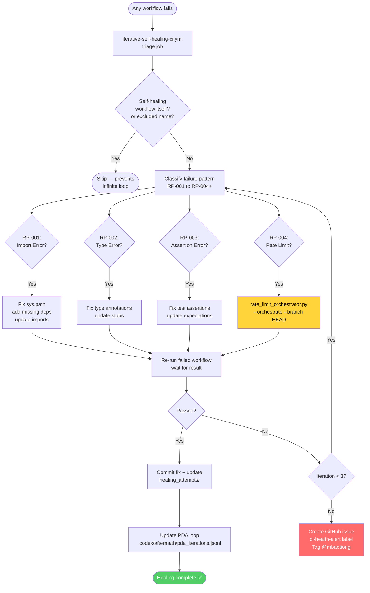
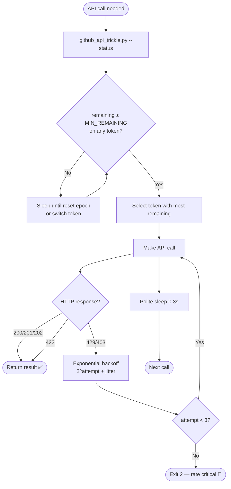

# Copilot Cloud Agent — Session Handoff & WEC Autonomy Design

> **Document:** `docs/plans/COPILOT_SESSION_HANDOFF_DESIGN.md`  
> **Status:** ✅ Living document — updated 2026-05-08  
> **Scope:** Session continuity, WEC self-management, autonomous self-healing for GitHub Copilot Cloud Agent / Copilot Coding Agent

---

## Table of Contents

1. [Problem Statement](#1-problem-statement)
2. [Environment Config Audit](#2-environment-config-audit-copilot-setup-stepsyml)
3. [Full WEC Autonomy Flow](#3-full-wec-autonomy-flow)
4. [Session Handoff Protocol](#4-session-handoff-protocol)
5. [Self-Healing Loop Architecture](#5-self-healing-loop-architecture)
6. [Rate-Limit Orchestration](#6-rate-limit-orchestration)
7. [Known Gaps & Improvement Plan](#7-known-gaps--improvement-plan)
8. [Invariant Verification Matrix](#8-invariant-verification-matrix)

---

## 1. Problem Statement

Every Copilot Cloud Agent session starts from a **cold clone** with no memory of prior work.
Without an explicit handoff mechanism, agents must re-discover:
- Which PR they are working on
- What the WEC state is
- What CI failures need healing
- What rate-limit headroom is available
- Where the previous session left off

The goal is a **zero-RTT context injection** system that gives the incoming agent full situational awareness within the first 60 seconds of environment setup.

---

## 2. Environment Config Audit — `copilot-setup-steps.yml`

### Current Setup Phases

| Phase | Step | Description | Failure Mode |
|-------|------|-------------|--------------|
| 1 | Checkout | Full-depth clone, no LFS | LFS blobs missing |
| 2 | 🧠 Session Preload | Reads AGENTIC_REPO_STATE, policy, accountability, PDA loop | Script error (non-blocking) |
| 3 | 🔌 Access Probe | Discovers tokens, rate limits, writes manifest | Token exhaustion |
| 4 | 🧠 RAG Context | Builds PR context from FAISS + GitHub API | API rate limit |
| 5 | Git config | Non-interactive editor, no merge conflict hints | — |
| 6 | Branch refs | Fetch all remote refs, promote main + base | Shallow clone |
| 7 | Merge conflict pre-check | §0.4 check — CONFLICTING / MERGEABLE / UNKNOWN | Git error |
| 8 | CI failure issues | List open `ci-failure` + `ci-health-alert` issues | Token scope |
| 9 | JSON validation | Validate all `.codex/` and `docs/` JSON files | Malformed JSON |
| 10 | Agent context inject | Read `agent_context.json`, write to `GITHUB_ENV` | Missing file |
| 11 | Cascade-control vars | Inject live `CODEX_*` tuning vars | Missing vars |
| 12 | safe-git-show | Install path guard | Missing script |
| 13 | Env type detection | Auto-detect (ml/security/docs/standard) | — |
| 14 | Runner adequacy | AAIS Pillar 3 check | Runner unavailable |

### Identified Gaps

| Gap | Severity | Impact | Fix |
|-----|----------|--------|-----|
| **No WEC state injection** | High | Agent must re-parse PR body from scratch | Inject `wec_state.json` → `GITHUB_ENV` |
| **No rate-limit cap enforcement** | High | Cascade of workflows exhausts API quota | Call `rate_limit_orchestrator.py --orchestrate` at setup |
| **No session handoff token** | Medium | No way for agent to know "session N of M" | Write `COPILOT_SESSION_CHAIN_INDEX` to env |
| **Access probe is non-blocking but silent** | Medium | Agent doesn't know which methods failed | Emit `::notice` annotations per method |
| **No workflow deduplication at setup** | Medium | Multiple setup runs from rapid pushes waste runners | Add dedup step before expensive installs |
| **RAG context build can silently fail** | Low | Agent works with stale context | Add fallback to read `.codex/session_context_latest.md` |

---

## 3. Full WEC Autonomy Flow

```mermaid
flowchart TD
    A([Agent Push / PR Edit]) --> B{PR body edited?}
    B -- Yes --> C[workflow-execution-gate.yml\ndetect-wec-changes job]
    B -- No --> D[Normal CI triggers\nno WEC diff]

    C --> E{Has changes?}
    E -- No --> F([No action needed])
    E -- Yes --> G[Parse BODY_BEFORE vs BODY_AFTER\nwec_enforcer.py --detect-changes]

    G --> H{newly_unchecked?}
    G --> I{newly_checked?}

    H -- Yes --> J[cancel-unchecked job\nwec_enforcer.py --cancel-unchecked]
    J --> J1[Cancel in-progress runs\nfor each unchecked workflow]
    J --> J2{Was auto-approve\nunchecked by bot?}
    J2 -- Yes --> J3[Restore [x] in PR body\nbot-reset protection]
    J2 -- Owner unchecked --> J4[Remove wec:auto-approve label]

    I -- Yes --> K[dispatch-checked job\nwec_enforcer.py --dispatch-checked]
    K --> K1[POST /actions/workflows/\nFILENAME/dispatches]
    K1 --> K2[Poll for action_required state\n45s timeout]
    K2 --> K3[POST /runs/ID/approve\nauto-approve immediately]

    D --> L[Always-required workflows fire\npre-merge, comment-gate, deferral-gate\nagent-auth-delegation, cost-gate]
    L --> M{COPILOT_AGENT_AUTH_ENABLED?}
    M -- true --> N[auto-approve-workflows\nchecked automatically]
    M -- false --> O[Human must approve\naction_required runs]

    style J fill:#ff6b6b,color:#fff
    style K fill:#51cf66,color:#fff
    style N fill:#339af0,color:#fff
```

### WEC Item Classification



---

## 4. Session Handoff Protocol

### Handoff State Machine



### Handoff State File Schema (`.codex/session_handoff.json`)

```json
{
  "session_id": "2c80b213-36c7-43ae-bd61-b30110aabca3",
  "session_index": 7,
  "pr_number": 4351,
  "branch": "copilot/fix-webhook-receiver-url-format",
  "last_commit_sha": "f25996a",
  "timestamp": "2026-05-08T07:15:00Z",
  "wec_state": {
    "pre-merge-validation.yml": "checked",
    "comment-review-gate.yml": "checked",
    "auto-approve-workflows": "checked"
  },
  "open_tasks": [
    "Rate-limit orchestration — implement mermaid diagram",
    "WEC self-healing test"
  ],
  "ci_health": {
    "open_ci_failures": 0,
    "open_health_alerts": 0,
    "last_green_sha": "8277069"
  },
  "rate_limit": {
    "tokens_ok": 2,
    "tokens_critical": 0,
    "master_key_remaining": 4230
  }
}
```

### Handoff Sequence for Incoming Agent



---

## 5. Self-Healing Loop Architecture



### Self-Healing Loop Guards (Excluded Workflow Names)

The triage job's `if:` condition explicitly excludes these to break recursion:

```
iterative-self-healing-ci.yml   (itself)
copilot-iterative-self-healing.yml
CI Rescue — Auto-Fix & @copilot RCA
Cognitive Brain CI Feedback
Cognitive Action & Decision (Unified)
Cognitive Analysis & Learning (Unified)
Agent Variable Writer (Provenance-Chain)
Token Probe
Agent Vars Bootstrap
CODEX Manifest Auto-Refresh
PR Comment Review Gate
Agent Token Delegation
🔄 Auto-Post @copilot review After Agent Session
🤖 Agent Check-In — Q&A Bridge
```

---

## 6. Rate-Limit Orchestration

### Rate-Limit Decision Tree



### Workflow Deduplication Decision

```mermaid
flowchart LR
    PUSH([New push to branch]) --> LIST[List in-progress runs\nfor each cancellable workflow]
    LIST --> COUNT{runs > 1?}
    COUNT -- No --> KEEP([Keep single run ✅])
    COUNT -- Yes --> SORT[Sort by run_number DESC\nnewers = higher number]
    SORT --> KEEP1[Keep run[0]\nnewist run]
    SORT --> CANCEL[Cancel run[1..N]\nPOST /runs/ID/cancel]
    CANCEL --> LOG[Log to .codex/\nhealing_attempts/]
```

---

## 7. Known Gaps & Improvement Plan

### Gap A — WEC State Not Injected at Session Start

**Problem:** Agent must re-parse PR body via API call (costs rate limit, slow).  
**Fix:** Add setup step to read `.codex/wec_state.json` and write `WEC_*` env vars.

```yaml
# Add to copilot-setup-steps.yml after "Inject repo variable context" step:
- name: "📋 Inject WEC state for agent"
  run: |
    if [ -f .codex/wec_state.json ]; then
      python3 -c "
import json, os
state = json.load(open('.codex/wec_state.json'))
with open(os.environ['GITHUB_ENV'], 'a') as f:
    f.write(f'WEC_LAST_PR={state.get(\"pr_number\", \"\")}\n')
    f.write(f'WEC_CHECKED_COUNT={len(state.get(\"checked\", []))}\n')
print('✅ WEC state injected')
"
    fi
```

### Gap B — No Rate-Limit Orchestration at Setup

**Problem:** Agent starts work while dozens of redundant workflows are consuming API quota.  
**Fix:** Add orchestration step early in setup.

```yaml
# Add to copilot-setup-steps.yml before Python installs:
- name: "⚡ Rate-limit orchestration (dedup + cap)"
  continue-on-error: true
  env:
    GH_TOKEN: ${{ secrets.CODEX_MASTER_KEY || secrets.CODEX_BACKUP_KEY || github.token }}
    REPO: ${{ github.repository }}
  run: |
    if [ -f scripts/ci/rate_limit_orchestrator.py ]; then
      python3 scripts/ci/rate_limit_orchestrator.py \
        --orchestrate \
        --branch "${{ github.head_ref }}" \
        --max-concurrent 6 \
        --dry-run  # Remove --dry-run when COPILOT_AGENT_AUTH_ENABLED=true
      echo "✅ Rate-limit orchestration complete"
    fi
```

### Gap C — No Session Chain Index

**Problem:** No way to know "this is session 7 of this PR".  
**Fix:** Read/increment `.codex/session_handoff.json` → `COPILOT_SESSION_INDEX`.

### Gap D — Silent Access Probe Failures

**Problem:** When `session_access_probe.py` fails, agent doesn't know which API methods are down.  
**Fix:** Emit `::notice` or `::warning` GitHub annotations per method so they appear in the setup log.

---

## 8. Invariant Verification Matrix

These invariants are verified at module load by `session_wrapup_autofix.py`:

| Invariant | Formula | Verified? |
|-----------|---------|-----------|
| Never-check workflows never in merge-required | `_WEC_NEVER_CHECK ∩ _MERGE_REQUIRED_WORKFLOWS = ∅` | ✅ |
| Always-required never in never-check | `_WEC_ALWAYS_REQUIRED ∩ _WEC_NEVER_CHECK = ∅` | ✅ |
| Autonomous auto-check not in never-check | `_WEC_AUTONOMOUS_AUTO_CHECK ∩ _WEC_NEVER_CHECK = ∅` | ✅ |
| All merge-required items exist in WEC_ITEMS | `_MERGE_REQUIRED_WORKFLOWS ⊆ {fname for fname,_,_ in _WEC_ITEMS}` | ✅ |
| Protected workflows not cancellable by orchestrator | `_PROTECTED_WORKFLOWS ∩ _DEDUP_WORKFLOWS = ∅` | ✅ |

---

## Appendix: Quick Reference — Session Start Checklist for Agents

```
□ 1. Read .codex/AGENTIC_REPO_STATE.md           → confirms auth is active
□ 2. Read .codex/CODEBASE_AGENCY_POLICY.md       → mandatory rules
□ 3. Read docs/accountability/AGENT_ACCOUNTABILITY_REPORT.md → last session state
□ 4. Read .codex/session_handoff.json            → open tasks + WEC + rate limits
□ 5. Read .codex/session_context_latest.md       → RAG-built PR context
□ 6. Check COPILOT_MERGE_CONFLICT env var         → resolve conflicts first if true
□ 7. Check COPILOT_CI_FAILURE_ISSUES env var      → review open CI failure issues
□ 8. Call rate_limit_orchestrator.py --status     → know remaining headroom
□ 9. Parse WEC from PR body (or wec_state.json)  → know which workflows are armed
□ 10. Begin task execution with P-045 gate in mind → no turn without clean state
```

---

*Document maintained by the Copilot Cloud Agent session management system.*  
*Last verified: 2026-05-08 | WEC items: 41 | Invariants: 5/5 ✅*
