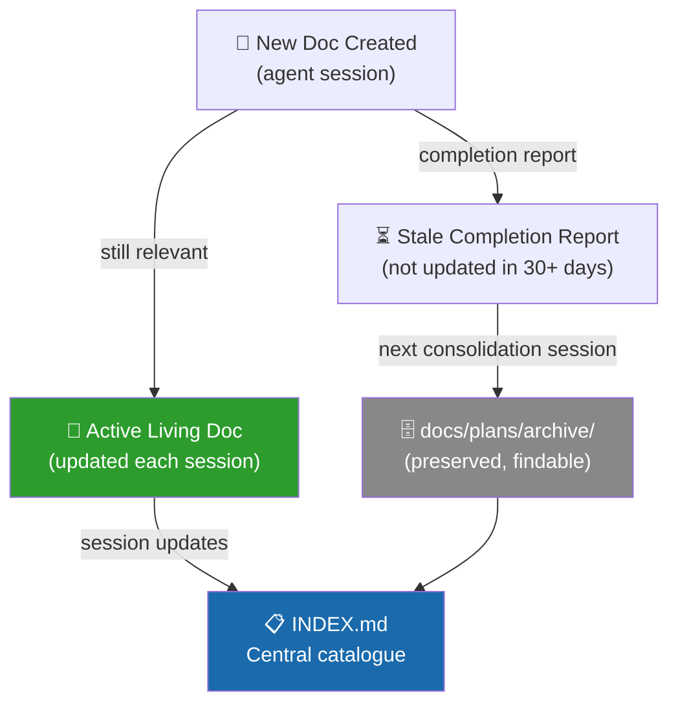

# Documentation Consolidation Map

> **Created:** 2026-05-08 S868 | **Updated:** 2026-05-08 S873
> **Purpose:** Catalogue all `docs/plans/` files (81 total at creation → 50 active after S870 archive sweep).
> identify stale/duplicate/merge candidates, and protect active living docs.
> **Policy:** Stale docs move to `docs/plans/archive/` — never deleted, always findable.

---

## 📊 Summary

| Category | Count | Action | Status |
|----------|-------|--------|--------|
| Active living docs | 18 | Keep — update regularly | ✅ Current |
| PR what's-next docs | 8 | Keep — one per active/recent PR | ✅ Current |
| Archive candidates (PHASE0/1/2 completion reports) | 28 originally · **31 moved** | `docs/plans/archive/` | ✅ **Done S870** (3 more identified at execution) |
| Merge candidates (near-duplicate CI/ops docs) | 5 | Merge → single canonical doc | ⏳ Next session |
| Retain as-is (design docs, guides, runbooks) | 19 | Keep — still relevant | ✅ Current |

---

## ✅ Active Living Docs (DO NOT ARCHIVE)

| File | Owner | Last Updated |
|------|-------|-------------|
| `PLAN_STATUS_DASHBOARD.md` | Agent | S868 |
| `COGNITIVE_BRAIN_UNIFIED_IMPLEMENTATION_TASKS.md` | Agent | S868 |
| `AUTONOMOUS_PRIVILEGE_ARCHITECTURE.md` | Agent (S867) | S868 |
| `COPILOT_SESSION_HANDOFF_DESIGN.md` | Agent (S867) | S868 |
| `PR4356_whats_next.md` | Agent (S867/S868) | S868 |
| `PR4356_session_diagram.md` | Agent (S867/S868) | S868 |
| `PR4351_whats_next.md` | Agent (S866) | S866 |
| `PR4346_whats_next.md` | Agent (S862) | S862 |
| `PR4343_whats_next.md` | Agent | — |
| `PR4344_whats_next.md` | Agent | — |
| `PR4323_whats_next.md` | Agent | — |
| `PR4317_whats_next.md` | Agent | — |
| `PR4289_whats_next.md` | Agent | — |
| `COVERAGE_IMPROVEMENT_ROADMAP.md` | Agent | — |
| `AGENT_CONTINUATION_PROMPT.md` | Agent | — |
| `AUTONOMOUS_SELF_HEALING_PROPOSAL_S182.md` | Agent | — |
| `SPRINT_PLAN_PHASE_13_1.md` | Agent | — |
| `INDEX.md` | Agent | needs S868 update |

---

## 🗄️ Archive Candidates (PHASE0/1/2 completion docs)

> These are historical completion reports. Completed work is permanent — these docs are
> preserved for audit purposes in `docs/plans/archive/`.

```
PHASE0_READINESS_REPORT.md
PHASE0_IMPLEMENTATION_ASSESSMENT.md
AST_PHASE0_COMPLETION_GUIDE.md
Phase0_ExecutiveDashboard.md
Phase0_Gap_Resolution_Guide.md
PHASE1_COMPLETION_REPORT.md
PHASE2_BATCHES_4-12_COMPLETION_SUMMARY.md
PHASE2_CICD_ANALYSIS_REMEDIATION.md
PHASE2_COMPLETE_ACHIEVEMENT_REPORT.md
PHASE2_COMPLETE_SESSION_SUMMARY_FINAL.md
PHASE2_CYCLE2_COMPLETE.md
PHASE2_CYCLE2_ITERATION1_COMPLETE.md
PHASE2_CYCLE3_9ITERATIONS_COMPLETE.md
PHASE2_CYCLE3_COMPLETE_SESSION_SUMMARY.md
PHASE2_CYCLE3_ITERATION1_STATUS.md
PHASE2_CYCLE3_ITERATION2_STATUS.md
PHASE2_DEEP_COVERAGE_PLAYBOOK.md
PHASE2_EXCEPTIONAL_PROGRESS_REPORT.md
PHASE2_EXPANSION_BATCHES_STATUS.md
PHASE2_FINAL_COMPREHENSIVE_REPORT.md
PHASE2_FINAL_STATUS_AND_ROADMAP.md
PHASE2_FINAL_WORK_SUMMARY.md
PHASE2_REMEDIATION_CYCLE1_COMPLETE.md
PHASE2_SESSION_COMPLETE_FINAL_SUMMARY.md
PHASE2_SESSION_LESSONS_LEARNED.md
PHASE2_SESSION_NOTES_COMPLETE.md
PHASE2_VERIFICATION_GAP_ANALYSIS.md
PHASE2_VERIFICATION_STATUS_CYCLE1.md
MISSION_COMPLETE.md
FINAL_COMPREHENSIVE_STATUS.md
COMPREHENSIVE_PLAN_VERIFICATION.md
MILESTONE_30_PERCENT_COVERAGE_ACHIEVED.md
```

**Archive command (next session):**
```bash
mkdir -p docs/plans/archive
git mv docs/plans/PHASE0_* docs/plans/archive/
git mv docs/plans/PHASE1_* docs/plans/archive/
git mv docs/plans/PHASE2_* docs/plans/archive/
git mv docs/plans/MISSION_COMPLETE.md docs/plans/archive/
git mv docs/plans/FINAL_COMPREHENSIVE_STATUS.md docs/plans/archive/
git mv docs/plans/COMPREHENSIVE_PLAN_VERIFICATION.md docs/plans/archive/
git mv docs/plans/MILESTONE_30_PERCENT_COVERAGE_ACHIEVED.md docs/plans/archive/
```

---

## 🔀 Merge Candidates (near-duplicates)

| Files to Merge | Target | Overlap |
|----------------|--------|---------|
| `batchset.md` + `patchset.md` | `copilot-workflow-agent/01-BATCHSET.md` | Batch/patch tracking |
| `ci_failures_resolution_plan.md` + `fix_falied_workflows_2025-12-22.md` | Merge → `CI_FAILURES_RESOLUTION.md` | CI failure history |
| `Agentic_AI_System/soft_to_GROUNDED.md` + `Agentic_AI_System/READINESS_AUDIT_ANALYSIS.md` | Keep in sub-dir, add to INDEX | Agentic system readiness |

---

## 🗂️ Retain As-Is (Design docs, guides, runbooks)

| File | Purpose |
|------|---------|
| `operational_runbook.md` | Ops runbook |
| `AST_ARCHITECTURE_DESIGN.md` | AST design |
| `AST_ENGINEERING_PROJECT_GUIDE.md` | AST guide |
| `AST_IMPLEMENTATION_ROADMAP.md` | AST roadmap |
| `AST_TEST_STRATEGY.md` | AST testing |
| `AST_DEPENDENCY_REQUIREMENTS.md` | AST deps |
| `AST_COMMON_IMPLEMENTATION_PATTERNS.md` | AST patterns |
| `AST_BLOCKERS_DEEPRESEARCH_COMPREHENSIVE.md` | AST blockers |
| `COGNITIVE_BRAIN_UNIFIED_IMPLEMENTATION_TASKS.md` | CB tasks (active) |
| `Test_Execution_Guide.md` | Test guide |
| `Test_Suite_Validation_Report.md` | Test validation |
| `deep_research_analysis.md` | Research |
| `larger-runners-upgrade.md` | Runner upgrade plan |
| `webhook-identification.md` | Webhook ref |
| `copilot-directives-to-implementation-plan.md` | Copilot directives |
| `Physics_*.md` (5 files) | Physics coverage docs |
| `copilot-workflow-agent/` (6 files) | Workflow agent docs |
| `MSP_Audit_Gap_Remediation_*.md` (2 files) | MSP audit |

---

## 🔗 Mermaid: Docs Lifecycle


