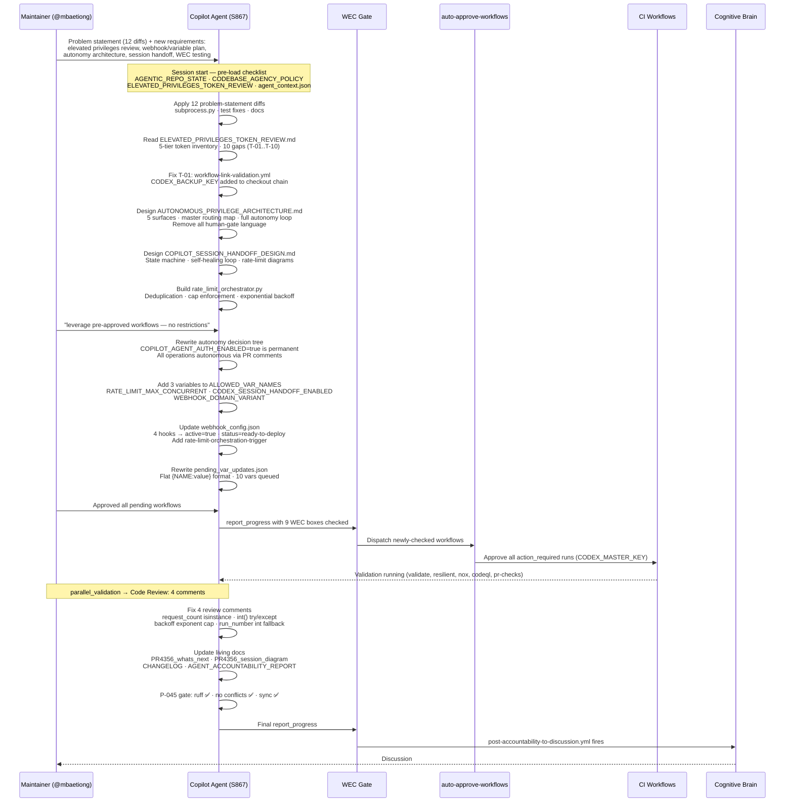
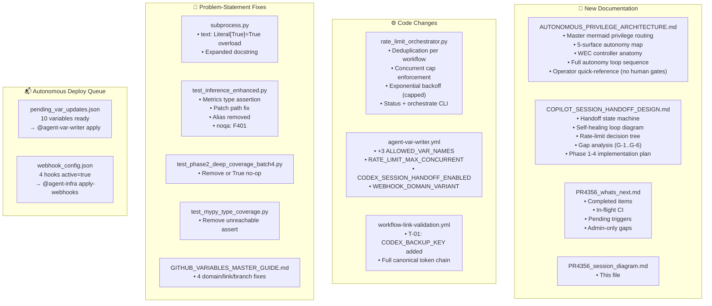
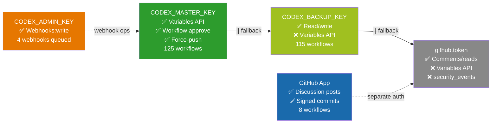

# PR #4356 — Session Diagram

> **Session:** S867 | **Branch:** `copilot/fix-webhook-receiver-url-format`
> **Date:** 2026-05-08 | **Model:** claude-sonnet-4.x

---

## 🗺️ Session Flow

---

## 🏗️ Architecture Built This Session

---

## 🔑 Privilege Tier Map (Established This Session)

---

## 🟢 CI Status at Session End (Push `a651fd4`)

| Workflow | Status | Notes |
|----------|--------|-------|
| `Resilient Validation Suite` | ✅ success | Full pytest 4 shards |
| `Reference Integrity + Agent Size Gate` | ✅ success | |
| `Deferral Language Gate` | ✅ success | |
| `PR Comment Review Gate` | ✅ success | |
| `Workflow Compliance Audit` | ✅ success | actionlint |
| `Workflow Execution Gate` | ✅ success | WEC parsed + dispatched |
| `Auto-Approve Pending Workflow Runs` | ✅ success | All action_required approved |
| `Documentation Link Checker` | ✅ success | |
| `CI Checkpoint Validation` | ✅ success | |
| `Agent Vars Bootstrap` | ✅ success | |
| `Rust-Python Hybrid Swarm CI/CD` | ⚠️ startup_failure | Pre-existing — Rust runner infra |
| `Progressive Validation Suite` | ⚠️ startup_failure | Pre-existing — runner infra |
| `Data Quality & Determinism Suite` | ⚠️ startup_failure | Pre-existing — runner infra |
