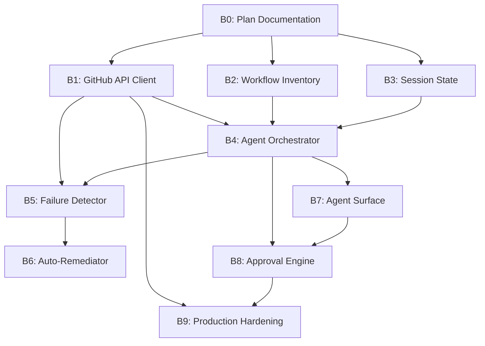

# Copilot Workflow Agent - Batchset Plan

> Generated: 2024-12-16 | Version: 1.0.0  
> Purpose: Work batches for iterative implementation with acceptance criteria

## Batch Overview

| Batch | Name | Phase | Status | Checkpoint |
|-------|------|-------|--------|------------|
| B0 | Plan Documentation | 0 | ✅ COMPLETE | `B0-COMPLETE` |
| B1 | GitHub API Client | 1 | ✅ COMPLETE | `B1-COMPLETE` |
| B2 | Workflow Inventory | 1 | 🔜 PENDING | `B2-COMPLETE` |
| B3 | Session State | 1 | 🔜 PENDING | `B3-COMPLETE` |
| B4 | Agent Orchestrator | 1 | 🔜 PENDING | `B4-COMPLETE` |
| B5 | Failure Detector | 2 | 🔜 PENDING | `B5-COMPLETE` |
| B6 | Auto-Remediator | 2 | 🔜 PENDING | `B6-COMPLETE` |
| B7 | Agent Surface | 3 | 🔜 PENDING | `B7-COMPLETE` |
| B8 | Approval Engine | 3 | 🔜 PENDING | `B8-COMPLETE` |
| B9 | Production Hardening | 4 | 🔜 PENDING | `B9-COMPLETE` |

---

## B0 — Plan Documentation

**Status**: ⏳ IN PROGRESS  
**Checkpoint**: `B0-COMPLETE`

### Missing Files
- `docs/plans/copilot-workflow-agent/README.md` ✅
- `docs/plans/copilot-workflow-agent/00-PLANSET.md` ✅
- `docs/plans/copilot-workflow-agent/01-BATCHSET.md` ⏳
- `docs/plans/copilot-workflow-agent/02-PATCHSET.md` 🔜
- `docs/plans/copilot-workflow-agent/03-ARCHITECTURE.md` 🔜
- `docs/plans/copilot-workflow-agent/08-CHECKPOINTS.md` 🔜
- `docs/plans/copilot-workflow-agent/09-CONTINUATION-PROMPTS.md` 🔜

### Prompt
> Create comprehensive plan documentation for the Copilot Workflow Agent including master planset, work batches, patch prompts, architecture design, checkpoint system, and continuation prompts. Follow existing batchset/patchset patterns in docs/plans/.

### Acceptance Criteria
- [ ] All plan files created and linked
- [ ] Architecture aligned with existing services
- [ ] Checkpoints defined for each phase
- [ ] Continuation prompts ready for use

### Verification
```bash
ls -la docs/plans/copilot-workflow-agent/
# Expect: README.md, 00-PLANSET.md, 01-BATCHSET.md, 02-PATCHSET.md, etc.
```

---

## B1 — GitHub API Client

**Status**: ✅ COMPLETE  
**Checkpoint**: `B1-COMPLETE`  
**Dependencies**: B0

### Target Files
- `src/services/github/__init__.py` ✅
- `src/services/github/client.py` ✅
- `src/services/github/types.py` ✅
- `src/services/github/exceptions.py` ✅
- `tests/services/github/test_client.py` ✅

### Prompt
> Implement a GitHub API client wrapper with typed interfaces for workflow operations. Include methods for triggering workflows via workflow_dispatch, polling run status, retrieving job logs, and downloading artifacts. Use async/await, implement retry with exponential backoff, handle rate limits gracefully, and support both PAT and GitHub App authentication.

### Acceptance Criteria
- [ ] Async methods for all workflow operations
- [ ] Typed request/response models with Pydantic
- [ ] Exponential backoff retry logic
- [ ] Rate limit detection and handling
- [ ] Mock-friendly for testing
- [ ] Unit tests with >80% coverage

### Verification
```bash
# Type check
mypy src/services/github/

# Unit tests
pytest tests/services/github/ -v --cov=src/services/github

# Integration test (requires GITHUB_TOKEN)
python -c "
from src.services.github.client import GitHubClient
client = GitHubClient()
print(client.list_workflows('Aries-Serpent', '_codex_'))
"
```

---

## B2 — Workflow Inventory

**Status**: 🔜 PENDING  
**Checkpoint**: `B2-COMPLETE`  
**Dependencies**: B0

### Target Files
- `src/services/workflow/__init__.py`
- `src/services/workflow/inventory.py`
- `src/services/workflow/parser.py`
- `src/services/workflow/types.py`
- `tests/services/workflow/test_inventory.py`

### Prompt
> Build a workflow inventory system that scans .github/workflows/*.yml, parses YAML to extract metadata (name, triggers, inputs, jobs, dependencies), identifies workflow_dispatch-enabled workflows, and builds a dependency graph. Handle YAML edge cases (anchors, aliases, multi-document) and support incremental updates.

### Acceptance Criteria
- [ ] Scans all workflow files correctly
- [ ] Extracts all trigger types and inputs
- [ ] Identifies workflow dependencies
- [ ] Handles malformed YAML gracefully
- [ ] Caches parsed results
- [ ] Unit tests cover edge cases

### Verification
```bash
# Parse all workflows
python -c "
from src.services.workflow.inventory import WorkflowInventory
inv = WorkflowInventory('.github/workflows')
print(f'Found {len(inv.workflows)} workflows')
print(f'Triggerable: {len(inv.get_triggerable())}')
"

# Unit tests
pytest tests/services/workflow/ -v
```

---

## B3 — Session State

**Status**: 🔜 PENDING  
**Checkpoint**: `B3-COMPLETE`  
**Dependencies**: B0

### Target Files
- `src/services/session/__init__.py`
- `src/services/session/state.py`
- `src/services/session/storage.py`
- `src/services/session/types.py`
- `tests/services/session/test_state.py`

### Prompt
> Implement session state management for cross-session resumption. Store session ID, workflow runs, pending actions, artifacts, and checkpoints. Support file-based storage (.copilot/state/) with JSON serialization, atomic writes, and corruption recovery. Enable checkpoint save/restore for graceful resumption.

### Acceptance Criteria
- [ ] State models with Pydantic validation
- [ ] Atomic file writes (temp + rename)
- [ ] Corruption detection and recovery
- [ ] Checkpoint save and restore
- [ ] Session listing and cleanup
- [ ] Thread-safe operations

### Verification
```bash
# Create and restore session
python -c "
from src.services.session.state import SessionState
from src.services.session.storage import StateStorage

storage = StateStorage('.copilot/state')
state = SessionState.new()
state.add_checkpoint('TEST-1', {'note': 'test'})
storage.save(state)
restored = storage.load(state.session_id)
assert restored.checkpoints[0].id == 'TEST-1'
print('Session state works!')
"

# Unit tests
pytest tests/services/session/ -v
```

---

## B4 — Agent Orchestrator

**Status**: 🔜 PENDING  
**Checkpoint**: `B4-COMPLETE`  
**Dependencies**: B1, B2, B3

### Target Files
- `src/services/agent/__init__.py`
- `src/services/agent/orchestrator.py`
- `src/services/agent/actions.py`
- `src/services/agent/types.py`
- `tests/services/agent/test_orchestrator.py`

### Prompt
> Implement the agent orchestrator that coordinates workflow operations. Follow PLAN→ACT→OBSERVE→VERIFY pattern. Integrate GitHub client, workflow inventory, and session state. Handle action queueing, execution, result collection, and state updates. Support dry-run mode and action cancellation.

### Acceptance Criteria
- [ ] PLAN→ACT→OBSERVE→VERIFY flow
- [ ] Action queue with priorities
- [ ] Dry-run mode for previews
- [ ] Cancellation support
- [ ] State persistence after each action
- [ ] Comprehensive logging

### Verification
```bash
# Dry-run workflow trigger
python -c "
from src.services.agent.orchestrator import AgentOrchestrator
orch = AgentOrchestrator(dry_run=True)
result = orch.trigger_workflow('test-suite.yml', ref='main')
print(f'Dry-run result: {result}')
"

# Unit tests
pytest tests/services/agent/ -v
```

---

## B5 — Failure Detector

**Status**: 🔜 PENDING  
**Checkpoint**: `B5-COMPLETE`  
**Dependencies**: B1, B4

### Target Files
- `src/services/healing/__init__.py`
- `src/services/healing/detector.py`
- `src/services/healing/patterns.py`
- `src/services/healing/types.py`
- `tests/services/healing/test_detector.py`

### Prompt
> Build a failure detector that analyzes job logs to identify and classify failures. Define patterns for common failures (dependency, timeout, YAML, permission, etc.). Extract error context and suggested fixes. Support custom pattern registration and learning from historical failures.

### Acceptance Criteria
- [ ] Pattern matching for 10+ failure types
- [ ] Contextual error extraction
- [ ] Confidence scoring
- [ ] Historical pattern learning
- [ ] Extensible pattern registry
- [ ] Performance: <100ms per log

### Verification
```bash
# Test pattern matching
python -c "
from src.services.healing.detector import FailureDetector
detector = FailureDetector()

sample_log = '''
ERROR: No module named 'torch'
Traceback (most recent call last):
  File \"test.py\", line 1, in <module>
    import torch
ModuleNotFoundError: No module named 'torch'
'''
result = detector.analyze(sample_log)
print(f'Failure type: {result.failure_type}')
print(f'Confidence: {result.confidence}')
"

# Unit tests
pytest tests/services/healing/ -v
```

---

## B6 — Auto-Remediator

**Status**: 🔜 PENDING  
**Checkpoint**: `B6-COMPLETE`  
**Dependencies**: B5

### Target Files
- `src/services/healing/remediator.py`
- `src/services/healing/strategies.py`
- `src/services/healing/patches.py`
- `tests/services/healing/test_remediator.py`

### Prompt
> Implement auto-remediation for common failures. Define remediation strategies for each failure type. Generate patches (YAML, Python, config). Validate patches before application. Track remediation history and success rates. Support approval gates for risky fixes.

### Acceptance Criteria
- [ ] Remediation strategies for 10+ failure types
- [ ] Patch generation and validation
- [ ] Approval gate integration
- [ ] Success rate tracking
- [ ] Rollback support
- [ ] Audit logging

### Verification
```bash
# Test remediation
python -c "
from src.services.healing.detector import FailureDetector
from src.services.healing.remediator import AutoRemediator

detector = FailureDetector()
remediator = AutoRemediator()

failure = detector.analyze('No module named torch')
if remediator.can_remediate(failure):
    patch = remediator.generate_fix(failure)
    print(f'Generated patch: {patch}')
"

# Unit tests
pytest tests/services/healing/test_remediator.py -v
```

---

## B7 — Agent Surface

**Status**: 🔜 PENDING  
**Checkpoint**: `B7-COMPLETE`  
**Dependencies**: B4

### Target Files
- `src/services/agent/surface.py`
- `src/services/agent/previews.py`
- `src/services/agent/displays.py`
- `tests/services/agent/test_surface.py`

### Prompt
> Create the agent surface layer for web UI integration. Implement workflow previews showing what will happen before triggering. Display run progress and results. Format error messages with context and suggestions. Support markdown and rich formatting.

### Acceptance Criteria
- [ ] Workflow preview generation
- [ ] Progress display updates
- [ ] Result formatting (success/failure)
- [ ] Error context display
- [ ] Markdown/rich output
- [ ] Responsive updates

### Verification
```bash
# Test preview generation
python -c "
from src.services.agent.surface import AgentSurface
surface = AgentSurface()
preview = surface.preview_workflow('test-suite.yml', inputs={'test_type': 'unit'})
print(preview.as_markdown())
"

# Unit tests
pytest tests/services/agent/test_surface.py -v
```

---

## B8 — Approval Engine

**Status**: 🔜 PENDING  
**Checkpoint**: `B8-COMPLETE`  
**Dependencies**: B4, B7

### Target Files
- `src/services/agent/approval.py`
- `src/services/agent/policies.py`
- `tests/services/agent/test_approval.py`

### Prompt
> Implement approval workflows for high-risk actions. Define policies for what requires approval (production deploys, secret access, branch protection changes). Create approval request/response flow. Support timeout and escalation. Audit all approval decisions.

### Acceptance Criteria
- [ ] Policy-based approval rules
- [ ] Request/response workflow
- [ ] Timeout handling
- [ ] Escalation support
- [ ] Audit logging
- [ ] Policy hot-reload

### Verification
```bash
# Test approval flow
python -c "
from src.services.agent.approval import ApprovalEngine
from src.services.agent.actions import Action

engine = ApprovalEngine()
action = Action(type='deploy', target='production')
if engine.requires_approval(action):
    request = engine.create_request(action)
    print(f'Approval required: {request.reason}')
"

# Unit tests
pytest tests/services/agent/test_approval.py -v
```

---

## B9 — Production Hardening

**Status**: 🔜 PENDING  
**Checkpoint**: `B9-COMPLETE`  
**Dependencies**: B1-B8

### Target Files
- `src/services/telemetry/__init__.py`
- `src/services/telemetry/tracing.py`
- `src/services/limits/__init__.py`
- `src/services/limits/rate_limiter.py`
- `tests/services/test_production.py`

### Prompt
> Add production hardening features: OpenTelemetry tracing integration, rate limiting with token bucket, request quotas, circuit breakers, and graceful degradation. Ensure no secrets are logged, add request ID correlation, and implement health checks.

### Acceptance Criteria
- [ ] OTEL tracing on all operations
- [ ] Rate limiting with backoff
- [ ] Circuit breakers for external calls
- [ ] No secret logging
- [ ] Request ID correlation
- [ ] Health check endpoints

### Verification
```bash
# Check tracing
python -c "
from src.services.telemetry.tracing import setup_tracing
tracer = setup_tracing('test')
with tracer.start_span('test-span') as span:
    span.set_attribute('test', 'value')
    print('Tracing works!')
"

# Check rate limiting
python -c "
from src.services.limits.rate_limiter import RateLimiter
limiter = RateLimiter(requests_per_minute=60)
for i in range(5):
    limiter.acquire()
print('Rate limiting works!')
"

# Full test suite
pytest tests/services/ -v --cov
```

---

## Execution Order



---

## Quick Reference

### Start a Batch
```
@copilot Execute Batch B1 from docs/plans/copilot-workflow-agent/01-BATCHSET.md
```

### Check Batch Status
```
@copilot Show status of all batches in docs/plans/copilot-workflow-agent/01-BATCHSET.md
```

### Resume from Checkpoint
```
@copilot Resume from checkpoint B1-COMPLETE in docs/plans/copilot-workflow-agent/
```
