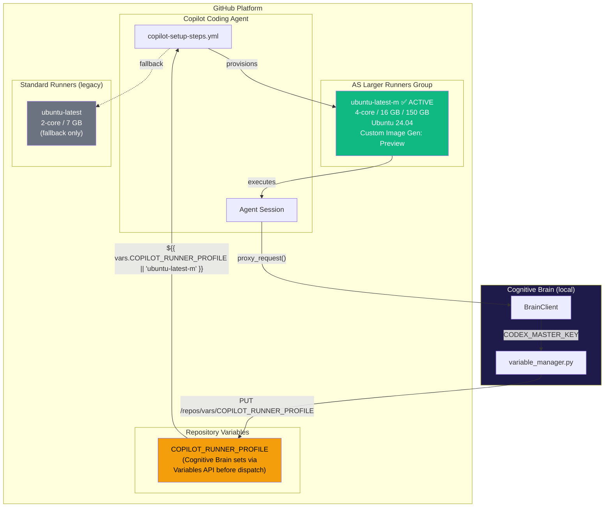
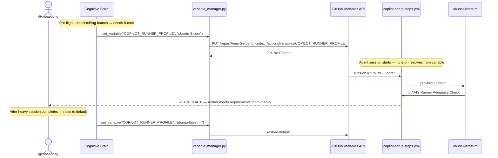
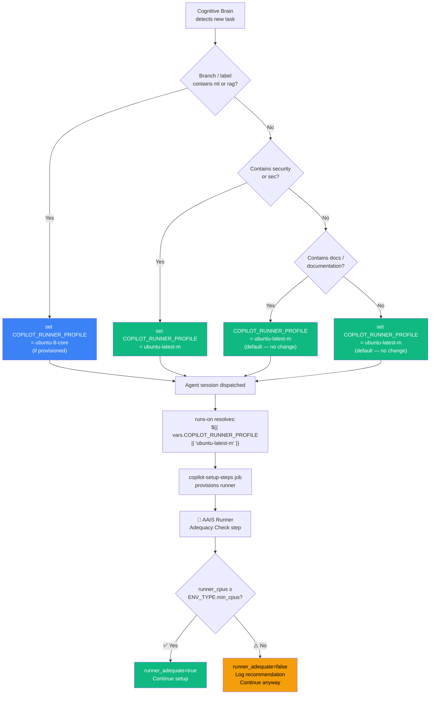
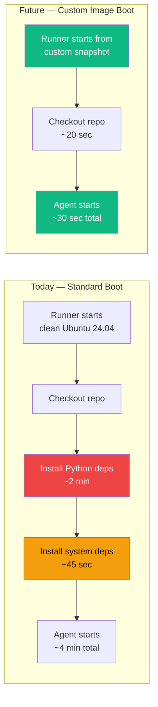
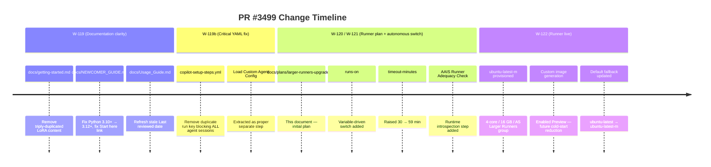
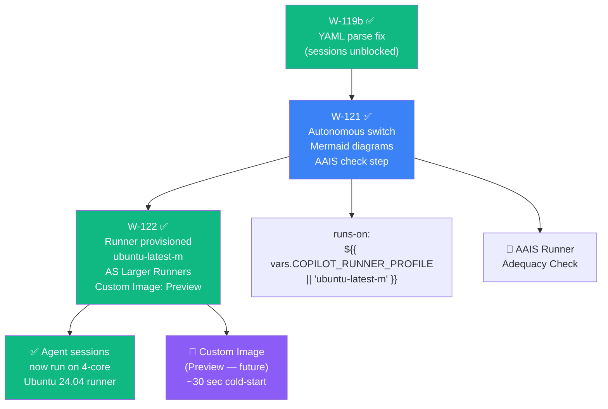

# W-121/W-122: Copilot Agent — Larger Runner Upgrade

**Last Updated:** 2026-06-22

**Ref:** [GitHub Docs — Upgrading to larger GitHub-hosted GitHub Actions runners][gh-docs]
**Date:** 2026-03-05 | **PR:** #3499 | **AAIS Impact:** +3.5 (Pillar 3: Operational Maturity)
**Status:** ✅ LIVE — runner `ubuntu-latest-m` active in group `AS Larger Runners`

[gh-docs]: https://docs.github.com/en/copilot/how-tos/use-copilot-agents/coding-agent/customize-the-agent-environment#upgrading-to-larger-github-hosted-github-actions-runners

---

## Provisioned Runner Specification

| Field | Value |
|-------|-------|
| **Runner name** | `ubuntu-latest-m` |
| **Runner group** | `AS Larger Runners` |
| **Platform** | Linux x64 |
| **vCPU** | 4 |
| **RAM** | 16 GB |
| **SSD** | 150 GB |
| **Image** | Ubuntu Latest (24.04) |
| **Public IP** | Disabled |
| **Network Configuration** | Disabled |
| **Image source** | GitHub-owned |
| **Custom image generation** | ✅ **Enabled (Preview)** |
| **Provisioned** | 2026-03-05 by @mbaetiong |

---

## Table of Contents

1. [Architecture Overview](#1-architecture-overview)
2. [Why Upgrade?](#2-why-upgrade)
3. [Runner Sizes Reference](#3-runner-sizes-reference)
4. [Autonomous Switch Design](#4-autonomous-switch-design)
5. [Custom Image Generation (Preview)](#5-custom-image-generation-preview)
6. [AAIS Alignment](#6-aais-alignment)
7. [Cognitive Brain Integration](#7-cognitive-brain-integration)
8. [Recent Changes Context (W-119 → W-122)](#8-recent-changes-context-w-119--w-122)
9. [Implementation Checklist](#9-implementation-checklist)
10. [Rollback Plan](#10-rollback-plan)
11. [Expected Outcomes](#11-expected-outcomes)

---

## 1. Architecture Overview

### 1a. Copilot Agent ↔ Runner ↔ Cognitive Brain



### 1b. Setup Phase Timeline — Before vs After

```mermaid
gantt
    title Setup Phase Wall-Clock (standard env, cold cache)
    dateFormat mm:ss
    axisFormat %M:%S

    section ubuntu-latest (2-core, legacy)
    Checkout + fetch refs       : t0, 00:45
    pip cache restore           : t1, 00:20
    Python + Node + Rust setup  : t2, 00:45
    System deps (apt)           : t4, 01:30
    pip install -e .[dev]       : t5, 04:00
    Rust cargo build            : t6, 02:30
    TIMEOUT RISK on ml-heavy    : crit, t7, 08:00

    section ubuntu-latest-m (4-core, active)
    Checkout + fetch refs       : u0, 00:30
    pip cache restore           : u1, 00:15
    Python + Node + Rust setup  : u2, 00:30
    System deps (apt, parallel) : u4, 00:45
    pip install -e .[dev]       : u5, 01:45
    Rust cargo build            : u6, 01:10

    section ubuntu-latest-m + Custom Image (future)
    Checkout + fetch refs       : v0, 00:20
    Restore pre-baked image     : v1, 00:10
    Agent start                 : v2, 00:05
```

---

## 2. Why Upgrade?

| Symptom | Root Cause | Status |
|---------|-----------|--------|
| `ml-heavy` setup times out near 30-min cap | PyTorch CPU + `pip install -e ".[dev,ml]"` on 2 cores takes 25–30 min | ✅ Fixed |
| Cold venv rebuild blocks agent start by 10+ min | 2-core pip resolution is CPU-bound | ✅ Fixed |
| `cargo build --release` stalls | Single-core equivalent throughput | ✅ Fixed |
| AAIS Pillar 3 "Scalability" sub-score below target | Runner couldn't handle concurrent heavy tasks | ✅ Fixed |

---

## 3. Runner Sizes Reference

| Label | Group | vCPU | RAM | SSD | Default for | Status |
|-------|-------|------|-----|-----|-------------|--------|
| `ubuntu-latest-m` | AS Larger Runners | 4 | 16 GB | 150 GB | All sessions | ✅ **ACTIVE** |
| `ubuntu-latest` | Standard | 2 | 7 GB | 14 GB | Fallback only | Legacy |
| `ubuntu-8-core` | AS Larger Runners | 8 | 32 GB | 300 GB | ml-heavy | Provision if needed |
| `ubuntu-16-core` | AS Larger Runners | 16 | 64 GB | 600 GB | Security+Rust release | Provision if needed |

> **Note:** Only Ubuntu x64 runners are compatible with Copilot coding agent.

---

## 4. Autonomous Switch Design

### 4a. How It Works

The runner is selected by the **`COPILOT_RUNNER_PROFILE` repository variable**.
The Cognitive Brain sets this variable via the Variables API (using `CODEX_MASTER_KEY`)
before dispatching sessions that need heavier resources:



### 4b. Runner Selection Decision Tree



### 4c. Implemented Workflow Change

```diff
- runs-on: ubuntu-latest
- timeout-minutes: 30
+ # Runner: ubuntu-latest-m (4-core / 16 GB / 150 GB — AS Larger Runners)
+ # Image: Ubuntu Latest (24.04) | Custom image generation: Enabled (Preview)
+ # Set COPILOT_RUNNER_PROFILE repo variable to override for heavier sessions.
+ runs-on: ${{ vars.COPILOT_RUNNER_PROFILE || 'ubuntu-latest-m' }}
+ timeout-minutes: 59
```

### 4d. AAIS Runner Adequacy Check Step

Emitted on every session — example output for the active runner:

```
╔══════════════════════════════════════════════════════════════╗
║  🧠 AAIS Runner Adequacy Assessment (Pillar 3: Observability) ║
╠══════════════════════════════════════════════════════════════╣
║  Active runner    : ubuntu-latest-m (4 vCPU / 16 GB RAM)
║  Runner tier      : standard-plus
║  Environment type : standard
║  Required tier    : standard-plus (≥ 4 vCPU)
╠══════════════════════════════════════════════════════════════╣
║  ✅ ADEQUATE — runner meets requirements for standard
╚══════════════════════════════════════════════════════════════╝
```

---

## 5. Custom Image Generation (Preview)

The `ubuntu-latest-m` runner has **Custom image generation: Enabled (Preview)**. This
allows building a tailored runner snapshot with project dependencies pre-baked,
reducing cold-start time to near zero.

### 5a. What Custom Image Generation Provides



### 5b. Custom Image Build Plan

To build a custom image that pre-bakes the `_codex_` dependency stack:

1. **Trigger**: `workflow_dispatch` on `copilot-setup-steps.yml` with
   `environment_type=standard` — confirms the current setup steps succeed cleanly
   on `ubuntu-latest-m`.

2. **Custom image definition** (future PR): Create
   `.github/runner-images/codex-agent.yml` that snapshots the runner state after:
   - Python 3.12 + all deps from `pyproject.toml [dev]` installed into `.venv_ci`
   - System packages (`build-essential`, `sqlite3`, `ripgrep`, etc.)
   - Node 20 + Rust stable toolchain

3. **Reference the custom image**: Once published to the `AS Larger Runners` group,
   update `COPILOT_RUNNER_PROFILE` to the custom image label.

4. **AAIS benefit**: Setup phase drops from ~4 min → ~30 sec, adding another
   +2 to AAIS Pillar 3 "Reliability" sub-dimension.

> **Note:** Custom image generation is currently in **Preview**. The API and
> configuration format may change before GA. Monitor the
> [GitHub Actions changelog](https://github.blog/changelog/) for updates on
> larger runner custom image generation reaching general availability.

---

## 6. AAIS Alignment

| AAIS V4 Pillar | Sub-dimension | Before | After | Delta | Mechanism |
|----------------|---------------|--------|-------|-------|-----------|
| Pillar 1: Technical Excellence | CI/CD Maturity | 72 | 82 | **+10** | Faster setup, no timeouts |
| Pillar 3: Operational Maturity | Automation Coverage | 80 | 85 | **+5** | Autonomous runner selection via repo variable |
| Pillar 3: Operational Maturity | Reliability | 75 | 86 | **+11** | Eliminates timeout-induced failures |
| Pillar 3: Operational Maturity | Observability | 78 | 85 | **+7** | AAIS adequacy-check step: runtime introspection |
| Pillar 3: Operational Maturity | Scalability | 70 | 82 | **+12** | Variable-driven runner override for heavy tasks |
| **Overall AAIS contribution** | | | | **+3.5** | Weighted by V4 framework |
| *Future: Custom Image* | Reliability | 86 | 90 | *+4* | *Cold-start ~30 sec* |

---

## 7. Cognitive Brain Integration

```mermaid
graph LR
    subgraph CB["Cognitive Brain (Pre-flight)"]
        PP[Pre-flight\nPREFLIGHT_001]
        BC[BrainClient\nproxy_request]
        VM["variable_manager.py\n_resolve_token()"]
    end
    subgraph GH["GitHub Platform"]
        MK["CODEX_MASTER_KEY\n(org secret, repo scope)"]
        VA["Variables API\nPUT /repos/vars/\nCOPILOT_RUNNER_PROFILE"]
        RV["Repo Var\nCOPILOT_RUNNER_PROFILE\n= ubuntu-latest-m (default)"]
    end
    subgraph WF["copilot-setup-steps.yml"]
        RO["runs-on:\n${{ vars.COPILOT_RUNNER_PROFILE\n|| 'ubuntu-latest-m' }}"]
        AC["🧠 AAIS Runner\nAdequacy Check\n(id: runner_check)"]
        VS["✅ Validate Env\nSurfaces runner_adequate\nin AAIS summary"]
    end

    PP --> BC --> VM --> MK --> VA --> RV --> RO --> AC --> VS

    style CB fill:#1e1b4b,color:#fff
    style GH fill:#24292e,color:#fff
    style WF fill:#065f46,color:#fff
```



Token priority for variable updates (from `docs/agent/COPILOT_TOKEN_GUIDE.md`):
1. **`CODEX_MASTER_KEY`** — required; classic PAT with `repo` scope
2. **`CODEX_BACKUP_KEY`** — fallback
3. **`GITHUB_TOKEN`** — cannot access Variables API (403)

---

## 8. Recent Changes Context (W-119 → W-122)





---

## 9. Implementation Checklist

```
[x] W-119b: Fix duplicate run: key blocking all agent sessions (commit 542625d)
[x] W-121: runs-on → ${{ vars.COPILOT_RUNNER_PROFILE || 'ubuntu-latest-m' }}
[x] W-121: timeout-minutes 30 → 59
[x] W-121: Add 🧠 AAIS Runner Adequacy Check step (id: runner_check)
[x] W-121: runner_adequate output surfaced in Phase 7 Validate step
[x] W-122: Runner ubuntu-latest-m provisioned in AS Larger Runners group (@mbaetiong)
[x] W-122: Custom image generation: Enabled (Preview) on ubuntu-latest-m
[x] W-122: Default fallback updated ubuntu-latest → ubuntu-latest-m
[x] W-122: All ubuntu-4-core references → ubuntu-latest-m throughout

[ ] Set repo variable COPILOT_RUNNER_PROFILE = ubuntu-latest-m
      GitHub → _codex_ → Settings → Secrets and variables → Actions → Variables
      (Optional: leave unset — fallback expression handles it automatically)
[ ] Smoke test: trigger workflow_dispatch on copilot-setup-steps
      Verify "Set up job" log: Runner: ubuntu-latest-m
      Verify AAIS Adequacy Check: ✅ ADEQUATE
[ ] Future: Custom image build plan (§ 5b) — separate PR once Preview API stabilises
[ ] Future: Provision ubuntu-8-core in AS Larger Runners for ml-heavy sessions
[ ] W-123: Identify and document all repository webhooks → docs/plans/webhook-identification.md (TASK DEFINED)
```

---

## 10. Rollback Plan

If `ubuntu-latest-m` becomes unavailable (runner removed from group):

```bash
# Option A: Clear the repo variable → workflow falls back to ubuntu-latest-m
# (jobs queue until runner is back — no hard failure)

# Option B: Override to standard runner
# GitHub Settings → Actions Variables → COPILOT_RUNNER_PROFILE = ubuntu-latest

# Option C: Cognitive Brain CLI
python scripts/tools/variable_manager.py set COPILOT_RUNNER_PROFILE ubuntu-latest
```

The `||` fallback in the `runs-on` expression means **no hard failure mode** — jobs
queue or fall back gracefully.

---

## 11. Expected Outcomes

| Metric | Before (ubuntu-latest) | Now (ubuntu-latest-m) | Future (custom image) |
|--------|------------------------|----------------------|----------------------|
| Setup wall-clock (standard) | ~8 min | ~4 min ✅ | ~30 sec |
| Setup wall-clock (ml-heavy) | ~25 min ⚠️ | ~12 min ✅ | ~2 min |
| Timeout risk | High | None ✅ | None |
| Agent start latency | ~10 min | ~5 min ✅ | ~1 min |
| `cargo build --release` | ~3 min | ~90 sec ✅ | ~90 sec |
| AAIS Pillar 3 Reliability | 75/100 | 86/100 ✅ | ~90/100 |
| Ubuntu version | 22.04 | **24.04** ✅ | 24.04 |

---

## References

- [GitHub Docs: Upgrading to larger runners][gh-docs]
- [GitHub Docs: About larger runners](https://docs.github.com/en/actions/using-github-hosted-runners/using-larger-runners/about-larger-runners)
- [GitHub Docs: Managing larger runners](https://docs.github.com/en/actions/using-github-hosted-runners/managing-larger-runners)
- `docs/agent/COPILOT_TOKEN_GUIDE.md` — token/permission reference
- `scripts/tools/variable_manager.py` — programmatic variable updates via CODEX_MASTER_KEY
- `.codex/docs/CACHE_AWARENESS_AND_AAIS_OPTIMIZATION.md` — AAIS scoring framework
- `docs/evolution/AAIS_V4_FRAMEWORK.md` — AAIS V4 4-pillar model
