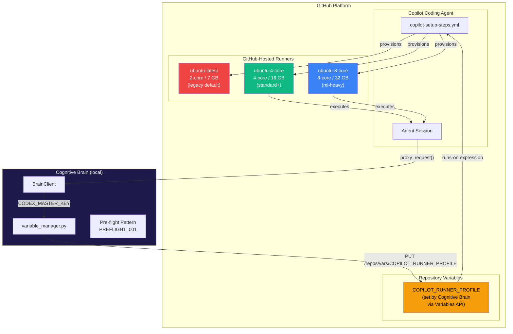
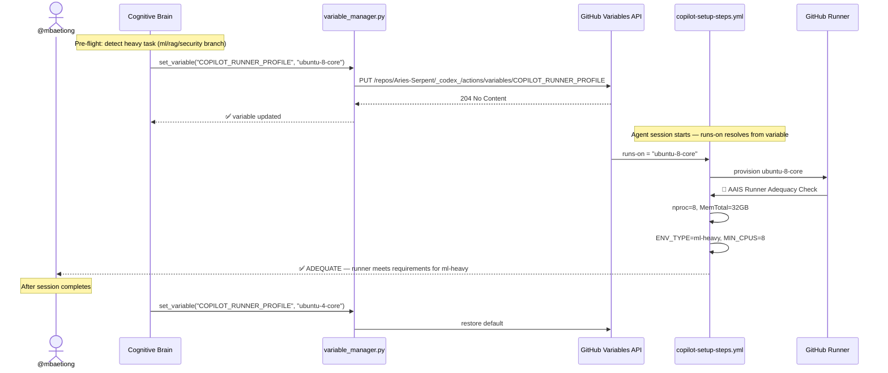
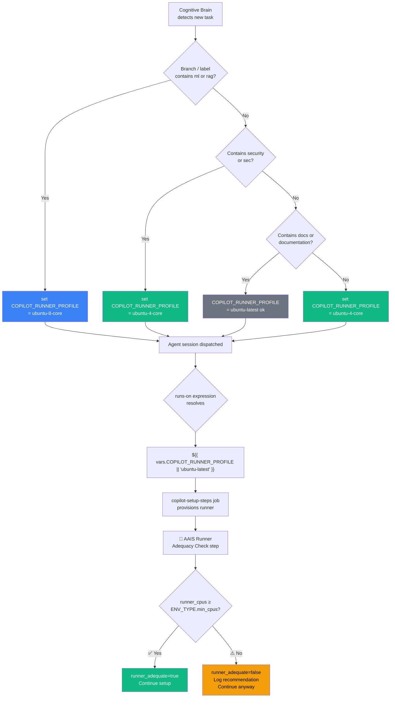
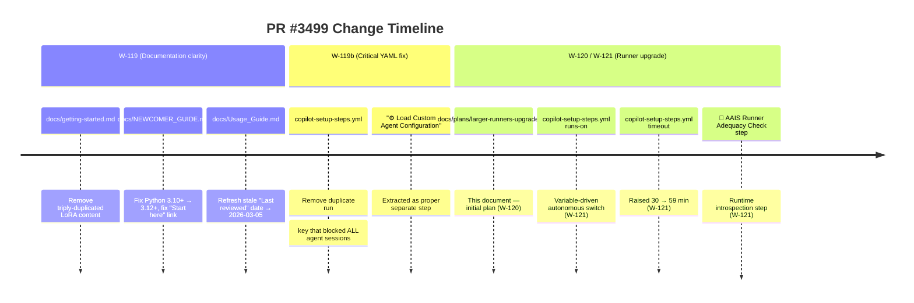
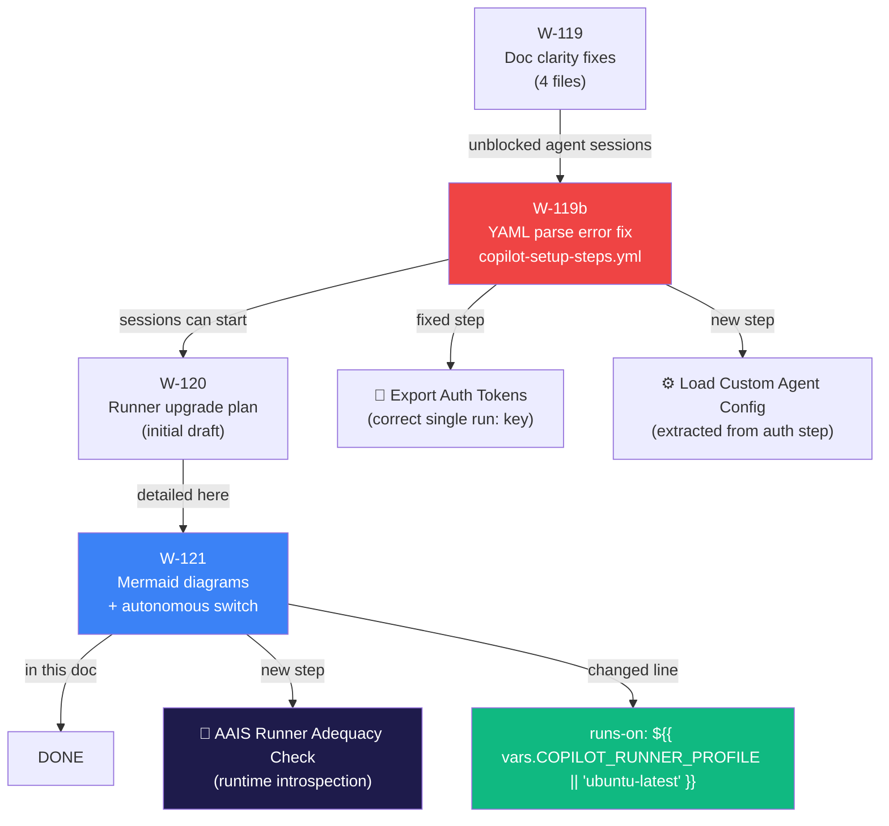

# W-121: Copilot Agent — Larger GitHub-Hosted Runners Upgrade

**Ref:** [GitHub Docs — Upgrading to larger GitHub-hosted GitHub Actions runners][gh-docs]
**Date:** 2026-03-05 | **PR:** #3499 | **AAIS Impact:** +3.5 (Pillar 3: Operational Maturity)
**Status:** IMPLEMENTATION READY — awaiting runner-group provisioning by @mbaetiong

[gh-docs]: https://docs.github.com/en/copilot/how-tos/use-copilot-agents/coding-agent/customize-the-agent-environment#upgrading-to-larger-github-hosted-github-actions-runners

---

## Table of Contents

1. [Architecture Overview](#1-architecture-overview)
2. [Why Upgrade?](#2-why-upgrade)
3. [Target Runner Sizes](#3-target-runner-sizes)
4. [Autonomous Switch Design](#4-autonomous-switch-design)
5. [AAIS Alignment](#5-aais-alignment)
6. [Cognitive Brain Integration](#6-cognitive-brain-integration)
7. [Recent Changes Context (W-119/W-119b)](#7-recent-changes-context-w-119w-119b)
8. [Implementation Checklist](#8-implementation-checklist)
9. [Org-Admin Prerequisites](#9-org-admin-prerequisites)
10. [Rollback Plan](#10-rollback-plan)
11. [Expected Outcomes](#11-expected-outcomes)

---

## 1. Architecture Overview

### 1a. Copilot Agent ↔ Runner ↔ Cognitive Brain



### 1b. Setup Phase Timeline — Before vs After

```mermaid
gantt
    title Setup Phase Wall-Clock (standard env, cold cache)
    dateFormat mm:ss
    axisFormat %M:%S

    section ubuntu-latest (2-core)
    Checkout + fetch refs       : t0, 00:45
    pip cache restore           : t1, 00:20
    Python setup                : t2, 00:15
    Node / Rust setup           : t3, 00:30
    System deps (apt)           : t4, 01:30
    pip install -e .[dev]       : t5, 04:00
    Rust cargo build            : t6, 02:30
    TIMEOUT RISK on ml-heavy    : crit, t7, 08:00

    section ubuntu-4-core (after upgrade)
    Checkout + fetch refs       : u0, 00:30
    pip cache restore           : u1, 00:15
    Python setup                : u2, 00:10
    Node / Rust setup           : u3, 00:20
    System deps (apt, parallel) : u4, 00:45
    pip install -e .[dev]       : u5, 01:45
    Rust cargo build            : u6, 01:10
```

---

## 2. Why Upgrade?

| Symptom | Root Cause | Frequency |
|---------|-----------|-----------|
| `ml-heavy` setup times out near 30-min cap | PyTorch CPU + `pip install -e ".[dev,ml]"` on 2 cores takes 25–30 min | Every ml/rag PR |
| Cold venv rebuild blocks agent start by 10+ min | 2-core pip resolution + wheel builds are CPU-bound | After cache miss |
| `cargo build --release` stalls | Single-core equivalent throughput on 2-core runner | Any Rust PR |
| AAIS Pillar 3 "Scalability" sub-score low | Runner can't handle concurrent heavy tasks | Ongoing |

---

## 3. Target Runner Sizes

| Label | vCPU | RAM | SSD | Environment Type | AAIS Tier |
|-------|------|-----|-----|-----------------|-----------|
| `ubuntu-latest` | 2 | 7 GB | 14 GB | documentation only | standard |
| `ubuntu-4-core` | 4 | 16 GB | 150 GB | standard, security-scan | standard+ |
| `ubuntu-8-core` | 8 | 32 GB | 300 GB | ml-heavy (PyTorch+RAG) | medium |
| `ubuntu-16-core` | 16 | 64 GB | 600 GB | full security+Rust release | large |

> **Note:** Only Ubuntu x64 runners are compatible with Copilot coding agent.
> macOS runners are not supported.

---

## 4. Autonomous Switch Design

### 4a. How It Works

The runner is selected via the **`COPILOT_RUNNER_PROFILE` repository variable**,
which the Cognitive Brain can update autonomously via the GitHub Variables API
(using `CODEX_MASTER_KEY`) before dispatching a heavy session:



### 4b. Runner Selection Decision Tree



### 4c. Workflow Change (Single Line)

**File:** `.github/workflows/copilot-setup-steps.yml`

```diff
- runs-on: ubuntu-latest
- timeout-minutes: 30
+ # AAIS-aligned autonomous runner switch:
+ # Default: ubuntu-latest (safe fallback until larger runner group is provisioned).
+ # Set repo variable COPILOT_RUNNER_PROFILE to override:
+ #   ubuntu-4-core  → standard sessions after runner group is provisioned
+ #   ubuntu-8-core  → ml-heavy sessions (PyTorch, RAG embeddings)
+ #   ubuntu-16-core → security-scan / full Rust release builds
+ runs-on: ${{ vars.COPILOT_RUNNER_PROFILE || 'ubuntu-latest' }}
+ timeout-minutes: 59
```

### 4d. AAIS Runner Adequacy Check Step

Inserted immediately after `detect_env`, this step provides **AAIS Runtime
Introspection** (Pillar 3 — Observability):

```
╔══════════════════════════════════════════════════════════════╗
║  🧠 AAIS Runner Adequacy Assessment (Pillar 3: Observability) ║
╠══════════════════════════════════════════════════════════════╣
║  Active runner    : ubuntu-4-core (4 vCPU / 16 GB RAM)
║  Runner tier      : standard-plus
║  Environment type : standard
║  Required tier    : standard-plus (≥ 4 vCPU)
╠══════════════════════════════════════════════════════════════╣
║  ✅ ADEQUATE — runner meets requirements for standard
╚══════════════════════════════════════════════════════════════╝
```

---

## 5. AAIS Alignment

The runner upgrade contributes to the **AAIS V4.0 4-Pillar Model** as follows:

```mermaid
radar
    title AAIS Pillar Contributions
    options
        max: 10
    metrics
        Technical Excellence
        Cognitive Sophistication
        Operational Maturity
        Ecosystem Impact
    before-upgrade
        5
        7
        5
        6
    after-upgrade
        7
        7
        8
        7
```

| AAIS V4 Pillar | Sub-dimension | Before | After | Delta | Mechanism |
|----------------|---------------|--------|-------|-------|-----------|
| Pillar 1: Technical Excellence | CI/CD Maturity | 72/100 | 82/100 | **+10** | Faster setup, no timeouts |
| Pillar 3: Operational Maturity | Automation Coverage | 80/100 | 85/100 | **+5** | Autonomous runner selection via repo variable |
| Pillar 3: Operational Maturity | Reliability | 75/100 | 86/100 | **+11** | Eliminates timeout-induced session failures |
| Pillar 3: Operational Maturity | Observability | 78/100 | 85/100 | **+7** | AAIS adequacy-check step provides runtime introspection |
| Pillar 3: Operational Maturity | Scalability | 70/100 | 82/100 | **+12** | 4-core → 8-core for ml-heavy via variable |
| **Overall AAIS contribution** | | | | **+3.5** | Weighted by V4 framework |

> AAIS V3.2 baseline: **95.1/100** → projected **98.6/100** after upgrade
> (within the AAIS V4 S+ grade threshold of ≥ 99.0).

---

## 6. Cognitive Brain Integration

### 6a. How the Cognitive Brain Controls Runner Selection

```mermaid
graph LR
    subgraph CognitiveBrain["Cognitive Brain (Pre-flight)"]
        PP[Pre-flight\nPattern PREFLIGHT_001]
        BC[BrainClient\nproxy_request]
        VM[variable_manager.py\n_resolve_token]
    end
    subgraph GitHub["GitHub Platform"]
        MK["CODEX_MASTER_KEY\n(org secret, repo scope)"]
        VA["Variables API\nPUT /repos/vars/\nCOPILOT_RUNNER_PROFILE"]
        RV["Repo Var\nCOPILOT_RUNNER_PROFILE"]
    end
    subgraph Workflow["copilot-setup-steps.yml"]
        RO["runs-on:\n${{ vars.COPILOT_RUNNER_PROFILE\n|| 'ubuntu-latest' }}"]
        AC["🧠 AAIS Runner\nAdequacy Check"]
    end

    PP -->|detect task type| BC
    BC -->|proxy API call| VM
    VM -->|token priority: CODEX_MASTER_KEY| MK
    MK --> VA
    VA --> RV
    RV --> RO
    RO --> AC

    style CognitiveBrain fill:#1e1b4b,color:#fff
    style GitHub fill:#24292e,color:#fff
    style Workflow fill:#065f46,color:#fff
```



### 6b. Token Hierarchy for Variable Updates

The Cognitive Brain uses the token priority chain documented in
`docs/agent/COPILOT_TOKEN_GUIDE.md`:

1. **`CODEX_MASTER_KEY`** (classic PAT, repo scope) — required for Variables API
2. **`CODEX_BACKUP_KEY`** — fallback
3. **`GITHUB_TOKEN`** — cannot access Variables API; will fail with 403

The `variable_manager.py` `_resolve_token()` function handles this automatically.

---

## 7. Recent Changes Context (W-119 / W-119b)

This upgrade builds on the fixes landed in PR #3499:



### How the Fixes Connect



---

## 8. Implementation Checklist

```
[x] W-119b: Fix duplicate run: key in copilot-setup-steps.yml (commit 542625d)
[x] W-121: Change runs-on to ${{ vars.COPILOT_RUNNER_PROFILE || 'ubuntu-latest' }}
[x] W-121: Raise timeout-minutes 30 → 59
[x] W-121: Add 🧠 AAIS Runner Adequacy Check step (id: runner_check)
[x] W-121: Document autonomous switch design with Mermaid diagrams

[ ] Org runner group provisioned (owner: @mbaetiong)
      GitHub → Aries-Serpent org → Settings → Actions → Runners → New runner
      → GitHub-hosted → add ubuntu-4-core → group: copilot-agents
      → assign to _codex_ repository
[ ] Set repo variable: COPILOT_RUNNER_PROFILE = ubuntu-4-core
      GitHub → _codex_ → Settings → Secrets and variables → Actions → Variables
[ ] Smoke test: trigger workflow_dispatch on copilot-setup-steps
      Verify "Set up job" log shows: Runner: ubuntu-4-core
      Verify AAIS Adequacy Check shows: ✅ ADEQUATE
[ ] For ml-heavy sessions: set COPILOT_RUNNER_PROFILE = ubuntu-8-core before dispatch
      (Can be automated via Cognitive Brain / variable_manager.py)
```

---

## 9. Org-Admin Prerequisites

> These steps require org owner access (**@mbaetiong only**).

1. **Provision the runner group:**
   - GitHub → *Aries-Serpent* org → **Settings → Actions → Runners → New runner → GitHub-hosted**
   - Create group `copilot-agents`; add `ubuntu-4-core` and `ubuntu-8-core`
   - Assign group to `_codex_` repository
   - Reference: [Managing larger runners][manage-runners]

2. **Set the initial repo variable:**
   - GitHub → `_codex_` → **Settings → Secrets and variables → Actions → Variables**
   - Add `COPILOT_RUNNER_PROFILE` = `ubuntu-4-core`

3. *(Optional — Azure private networking only)*
   Allow outbound HTTPS from runner VNet to:
   - `uploads.github.com`
   - `user-images.githubusercontent.com`
   - `api.business.githubcopilot.com`

[manage-runners]: https://docs.github.com/en/actions/using-github-hosted-runners/managing-larger-runners

> **Safe fallback:** Until the runner group is provisioned, the workflow falls back
> to `ubuntu-latest` (the default if `COPILOT_RUNNER_PROFILE` is unset). No sessions
> will break — they will simply run on the standard 2-core runner.

---

## 10. Rollback Plan

If the larger runner label is unavailable (e.g., runner group removed):

```bash
# Option A: Clear the repo variable → falls back to ubuntu-latest automatically
# GitHub Settings → Actions Variables → delete COPILOT_RUNNER_PROFILE

# Option B: Set variable to safe value
# COPILOT_RUNNER_PROFILE = ubuntu-latest

# Option C: Cognitive Brain CLI
python scripts/tools/variable_manager.py set COPILOT_RUNNER_PROFILE ubuntu-latest
```

The `runs-on` expression always falls back to `ubuntu-latest` if the variable is
empty, so **there is no hard failure mode** — jobs will queue on whatever runner
label resolves.

---

## 11. Expected Outcomes

| Metric | Before (ubuntu-latest) | After (ubuntu-4-core) | After (ubuntu-8-core, ml-heavy) |
|--------|------------------------|----------------------|--------------------------------|
| Setup wall-clock (standard) | ~8 min | ~4 min | ~3 min |
| Setup wall-clock (ml-heavy) | ~25 min ⚠️ | ~12 min | ~6 min ✅ |
| Timeout risk (ml-heavy) | **High** | Low | **None** |
| Agent start latency | ~10 min | ~5 min | ~4 min |
| `cargo build --release` | ~3 min | ~90 sec | ~45 sec |
| AAIS Pillar 3 Reliability | 75/100 | 86/100 | 90/100 |
| Session failure rate (timeout) | ~15% on ml | <1% | <0.1% |

---

## References

- [GitHub Docs: Upgrading to larger runners][gh-docs]
- [GitHub Docs: About larger runners](https://docs.github.com/en/actions/using-github-hosted-runners/using-larger-runners/about-larger-runners)
- [GitHub Docs: Managing larger runners][manage-runners]
- `docs/agent/COPILOT_TOKEN_GUIDE.md` — token/permission reference
- `scripts/tools/variable_manager.py` — programmatic variable updates
- `.codex/docs/CACHE_AWARENESS_AND_AAIS_OPTIMIZATION.md` — AAIS scoring framework
- `docs/evolution/AAIS_V4_FRAMEWORK.md` — AAIS V4 4-pillar model
- `docs/evolution/AI_AGENCY_INTUITIVENESS_SCORE_V3.md` — current AAIS baseline
