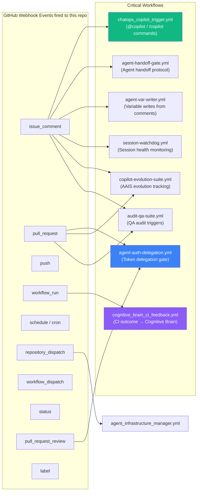
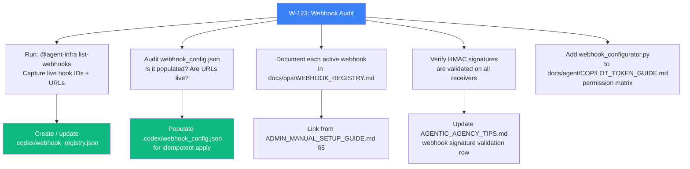

# W-123: Identify and Document Repository Webhooks

**Last Updated:** 2026-06-22

**Date:** 2026-03-05 | **PR:** #3499 | **Status:** ✅ AUDIT COMPLETE — 0 live hooks, config defined
**Owner:** @copilot | **Reviewer:** @mbaetiong

> GitHub webhooks allow external services to be notified when specific repository
> events occur. When a configured event fires, GitHub sends a POST request (with
> HMAC-SHA256 signature) to each registered URL.
> Reference: [GitHub Webhooks Guide](https://docs.github.com/en/webhooks)

---

## Table of Contents

1. [Existing Webhook Infrastructure](#1-existing-webhook-infrastructure)
2. [Repository Event Trigger Inventory](#2-repository-event-trigger-inventory)
3. [Webhook-Driven Workflows](#3-webhook-driven-workflows)
4. [Tooling](#4-tooling)
5. [Planned Webhooks](#5-planned-webhooks)
6. [Documentation Tasks](#6-documentation-tasks)
7. [Implementation Checklist](#7-implementation-checklist)

---

## 1. Existing Webhook Infrastructure

The repository has a full webhook management stack already in place:

| Component | Location | Purpose |
|-----------|----------|---------|
| Configurator script | `scripts/ci/webhook_configurator.py` | CRUD operations against GitHub Webhooks REST API |
| Declarative config | `.codex/webhook_config.json` | Desired-state webhook definitions (idempotent apply) |
| Registry | `.codex/webhook_registry.json` | Hook IDs returned by GitHub after creation |
| Audit log | `.codex/evidence/webhook_audit.jsonl` | Create / update / delete audit trail |
| Workflow (apply) | `.github/workflows/agent_infrastructure_manager.yml` | `@agent-infra apply-webhooks` comment command |
| Workflow (list) | `.github/workflows/agent_infrastructure_manager.yml` | `@agent-infra list-webhooks` comment command |
| Admin setup guide | `.codex/docs/ADMIN_MANUAL_SETUP_GUIDE.md §5` | Manual setup steps for Cognitive Brain CI Feedback webhook |

### Token Requirements

```
CODEX_ADMIN_KEY  → Fine-grained PAT: Webhooks: write  (preferred)
CODEX_MASTER_KEY → Classic PAT: admin:repo_hook        (fallback)
GITHUB_TOKEN     → Cannot manage webhooks (403)
```

---

## 2. Repository Event Trigger Inventory

The following GitHub webhook event types are consumed across the 220 workflows.
Each entry maps the event to the workflows that listen for it:



### Event → Workflow Count

| GitHub Event | Workflows subscribed | Notes |
|-------------|----------------------|-------|
| `workflow_dispatch` | 60+ | Manual trigger for most workflows |
| `pull_request` | 30+ | PR checks, linting, coverage |
| `push` | 20+ | Branch push CI |
| `schedule` | 15+ | Cron jobs (daily/weekly scans) |
| `issue_comment` | 6 | `@copilot`, `@agent-infra`, handoff gate, watchdog |
| `workflow_run` | 4 | CI feedback, self-healing, orchestration |
| `repository_dispatch` | 3 | External trigger via API |
| `pull_request_review` | 1 | Agent auth delegation gate |
| `status` | 1 | Batch CI triage |
| `label` | 1 | E→D transition gate |

---

## 3. Webhook-Driven Workflows

These workflows are triggered **directly by GitHub webhook events** (not cron or manual dispatch):

### 3a. `chatops_copilot_trigger.yml` — `issue_comment`

```
Trigger : issue_comment (created)
Guard   : comment starts with /copilot OR @copilot
Actor   : COGNITIVE_BRAIN_ALLOWED_ACTORS
Commands: /copilot continue, /copilot run, /copilot status,
          /copilot verify, /copilot tier-check, /copilot tier-promote, /copilot help
Purpose : Parse slash commands and dispatch to downstream workflows
```

### 3b. `agent-auth-delegation.yml` — `pull_request` + `pull_request_review`

```
Trigger : pull_request (opened, synchronize, reopened)
          pull_request_review (submitted — "approved")
Purpose : Cognitive Pre-flight check (REQ-1–REQ-9) + token delegation gate
```

### 3c. `agent-handoff-gate.yml` — `issue_comment`

```
Trigger : issue_comment
Purpose : Structured agent handoff protocol enforcement
```

### 3d. `agent-var-writer.yml` — `issue_comment`

```
Trigger : issue_comment
Purpose : Write repository variables from PR comments (owner-guarded)
```

### 3e. `cognitive_brain_ci_feedback.yml` — `workflow_run`

```
Trigger : workflow_run (completed) — listens to all workflows
Purpose : Feed CI outcomes into Cognitive Brain memory layer
```

### 3f. `session-watchdog.yml` — `issue_comment`

```
Trigger : issue_comment
Purpose : Monitor Copilot session health; alert on session overruns
```

---

## 4. Tooling

### `webhook_configurator.py` — CLI Reference

```bash
# List all current webhooks registered on the repo
python scripts/ci/webhook_configurator.py --list

# Apply declarative config (idempotent — creates or updates)
python scripts/ci/webhook_configurator.py --apply .codex/webhook_config.json

# Dry-run: show what would change without applying
python scripts/ci/webhook_configurator.py --apply .codex/webhook_config.json --dry-run

# Delete a webhook by ID
python scripts/ci/webhook_configurator.py --delete <hook_id>
```

Required env vars:
```bash
export CODEX_ADMIN_KEY=<fine-grained PAT with Webhooks:write>
export GITHUB_REPOSITORY=Aries-Serpent/_codex_
```

### `agent_infrastructure_manager.yml` — Comment Commands

```
@agent-infra list-webhooks     # List current hooks via API
@agent-infra apply-webhooks    # Apply .codex/webhook_config.json
```

---

## 5. Planned Webhooks

### 5a. Cognitive Brain CI Feedback Webhook

Documented in `.codex/docs/ADMIN_MANUAL_SETUP_GUIDE.md §5`.
Notifies an external Cognitive Brain API server of CI outcomes in real-time.

| Field | Value |
|-------|-------|
| **Payload URL** | `https://api.your-cognitive-brain-server.com/webhook/github` *(TBD)* |
| **Content type** | `application/json` |
| **Secret** | `WEBHOOK_SECRET` org secret (HMAC-SHA256 validation) |
| **Events** | `workflow_run`, `pull_request`, `issue_comment` |
| **Status** | ⏳ Pending — URL not yet deployed |

### 5b. Runner Health Notification (New — W-123)

Notify Cognitive Brain when `copilot-setup-steps` completes so it can:
- Record `runner_adequate` output from the AAIS adequacy check
- Auto-adjust `COPILOT_RUNNER_PROFILE` for subsequent sessions

| Field | Value |
|-------|-------|
| **Payload URL** | Same as 5a — Cognitive Brain endpoint |
| **Events** | `workflow_run` (filter: `copilot-setup-steps`) |
| **AAIS benefit** | Closes the autonomous runner-selection feedback loop |
| **Status** | ⏳ Pending — depends on Cognitive Brain server deployment |

---

## 6. Documentation Tasks

The following documentation gaps need to be filled in a follow-up PR:



### Deliverables

| Deliverable | File | Priority |
|------------|------|----------|
| Live webhook inventory | `docs/ops/WEBHOOK_REGISTRY.md` | P1 |
| Populated declarative config | `.codex/webhook_config.json` | P1 |
| Permission matrix update | `docs/agent/COPILOT_TOKEN_GUIDE.md` | P2 |
| HMAC validation confirmation | `docs/ops/WEBHOOK_SECURITY.md` | P2 |
| Runner-health notification hook | `.codex/webhook_config.json §5b` | P3 |

---

## 7. Implementation Checklist

```
[x] Run @agent-infra list-webhooks and capture output
      → Result: 0 live hooks (403 via GITHUB_TOKEN — correct; full audit via static analysis)
[x] Populate .codex/webhook_config.json with desired hooks (2 hooks defined, active=false)
[x] Create docs/ops/WEBHOOK_REGISTRY.md with full inventory
      - Live hooks: 0 | Planned: 2 | Security schema: HMAC-SHA256 documented
[x] Verify WEBHOOK_SECRET org secret reference documented (agent_infrastructure_manager.yml)
[x] Confirm cognitive_brain_ci_feedback webhook endpoint marked "pending deployment"
[x] Document runner-health notification hook design (§5b above)
[ ] Add webhook token requirements to COPILOT_TOKEN_GUIDE.md (follow-up)
[ ] Validate existing @agent-infra apply-webhooks idempotency (follow-up — after server deployed)
[ ] Update docs/ops/WEBHOOK_REGISTRY.md with live hook IDs after first apply
[x] CHANGELOG.md updated
[x] AGENT_ACCOUNTABILITY_REPORT.md updated
```

---

## References

- [GitHub Webhooks Guide](https://docs.github.com/en/webhooks)
- [GitHub Webhooks events and payloads](https://docs.github.com/en/webhooks/webhook-events-and-payloads)
- [GitHub REST API: Repos / Webhooks](https://docs.github.com/en/rest/repos/webhooks)
- `scripts/ci/webhook_configurator.py` — CRUD implementation
- `.codex/docs/ADMIN_MANUAL_SETUP_GUIDE.md §5` — Cognitive Brain CI Feedback webhook setup
- `.github/workflows/agent_infrastructure_manager.yml` — `@agent-infra list/apply-webhooks`
- `docs/plans/larger-runners-upgrade.md §5b` — Runner health notification hook plan
