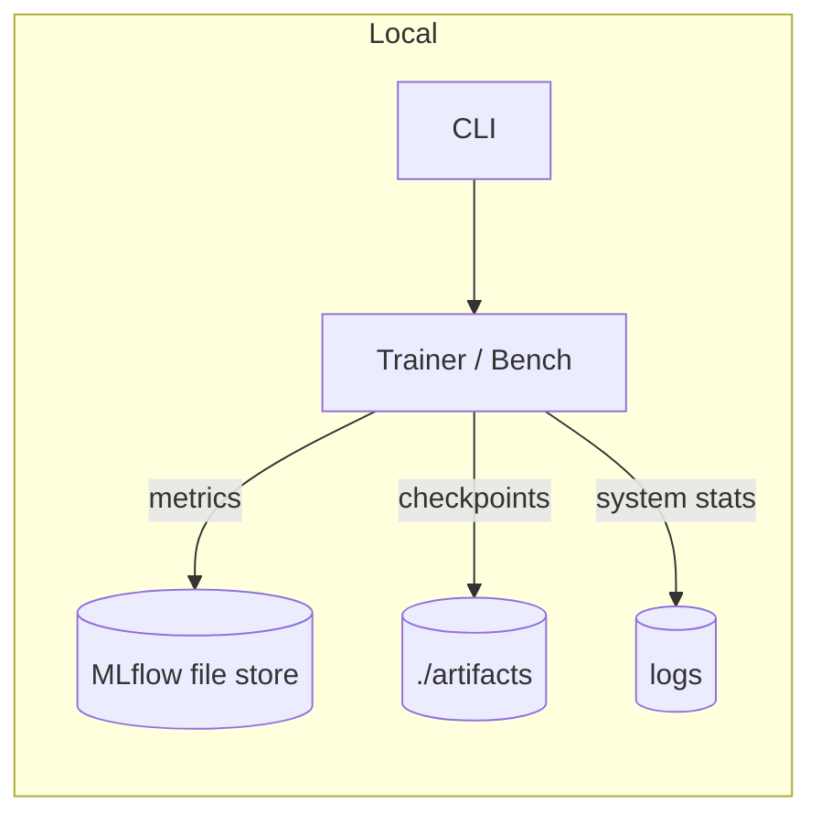

# Offline micro-perf & observability (addendum)

This builds on the existing offline quickstart with a tiny perf harness and system samplers.

## One-liners

```bash
python -c "from codex_ml.monitoring.microhelpers import sample; import json; print(json.dumps(sample(), indent=2))"

codex-perf --numpy-matmul --size 2048 --iters 5
codex-perf --torch-matmul --size 4096 --iters 10 --json
```

## Keep tracking local (optional)

```bash
export MLFLOW_TRACKING_URI="file:./artifacts/mlruns"
```

## Flow at a glance



> All optional deps (psutil, pynvml, torch, numpy, mlflow) are **guarded**. Missing deps degrade gracefully.

