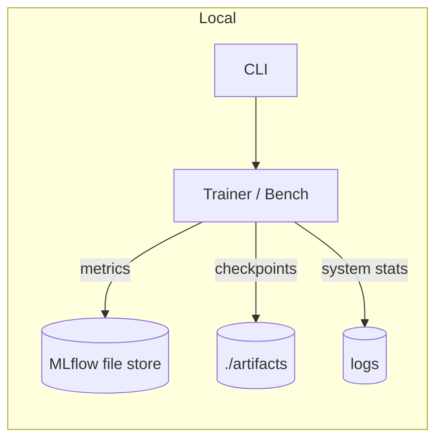

# Offline micro-perf & observability (addendum)

This builds on the existing offline quickstart with a tiny perf harness and system samplers.

## One-liners

> Optional deps are **opt-in**. If you want everything used below:
>
> ```bash
> pip install -e '.[perf,monitoring,gpu]'
> ```

```bash
python -c "from codex_ml.monitoring.microhelpers import sample; import json; print(json.dumps(sample(), indent=2))"

codex-perf --numpy-matmul --size 2048 --iters 5
codex-perf --torch-matmul --size 4096 --iters 10 --json
```

### Extras (opt-in)

| Extra         | Brings in            | Purpose                          |
|---------------|----------------------|----------------------------------|
| `monitoring`  | `psutil`             | CPU/process sampling             |
| `gpu`         | `nvidia-ml-py3`      | GPU stats via NVML (if present)  |
| `perf`        | `numpy`, `mlflow`    | Micro-bench harness + tracking   |

> You can pipe samples to the FileLogger:
>
> ```bash
> python -c "from codex_ml.monitoring.microhelpers import sample; from codex_ml.logging.file_logger import FileLogger; import time; L=FileLogger('samples.ndjson'); [L.write(sample()) or time.sleep(1) for _ in range(3)]"
> ```

## Keep tracking local (optional)

```bash
export MLFLOW_TRACKING_URI="file:./artifacts/mlruns"
```

## Flow at a glance



> All optional deps (psutil, pynvml, torch, numpy, mlflow) are **guarded**. Missing deps degrade gracefully.

### Tip: file logging for quick evals
Use the new `FileLogger` sink to emit **NDJSON** (one JSON object per line) and/or
**CSV** into `./logs/`.
NDJSON is a newline-delimited JSON format that plays nicely with tail/grep or
streaming ingestion.

