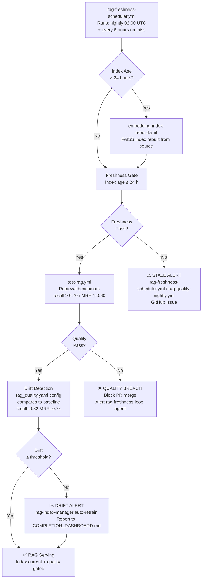

# RAG Freshness & Quality SLA

**Owner**: `rag-freshness-loop-agent` (primary), `rag-index-manager` (backup)  
**Last updated**: 2026-05-27  
**Dashboard**: [`../../.codex/COMPLETION_DASHBOARD.md`](../../.codex/COMPLETION_DASHBOARD.md)  
**Freshness scheduler**: [`.github/workflows/rag-freshness-scheduler.yml`](../../.github/workflows/rag-freshness-scheduler.yml)  
**Quality gate**: [`.github/workflows/test-rag.yml`](../../.github/workflows/test-rag.yml)  
**Drift config**: `.codex/config/rag_quality.yaml`

---

## Purpose

This document defines the service-level agreement (SLA) for the RAG index freshness
and retrieval quality.  The SLA is enforced automatically by the workflows listed above.

---

## RAG Freshness & Quality Pipeline



**Evidence**: RAG production readiness validation PASS (2026-01-08) — 403 tests across 5 files; multi-tenant indexing, caching, observability all validated. See `reports/rag_validation_summary.md`.

---

## Freshness SLA

| Metric | SLA | Enforcement |
|--------|-----|-------------|
| Index age at time of query | ≤ 24 hours | `rag-freshness-scheduler.yml` fires rebuild if age > 24 h |
| Nightly rebuild completion | By 03:00 UTC | Scheduled rebuild at 02:00 UTC |
| Rebuild after scheduler miss | Within 6 hours | `rag-freshness-scheduler.yml` runs every 6 hours |

If the FAISS index age exceeds 72 hours the scheduler auto-dispatches
`embedding-index-rebuild.yml`.

---

## Retrieval Quality SLA

| Metric | Threshold | Action on breach |
|--------|-----------|-----------------|
| Top-5 recall @ benchmark corpus | ≥ 0.70 | `test-rag.yml` fails; PR blocked |
| MRR (Mean Reciprocal Rank) | ≥ 0.60 | `test-rag.yml` fails; PR blocked |
| Retrieval latency (P95) | ≤ 500 ms | Warning only |
| Quality drift vs. baseline | ≤ 10 % drop | Drift alert fired; issue opened |

Quality is measured against the canonical benchmark in
`benchmarks/rag/retrieval_benchmark.json`.

---

## Drift Alerting

Drift is detected when the rolling 7-day average recall drops more than 10 %
below the baseline stored in `benchmarks/rag/retrieval_benchmark.json`.

When drift is detected:
1. `test-rag.yml` posts a warning comment to the PR.
2. A GitHub Issue is opened with label `rag:quality-drift`.
3. `rag-freshness-loop-agent` is notified to investigate.

---

## Benchmark Baseline Management

The baseline is stored in `benchmarks/rag/retrieval_benchmark.json`.

```json
{
  "version": "1.0",
  "created_at": "2026-05-27T00:00:00Z",
  "corpus": "codex-docs-v1",
  "metrics": {
    "top5_recall": 0.82,
    "mrr": 0.74,
    "p95_latency_ms": 210
  }
}
```

Update the baseline when:
- The embedding model is changed.
- The corpus is significantly expanded (> 20 % new documents).
- A deliberate quality improvement is shipped.

Baseline updates require review from `rag-freshness-loop-agent` and a passing
`test-rag.yml` run against the new baseline.

---

## Escalation

| Condition | Action |
|-----------|--------|
| Index age > 24 h | Auto-rebuild triggered |
| Index age > 72 h | P1 alert; issue opened |
| Recall drops > 10 % | P2 alert; issue opened |
| `test-rag.yml` fails > 3 consecutive runs | Page `@mbaetiong` |
