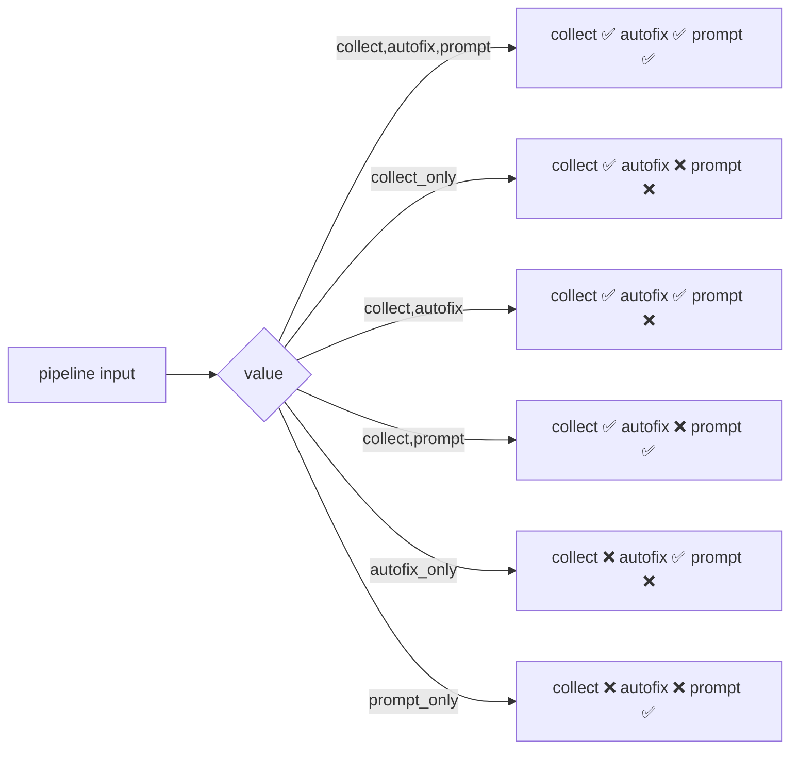
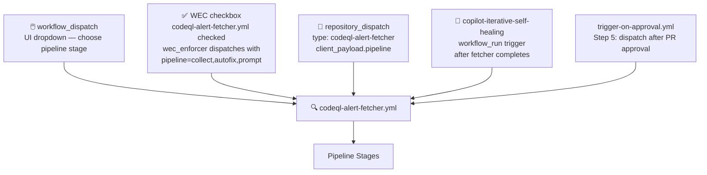
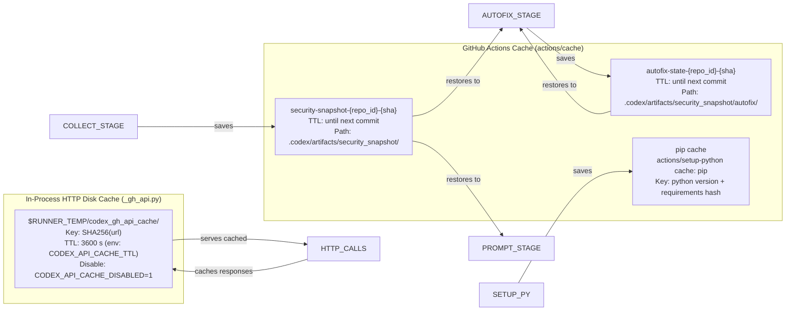
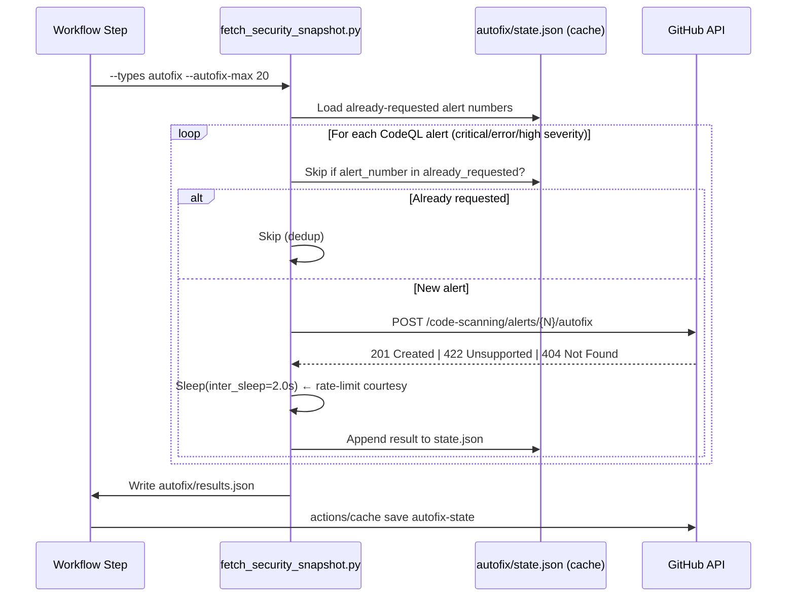
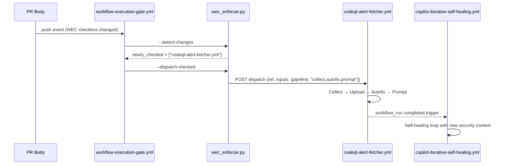

# 🔍 CodeQL Alert Fetcher — Workflow Guide

> **Audience:** Copilot Cloud / Coding Agents and human maintainers  
> **Workflow:** `.github/workflows/codeql-alert-fetcher.yml`  
> **Updated:** 2026-05-13 | PR #4434

---

## Overview

The **CodeQL Alert Fetcher** is a multi-stage, cache-aware security pipeline that:

1. **Collects** a full security snapshot (CodeQL, Dependabot, Secrets, Policy, Analyses)
2. **Generates** `AGENT_SECURITY_CONTEXT.md` — a consolidated, agent-readable brief
3. **Requests** GitHub Copilot Autofix for eligible CodeQL alerts (AI-generated fixes)
4. **Posts** a structured `@copilot` remediation prompt to the triggering PR (or creates an issue)

It is triggerable via **UI dropdown** (choose which stage(s) to run), **WEC checkbox**, **`repository_dispatch`**, and the **iterative self-healing** `workflow_run` trigger.

---

## Pipeline Stage Diagram

```mermaid
flowchart TD
    T([🔑 Token Check]) --> CACHE[♻️ Restore Snapshot Cache\nsecurity-snapshot-sha cache key]

    CACHE -->|cache HIT| SKIP_COLLECT[⏩ Skip collect stage\nreuse prior run data]
    CACHE -->|cache MISS| COLLECT

    subgraph COLLECT ["📥 Stage: collect"]
        C1[fetch_codeql_alerts.py\nPaginated CodeQL alerts\nrate-limit aware + disk cache]
        C2[fetch_security_snapshot.py\n--types dependabot,secrets,\npolicy,analyses\nTTL disk cache · retry · backoff]
        C3[fetch_security_snapshot.py\n--types context\nGenerates AGENT_SECURITY_CONTEXT.md]
        C4[Write run_metadata.json]
        C1 --> C2 --> C3 --> C4
    end

    COLLECT --> UPLOAD[📦 Upload artifact\nretention 90 days]
    SKIP_COLLECT --> UPLOAD
    UPLOAD --> CACHE_SAVE[💾 Save snapshot cache\nfor autofix/prompt reuse]

    CACHE_SAVE --> AF_RESTORE[♻️ Restore autofix-state cache\ndedup: skip already-requested alerts]

    AF_RESTORE --> AUTOFIX

    subgraph AUTOFIX ["🤖 Stage: autofix  (requires do_autofix=true)"]
        A1[fetch_security_snapshot.py\n--types autofix\nPOST /code-scanning/alerts/N/autofix\nper alert · inter-sleep · max cap]
        A2[Save autofix/results.json\nDedup state persisted to cache]
        A1 --> A2
    end

    AUTOFIX --> CACHE_AF_SAVE[💾 Save autofix-state cache]

    CACHE_AF_SAVE --> PROMPT

    subgraph PROMPT ["💬 Stage: prompt  (requires do_prompt=true)"]
        P1{PR number\nknown?}
        P1 -->|yes or auto-detected| P2[Upsert sentinel comment\non PR via gh CLI]
        P1 -->|no PR found| P3[Create labelled issue\nsecurity · copilot]
        P2 & P3 --> P4[@copilot fix prompt posted\nwith artifact link + action table]
    end

    PROMPT --> DONE([✅ Done — print download instructions])
```

---

## Stage Gate Logic

The `pipeline` choice input controls which stages execute:



> When `autofix_only` or `prompt_only`, the snapshot cache is restored automatically so prior-run data is available without re-downloading.

---

## Trigger Map



---

## Caching Architecture



---

## Rate-Limit Awareness

All API calls route through `scripts/ci/_gh_api.py` which implements:

```mermaid
sequenceDiagram
    participant S as Script
    participant C as Disk Cache
    participant A as GitHub API
    participant RL as Rate Limiter

    S->>C: Check cache(url, ttl=3600s)
    alt Cache HIT (not expired)
        C-->>S: Return cached JSON
    else Cache MISS
        S->>A: GET /repos/.../alerts?page=N
        A-->>S: Response + X-RateLimit-Remaining headers
        S->>RL: Check remaining < min_remaining (10)?
        alt Low rate-limit
            RL-->>S: Sleep until X-RateLimit-Reset + 5s
        else OK
            RL-->>S: Continue
        end
        alt HTTP 429 / 403
            A-->>S: Retry-After header
            S->>S: Sleep(Retry-After); retry up to 3×
        else Network error
            S->>S: Sleep(5s); retry up to 3×
        end
        S->>C: Write cache(url, response)
        S->>S: Sleep(page_sleep) between pages
    end
```

---

## Copilot Autofix API Flow



> After the autofix stage completes, the **Security tab** in GitHub shows AI-generated fix suggestions. Review and commit to apply.

---

## Artifact File Index

| File | Contents | Primary Consumer |
|------|----------|-----------------|
| `AGENT_SECURITY_CONTEXT.md` | Full priority brief + tables | Copilot agent — **start here** |
| `codeql/alerts_raw.json` | Full CodeQL alert JSON array | Agents needing full metadata |
| `codeql/alerts_by_rule.md` | Alerts grouped by rule ID | Human triage |
| `codeql/alerts_fixable.md` | Top-N prioritised fix list with file:line | Agent fix loop |
| `codeql/alerts_summary.json` | Machine-readable counts | Dashboard / reporting |
| `dependabot/alerts_open.json` | All open Dependabot alerts | Dependency upgrade agents |
| `dependabot/alerts_critical.json` | Critical + high only | Urgent triage |
| `dependabot/summary.json` | Counts by severity / ecosystem | Dashboard |
| `secrets/alerts_open.json` | All open secret alerts | Secret rotation agents |
| `secrets/alerts_active.json` | Confirmed active secrets | **Revoke immediately** |
| `secrets/summary.json` | Counts by type / validity | Dashboard |
| `policy/community_profile.json` | Community health metadata | Policy agents |
| `policy/security_policy.json` | Security policy file content | Compliance check |
| `analyses/recent.json` | Last 100 code-scanning analyses | Provenance tracking |
| `analyses/default_setup.json` | CodeQL default-setup status | Setup validation |
| `autofix/results.json` | Per-alert autofix request outcomes | Autofix tracking |
| `run_metadata.json` | Run parameters + cache-hit flag | Debugging |

---

## WEC Wiring

The checkbox `- [ ] codeql-alert-fetcher.yml` in the PR description WEC section:

1. When **checked [x]**, `workflow-execution-gate.yml` → `wec_enforcer.py --dispatch-checked`
2. `wec_enforcer.py` reads `_WORKFLOW_DEFAULT_INPUTS["codeql-alert-fetcher.yml"]` = `{"pipeline": "collect,autofix,prompt"}`
3. Dispatches via `POST /repos/.../actions/workflows/codeql-alert-fetcher.yml/dispatches` with `{"ref": branch, "inputs": {"pipeline": "collect,autofix,prompt"}}`
4. Workflow runs full pipeline, uploads artifact, posts `@copilot` prompt
5. `copilot-iterative-self-healing.yml` fires on `workflow_run: completed` to process results



---

## How to Use the Artifact (Agent Quick Start)

```bash
# 1. List artifacts for the latest fetcher run
github-mcp-server-actions_list  method=list_workflow_run_artifacts  resource_id=<RUN_ID>

# 2. Download the artifact
github-mcp-server-actions_get  method=download_workflow_run_artifact  resource_id=<ARTIFACT_ID>

# 3. Start with the priority brief
cat AGENT_SECURITY_CONTEXT.md

# 4. Work through the fix list top-down
cat codeql/alerts_fixable.md

# 5. For each fix:
#    a. Edit the target file
#    b. ruff check --fix <file>
#    c. pre-commit run --files <file>
#    d. git commit -m "fix(security): <rule_id> in <file>"

# 6. Check Security tab for Copilot Autofix suggestions
#    (Review and commit — no manual edits needed for AI-generated fixes)
```

---

## Related Files

| File | Purpose |
|------|---------|
| `scripts/ci/_gh_api.py` | Shared rate-limit aware HTTP helper with TTL disk cache |
| `scripts/ci/fetch_codeql_alerts.py` | CodeQL-specific paginated fetcher |
| `scripts/ci/fetch_security_snapshot.py` | Unified fetcher: Dependabot, Secrets, Policy, Analyses, Autofix, Context |
| `scripts/ci/wec_enforcer.py` | WEC gate — `_WORKFLOW_DEFAULT_INPUTS` for explicit pipeline dispatch |
| `docs/reference/SECURITY_API_REFERENCE.md` | Full GitHub Security API call catalog |
| `.github/workflows/copilot-iterative-self-healing.yml` | Downstream workflow_run consumer |
| `.github/pull_request_template.md` | WEC checkbox location |
