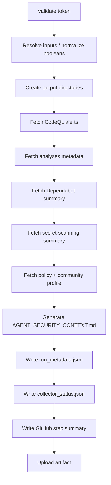

# 🔍 CodeQL Alert Fetcher — Workflow Guide

> **Audience:** Copilot Cloud / Coding Agents and human maintainers  
> **Workflow:** `.github/workflows/codeql-alert-fetcher.yml`  
> **Updated:** 2026-05-13 | PR #4434 | S992 workflow hardening

---

## Overview

The **CodeQL Alert Fetcher** is a security snapshot workflow that collects a single artifact bundle for the current repository context.

It currently performs these operations in one workflow job:

1. Fetches **CodeQL/code-scanning** alerts via `scripts/ci/fetch_codeql_alerts.py`
2. Fetches **Dependabot** and **secret-scanning** summaries
3. Fetches **community profile**, **security policy**, and **analysis provenance** metadata
4. Generates **`AGENT_SECURITY_CONTEXT.md`** for agent consumption
5. Writes **`run_metadata.json`**, **`collector_status.json`**, and a GitHub Actions **step summary**
6. Uploads a single **security snapshot artifact**

> This workflow does **not** currently run Copilot Autofix or post a PR prompt. Earlier planning docs referenced a broader multi-stage pipeline; the source of truth is the workflow file itself.

---

## Trigger Modes

The workflow can be started through:

- **`workflow_dispatch`** — manual run from the Actions UI
- **`repository_dispatch`** — typically sent by WEC / automation

Boolean inputs from `repository_dispatch` are normalized centrally in the `params` step so values like `true`, `1`, `yes`, `on`, `false`, `0`, `no`, and `off` behave consistently.

---

## Input Parameters

| Input | Purpose | Notes |
|---|---|---|
| `state` | CodeQL alert state | `open`, `dismissed`, `fixed`, `auto_dismissed` |
| `tool_name` | Code-scanning tool filter | Defaults to `CodeQL` |
| `max_pages` | Max CodeQL pages | Clamped to `1..100` |
| `page_sleep_ms` | Delay between CodeQL pages | Clamped to `>=500 ms` |
| `top_n` | Number of prioritized fix entries | Clamped to `1..500` |
| `include_dependabot` | Include Dependabot collector | Normalized boolean |
| `include_secrets` | Include secret-scanning collector | Normalized boolean |

---

## Execution Flow

---

## Artifact Layout

| File | Contents | Primary Consumer |
|---|---|---|
| `AGENT_SECURITY_CONTEXT.md` | Human/agent-readable summary | Copilot agent — start here |
| `collector_status.json` | Per-output existence + size | Validation / downstream automation |
| `run_metadata.json` | Resolved inputs + provenance | Debugging / audit |
| `codeql/alerts_raw.json` | Full CodeQL alert payload | Automated triage |
| `codeql/alerts_by_rule.md` | Rule-grouped CodeQL summary | Human review |
| `codeql/alerts_fixable.md` | Prioritized fix list | Coding agent remediation |
| `codeql/alerts_summary.json` | Counts by rule / severity | Dashboards |
| `dependabot/alerts_open.json` | All fetched Dependabot alerts | Dependency remediation |
| `dependabot/alerts_critical.json` | Critical/high subset | Urgent triage |
| `dependabot/summary.json` | Severity/ecosystem summary | Reporting |
| `secrets/alerts_open.json` | All fetched secret alerts | Secret-remediation work |
| `secrets/alerts_active.json` | Active/confirmed subset | Immediate response |
| `secrets/summary.json` | Type/validity summary | Reporting |
| `policy/community_profile.json` | Community health endpoint result | Governance / docs |
| `policy/security_policy.json` | Resolved policy file content + metadata | Compliance review |
| `analyses/recent.json` | Recent code-scanning analyses | Provenance |
| `analyses/default_setup.json` | Default setup state | CodeQL setup validation |

---

## Hardening Added in S992

The workflow was hardened in PR #4434 Session S992 with the following improvements:

- **Strict shell mode** (`set -euo pipefail`) in multi-line bash steps
- **Normalized dispatch booleans** for `include_dependabot` / `include_secrets`
- **Bounded `top_n`** clamping to `1..500`
- **Safer fallback writes** using temp files + JSON validation before file moves
- **Collector health reporting** via `collector_status.json`
- **GitHub Actions step summary** for quick UI review
- **Byte-safe policy-content truncation** with explicit metadata
- **Removal of dead workflow code** (`ENCODED_PATH`)

---

## Rate-Limit / Failure Behavior

- The workflow exits early and neutrally if no elevated token is available.
- CodeQL fetching uses the dedicated Python collector, which already contains rate-limit-aware behavior.
- Dependabot and secret collectors currently use bounded loops (10 pages max = 1000 alerts) to keep runtime predictable.
- Analyses/community-profile fetches now validate JSON before writing artifact files.
- Soft failures are tolerated so partial artifacts can still be uploaded, but collector health is visible in `collector_status.json` and the step summary.

---

## WEC Wiring

The checkbox `codeql-alert-fetcher.yml` in the PR Workflow Execution Checklist only controls whether this workflow is dispatched by the WEC automation.

If checked:

1. `workflow-execution-gate.yml` detects the selection
2. `wec_enforcer.py` dispatches `codeql-alert-fetcher.yml`
3. The workflow produces a single security snapshot artifact for this branch/PR context

If unchecked, the workflow can still be run manually from the Actions UI.

---

## Agent Quick Start

1. Open **`AGENT_SECURITY_CONTEXT.md`** first
2. Use **`collector_status.json`** to confirm which collectors succeeded
3. Use **`codeql/alerts_fixable.md`** for fix planning
4. Use **`dependabot/alerts_critical.json`** for urgent dependency upgrades
5. Use **`secrets/alerts_active.json`** for any active secret response

---

## Known Gaps / Future Enhancements

The workflow is now hardened for correctness, but these follow-on improvements remain candidates:

- Link-header pagination instead of fixed 10-page loops for Dependabot / secret scanning
- Ref-aware collection inputs where supported by the GitHub APIs
- Location/detail enrichment for top alerts
- Unified Python collectors for all non-CodeQL endpoints
- A normalized `security_overview.json` / `manifest.json` artifact layer
