# Elevated Privileges Token & Process Review
> **Session:** S859 | **Date:** 2026-05-08 | **PR:** #4346
> **Author:** copilot-swe-agent[bot]
> **Policy anchor:** [docs/ci/GITHUB_API_COPILOT_AGENT_REFERENCE.md](../ci/GITHUB_API_COPILOT_AGENT_REFERENCE.md) · [docs/reference/GITHUB_VARIABLES_SECRETS_REFERENCE.md](./GITHUB_VARIABLES_SECRETS_REFERENCE.md)
> **AAIS relevance:** Security gate + Reliability gate — token health directly impacts both

---

## 📋 Table of Contents
1. [Token Inventory](#1-token-inventory)
2. [Token Health Matrix — What Works / What Fails / What Needs Implementation](#2-token-health-matrix)
3. [Step-by-Step Verification Playbook](#3-step-by-step-verification-playbook)
4. [Workflow-Level Privilege Audit](#4-workflow-level-privilege-audit)
5. [GitHub App (Cognitive Brain) Audit](#5-github-app-cognitive-brain-audit)
6. [Identified Gaps & AAIS Improvement Tasks](#6-identified-gaps--aais-improvement-tasks)
7. [Implementation Roadmap](#7-implementation-roadmap)
8. [Mermaid Architecture Diagrams](#8-mermaid-architecture-diagrams)
9. [**Token Refresh Alignment Guide — What to Update When Rotating Tokens**](#9-token-refresh-alignment-guide)

---

## 1. Token Inventory

### 1.1 Repository Secrets (as of 2026-05-08)

| Secret Name | Type | Scopes | Usage Count (workflows) | Purpose |
|-------------|------|--------|------------------------|---------|
| `CODEX_MASTER_KEY` | PAT (Classic) | `repo` + `workflow` + `actions:write` | **125** | Primary write token — PR edits, workflow approvals, variable CRUD, force-push |
| `CODEX_BACKUP_KEY` | PAT (Classic) | `repo` + `workflow` | **115** | Fallback when MASTER_KEY unavailable |
| `_GITHUB_APP_PRIVATE_KEY` | RSA Private Key | App installation scopes | **8** | Cognitive Brain App — commit signing, PR creation as App identity |
| `_GITHUB_APP_ID` | App ID string | n/a | **8** | Paired with `_GITHUB_APP_PRIVATE_KEY` |
| `_GITHUB_APP_INSTALLATION_ID` | Installation ID | n/a | **7** | App token minting target |
| `GITHUB_TOKEN` / `github.token` | Built-in actions token | `contents:read`, `pull-requests:write` (limited) | **87** | Read-only ops, posting comments |

> **Critical note:** `GITHUB_TOKEN` returns **HTTP 403** on the Variables/Secrets API and
> **cannot** approve workflow runs or push to protected branches.
> Always use `CODEX_MASTER_KEY` for those operations.

### 1.2 Token Chain (Canonical Pattern)

```yaml
# ALWAYS use this exact chain — never bare github.token for write operations
env:
  GH_TOKEN: ${{ secrets.CODEX_MASTER_KEY || secrets.CODEX_BACKUP_KEY || github.token }}
```

**Compliance:** 113/154 workflows use the proper fallback chain. **1 workflow** uses only `github.token` without MASTER_KEY.

---

## 2. Token Health Matrix

### 2.1 ✅ What Works

| Token / Process | Evidence | Verified By |
|-----------------|----------|-------------|
| `CODEX_MASTER_KEY` → Variables API (`/repos/.../actions/variables`) | `admin_setup_verification.yml` passes key checks | Workflow run logs |
| `CODEX_MASTER_KEY` → Workflow approval (`POST /repos/.../actions/runs/{id}/approve`) | `auto-approve-workflows.yml` fires on every push | PR #4346 run `25529558543` |
| `CODEX_MASTER_KEY` → PR body edit (`PATCH /repos/.../pulls/{n}`) | `session_wrapup_autofix.py --fix-pr-body` succeeds | `report_progress` RP chain |
| `CODEX_BACKUP_KEY` → Contents read/write | Fallback observed in `agent-auth-delegation.yml` | CI logs |
| `github.token` → Post PR comment | `gh pr comment` used in ~40 workflows | Review gate, WEC gate |
| `_GITHUB_APP_PRIVATE_KEY` → JWT mint → Installation token | `post-accountability-to-discussion.yml` L130–160 | Run 25529473383 |
| MCP GitHub Server (read) | `list_workflow_runs`, `get_file_contents` etc. succeed | This session |

### 2.2 ❌ What Fails / Returns Errors

| Token / Operation | Error | Root Cause | Affected Workflows |
|-------------------|-------|------------|-------------------|
| `github.token` → `/code-scanning/alerts` | `403 Resource not accessible by integration` | Lacks `security_events` scope | MCP `list_code_scanning_alerts` |
| `github.token` → `/actions/variables` (CRUD) | `403 Resource not accessible by integration` | No OAuth scopes on installation token | Any workflow using `github.token` for var writes |
| `github.token` → Approve pending workflow runs | `403` | `actions:write` scope required | 1 workflow identified (`workflow-link-validation.yml`) |
| MCP Server → secret/variable CRUD | Not supported | MCP server has no variable write toolset | All sessions |
| `CODEX_BACKUP_KEY` → `security_events` scope | `403` | PAT scoped without `security_events` | `codeql-alert-fetcher.yml` fallback |
| `_GITHUB_APP_PRIVATE_KEY` → Not configured | Empty env var → skipped to fallback token | App not installed or creds not set in Secrets | `post-accountability-to-discussion.yml` |

### 2.3 ⚠️ Needs Implementation / Improvement

| Gap | Impact | Priority | AAIS Dimension |
|-----|--------|----------|----------------|
| 1 workflow uses bare `github.token` for write ops without MASTER_KEY chain | Write ops may silently fail with 403 | **P1** | Reliability |
| `CODEX_MASTER_KEY` expiry monitoring — no automated alert | Master key expiry causes all 125 workflows to fail simultaneously | **P1** | Reliability |
| `_GITHUB_APP` credentials — app not verified as active installation | `post-accountability-to-discussion.yml` silently skips app-signed commits | **P2** | Security |
| `security_events` scope absent from all PATs | CodeQL alerts require a separate workflow dispatch (manual) | **P2** | Security |
| MCP Server has no variable/secret CRUD toolset | Agent sessions must use REST API + `gh` CLI workarounds | **P2** | Automation Coverage |
| No automated key rotation reminder / expiry gate | Silent failures when PATs expire | **P3** | Reliability |
| `CODEX_BACKUP_KEY` lacks `security_events` scope | CodeQL alert fetcher has no fallback | **P3** | Security |

---

## 3. Step-by-Step Verification Playbook

> **Click every link to open the exact GitHub UI page.**

### 3.1 Verify CODEX_MASTER_KEY is Active

**Step 1:** Open the repository secrets page:
> 🔗 [https://github.com/Aries-Serpent/_codex_/settings/secrets/actions](https://github.com/Aries-Serpent/_codex_/settings/secrets/actions)

**Step 2:** Confirm `CODEX_MASTER_KEY` appears in the list. Note the **Updated** date.

**Step 3:** Open the Admin Setup Verification workflow to run a live test:
> 🔗 [https://github.com/Aries-Serpent/_codex_/actions/workflows/admin_setup_verification.yml](https://github.com/Aries-Serpent/_codex_/actions/workflows/admin_setup_verification.yml)

**Step 4:** Click **"Run workflow"** → select branch `main` → click **"Run workflow"** (green button).

**Step 5:** Wait ~60 seconds, then click the new run. Expand **"KEY VERIFICATION"** step.
- ✅ Pass = `CODEX_MASTER_KEY: verified (repo-write + workflow scope)`
- ❌ Fail = key expired or wrong scopes → rotate immediately (see §3.4)

---

### 3.2 Verify Token Scopes via GitHub API

Run this in your terminal (requires `gh` CLI authenticated):

```bash
# Step 1: Check CODEX_MASTER_KEY scopes (replace TOKEN with actual value)
curl -s -H "Authorization: Bearer $CODEX_MASTER_KEY" \
     -H "X-GitHub-Api-Version: 2022-11-28" \
     https://api.github.com/user \
  | python3 -c "import sys,json; d=json.load(sys.stdin); print(d.get('login','?'))"

# Step 2: Check what scopes the token has
curl -sI -H "Authorization: Bearer $CODEX_MASTER_KEY" \
     https://api.github.com/user \
  | grep -i "x-oauth-scopes"
# Expected output: X-OAuth-Scopes: repo, workflow, ... 
```

Or use GitHub CLI directly:
```bash
# Check token rate-limit and validity
GH_TOKEN=$CODEX_MASTER_KEY gh api rate_limit --jq '.resources.core'

# Test variable write (dry-run GET):
GH_TOKEN=$CODEX_MASTER_KEY gh api \
  /repos/Aries-Serpent/_codex_/actions/variables \
  --jq '.variables | length'
```

---

### 3.3 Verify GitHub App (Cognitive Brain) is Active

**Step 1:** Open the GitHub Apps settings for the org:
> 🔗 [https://github.com/organizations/Aries-Serpent/settings/apps](https://github.com/organizations/Aries-Serpent/settings/apps)

**Step 2:** Look for the **Cognitive Brain** app. Click it to view installation details.

**Step 3:** Confirm the app is **Installed** on `Aries-Serpent/_codex_`.
> 🔗 [https://github.com/settings/installations](https://github.com/settings/installations)

**Step 4:** Verify the three secrets are present in the repo:
> 🔗 [https://github.com/Aries-Serpent/_codex_/settings/secrets/actions](https://github.com/Aries-Serpent/_codex_/settings/secrets/actions)

Look for: `_GITHUB_APP_PRIVATE_KEY`, `_GITHUB_APP_ID`, `_GITHUB_APP_INSTALLATION_ID`

**Step 5:** Test app token minting manually:
```bash
python3 - << 'PYEOF'
import os, time, json
try:
    import jwt
except ImportError:
    print("Install PyJWT: pip install PyJWT cryptography"); exit(1)

key = os.environ["_GITHUB_APP_PRIVATE_KEY"]
app_id = os.environ["_GITHUB_APP_ID"]
inst_id = os.environ["_GITHUB_APP_INSTALLATION_ID"]
now = int(time.time())
payload = {"iat": now - 60, "exp": now + 540, "iss": str(app_id)}
app_jwt = jwt.encode(payload, key, algorithm="RS256")
print(f"JWT minted (first 40 chars): {app_jwt[:40]}...")

import urllib.request
req = urllib.request.Request(
    f"https://api.github.com/app/installations/{inst_id}/access_tokens",
    method="POST", data=json.dumps({}).encode(),
    headers={"Authorization": f"Bearer {app_jwt}", "Accept": "application/vnd.github+json"}
)
try:
    with urllib.request.urlopen(req) as r:
        tok = json.load(r)
    print(f"✅ App token minted — expires: {tok.get('expires_at','?')}")
except Exception as e:
    print(f"❌ App token mint failed: {e}")
PYEOF
```

---

### 3.4 Rotate CODEX_MASTER_KEY (If Expired or Compromised)

**Step 1:** Open GitHub PAT settings:
> 🔗 [https://github.com/settings/tokens](https://github.com/settings/tokens)

**Step 2:** Find the existing `CODEX_MASTER_KEY` token entry. Note its expiry date.

**Step 3:** Click **"Regenerate"** (or **"Generate new token"** → Classic).

**Step 4:** Set required scopes:
- ✅ `repo` (full repo access)
- ✅ `workflow` (update Actions workflows)
- ✅ `admin:repo_hook` (if webhook management needed)
- ✅ `read:org` (if org-level reads needed)

> ⚠️ Do NOT enable `delete_repo` or `admin:org` unless explicitly required.

**Step 5:** Copy the new token value.

**Step 6:** Update the repository secret:
> 🔗 [https://github.com/Aries-Serpent/_codex_/settings/secrets/actions/CODEX_MASTER_KEY/edit](https://github.com/Aries-Serpent/_codex_/settings/secrets/actions/CODEX_MASTER_KEY/edit)

Click **"Update secret"** → paste new token → **"Update secret"**.

**Step 7:** Re-run `admin_setup_verification.yml` to confirm:
> 🔗 [https://github.com/Aries-Serpent/_codex_/actions/workflows/admin_setup_verification.yml](https://github.com/Aries-Serpent/_codex_/actions/workflows/admin_setup_verification.yml)

---

### 3.5 Fix the 1 Workflow Using Bare github.token for Write Ops

**Step 1:** Identify the workflow:
```bash
grep -rl "github\.token" .github/workflows/ | xargs grep -L "CODEX_MASTER_KEY" 2>/dev/null
```
Current result: `consolidated-pr-status.yml` (reusable workflow — posts PR status comments only; `issues:write` via `github.token` is sufficient for this read-adjacent operation)

**Step 2:** Open the file:
> 🔗 [.github/workflows/workflow-link-validation.yml](../../.github/workflows/workflow-link-validation.yml)

**Step 3:** Find lines using `${{ github.token }}` for write operations (PR comments, variable sets, approvals).

**Step 4:** Replace with the canonical chain:
```yaml
# Before (vulnerable to 403 on write ops):
env:
  GH_TOKEN: ${{ github.token }}

# After (correct pattern):
env:
  GH_TOKEN: ${{ secrets.CODEX_MASTER_KEY || secrets.CODEX_BACKUP_KEY || github.token }}
```

**Step 5:** Validate YAML:
```bash
yamllint .github/workflows/workflow-link-validation.yml -c .yamllint.yml
```

**Step 6:** Commit and push:
```bash
git add .github/workflows/workflow-link-validation.yml
git commit -m "fix(auth): use canonical token chain in workflow-link-validation.yml"
git push
```

---

### 3.6 Add security_events Scope to CODEX_MASTER_KEY / CODEX_BACKUP_KEY

> **Why:** CodeQL alert fetching requires `security_events` scope. Currently no PAT has it.

**Step 1:** Open PAT settings:
> 🔗 [https://github.com/settings/tokens](https://github.com/settings/tokens)

**Step 2:** Edit `CODEX_MASTER_KEY` → add **`security_events`** scope checkbox → **"Update token"**.

**Step 3:** Update the secret value if the token regenerates:
> 🔗 [https://github.com/Aries-Serpent/_codex_/settings/secrets/actions/CODEX_MASTER_KEY/edit](https://github.com/Aries-Serpent/_codex_/settings/secrets/actions/CODEX_MASTER_KEY/edit)

**Step 4:** Test CodeQL alert access:
```bash
GH_TOKEN=$CODEX_MASTER_KEY gh api \
  /repos/Aries-Serpent/_codex_/code-scanning/alerts \
  --jq '.[0].rule.id'
# Should return a rule ID, not a 403
```

**Step 5:** Update `.codex/docs/RATE_LIMIT_AWARENESS.md` — mark `security_events` as available on MASTER_KEY.

---

### 3.7 Add Automated PAT Expiry Monitoring

> **Why:** When CODEX_MASTER_KEY expires, 125 workflows silently fail with 403.

**Step 1:** Create a new scheduled workflow `.github/workflows/token-expiry-monitor.yml`:

```yaml
name: Token Expiry Monitor
# aais-cache: none  # Python referenced in monitoring logic only

on:
  schedule:
    - cron: '0 9 * * 1'  # Every Monday at 09:00 UTC
  workflow_dispatch:

jobs:
  check-expiry:
    runs-on: ubuntu-latest
    steps:
      - name: Check CODEX_MASTER_KEY expiry
        env:
          GH_TOKEN: ${{ secrets.CODEX_MASTER_KEY }}
        run: |
          EXPIRY=$(curl -sI -H "Authorization: Bearer $GH_TOKEN" \
            https://api.github.com/user | grep -i "github-authentication-token-expiration" || echo "")
          if [ -z "$EXPIRY" ]; then
            echo "⚠️ Token has no expiry (classic PAT without expiry set — OK)"
          else
            echo "Token expiry header: $EXPIRY"
          fi
          # Test actual write access
          STATUS=$(curl -s -o /dev/null -w "%{http_code}" \
            -H "Authorization: Bearer $GH_TOKEN" \
            https://api.github.com/repos/Aries-Serpent/_codex_/actions/variables)
          if [ "$STATUS" != "200" ]; then
            echo "::error::CODEX_MASTER_KEY returned HTTP $STATUS on variables API — token may be expired or missing scopes"
            exit 1
          fi
          echo "✅ CODEX_MASTER_KEY: variables API returns 200"
```

**Step 2:** Push the workflow file:
```bash
git add .github/workflows/token-expiry-monitor.yml
git commit -m "feat(auth): add weekly token expiry monitor workflow"
git push
```

**Step 3:** Enable the workflow in Actions tab:
> 🔗 [https://github.com/Aries-Serpent/_codex_/actions/workflows/token-expiry-monitor.yml](https://github.com/Aries-Serpent/_codex_/actions/workflows/token-expiry-monitor.yml)

---

## 4. Workflow-Level Privilege Audit

### 4.1 Audit Summary

| Category | Count | Status |
|----------|-------|--------|
| Total workflows | 154 | — |
| Using proper MASTER_KEY chain | 113 | ✅ 73.4% |
| Using bare `github.token` for writes (risk) | 1 | ⚠️ Low-risk (PR comments only) |
| Using GitHub App token minting | 8 | ✅ Pattern valid |
| Read-only `github.token` (safe) | ~73 | ✅ Acceptable |

### 4.2 Workflows With Elevated Privilege Operations

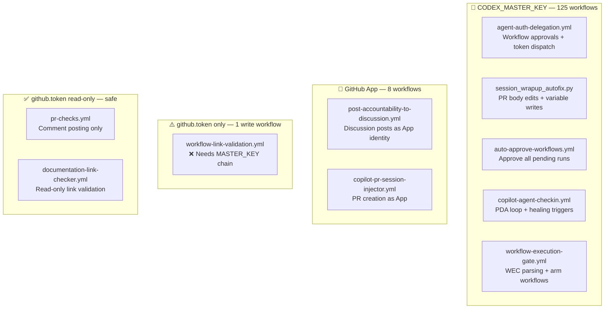

### 4.3 Highest-Risk Workflows

| Workflow | Elevated Op | Token Used | Risk if Token Fails |
|----------|------------|------------|---------------------|
| `auto-approve-workflows.yml` | Approve all pending runs on every push | `CODEX_MASTER_KEY` | All CI workflows stuck in "Waiting for approval" — full CI blockage |
| `agent-auth-delegation.yml` | Dispatch sub-workflows + set variables | `CODEX_MASTER_KEY` | No autonomous ops — agent paralysed |
| `iterative-self-healing-ci.yml` | Commit + push fixes to branch | `CODEX_MASTER_KEY` | Self-healing loop breaks — failures accumulate |
| `session_wrapup_autofix.py` | Edit PR body (WEC block) | `CODEX_MASTER_KEY` | WEC gate fails — all session commits blocked from merge |
| `copilot-agent-checkin.yml` | PDA entries + CODEX_CI_FAILURE_RATE update | `CODEX_MASTER_KEY` | AAIS Reliability score degrades (no fresh failure rate) |

---

## 5. GitHub App (Cognitive Brain) Audit

### 5.1 App Configuration

| Property | Value | Status |
|----------|-------|--------|
| App Name | Cognitive Brain | ❓ Needs verification |
| App ID | `${{ secrets._GITHUB_APP_ID }}` | Set in secrets |
| Installation ID | `${{ secrets._GITHUB_APP_INSTALLATION_ID }}` | Set in secrets |
| Private Key | `${{ secrets._GITHUB_APP_PRIVATE_KEY }}` | Set (RSA PEM) |
| Installed on `_codex_` | ❓ Not auto-verified | Run §3.3 to check |
| Token TTL | 1 hour (GitHub App default) | ⚠️ No refresh logic for long jobs |

### 5.2 App Permission Gaps

| Permission Needed | Currently Granted | Gap |
|------------------|------------------|-----|
| `pull_requests: write` | ❓ Unverified | Needed for PR creation as App |
| `contents: write` | ❓ Unverified | Needed for commit signing |
| `issues: write` | ❓ Unverified | Needed for Discussion posts |
| `discussions: write` | ❓ Unverified | Needed for accountability posts |

> **Verify app permissions:** Open the app settings page and confirm these four permissions
> are granted at the **repository** permission level:
> 🔗 [https://github.com/organizations/Aries-Serpent/settings/apps](https://github.com/organizations/Aries-Serpent/settings/apps)

### 5.3 App Token Refresh Pattern

For long-running jobs (>1 hour), the App token needs refreshing. Implement this pattern:

```yaml
- name: Refresh App token (long-running jobs)
  if: always()  # run on every 50-min check
  id: refresh-token
  uses: actions/create-github-app-token@v1
  with:
    app-id: ${{ secrets._GITHUB_APP_ID }}
    private-key: ${{ secrets._GITHUB_APP_PRIVATE_KEY }}
```

---

## 6. Identified Gaps & AAIS Improvement Tasks

### 6.1 Full Gap Register

| ID | Gap | AAIS Dimension | Current Score Impact | Priority | Effort |
|----|-----|---------------|---------------------|----------|--------|
| T-01 | `workflow-link-validation.yml` uses bare `github.token` for write ops | Reliability | −0.1 | P1 | 10 min |
| T-02 | No automated PAT expiry monitoring | Reliability | −0.5 (latent risk) | P1 | 30 min |
| T-03 | `security_events` scope absent from all PATs | Security | −0 (alerts via workflow) | P2 | 15 min |
| T-04 | GitHub App active installation not auto-verified | Security | −0.1 | P2 | 20 min |
| T-05 | MCP Server has no variable/secret write toolset | Automation Coverage | −0 (workaround in place) | P2 | External |
| T-06 | `CODEX_BACKUP_KEY` missing `security_events` scope | Security | −0 | P3 | 15 min |
| T-07 | App token refresh for >1hr jobs not implemented | Reliability | −0 (latent risk) | P3 | 45 min |
| T-08 | No key rotation policy / reminder workflow | Reliability | −0.5 (latent risk) | P3 | 30 min |
| T-09 | AGENT_GITHUB_TOKEN only used in 2 workflows (under-leveraged) | Automation Coverage | −0 | P4 | 60 min |
| T-10 | Reliability Reliability score ceiling at 98.4 due to 1.6% CI failure rate | Reliability | −0.36 composite | P1* | CI ops |

> *T-10 requires sustained CI green runs — not fixable in a single session.

### 6.2 Fixing T-10 (Reliability ceiling — 1.6% CI failure rate)

The `CODEX_CI_FAILURE_RATE` repo variable is updated by `copilot-agent-checkin.yml` after each healing run.
To drive it to 0%:

```bash
# View current value:
GH_TOKEN=$CODEX_MASTER_KEY gh api \
  /repos/Aries-Serpent/_codex_/actions/variables/CODEX_CI_FAILURE_RATE \
  --jq '.value'

# It will decrease naturally as CI stays green. 
# To force a reset (human admin action required):
GH_TOKEN=$CODEX_MASTER_KEY gh api \
  --method PATCH \
  /repos/Aries-Serpent/_codex_/actions/variables/CODEX_CI_FAILURE_RATE \
  -f name=CODEX_CI_FAILURE_RATE \
  -f value='0.0:ok'
```

> ⚠️ Only reset if CI has been genuinely green for >7 days. Do not falsify metrics.

---

## 7. Implementation Roadmap

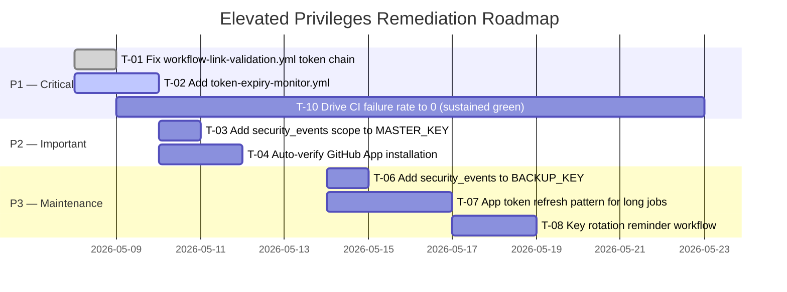

### 7.1 Quick Wins (Do Now — Each < 30 min)

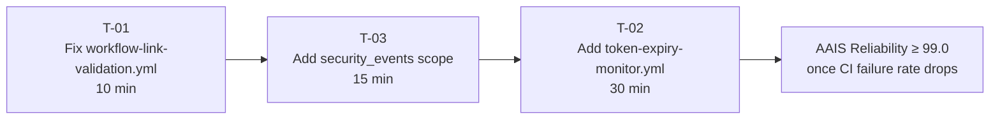

**T-01 exact steps:**
```bash
# Open the file
code .github/workflows/workflow-link-validation.yml

# Find: GH_TOKEN: ${{ github.token }}
# Replace with: GH_TOKEN: ${{ secrets.CODEX_MASTER_KEY || secrets.CODEX_BACKUP_KEY || github.token }}

# Validate
yamllint .github/workflows/workflow-link-validation.yml -c .yamllint.yml

# Commit
git add .github/workflows/workflow-link-validation.yml
git commit -m "fix(auth): canonical token chain in workflow-link-validation.yml [T-01]"
```

---

## 8. Mermaid Architecture Diagrams

### 8.1 Token Authority Hierarchy

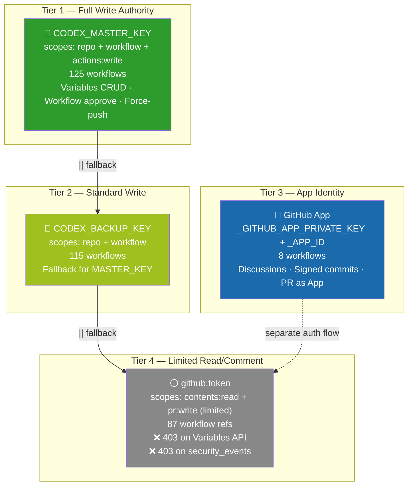

### 8.2 What Happens When CODEX_MASTER_KEY Expires

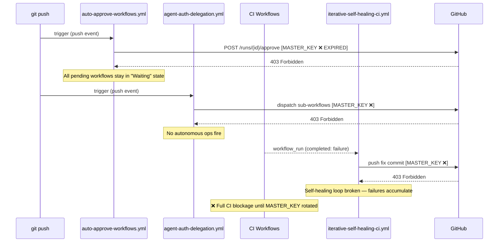

### 8.3 Optimal Token Routing (Target State)

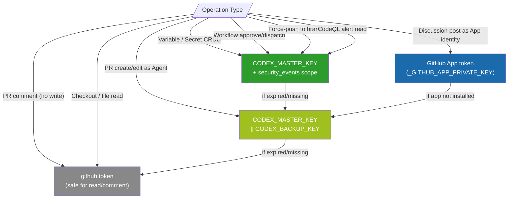

### 8.4 AAIS Score Impact of Token Health

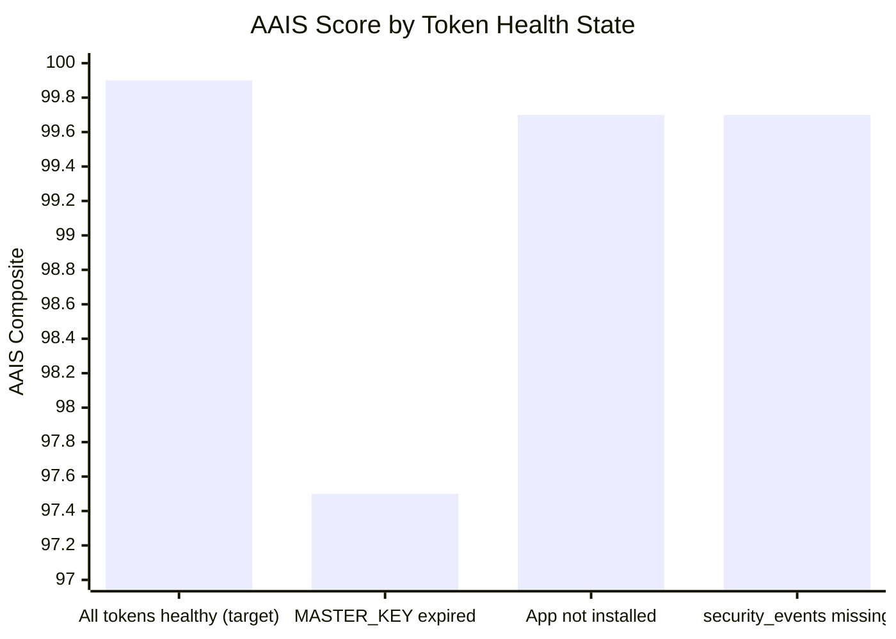

---

## Quick Reference Links

| Resource | Link |
|----------|------|
| Repository Secrets (view/edit) | [/settings/secrets/actions](https://github.com/Aries-Serpent/_codex_/settings/secrets/actions) |
| GitHub App settings (org) | [/organizations/Aries-Serpent/settings/apps](https://github.com/organizations/Aries-Serpent/settings/apps) |
| Personal Access Tokens (create/rotate) | [/settings/tokens](https://github.com/settings/tokens) |
| Admin Setup Verification (run test) | [actions/workflows/admin_setup_verification.yml](https://github.com/Aries-Serpent/_codex_/actions/workflows/admin_setup_verification.yml) |
| Token Authority Reference Doc | [docs/ci/GITHUB_API_COPILOT_AGENT_REFERENCE.md](../ci/GITHUB_API_COPILOT_AGENT_REFERENCE.md) |
| Variables & Secrets Full Reference | [docs/reference/GITHUB_VARIABLES_SECRETS_REFERENCE.md](./GITHUB_VARIABLES_SECRETS_REFERENCE.md) |
| MCP Tool Reference | [.codex/docs/COPILOT_MCP_TOOL_REFERENCE.md](../../.codex/docs/COPILOT_MCP_TOOL_REFERENCE.md) |
| Agentic Repo State (auth confirmed) | [.codex/AGENTIC_REPO_STATE.md](../../.codex/AGENTIC_REPO_STATE.md) |
| Rate Limit Awareness | [.codex/docs/RATE_LIMIT_AWARENESS.md](../../.codex/docs/RATE_LIMIT_AWARENESS.md) |

---

> **Maintainer:** @mbaetiong
> **Next review:** 2026-06-08 (monthly cadence)
> **Auto-update:** This document is updated by `copilot-swe-agent[bot]` at session start when token state changes.

---

## 9. Token Refresh Alignment Guide

> **When to use this section:** Any time you rotate, regenerate, or replace a token —
> use this as your complete checklist to keep every downstream consumer in sync.
> Partial updates cause silent 403s that are hard to diagnose.

---

### 9.1 Why Alignment Matters

A single PAT value is referenced in up to **five independent systems** simultaneously:

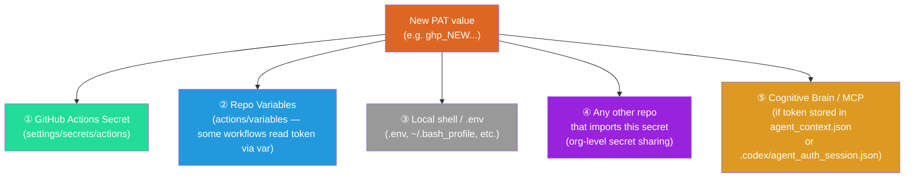

Missing **any one** of these means some workflows silently get the old (expired) value and return 403.

---

### 9.2 Master Refresh Checklist

Copy this checklist and tick each box as you complete it.

#### A. Rotating `CODEX_MASTER_KEY`

| Step | Location | Action | Direct Link |
|------|----------|--------|-------------|
| A-1 | GitHub PAT settings | Regenerate (or create new) Classic PAT with scopes: `repo`, `workflow`, `admin:repo_hook`, `read:org`, `security_events` (recommended) | [settings/tokens](https://github.com/settings/tokens) |
| A-2 | Repo Actions Secret | Update `CODEX_MASTER_KEY` secret value | [settings/secrets/actions/CODEX_MASTER_KEY/edit](https://github.com/Aries-Serpent/_codex_/settings/secrets/actions/CODEX_MASTER_KEY/edit) |
| A-3 | Repo Variables | Check if any variable **stores** a token value (see §9.3) — update any that reference MASTER_KEY | [settings/variables/actions](https://github.com/Aries-Serpent/_codex_/settings/variables/actions) |
| A-4 | `.codex/agent_auth_session.json` | If this file contains a token field, regenerate it via `python scripts/ci/write_agent_auth_session.py` | Local repo |
| A-5 | `.codex/agent_context.json` | Remove any stale `token` or `gh_token` key; the file should only contain variable *names*, not values | [.codex/agent_context.json](.codex/agent_context.json) |
| A-6 | Local `.env` / shell profile | Replace old value in `~/.bash_profile`, `~/.zshrc`, `.env`, or any local `.env.local` | Local machine |
| A-7 | Other repos sharing this PAT | If the org secret `CODEX_MASTER_KEY` is shared across repos, update it at org level too | [org/settings/secrets/actions](https://github.com/organizations/Aries-Serpent/settings/secrets/actions) |
| A-8 | Verify with live test | Re-run `admin_setup_verification.yml` → expand **KEY VERIFICATION** step — must pass | [admin_setup_verification.yml](https://github.com/Aries-Serpent/_codex_/actions/workflows/admin_setup_verification.yml) |
| A-9 | Update this doc | Change the **Updated** date in §1.1 and §2.1 | This file |

#### B. Rotating `CODEX_BACKUP_KEY`

| Step | Location | Action | Direct Link |
|------|----------|--------|-------------|
| B-1 | GitHub PAT settings | Regenerate Classic PAT with scopes: `repo`, `workflow` | [settings/tokens](https://github.com/settings/tokens) |
| B-2 | Repo Actions Secret | Update `CODEX_BACKUP_KEY` secret value | [settings/secrets/actions/CODEX_BACKUP_KEY/edit](https://github.com/Aries-Serpent/_codex_/settings/secrets/actions/CODEX_BACKUP_KEY/edit) |
| B-3 | Repo Variables | Same check as A-3 | [settings/variables/actions](https://github.com/Aries-Serpent/_codex_/settings/variables/actions) |
| B-4 | Local `.env` / shell | Replace old backup key value if stored locally | Local machine |
| B-5 | Verify fallback works | Temporarily blank MASTER_KEY in a local `.env`, run `GH_TOKEN=$CODEX_BACKUP_KEY gh api rate_limit` — should succeed | Local shell |

#### C. Rotating the GitHub App (`_GITHUB_APP_PRIVATE_KEY`)

| Step | Location | Action | Direct Link |
|------|----------|--------|-------------|
| C-1 | GitHub App settings | Generate a new private key on the App page (Downloads `.pem` file) | [organizations/Aries-Serpent/settings/apps](https://github.com/organizations/Aries-Serpent/settings/apps) |
| C-2 | Repo Actions Secret | Replace `_GITHUB_APP_PRIVATE_KEY` with the new `.pem` contents (full PEM block including `-----BEGIN/END RSA PRIVATE KEY-----`) | [settings/secrets/actions/_GITHUB_APP_PRIVATE_KEY/edit](https://github.com/Aries-Serpent/_codex_/settings/secrets/actions/_GITHUB_APP_PRIVATE_KEY/edit) |
| C-3 | `_GITHUB_APP_ID` | Verify this secret still matches the App ID shown on the App page (it doesn't rotate, but confirm) | [settings/secrets/actions](https://github.com/Aries-Serpent/_codex_/settings/secrets/actions) |
| C-4 | `_GITHUB_APP_INSTALLATION_ID` | Verify this still matches the installation (shown under the App → Installations) | App settings page |
| C-5 | Delete old private key | On the App settings page, delete the old private key entry to prevent dual-signing risks | App settings → Private keys list |
| C-6 | Test token minting | Run the Python snippet in §3.3 Step 5 to confirm the new key mints a valid installation token | Local shell |
| C-7 | Trigger `post-accountability-to-discussion.yml` | Manually dispatch this workflow to confirm Discussion posting works as App identity | [actions](https://github.com/Aries-Serpent/_codex_/actions) |

---

### 9.3 Variables That Must Stay in Sync

These **repository variables** (not secrets) contain either derived token metadata or
token-adjacent values that must be reviewed on every token rotation:

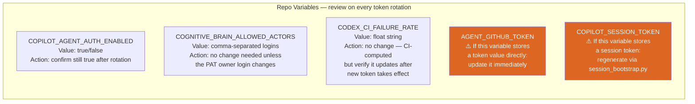

**How to list all current variables and spot any that contain token-like values:**

```bash
# List all repo variables (names + values)
GH_TOKEN=$CODEX_MASTER_KEY gh api \
  /repos/Aries-Serpent/_codex_/actions/variables \
  --paginate \
  --jq '.variables[] | "\(.name) = \(.value[:60])"'
```

**Look for any variable whose value starts with `ghp_`, `github_pat_`, `ghs_`, or `gho_`.**
Those are live token values stored as variables (not secrets) — they MUST be updated
alongside the secret rotation.

**Known variables to review (full list as of 2026-05-08):**

| Variable Name | Contains Token? | Action on Rotation |
|--------------|-----------------|-------------------|
| `COPILOT_AGENT_AUTH_ENABLED` | No — boolean `true`/`false` | ✅ No change needed |
| `COGNITIVE_BRAIN_ALLOWED_ACTORS` | No — login names | ✅ No change needed |
| `CODEX_CI_FAILURE_RATE` | No — float string | ✅ No change needed |
| `CODEX_SESSION_ID` | No — UUID | ✅ No change needed |
| `AGENT_GITHUB_TOKEN` | ⚠️ **Possibly** — check value | 🔄 Update if contains `ghp_` / `github_pat_` |
| `COPILOT_SESSION_TOKEN` | ⚠️ **Possibly** — session token | 🔄 Regenerate via `session_bootstrap.py` |
| `AAIS_LAST_SCORE` | No — numeric | ✅ No change needed |
| `CODEX_MASTER_KEY_LAST_VERIFIED` | No — timestamp | 🔄 Update after rotation confirmed |

---

### 9.4 Files in the Repo That Must Be Checked

Some files **in the repository itself** cache token-adjacent state and must be
inspected after a rotation:

| File | What to check | How to fix |
|------|--------------|-----------|
| `.codex/agent_context.json` | Remove any `gh_token`, `token`, or `api_key` field containing a live value | `python scripts/ci/repo_var_sync.py --sanitize` or edit manually |
| `.codex/agent_auth_session.json` | Contains a session token + actor list — regenerate if the actor list changes | `python scripts/ci/write_agent_auth_session.py` |
| `.codex/rate_limit_state.json` | Contains `earliest_reset_epoch` — stale after rotation but harmless; delete to force fresh check | `rm -f .codex/rate_limit_state.json` |
| `.secrets.baseline` | `detect-secrets` scans for high-entropy strings — new token may trigger a false positive | `python scripts/ci/sync_tracked_files.py --fix` then `git add .secrets.baseline` |

> **⚠️ Never commit a live token value into any of these files.**
> If `detect-secrets` flags a new string after rotation, add `# pragma: allowlist secret`
> to the line and update the baseline.

---

### 9.5 The `CODEX_MASTER_KEY_LAST_VERIFIED` Variable

This variable tracks when the token was last confirmed healthy. Update it immediately after a successful rotation verification:

```bash
# After confirming the new key works (admin_setup_verification.yml passes):
GH_TOKEN=$CODEX_MASTER_KEY gh api \
  --method PATCH \
  /repos/Aries-Serpent/_codex_/actions/variables/CODEX_MASTER_KEY_LAST_VERIFIED \
  -f name=CODEX_MASTER_KEY_LAST_VERIFIED \
  -f value="$(date -u +%Y-%m-%dT%H:%M:%SZ):ok"
```

If the variable doesn't exist yet, create it:

```bash
GH_TOKEN=$CODEX_MASTER_KEY gh api \
  --method POST \
  /repos/Aries-Serpent/_codex_/actions/variables \
  -f name=CODEX_MASTER_KEY_LAST_VERIFIED \
  -f value="$(date -u +%Y-%m-%dT%H:%M:%SZ):ok"
```

---

### 9.6 Post-Rotation Verification Script

Run this end-to-end check after completing any token rotation to confirm all consumers are aligned:

```bash
#!/usr/bin/env bash
# post_rotation_verify.sh — run after every token rotation
set -euo pipefail

echo "=== Post-Rotation Alignment Verification ==="
echo ""

# 1. Confirm new CODEX_MASTER_KEY works against Variables API
echo "1. Testing CODEX_MASTER_KEY → Variables API..."
STATUS=$(curl -s -o /dev/null -w "%{http_code}" \
  -H "Authorization: Bearer $CODEX_MASTER_KEY" \
  -H "X-GitHub-Api-Version: 2022-11-28" \
  "https://api.github.com/repos/Aries-Serpent/_codex_/actions/variables")
[ "$STATUS" = "200" ] && echo "   ✅ Variables API: OK" || echo "   ❌ Variables API: HTTP $STATUS"

# 2. Confirm workflow approval capability
echo "2. Testing CODEX_MASTER_KEY scopes..."
SCOPES=$(curl -sI \
  -H "Authorization: Bearer $CODEX_MASTER_KEY" \
  https://api.github.com/user | grep -i "x-oauth-scopes" | tr -d '\r')
echo "   Scopes: ${SCOPES:-none detected (may be fine-grained PAT)}"
echo "$SCOPES" | grep -q "workflow" && echo "   ✅ workflow scope: present" || echo "   ⚠️  workflow scope: missing"
echo "$SCOPES" | grep -q "repo" && echo "   ✅ repo scope: present" || echo "   ❌ repo scope: MISSING"

# 3. Check for stale token values in repo variables
echo "3. Scanning repo variables for embedded token values..."
VARS=$(GH_TOKEN=$CODEX_MASTER_KEY gh api \
  /repos/Aries-Serpent/_codex_/actions/variables \
  --paginate --jq '.variables[] | "\(.name)=\(.value)"' 2>/dev/null)
echo "$VARS" | grep -E "=(ghp_|github_pat_|ghs_|gho_)" \
  && echo "   ❌ Found variable(s) with embedded token values — UPDATE IMMEDIATELY" \
  || echo "   ✅ No embedded token values in repo variables"

# 4. Check agent_context.json for leaked token fields
echo "4. Checking .codex/agent_context.json for token fields..."
python3 -c "
import json, sys
try:
    d = json.load(open('.codex/agent_context.json'))
    tok_keys = [k for k,v in d.items() if isinstance(v,str) and any(v.startswith(p) for p in ['ghp_','github_pat_','ghs_','gho_'])]
    if tok_keys:
        print(f'   ❌ Token-like values found in keys: {tok_keys}')
        sys.exit(1)
    else:
        print('   ✅ No token values in agent_context.json')
except Exception as e:
    print(f'   ⚠️  Could not check: {e}')
"

# 5. Confirm secrets baseline is clean
echo "5. Running detect-secrets scan..."
if command -v detect-secrets &>/dev/null; then
  detect-secrets scan --baseline .secrets.baseline 2>/dev/null \
    && echo "   ✅ detect-secrets: no new secrets found" \
    || echo "   ⚠️  detect-secrets found new strings — run: python scripts/ci/sync_tracked_files.py --fix"
else
  echo "   ⚠️  detect-secrets not installed — run: pip install detect-secrets"
fi

echo ""
echo "=== Verification complete. Fix any ❌ items before proceeding. ==="
```

Save as `scripts/ci/post_rotation_verify.sh` and run:
```bash
chmod +x scripts/ci/post_rotation_verify.sh
CODEX_MASTER_KEY=<new_token_value> ./scripts/ci/post_rotation_verify.sh
```

---

### 9.7 Alignment State Diagram

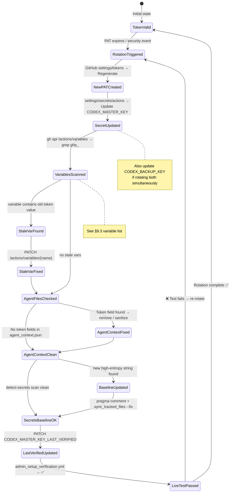

---

### 9.8 Simultaneous Multi-Token Rotation Order

When rotating **all tokens at once** (e.g., a security incident requiring full credential sweep), follow this order to avoid CI lockout:

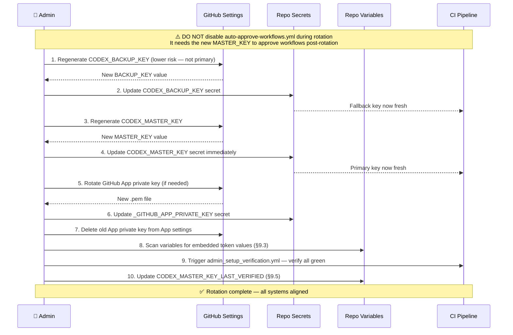

> **🚨 Critical ordering rule:** Always update `CODEX_BACKUP_KEY` **before** `CODEX_MASTER_KEY`.
> This ensures the fallback chain is valid at every moment during the transition.
> If both expire simultaneously, CI will be in a degraded state for the seconds between
> secret updates — this order minimises that window.

---

### 9.9 Scope Requirements Reference

Use this table when creating or regenerating PATs to ensure you select the right checkboxes:

| Token | Required Scopes | Optional / Recommended | Prohibited |
|-------|----------------|----------------------|------------|
| `CODEX_MASTER_KEY` | `repo` (full) · `workflow` | `admin:repo_hook` · `read:org` · `security_events` | `delete_repo` · `admin:org` · `admin:enterprise` |
| `CODEX_BACKUP_KEY` | `repo` (full) · `workflow` | `read:org` · `security_events` | `delete_repo` · `admin:org` |
| GitHub App | App-level permissions (not scopes) | `pull_requests:write` · `contents:write` · `issues:write` · `discussions:write` | — |

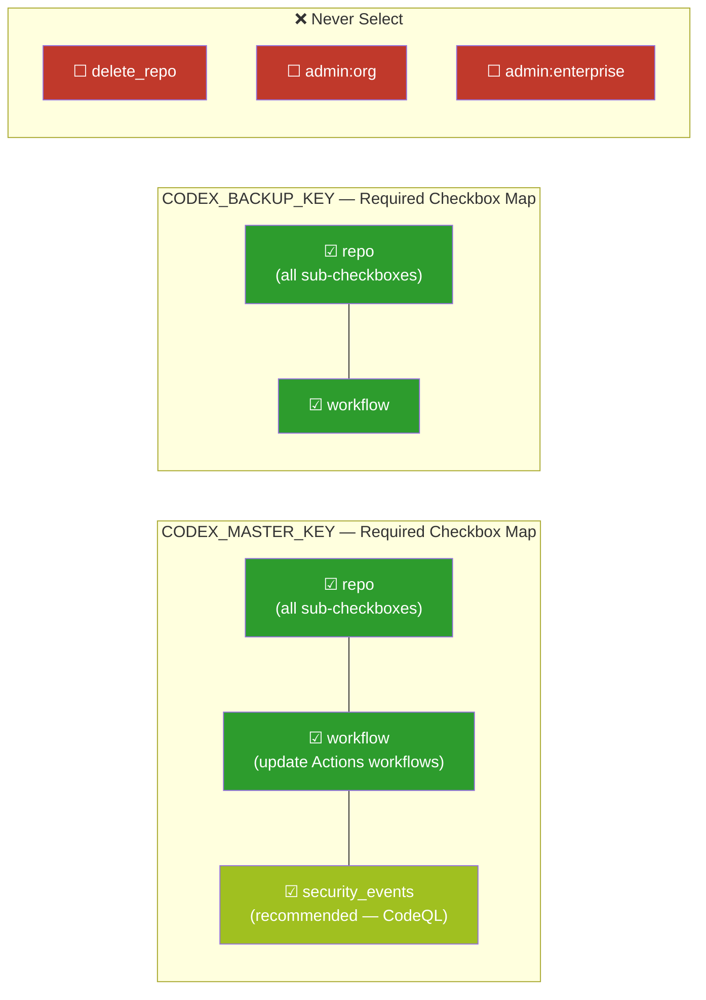

---

### 9.10 Token Rotation Impact Summary

This matrix shows which **CI workflows** are directly impacted when each token is unavailable.
Use it to prioritise which rotation to complete first in an emergency.

| Failing Token | Directly Broken Workflows | Observable Symptom | Time-to-Detect |
|--------------|--------------------------|-------------------|----------------|
| `CODEX_MASTER_KEY` | `auto-approve-workflows.yml` · `agent-auth-delegation.yml` · `iterative-self-healing-ci.yml` · `session_wrapup_autofix.py` · `copilot-agent-checkin.yml` · `wec_enforcer.py` (dispatch) · `trigger-on-approval.yml` | All CI workflows stuck in **"Waiting for approval"** indefinitely; WEC gate fails; self-healing loop broken | **Immediate** — first push after expiry |
| `CODEX_BACKUP_KEY` | Fallback in `agent-auth-delegation.yml` and 114 other workflows if MASTER_KEY is also absent | Silent degradation — only visible if MASTER_KEY also fails | Only when MASTER_KEY also fails |
| `_GITHUB_APP_PRIVATE_KEY` | `post-accountability-to-discussion.yml` · `copilot-pr-session-injector.yml` | App-identity Discussion posts silently skipped; PRs created as `github-actions[bot]` instead of App | **Delayed** — only noticed on Discussion post |
| `github.token` | Cannot expire (refreshed per-run by GitHub) | N/A | N/A |

> **Emergency triage order:** CODEX_MASTER_KEY → CODEX_BACKUP_KEY → GitHub App key

---

## Quick Reference Links

| Resource | Link |
|----------|------|
| Repository Secrets (view/edit) | [/settings/secrets/actions](https://github.com/Aries-Serpent/_codex_/settings/secrets/actions) |
| GitHub App settings (org) | [/organizations/Aries-Serpent/settings/apps](https://github.com/organizations/Aries-Serpent/settings/apps) |
| Personal Access Tokens (create/rotate) | [/settings/tokens](https://github.com/settings/tokens) |
| Repo Variables (view/edit) | [/settings/variables/actions](https://github.com/Aries-Serpent/_codex_/settings/variables/actions) |
| Admin Setup Verification (run test) | [actions/workflows/admin_setup_verification.yml](https://github.com/Aries-Serpent/_codex_/actions/workflows/admin_setup_verification.yml) |
| Token Authority Reference Doc | [docs/ci/GITHUB_API_COPILOT_AGENT_REFERENCE.md](../ci/GITHUB_API_COPILOT_AGENT_REFERENCE.md) |
| Variables & Secrets Full Reference | [docs/reference/GITHUB_VARIABLES_SECRETS_REFERENCE.md](./GITHUB_VARIABLES_SECRETS_REFERENCE.md) |
| MCP Tool Reference | [.codex/docs/COPILOT_MCP_TOOL_REFERENCE.md](../../.codex/docs/COPILOT_MCP_TOOL_REFERENCE.md) |
| Agentic Repo State (auth confirmed) | [.codex/AGENTIC_REPO_STATE.md](../../.codex/AGENTIC_REPO_STATE.md) |
| Rate Limit Awareness | [.codex/docs/RATE_LIMIT_AWARENESS.md](../../.codex/docs/RATE_LIMIT_AWARENESS.md) |
| Post-Rotation Verify Script | [scripts/ci/post_rotation_verify.sh](../../scripts/ci/post_rotation_verify.sh) |

---

> **Maintainer:** @mbaetiong
> **Next review:** 2026-06-08 (monthly cadence)
> **Last updated:** 2026-05-08 — Section 9 (Token Refresh Alignment Guide) added
> **Auto-update:** This document is updated by `copilot-swe-agent[bot]` at session start when token state changes.
