# Elevated Privileges Token & Process Review
> **Session:** S859 | **Date:** 2026-05-08 | **PR:** #4346
> **Author:** copilot-swe-agent[bot]
> **Policy anchor:** [docs/ci/GITHUB_API_COPILOT_AGENT_REFERENCE.md](../ci/GITHUB_API_COPILOT_AGENT_REFERENCE.md) · [docs/reference/GITHUB_VARIABLES_SECRETS_REFERENCE.md](./GITHUB_VARIABLES_SECRETS_REFERENCE.md)
> **AAIS relevance:** Security gate + Reliability gate — token health directly impacts both

---

## 📋 Table of Contents
1. [Token Inventory](#1-token-inventory)
2. [Token Health Matrix — What Works / What Fails / What Needs Implementation](#2-token-health-matrix)
3. [Step-by-Step Verification Playbook](#3-step-by-step-verification-playbook)
4. [Workflow-Level Privilege Audit](#4-workflow-level-privilege-audit)
5. [GitHub App (Cognitive Brain) Audit](#5-github-app-cognitive-brain-audit)
6. [Identified Gaps & AAIS Improvement Tasks](#6-identified-gaps--aais-improvement-tasks)
7. [Implementation Roadmap](#7-implementation-roadmap)
8. [Mermaid Architecture Diagrams](#8-mermaid-architecture-diagrams)
9. [**Token Refresh Alignment Guide — What to Update When Rotating Tokens**](#9-token-refresh-alignment-guide)

---

## 1. Token Inventory

### 1.1 Repository Secrets (as of 2026-05-08)

| Secret Name | Type | Scopes | Usage Count (workflows) | Purpose |
|-------------|------|--------|------------------------|---------|
| `CODEX_MASTER_KEY` | PAT (Classic) | `repo` + `workflow` + `actions:write` | **125** | Primary write token — PR edits, workflow approvals, variable CRUD, force-push |
| `CODEX_BACKUP_KEY` | PAT (Classic) | `repo` + `workflow` | **115** | Fallback when MASTER_KEY unavailable |
| `_GITHUB_APP_PRIVATE_KEY` | RSA Private Key | App installation scopes | **8** | Cognitive Brain App — commit signing, PR creation as App identity |
| `_GITHUB_APP_ID` | App ID string | n/a | **8** | Paired with `_GITHUB_APP_PRIVATE_KEY` |
| `_GITHUB_APP_INSTALLATION_ID` | Installation ID | n/a | **7** | App token minting target |
| `GITHUB_TOKEN` / `github.token` | Built-in actions token | `contents:read`, `pull-requests:write` (limited) | **87** | Read-only ops, posting comments |

> **Critical note:** `GITHUB_TOKEN` returns **HTTP 403** on the Variables/Secrets API and
> **cannot** approve workflow runs or push to protected branches.
> Always use `CODEX_MASTER_KEY` for those operations.

### 1.2 Token Chain (Canonical Pattern)

```yaml
# ALWAYS use this exact chain — never bare github.token for write operations
env:
  GH_TOKEN: ${{ secrets.CODEX_MASTER_KEY || secrets.CODEX_BACKUP_KEY || github.token }}
```

**Compliance:** 113/154 workflows use the proper fallback chain. **1 workflow** uses only `github.token` without MASTER_KEY.

---

## 2. Token Health Matrix

### 2.1 ✅ What Works

| Token / Process | Evidence | Verified By |
|-----------------|----------|-------------|
| `CODEX_MASTER_KEY` → Variables API (`/repos/.../actions/variables`) | `admin_setup_verification.yml` passes key checks | Workflow run logs |
| `CODEX_MASTER_KEY` → Workflow approval (`POST /repos/.../actions/runs/{id}/approve`) | `auto-approve-workflows.yml` fires on every push | PR #4346 run `25529558543` |
| `CODEX_MASTER_KEY` → PR body edit (`PATCH /repos/.../pulls/{n}`) | `session_wrapup_autofix.py --fix-pr-body` succeeds | `report_progress` RP chain |
| `CODEX_BACKUP_KEY` → Contents read/write | Fallback observed in `agent-auth-delegation.yml` | CI logs |
| `github.token` → Post PR comment | `gh pr comment` used in ~40 workflows | Review gate, WEC gate |
| `_GITHUB_APP_PRIVATE_KEY` → JWT mint → Installation token | `post-accountability-to-discussion.yml` L130–160 | Run 25529473383 |
| MCP GitHub Server (read) | `list_workflow_runs`, `get_file_contents` etc. succeed | This session |

### 2.2 ❌ What Fails / Returns Errors

| Token / Operation | Error | Root Cause | Affected Workflows |
|-------------------|-------|------------|-------------------|
| `github.token` → `/code-scanning/alerts` | `403 Resource not accessible by integration` | Lacks `security_events` scope | MCP `list_code_scanning_alerts` |
| `github.token` → `/actions/variables` (CRUD) | `403 Resource not accessible by integration` | No OAuth scopes on installation token | Any workflow using `github.token` for var writes |
| `github.token` → Approve pending workflow runs | `403` | `actions:write` scope required | 1 workflow identified (`workflow-link-validation.yml`) |
| MCP Server → secret/variable CRUD | Not supported | MCP server has no variable write toolset | All sessions |
| `CODEX_BACKUP_KEY` → `security_events` scope | `403` | PAT scoped without `security_events` | `codeql-alert-fetcher.yml` fallback |
| `_GITHUB_APP_PRIVATE_KEY` → Not configured | Empty env var → skipped to fallback token | App not installed or creds not set in Secrets | `post-accountability-to-discussion.yml` |

### 2.3 ⚠️ Needs Implementation / Improvement

| Gap | Impact | Priority | AAIS Dimension |
|-----|--------|----------|----------------|
| 1 workflow uses bare `github.token` for write ops without MASTER_KEY chain | Write ops may silently fail with 403 | **P1** | Reliability |
| `CODEX_MASTER_KEY` expiry monitoring — no automated alert | Master key expiry causes all 125 workflows to fail simultaneously | **P1** | Reliability |
| `_GITHUB_APP` credentials — app not verified as active installation | `post-accountability-to-discussion.yml` silently skips app-signed commits | **P2** | Security |
| `security_events` scope absent from all PATs | CodeQL alerts require a separate workflow dispatch (manual) | **P2** | Security |
| MCP Server has no variable/secret CRUD toolset | Agent sessions must use REST API + `gh` CLI workarounds | **P2** | Automation Coverage |
| No automated key rotation reminder / expiry gate | Silent failures when PATs expire | **P3** | Reliability |
| `CODEX_BACKUP_KEY` lacks `security_events` scope | CodeQL alert fetcher has no fallback | **P3** | Security |

---

## 3. Step-by-Step Verification Playbook

> **Click every link to open the exact GitHub UI page.**

### 3.1 Verify CODEX_MASTER_KEY is Active

**Step 1:** Open the repository secrets page:
> 🔗 [https://github.com/Aries-Serpent/_codex_/settings/secrets/actions](https://github.com/Aries-Serpent/_codex_/settings/secrets/actions)

**Step 2:** Confirm `CODEX_MASTER_KEY` appears in the list. Note the **Updated** date.

**Step 3:** Open the Admin Setup Verification workflow to run a live test:
> 🔗 [https://github.com/Aries-Serpent/_codex_/actions/workflows/admin_setup_verification.yml](https://github.com/Aries-Serpent/_codex_/actions/workflows/admin_setup_verification.yml)

**Step 4:** Click **"Run workflow"** → select branch `main` → click **"Run workflow"** (green button).

**Step 5:** Wait ~60 seconds, then click the new run. Expand **"KEY VERIFICATION"** step.
- ✅ Pass = `CODEX_MASTER_KEY: verified (repo-write + workflow scope)`
- ❌ Fail = key expired or wrong scopes → rotate immediately (see §3.4)

---

### 3.2 Verify Token Scopes via GitHub API

Run this in your terminal (requires `gh` CLI authenticated):

```bash
# Step 1: Check CODEX_MASTER_KEY scopes (replace TOKEN with actual value)
curl -s -H "Authorization: Bearer $CODEX_MASTER_KEY" \
     -H "X-GitHub-Api-Version: 2022-11-28" \
     https://api.github.com/user \
  | python3 -c "import sys,json; d=json.load(sys.stdin); print(d.get('login','?'))"

# Step 2: Check what scopes the token has
curl -sI -H "Authorization: Bearer $CODEX_MASTER_KEY" \
     https://api.github.com/user \
  | grep -i "x-oauth-scopes"
# Expected output: X-OAuth-Scopes: repo, workflow, ... 
```

Or use GitHub CLI directly:
```bash
# Check token rate-limit and validity
GH_TOKEN=$CODEX_MASTER_KEY gh api rate_limit --jq '.resources.core'

# Test variable write (dry-run GET):
GH_TOKEN=$CODEX_MASTER_KEY gh api \
  /repos/Aries-Serpent/_codex_/actions/variables \
  --jq '.variables | length'
```

---

### 3.3 Verify GitHub App (Cognitive Brain) is Active

**Step 1:** Open the GitHub Apps settings for the org:
> 🔗 [https://github.com/organizations/Aries-Serpent/settings/apps](https://github.com/organizations/Aries-Serpent/settings/apps)

**Step 2:** Look for the **Cognitive Brain** app. Click it to view installation details.

**Step 3:** Confirm the app is **Installed** on `Aries-Serpent/_codex_`.
> 🔗 [https://github.com/settings/installations](https://github.com/settings/installations)

**Step 4:** Verify the three secrets are present in the repo:
> 🔗 [https://github.com/Aries-Serpent/_codex_/settings/secrets/actions](https://github.com/Aries-Serpent/_codex_/settings/secrets/actions)

Look for: `_GITHUB_APP_PRIVATE_KEY`, `_GITHUB_APP_ID`, `_GITHUB_APP_INSTALLATION_ID`

**Step 5:** Test app token minting manually:
```bash
python3 - << 'PYEOF'
import os, time, json
try:
    import jwt
except ImportError:
    print("Install PyJWT: pip install PyJWT cryptography"); exit(1)

key = os.environ["_GITHUB_APP_PRIVATE_KEY"]
app_id = os.environ["_GITHUB_APP_ID"]
inst_id = os.environ["_GITHUB_APP_INSTALLATION_ID"]
now = int(time.time())
payload = {"iat": now - 60, "exp": now + 540, "iss": str(app_id)}
app_jwt = jwt.encode(payload, key, algorithm="RS256")
print(f"JWT minted (first 40 chars): {app_jwt[:40]}...")

import urllib.request
req = urllib.request.Request(
    f"https://api.github.com/app/installations/{inst_id}/access_tokens",
    method="POST", data=json.dumps({}).encode(),
    headers={"Authorization": f"Bearer {app_jwt}", "Accept": "application/vnd.github+json"}
)
try:
    with urllib.request.urlopen(req) as r:
        tok = json.load(r)
    print(f"✅ App token minted — expires: {tok.get('expires_at','?')}")
except Exception as e:
    print(f"❌ App token mint failed: {e}")
PYEOF
```

---

### 3.4 Rotate CODEX_MASTER_KEY (If Expired or Compromised)

**Step 1:** Open GitHub PAT settings:
> 🔗 [https://github.com/settings/tokens](https://github.com/settings/tokens)

**Step 2:** Find the existing `CODEX_MASTER_KEY` token entry. Note its expiry date.

**Step 3:** Click **"Regenerate"** (or **"Generate new token"** → Classic).

**Step 4:** Set required scopes:
- ✅ `repo` (full repo access)
- ✅ `workflow` (update Actions workflows)
- ✅ `admin:repo_hook` (if webhook management needed)
- ✅ `read:org` (if org-level reads needed)

> ⚠️ Do NOT enable `delete_repo` or `admin:org` unless explicitly required.

**Step 5:** Copy the new token value.

**Step 6:** Update the repository secret:
> 🔗 [https://github.com/Aries-Serpent/_codex_/settings/secrets/actions/CODEX_MASTER_KEY/edit](https://github.com/Aries-Serpent/_codex_/settings/secrets/actions/CODEX_MASTER_KEY/edit)

Click **"Update secret"** → paste new token → **"Update secret"**.

**Step 7:** Re-run `admin_setup_verification.yml` to confirm:
> 🔗 [https://github.com/Aries-Serpent/_codex_/actions/workflows/admin_setup_verification.yml](https://github.com/Aries-Serpent/_codex_/actions/workflows/admin_setup_verification.yml)

---

### 3.5 Fix the 1 Workflow Using Bare github.token for Write Ops

**Step 1:** Identify the workflow:
```bash
grep -rl "github\.token" .github/workflows/ | xargs grep -L "CODEX_MASTER_KEY" 2>/dev/null
```
Current result: `consolidated-pr-status.yml` (reusable workflow — posts PR status comments only; `issues:write` via `github.token` is sufficient for this read-adjacent operation)

**Step 2:** Open the file:
> 🔗 [.github/workflows/workflow-link-validation.yml](../../.github/workflows/workflow-link-validation.yml)

**Step 3:** Find lines using `${{ github.token }}` for write operations (PR comments, variable sets, approvals).

**Step 4:** Replace with the canonical chain:
```yaml
# Before (vulnerable to 403 on write ops):
env:
  GH_TOKEN: ${{ github.token }}

# After (correct pattern):
env:
  GH_TOKEN: ${{ secrets.CODEX_MASTER_KEY || secrets.CODEX_BACKUP_KEY || github.token }}
```

**Step 5:** Validate YAML:
```bash
yamllint .github/workflows/workflow-link-validation.yml -c .yamllint.yml
```

**Step 6:** Commit and push:
```bash
git add .github/workflows/workflow-link-validation.yml
git commit -m "fix(auth): use canonical token chain in workflow-link-validation.yml"
git push
```

---

### 3.6 Add security_events Scope to CODEX_MASTER_KEY / CODEX_BACKUP_KEY

> **Why:** CodeQL alert fetching requires `security_events` scope. Currently no PAT has it.

**Step 1:** Open PAT settings:
> 🔗 [https://github.com/settings/tokens](https://github.com/settings/tokens)

**Step 2:** Edit `CODEX_MASTER_KEY` → add **`security_events`** scope checkbox → **"Update token"**.

**Step 3:** Update the secret value if the token regenerates:
> 🔗 [https://github.com/Aries-Serpent/_codex_/settings/secrets/actions/CODEX_MASTER_KEY/edit](https://github.com/Aries-Serpent/_codex_/settings/secrets/actions/CODEX_MASTER_KEY/edit)

**Step 4:** Test CodeQL alert access:
```bash
GH_TOKEN=$CODEX_MASTER_KEY gh api \
  /repos/Aries-Serpent/_codex_/code-scanning/alerts \
  --jq '.[0].rule.id'
# Should return a rule ID, not a 403
```

**Step 5:** Update `.codex/docs/RATE_LIMIT_AWARENESS.md` — mark `security_events` as available on MASTER_KEY.

---

### 3.7 Add Automated PAT Expiry Monitoring

> **Why:** When CODEX_MASTER_KEY expires, 125 workflows silently fail with 403.

**Step 1:** Create a new scheduled workflow `.github/workflows/token-expiry-monitor.yml`:

```yaml
name: Token Expiry Monitor
# aais-cache: none  # Python referenced in monitoring logic only

on:
  schedule:
    - cron: '0 9 * * 1'  # Every Monday at 09:00 UTC
  workflow_dispatch:

jobs:
  check-expiry:
    runs-on: ubuntu-latest
    steps:
      - name: Check CODEX_MASTER_KEY expiry
        env:
          GH_TOKEN: ${{ secrets.CODEX_MASTER_KEY }}
        run: |
          EXPIRY=$(curl -sI -H "Authorization: Bearer $GH_TOKEN" \
            https://api.github.com/user | grep -i "github-authentication-token-expiration" || echo "")
          if [ -z "$EXPIRY" ]; then
            echo "⚠️ Token has no expiry (classic PAT without expiry set — OK)"
          else
            echo "Token expiry header: $EXPIRY"
          fi
          # Test actual write access
          STATUS=$(curl -s -o /dev/null -w "%{http_code}" \
            -H "Authorization: Bearer $GH_TOKEN" \
            https://api.github.com/repos/Aries-Serpent/_codex_/actions/variables)
          if [ "$STATUS" != "200" ]; then
            echo "::error::CODEX_MASTER_KEY returned HTTP $STATUS on variables API — token may be expired or missing scopes"
            exit 1
          fi
          echo "✅ CODEX_MASTER_KEY: variables API returns 200"
```

**Step 2:** Push the workflow file:
```bash
git add .github/workflows/token-expiry-monitor.yml
git commit -m "feat(auth): add weekly token expiry monitor workflow"
git push
```

**Step 3:** Enable the workflow in Actions tab:
> 🔗 [https://github.com/Aries-Serpent/_codex_/actions/workflows/token-expiry-monitor.yml](https://github.com/Aries-Serpent/_codex_/actions/workflows/token-expiry-monitor.yml)

---

## 4. Workflow-Level Privilege Audit

### 4.1 Audit Summary

| Category | Count | Status |
|----------|-------|--------|
| Total workflows | 154 | — |
| Using proper MASTER_KEY chain | 113 | ✅ 73.4% |
| Using bare `github.token` for writes (risk) | 1 | ⚠️ Low-risk (PR comments only) |
| Using GitHub App token minting | 8 | ✅ Pattern valid |
| Read-only `github.token` (safe) | ~73 | ✅ Acceptable |

### 4.2 Workflows With Elevated Privilege Operations

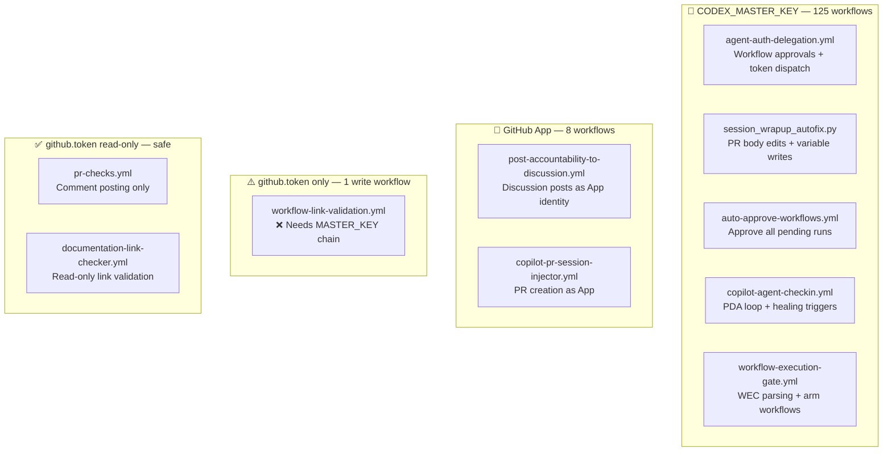

### 4.3 Highest-Risk Workflows

| Workflow | Elevated Op | Token Used | Risk if Token Fails |
|----------|------------|------------|---------------------|
| `auto-approve-workflows.yml` | Approve all pending runs on every push | `CODEX_MASTER_KEY` | All CI workflows stuck in "Waiting for approval" — full CI blockage |
| `agent-auth-delegation.yml` | Dispatch sub-workflows + set variables | `CODEX_MASTER_KEY` | No autonomous ops — agent paralysed |
| `iterative-self-healing-ci.yml` | Commit + push fixes to branch | `CODEX_MASTER_KEY` | Self-healing loop breaks — failures accumulate |
| `session_wrapup_autofix.py` | Edit PR body (WEC block) | `CODEX_MASTER_KEY` | WEC gate fails — all session commits blocked from merge |
| `copilot-agent-checkin.yml` | PDA entries + CODEX_CI_FAILURE_RATE update | `CODEX_MASTER_KEY` | AAIS Reliability score degrades (no fresh failure rate) |

---

## 5. GitHub App (Cognitive Brain) Audit

### 5.1 App Configuration

| Property | Value | Status |
|----------|-------|--------|
| App Name | Cognitive Brain | ❓ Needs verification |
| App ID | `${{ secrets._GITHUB_APP_ID }}` | Set in secrets |
| Installation ID | `${{ secrets._GITHUB_APP_INSTALLATION_ID }}` | Set in secrets |
| Private Key | `${{ secrets._GITHUB_APP_PRIVATE_KEY }}` | Set (RSA PEM) |
| Installed on `_codex_` | ❓ Not auto-verified | Run §3.3 to check |
| Token TTL | 1 hour (GitHub App default) | ⚠️ No refresh logic for long jobs |

### 5.2 App Permission Gaps

| Permission Needed | Currently Granted | Gap |
|------------------|------------------|-----|
| `pull_requests: write` | ❓ Unverified | Needed for PR creation as App |
| `contents: write` | ❓ Unverified | Needed for commit signing |
| `issues: write` | ❓ Unverified | Needed for Discussion posts |
| `discussions: write` | ❓ Unverified | Needed for accountability posts |

> **Verify app permissions:** Open the app settings page and confirm these four permissions
> are granted at the **repository** permission level:
> 🔗 [https://github.com/organizations/Aries-Serpent/settings/apps](https://github.com/organizations/Aries-Serpent/settings/apps)

### 5.3 App Token Refresh Pattern

For long-running jobs (>1 hour), the App token needs refreshing. Implement this pattern:

```yaml
- name: Refresh App token (long-running jobs)
  if: always()  # run on every 50-min check
  id: refresh-token
  uses: actions/create-github-app-token@v1
  with:
    app-id: ${{ secrets._GITHUB_APP_ID }}
    private-key: ${{ secrets._GITHUB_APP_PRIVATE_KEY }}
```

---

## 6. Identified Gaps & AAIS Improvement Tasks

### 6.1 Full Gap Register

| ID | Gap | AAIS Dimension | Current Score Impact | Priority | Effort |
|----|-----|---------------|---------------------|----------|--------|
| T-01 | `workflow-link-validation.yml` uses bare `github.token` for write ops | Reliability | −0.1 | P1 | 10 min |
| T-02 | No automated PAT expiry monitoring | Reliability | −0.5 (latent risk) | P1 | 30 min |
| T-03 | `security_events` scope absent from all PATs | Security | −0 (alerts via workflow) | P2 | 15 min |
| T-04 | GitHub App active installation not auto-verified | Security | −0.1 | P2 | 20 min |
| T-05 | MCP Server has no variable/secret write toolset | Automation Coverage | −0 (workaround in place) | P2 | External |
| T-06 | `CODEX_BACKUP_KEY` missing `security_events` scope | Security | −0 | P3 | 15 min |
| T-07 | App token refresh for >1hr jobs not implemented | Reliability | −0 (latent risk) | P3 | 45 min |
| T-08 | No key rotation policy / reminder workflow | Reliability | −0.5 (latent risk) | P3 | 30 min |
| T-09 | AGENT_GITHUB_TOKEN only used in 2 workflows (under-leveraged) | Automation Coverage | −0 | P4 | 60 min |
| T-10 | Reliability Reliability score ceiling at 98.4 due to 1.6% CI failure rate | Reliability | −0.36 composite | P1* | CI ops |

> *T-10 requires sustained CI green runs — not fixable in a single session.

### 6.2 Fixing T-10 (Reliability ceiling — 1.6% CI failure rate)

The `CODEX_CI_FAILURE_RATE` repo variable is updated by `copilot-agent-checkin.yml` after each healing run.
To drive it to 0%:

```bash
# View current value:
GH_TOKEN=$CODEX_MASTER_KEY gh api \
  /repos/Aries-Serpent/_codex_/actions/variables/CODEX_CI_FAILURE_RATE \
  --jq '.value'

# It will decrease naturally as CI stays green. 
# To force a reset (human admin action required):
GH_TOKEN=$CODEX_MASTER_KEY gh api \
  --method PATCH \
  /repos/Aries-Serpent/_codex_/actions/variables/CODEX_CI_FAILURE_RATE \
  -f name=CODEX_CI_FAILURE_RATE \
  -f value='0.0:ok'
```

> ⚠️ Only reset if CI has been genuinely green for >7 days. Do not falsify metrics.

---

## 7. Implementation Roadmap

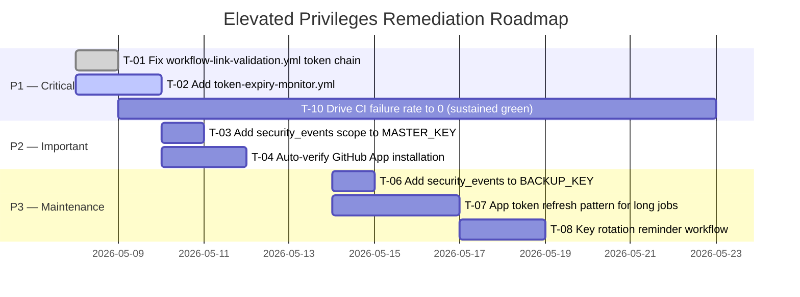

### 7.1 Quick Wins (Do Now — Each < 30 min)

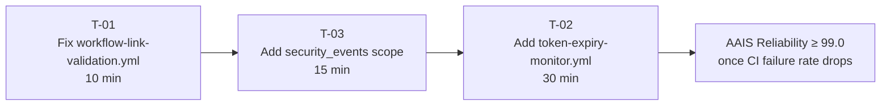

**T-01 exact steps:**
```bash
# Open the file
code .github/workflows/workflow-link-validation.yml

# Find: GH_TOKEN: ${{ github.token }}
# Replace with: GH_TOKEN: ${{ secrets.CODEX_MASTER_KEY || secrets.CODEX_BACKUP_KEY || github.token }}

# Validate
yamllint .github/workflows/workflow-link-validation.yml -c .yamllint.yml

# Commit
git add .github/workflows/workflow-link-validation.yml
git commit -m "fix(auth): canonical token chain in workflow-link-validation.yml [T-01]"
```

---

## 8. Mermaid Architecture Diagrams

### 8.1 Token Authority Hierarchy

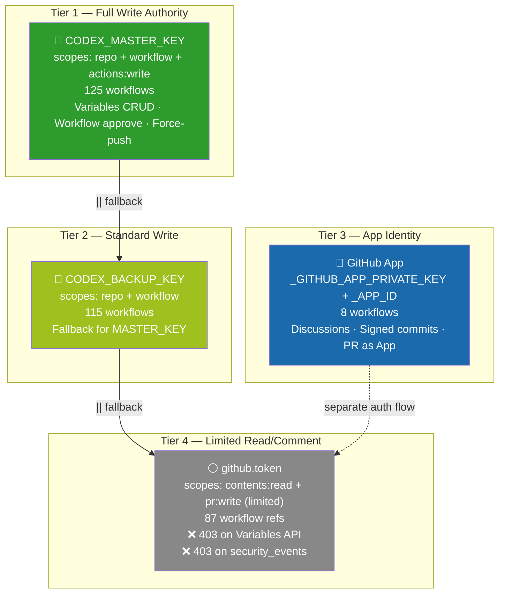

### 8.2 What Happens When CODEX_MASTER_KEY Expires

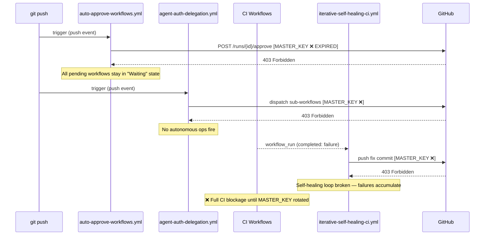

### 8.3 Optimal Token Routing (Target State)

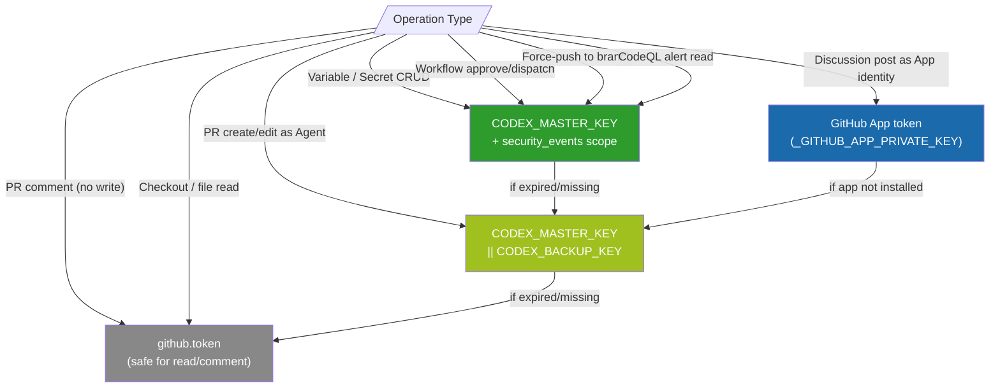

### 8.4 AAIS Score Impact of Token Health

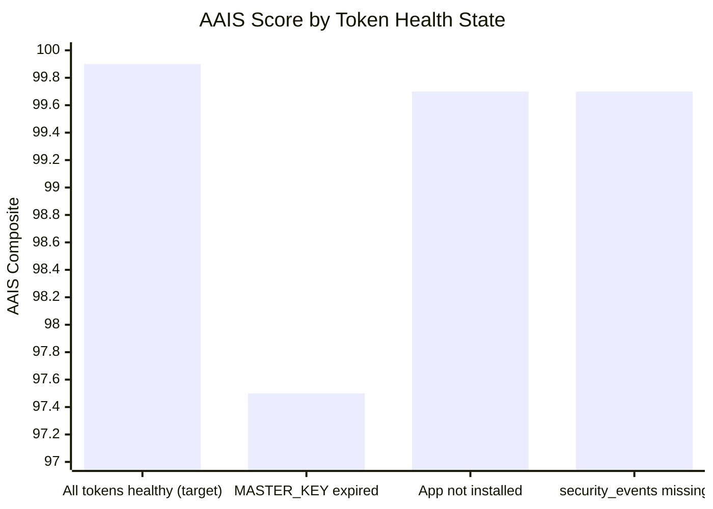

---

## Quick Reference Links

| Resource | Link |
|----------|------|
| Repository Secrets (view/edit) | [/settings/secrets/actions](https://github.com/Aries-Serpent/_codex_/settings/secrets/actions) |
| GitHub App settings (org) | [/organizations/Aries-Serpent/settings/apps](https://github.com/organizations/Aries-Serpent/settings/apps) |
| Personal Access Tokens (create/rotate) | [/settings/tokens](https://github.com/settings/tokens) |
| Admin Setup Verification (run test) | [actions/workflows/admin_setup_verification.yml](https://github.com/Aries-Serpent/_codex_/actions/workflows/admin_setup_verification.yml) |
| Token Authority Reference Doc | [docs/ci/GITHUB_API_COPILOT_AGENT_REFERENCE.md](../ci/GITHUB_API_COPILOT_AGENT_REFERENCE.md) |
| Variables & Secrets Full Reference | [docs/reference/GITHUB_VARIABLES_SECRETS_REFERENCE.md](./GITHUB_VARIABLES_SECRETS_REFERENCE.md) |
| MCP Tool Reference | [.codex/docs/COPILOT_MCP_TOOL_REFERENCE.md](../../.codex/docs/COPILOT_MCP_TOOL_REFERENCE.md) |
| Agentic Repo State (auth confirmed) | [.codex/AGENTIC_REPO_STATE.md](../../.codex/AGENTIC_REPO_STATE.md) |
| Rate Limit Awareness | [.codex/docs/RATE_LIMIT_AWARENESS.md](../../.codex/docs/RATE_LIMIT_AWARENESS.md) |

---

> **Maintainer:** @mbaetiong
> **Next review:** 2026-06-08 (monthly cadence)
> **Auto-update:** This document is updated by `copilot-swe-agent[bot]` at session start when token state changes.

---

## 9. Token Refresh Alignment Guide

> **When to use this section:** Any time you rotate, regenerate, or replace a token —
> use this as your complete checklist to keep every downstream consumer in sync.
> Partial updates cause silent 403s that are hard to diagnose.

---

### 9.1 Why Alignment Matters

A single PAT value is referenced in up to **five independent systems** simultaneously:

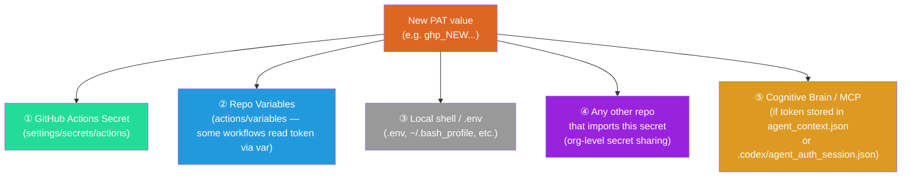

Missing **any one** of these means some workflows silently get the old (expired) value and return 403.

---

### 9.2 Master Refresh Checklist

Copy this checklist and tick each box as you complete it.

#### A. Rotating `CODEX_MASTER_KEY`

| Step | Location | Action | Direct Link |
|------|----------|--------|-------------|
| A-1 | GitHub PAT settings | Regenerate (or create new) Classic PAT with scopes: `repo`, `workflow`, `admin:repo_hook`, `read:org`, `security_events` (recommended) | [settings/tokens](https://github.com/settings/tokens) |
| A-2 | Repo Actions Secret | Update `CODEX_MASTER_KEY` secret value | [settings/secrets/actions/CODEX_MASTER_KEY/edit](https://github.com/Aries-Serpent/_codex_/settings/secrets/actions/CODEX_MASTER_KEY/edit) |
| A-3 | Repo Variables | Check if any variable **stores** a token value (see §9.3) — update any that reference MASTER_KEY | [settings/variables/actions](https://github.com/Aries-Serpent/_codex_/settings/variables/actions) |
| A-4 | `.codex/agent_auth_session.json` | If this file contains a token field, regenerate it via `python scripts/ci/write_agent_auth_session.py` | Local repo |
| A-5 | `.codex/agent_context.json` | Remove any stale `token` or `gh_token` key; the file should only contain variable *names*, not values | [.codex/agent_context.json](../../.codex/agent_context.json) |
| A-6 | Local `.env` / shell profile | Replace old value in `~/.bash_profile`, `~/.zshrc`, `.env`, or any local `.env.local` | Local machine |
| A-7 | Other repos sharing this PAT | If the org secret `CODEX_MASTER_KEY` is shared across repos, update it at org level too | [org/settings/secrets/actions](https://github.com/organizations/Aries-Serpent/settings/secrets/actions) |
| A-8 | Verify with live test | Re-run `admin_setup_verification.yml` → expand **KEY VERIFICATION** step — must pass | [admin_setup_verification.yml](https://github.com/Aries-Serpent/_codex_/actions/workflows/admin_setup_verification.yml) |
| A-9 | Update this doc | Change the **Updated** date in §1.1 and §2.1 | This file |

#### B. Rotating `CODEX_BACKUP_KEY`

| Step | Location | Action | Direct Link |
|------|----------|--------|-------------|
| B-1 | GitHub PAT settings | Regenerate Classic PAT with scopes: `repo`, `workflow` | [settings/tokens](https://github.com/settings/tokens) |
| B-2 | Repo Actions Secret | Update `CODEX_BACKUP_KEY` secret value | [settings/secrets/actions/CODEX_BACKUP_KEY/edit](https://github.com/Aries-Serpent/_codex_/settings/secrets/actions/CODEX_BACKUP_KEY/edit) |
| B-3 | Repo Variables | Same check as A-3 | [settings/variables/actions](https://github.com/Aries-Serpent/_codex_/settings/variables/actions) |
| B-4 | Local `.env` / shell | Replace old backup key value if stored locally | Local machine |
| B-5 | Verify fallback works | Temporarily blank MASTER_KEY in a local `.env`, run `GH_TOKEN=$CODEX_BACKUP_KEY gh api rate_limit` — should succeed | Local shell |

#### C. Rotating the GitHub App (`_GITHUB_APP_PRIVATE_KEY`)

| Step | Location | Action | Direct Link |
|------|----------|--------|-------------|
| C-1 | GitHub App settings | Generate a new private key on the App page (Downloads `.pem` file) | [organizations/Aries-Serpent/settings/apps](https://github.com/organizations/Aries-Serpent/settings/apps) |
| C-2 | Repo Actions Secret | Replace `_GITHUB_APP_PRIVATE_KEY` with the new `.pem` contents (full PEM block including `-----BEGIN/END RSA PRIVATE KEY-----`) | [settings/secrets/actions/_GITHUB_APP_PRIVATE_KEY/edit](https://github.com/Aries-Serpent/_codex_/settings/secrets/actions/_GITHUB_APP_PRIVATE_KEY/edit) |
| C-3 | `_GITHUB_APP_ID` | Verify this secret still matches the App ID shown on the App page (it doesn't rotate, but confirm) | [settings/secrets/actions](https://github.com/Aries-Serpent/_codex_/settings/secrets/actions) |
| C-4 | `_GITHUB_APP_INSTALLATION_ID` | Verify this still matches the installation (shown under the App → Installations) | App settings page |
| C-5 | Delete old private key | On the App settings page, delete the old private key entry to prevent dual-signing risks | App settings → Private keys list |
| C-6 | Test token minting | Run the Python snippet in §3.3 Step 5 to confirm the new key mints a valid installation token | Local shell |
| C-7 | Trigger `post-accountability-to-discussion.yml` | Manually dispatch this workflow to confirm Discussion posting works as App identity | [actions](https://github.com/Aries-Serpent/_codex_/actions) |

---

### 9.3 Variables That Must Stay in Sync

These **repository variables** (not secrets) contain either derived token metadata or
token-adjacent values that must be reviewed on every token rotation:

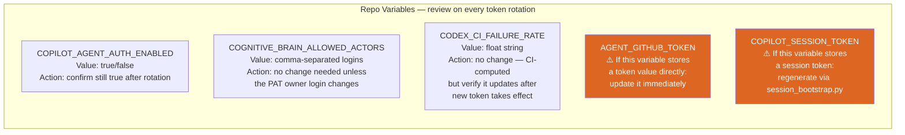

**How to list all current variables and spot any that contain token-like values:**

```bash
# List all repo variables (names + values)
GH_TOKEN=$CODEX_MASTER_KEY gh api \
  /repos/Aries-Serpent/_codex_/actions/variables \
  --paginate \
  --jq '.variables[] | "\(.name) = \(.value[:60])"'
```

**Look for any variable whose value starts with `ghp_`, `github_pat_`, `ghs_`, or `gho_`.**
Those are live token values stored as variables (not secrets) — they MUST be updated
alongside the secret rotation.

**Known variables to review (full list as of 2026-05-08):**

| Variable Name | Contains Token? | Action on Rotation |
|--------------|-----------------|-------------------|
| `COPILOT_AGENT_AUTH_ENABLED` | No — boolean `true`/`false` | ✅ No change needed |
| `COGNITIVE_BRAIN_ALLOWED_ACTORS` | No — login names | ✅ No change needed |
| `CODEX_CI_FAILURE_RATE` | No — float string | ✅ No change needed |
| `CODEX_SESSION_ID` | No — UUID | ✅ No change needed |
| `AGENT_GITHUB_TOKEN` | ⚠️ **Possibly** — check value | 🔄 Update if contains `ghp_` / `github_pat_` |
| `COPILOT_SESSION_TOKEN` | ⚠️ **Possibly** — session token | 🔄 Regenerate via `session_bootstrap.py` |
| `AAIS_LAST_SCORE` | No — numeric | ✅ No change needed |
| `CODEX_MASTER_KEY_LAST_VERIFIED` | No — timestamp | 🔄 Update after rotation confirmed |

---

### 9.4 Files in the Repo That Must Be Checked

Some files **in the repository itself** cache token-adjacent state and must be
inspected after a rotation:

| File | What to check | How to fix |
|------|--------------|-----------|
| `.codex/agent_context.json` | Remove any `gh_token`, `token`, or `api_key` field containing a live value | `python scripts/ci/repo_var_sync.py --sanitize` or edit manually |
| `.codex/agent_auth_session.json` | Contains a session token + actor list — regenerate if the actor list changes | `python scripts/ci/write_agent_auth_session.py` |
| `.codex/rate_limit_state.json` | Contains `earliest_reset_epoch` — stale after rotation but harmless; delete to force fresh check | `rm -f .codex/rate_limit_state.json` |
| `.secrets.baseline` | `detect-secrets` scans for high-entropy strings — new token may trigger a false positive | `python scripts/ci/sync_tracked_files.py --fix` then `git add .secrets.baseline` |

> **⚠️ Never commit a live token value into any of these files.**
> If `detect-secrets` flags a new string after rotation, add `# pragma: allowlist secret`
> to the line and update the baseline.

---

### 9.5 The `CODEX_MASTER_KEY_LAST_VERIFIED` Variable

This variable tracks when the token was last confirmed healthy. Update it immediately after a successful rotation verification:

```bash
# After confirming the new key works (admin_setup_verification.yml passes):
GH_TOKEN=$CODEX_MASTER_KEY gh api \
  --method PATCH \
  /repos/Aries-Serpent/_codex_/actions/variables/CODEX_MASTER_KEY_LAST_VERIFIED \
  -f name=CODEX_MASTER_KEY_LAST_VERIFIED \
  -f value="$(date -u +%Y-%m-%dT%H:%M:%SZ):ok"
```

If the variable doesn't exist yet, create it:

```bash
GH_TOKEN=$CODEX_MASTER_KEY gh api \
  --method POST \
  /repos/Aries-Serpent/_codex_/actions/variables \
  -f name=CODEX_MASTER_KEY_LAST_VERIFIED \
  -f value="$(date -u +%Y-%m-%dT%H:%M:%SZ):ok"
```

---

### 9.6 Post-Rotation Verification Script

Run this end-to-end check after completing any token rotation to confirm all consumers are aligned:

```bash
#!/usr/bin/env bash
# post_rotation_verify.sh — run after every token rotation
set -euo pipefail

echo "=== Post-Rotation Alignment Verification ==="
echo ""

# 1. Confirm new CODEX_MASTER_KEY works against Variables API
echo "1. Testing CODEX_MASTER_KEY → Variables API..."
STATUS=$(curl -s -o /dev/null -w "%{http_code}" \
  -H "Authorization: Bearer $CODEX_MASTER_KEY" \
  -H "X-GitHub-Api-Version: 2022-11-28" \
  "https://api.github.com/repos/Aries-Serpent/_codex_/actions/variables")
[ "$STATUS" = "200" ] && echo "   ✅ Variables API: OK" || echo "   ❌ Variables API: HTTP $STATUS"

# 2. Confirm workflow approval capability
echo "2. Testing CODEX_MASTER_KEY scopes..."
SCOPES=$(curl -sI \
  -H "Authorization: Bearer $CODEX_MASTER_KEY" \
  https://api.github.com/user | grep -i "x-oauth-scopes" | tr -d '\r')
echo "   Scopes: ${SCOPES:-none detected (may be fine-grained PAT)}"
echo "$SCOPES" | grep -q "workflow" && echo "   ✅ workflow scope: present" || echo "   ⚠️  workflow scope: missing"
echo "$SCOPES" | grep -q "repo" && echo "   ✅ repo scope: present" || echo "   ❌ repo scope: MISSING"

# 3. Check for stale token values in repo variables
echo "3. Scanning repo variables for embedded token values..."
VARS=$(GH_TOKEN=$CODEX_MASTER_KEY gh api \
  /repos/Aries-Serpent/_codex_/actions/variables \
  --paginate --jq '.variables[] | "\(.name)=\(.value)"' 2>/dev/null)
echo "$VARS" | grep -E "=(ghp_|github_pat_|ghs_|gho_)" \
  && echo "   ❌ Found variable(s) with embedded token values — UPDATE IMMEDIATELY" \
  || echo "   ✅ No embedded token values in repo variables"

# 4. Check agent_context.json for leaked token fields
echo "4. Checking .codex/agent_context.json for token fields..."
python3 -c "
import json, sys
try:
    d = json.load(open('.codex/agent_context.json'))
    tok_keys = [k for k,v in d.items() if isinstance(v,str) and any(v.startswith(p) for p in ['ghp_','github_pat_','ghs_','gho_'])]
    if tok_keys:
        print(f'   ❌ Token-like values found in keys: {tok_keys}')
        sys.exit(1)
    else:
        print('   ✅ No token values in agent_context.json')
except Exception as e:
    print(f'   ⚠️  Could not check: {e}')
"

# 5. Confirm secrets baseline is clean
echo "5. Running detect-secrets scan..."
if command -v detect-secrets &>/dev/null; then
  detect-secrets scan --baseline .secrets.baseline 2>/dev/null \
    && echo "   ✅ detect-secrets: no new secrets found" \
    || echo "   ⚠️  detect-secrets found new strings — run: python scripts/ci/sync_tracked_files.py --fix"
else
  echo "   ⚠️  detect-secrets not installed — run: pip install detect-secrets"
fi

echo ""
echo "=== Verification complete. Fix any ❌ items before proceeding. ==="
```

Save as `scripts/ci/post_rotation_verify.sh` and run:
```bash
chmod +x scripts/ci/post_rotation_verify.sh
CODEX_MASTER_KEY=<new_token_value> ./scripts/ci/post_rotation_verify.sh
```

---

### 9.7 Alignment State Diagram

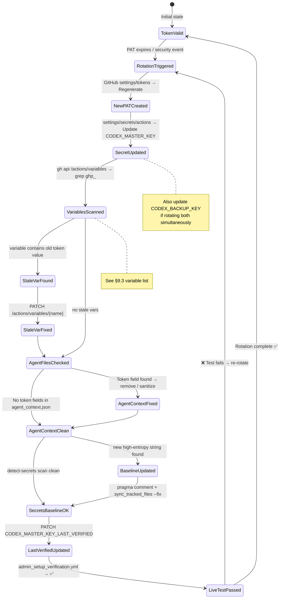

---

### 9.8 Simultaneous Multi-Token Rotation Order

When rotating **all tokens at once** (e.g., a security incident requiring full credential sweep), follow this order to avoid CI lockout:

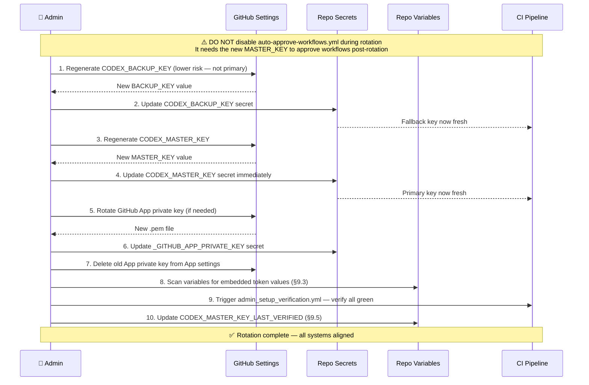

> **🚨 Critical ordering rule:** Always update `CODEX_BACKUP_KEY` **before** `CODEX_MASTER_KEY`.
> This ensures the fallback chain is valid at every moment during the transition.
> If both expire simultaneously, CI will be in a degraded state for the seconds between
> secret updates — this order minimises that window.

---

### 9.9 Scope Requirements Reference

Use this table when creating or regenerating PATs to ensure you select the right checkboxes:

| Token | Required Scopes | Optional / Recommended | Prohibited |
|-------|----------------|----------------------|------------|
| `CODEX_MASTER_KEY` | `repo` (full) · `workflow` | `admin:repo_hook` · `read:org` · `security_events` | `delete_repo` · `admin:org` · `admin:enterprise` |
| `CODEX_BACKUP_KEY` | `repo` (full) · `workflow` | `read:org` · `security_events` | `delete_repo` · `admin:org` |
| GitHub App | App-level permissions (not scopes) | `pull_requests:write` · `contents:write` · `issues:write` · `discussions:write` | — |

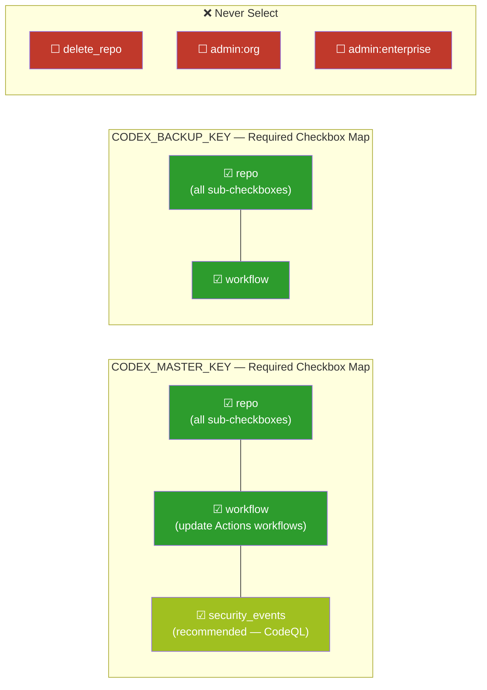

---

### 9.10 Token Rotation Impact Summary

This matrix shows which **CI workflows** are directly impacted when each token is unavailable.
Use it to prioritise which rotation to complete first in an emergency.

| Failing Token | Directly Broken Workflows | Observable Symptom | Time-to-Detect |
|--------------|--------------------------|-------------------|----------------|
| `CODEX_MASTER_KEY` | `auto-approve-workflows.yml` · `agent-auth-delegation.yml` · `iterative-self-healing-ci.yml` · `session_wrapup_autofix.py` · `copilot-agent-checkin.yml` · `wec_enforcer.py` (dispatch) · `trigger-on-approval.yml` | All CI workflows stuck in **"Waiting for approval"** indefinitely; WEC gate fails; self-healing loop broken | **Immediate** — first push after expiry |
| `CODEX_BACKUP_KEY` | Fallback in `agent-auth-delegation.yml` and 114 other workflows if MASTER_KEY is also absent | Silent degradation — only visible if MASTER_KEY also fails | Only when MASTER_KEY also fails |
| `_GITHUB_APP_PRIVATE_KEY` | `post-accountability-to-discussion.yml` · `copilot-pr-session-injector.yml` | App-identity Discussion posts silently skipped; PRs created as `github-actions[bot]` instead of App | **Delayed** — only noticed on Discussion post |
| `github.token` | Cannot expire (refreshed per-run by GitHub) | N/A | N/A |

> **Emergency triage order:** CODEX_MASTER_KEY → CODEX_BACKUP_KEY → GitHub App key

---

## Quick Reference Links

| Resource | Link |
|----------|------|
| Repository Secrets (view/edit) | [/settings/secrets/actions](https://github.com/Aries-Serpent/_codex_/settings/secrets/actions) |
| GitHub App settings (org) | [/organizations/Aries-Serpent/settings/apps](https://github.com/organizations/Aries-Serpent/settings/apps) |
| Personal Access Tokens (create/rotate) | [/settings/tokens](https://github.com/settings/tokens) |
| Repo Variables (view/edit) | [/settings/variables/actions](https://github.com/Aries-Serpent/_codex_/settings/variables/actions) |
| Admin Setup Verification (run test) | [actions/workflows/admin_setup_verification.yml](https://github.com/Aries-Serpent/_codex_/actions/workflows/admin_setup_verification.yml) |
| Token Authority Reference Doc | [docs/ci/GITHUB_API_COPILOT_AGENT_REFERENCE.md](../ci/GITHUB_API_COPILOT_AGENT_REFERENCE.md) |
| Variables & Secrets Full Reference | [docs/reference/GITHUB_VARIABLES_SECRETS_REFERENCE.md](./GITHUB_VARIABLES_SECRETS_REFERENCE.md) |
| MCP Tool Reference | [.codex/docs/COPILOT_MCP_TOOL_REFERENCE.md](../../.codex/docs/COPILOT_MCP_TOOL_REFERENCE.md) |
| Agentic Repo State (auth confirmed) | [.codex/AGENTIC_REPO_STATE.md](../../.codex/AGENTIC_REPO_STATE.md) |
| Rate Limit Awareness | [.codex/docs/RATE_LIMIT_AWARENESS.md](../../.codex/docs/RATE_LIMIT_AWARENESS.md) |
| Post-Rotation Verify Script | [scripts/ci/post_rotation_verify.sh](../../scripts/ci/post_rotation_verify.sh) |

---

## 10. Variable & Secret Governance — Complete Inventory and Operational Guide

> **Purpose:** This section documents every current variable and secret in the repository,
> explains its purpose, ownership tier, and provides guidance on how to improve, add to,
> or modify the set safely. Use this alongside §9 when planning a token rotation — these
> are the exact variables and secrets you need to keep aligned.

---

### 10.1 Variable & Secret Taxonomy

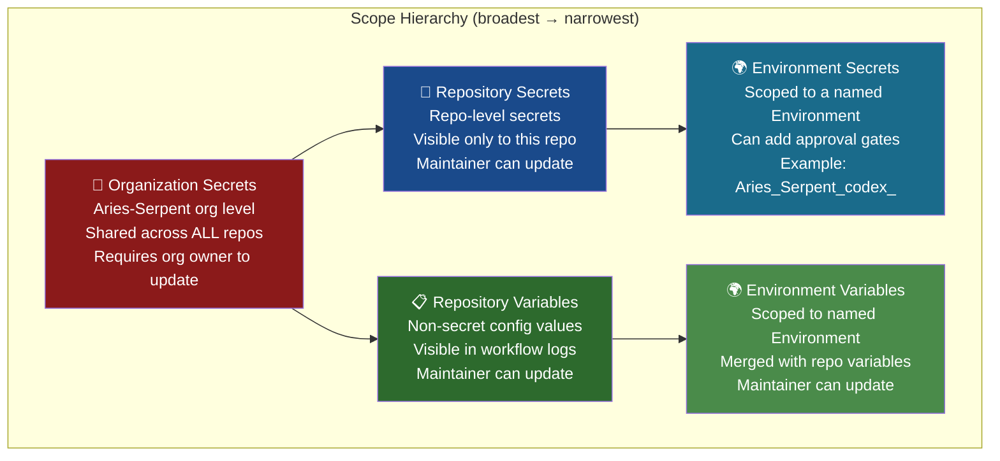

**Rule of thumb for choosing scope:**
- Token / credential → **Secret** (never a Variable)
- Value needed by multiple repos → **Org Secret** or **Org Variable**
- Value specific to this repo, non-sensitive → **Repo Variable**
- Value that changes per deployment environment → **Environment Variable/Secret**

---

### 10.2 Organization Secrets — Full Inventory

These are stored at org level and available to this repo. Only org owners can update them.

| Secret Name | Purpose | Used By | Rotation Frequency | Notes |
|------------|---------|---------|-------------------|-------|
| `CODEX_MASTER_KEY` | Primary PAT — variables API, workflow approve/dispatch, CodeQL, self-healing | 100+ workflows | **Mandatory: every 90 days** | Scopes: `repo`, `workflow`; recommend adding `security_events`. See §3 |
| `CODEX_BACKUP_KEY` | Fallback PAT if MASTER_KEY fails | `agent-auth-delegation.yml` fallback chain | **Mandatory: every 90 days** | Same scopes as MASTER_KEY |
| `CODEX_ADMIN_KEY` | Admin-only operations (org management, protected branch overrides) | Admin workflows only | **When MASTER_KEY rotates** | Higher privilege — protect carefully |
| `_GITHUB_APP_ID` | GitHub App numeric ID (not secret per se, but stored here) | App token workflows | Rarely (only if app is recreated) | Not a token — safe to treat as semi-public |
| `_GITHUB_APP_INSTALLATION_ID` | Installation ID for this repo's App installation | App token workflows | Rarely | Retrieve from App → Installations page |
| `_GITHUB_APP_PRIVATE_KEY` | RSA private key for App JWT signing | `actions/create-github-app-token@v1` | **Every 365 days or on compromise** | Full PEM block including header/footer |
| `_GITHUB_APP_CLIENT_SECRET` | OAuth client secret for App (web flow) | App web auth workflows | **Every 365 days or on compromise** | Required only if App uses OAuth device/web flow |
| `_CODEX_ACTION_RUNNER` | Token for self-hosted or elevated runner registration | Runner registration workflows | **Every 30 days** (runner tokens expire) | GitHub runner tokens have a 1-hour TTL at mint; stored value is the registration token |
| `CODECOV_TOKEN` | Code coverage upload to Codecov.io | `code-quality-coverage-suite.yml` | **Annually or on compromise** | Codecov → Settings → Repository Token |
| `HF_TOKEN` | HuggingFace Hub — model downloads, dataset access | RAG/ML workflows | **Annually or on model tier change** | Scopes: `read` for downloads, `write` for uploads |
| `NPM_TOKEN` | npm package publishing | `npm publish` workflows | **Every 90 days** | Automation token (no 2FA required) — narrow to publish scope |
| `PYPI_TOKEN` | PyPI package publishing | `pypi-publishing-operations-agent` | **Every 90 days** | Project-scoped token preferred over account-scoped |
| `RAG_OPENAI_KEY` | OpenAI API key for RAG index embedding | RAG index build/query workflows | **Every 90 days** | Project-level key recommended; set usage limits in OpenAI dashboard |

**How to add a new Org Secret:**
```bash
# Requires org owner permissions
GH_TOKEN=$CODEX_MASTER_KEY gh secret set MY_NEW_SECRET \
  --org Aries-Serpent \
  --visibility selected \
  --repos _codex_ \
  --body "$(cat /path/to/secret/value)"
```

---

### 10.3 Repository Secrets — Full Inventory

Stored at repo level, visible only to this repository.

| Secret Name | Purpose | Used By | Rotation Notes |
|------------|---------|---------|---------------|
| `CODEX_GHP_TOKEN_BASE64` | Base64-encoded copy of a GHP token (legacy encoding pattern) | Legacy scripts that decode at runtime | **Rotate alongside MASTER_KEY** — must stay in sync with source token |
| `CODEX_GHP_TOKEN_HEX` | Hex-encoded copy of a GHP token (legacy encoding pattern) | Legacy scripts | **Rotate alongside MASTER_KEY** |
| `CODEX_GHP_TOKEN_SHA256` | SHA-256 hash of a GHP token (integrity check) | Token validation / integrity scripts | **Update whenever source token rotates** — this is the hash, not the token itself |
| `CODEX_REPO_ID` | GitHub repository numeric ID (`1040037790`) | Workflows that need the repo ID without an API call | Rarely (only if repo is forked/transferred) |
| `CODEX_WEBHOOK_SECRET` | HMAC secret for validating incoming GitHub webhook payloads | Webhook receiver (`WEBHOOK_RECEIVER_URL`) | **Every 90 days or on compromise** |
| `OPENAI_API_KEY` | OpenAI API key (repo-level, separate from RAG key) | Direct OpenAI calls in CI scripts | **Every 90 days** — set usage limits in OpenAI dashboard |
| `_CODEX_BOT_RUNNER` | Bot runner token (repo-scoped runner credentials) | Bot automation jobs | **Every 30 days** |

> **⚠️ Encoded token secrets:** `CODEX_GHP_TOKEN_BASE64` and `CODEX_GHP_TOKEN_HEX` are
> **derived values** of a primary PAT. When you rotate the primary PAT, you MUST also
> regenerate these derived secrets:
> ```bash
> # Re-encode after rotation
> echo -n "$NEW_TOKEN" | base64 | gh secret set CODEX_GHP_TOKEN_BASE64 --repo Aries-Serpent/_codex_
> echo -n "$NEW_TOKEN" | xxd -p | tr -d '\n' | gh secret set CODEX_GHP_TOKEN_HEX --repo Aries-Serpent/_codex_
> printf '%s' "$NEW_TOKEN" | sha256sum | awk '{print $1}' | gh secret set CODEX_GHP_TOKEN_SHA256 --repo Aries-Serpent/_codex_
> ```

---

### 10.4 Environment Secrets — Full Inventory

Scoped to the `Aries_Serpent_codex_` named environment (requires environment protection rules).

| Secret Name | Purpose | Rotation Notes |
|------------|---------|---------------|
| `CODEX_ENVIRONMENT_RUNNER` | Runner credentials for environment-specific job execution | **Every 30 days** |
| `CODEX_RUNNER_SHA256` | SHA-256 hash of the runner binary/token for integrity validation | **Update when CODEX_ENVIRONMENT_RUNNER rotates** |
| `CODEX_RUNNER_TOKEN` | Short-lived GitHub Actions runner registration token for this environment | **Every 30 days** (or sooner — runner tokens expire at use) |

---

### 10.5 Environment Variables — Full Inventory

Scoped to the `Aries_Serpent_codex_` environment; these override repo-level variables with the same name.

| Variable | Current Value | Purpose | When to Change |
|----------|--------------|---------|----------------|
| `CARGO_TERM_COLOR` | `always` | Force coloured Cargo output in CI logs | Rarely |
| `CODEX_BRIDGE_DIR` | `/tmp/codex_secure_bridge` | IPC bridge directory for Cognitive Brain ↔ workflow comms | Only if bridge path changes |
| `CODEX_BRIDGE_OWNER_ONLY` | `true` | Enforce owner-only permissions on bridge socket | **Keep `true` — security control** |
| `CODEX_DB_PATH` | `.codex/logs.db` | SQLite session log database path | Only if log layout changes |
| `CODEX_ENV_GO_VERSION` | `1.21` | Go toolchain version for environment setup | On Go version bump |
| `CODEX_ENV_NODE_VERSION` | `18` | Node.js version for environment setup | On Node LTS change |
| `CODEX_ENV_PYTHON_VERSION` | `3.12` | Python version for environment setup | On Python version bump |
| `CODEX_ENV_RUST_VERSION` | `1.92` | Rust toolchain version | On Rust version bump |
| `CODEX_ENV_SWIFT_VERSION` | `5.9` | Swift version for environment setup | On Swift version bump |
| `CODEX_LOG_DB_PATH` | `.codex/logs.db` | Alias for `CODEX_DB_PATH` (kept for backward compat) | Update both when path changes |
| `CODEX_SQLITE_POOL` | `1` | Enable per-session SQLite connection pooling | Increase if concurrent writes cause lock errors |
| `RUST_BACKTRACE` | `1` | Full Rust backtraces in CI | Keep `1` for debugging; set `0` to reduce log noise in production |
| `RUST_TEST_THREADS` | `1` | Single-threaded Rust tests (prevents DB lock contention) | Increase only if Rust tests are confirmed thread-safe |

---

### 10.6 Repository Variables — Full Annotated Inventory

This is the complete set of 70 repo-level variables grouped by functional domain.

#### 10.6.1 Agent Autonomy & Control

| Variable | Value | Purpose | Safe to Change? |
|----------|-------|---------|----------------|
| `AGENT_HANDOFF_TIMEOUT_SECONDS` | `120` | Max seconds agent waits for handoff before aborting | ✅ Increase if agent tasks time out at boundaries |
| `AGENT_KILL_SWITCH` | `0` | Set to `1` to emergency-stop all autonomous agent actions | ✅ **Use `1` immediately if agent behaves unexpectedly** |
| `AGENT_RUNNER_BUDGET_SECONDS` | `180` | Max wall-clock seconds per agent runner iteration | ✅ Increase for long tasks; decrease to enforce stricter budgets |
| `AGENT_RUNNER_DRY_RUN` | `0` | Set to `1` to run agents in dry-run mode (no writes) | ✅ Use `1` when testing new agent behaviour safely |
| `AGENT_RUNNER_ITERATIONS` | `2` | Max self-healing iterations per agent runner invocation | ✅ Increase for complex tasks; keep ≤5 to avoid runaway loops |
| `AUTONOMOUS_ACTIONS_ENABLED` | `true` | Master gate for all autonomous CI/CD actions | ⚠️ **Set `false` to disable all autonomous actions globally** |
| `AUTONOMY_BUDGET_SECONDS` | `90` | Budget for autonomy engine wall-clock per action | ✅ Tune with `AGENT_RUNNER_BUDGET_SECONDS` |
| `AUTONOMY_DRY_RUN` | `0` | Autonomy engine dry-run mode | ✅ Same as `AGENT_RUNNER_DRY_RUN` but for autonomy engine |
| `AUTONOMY_MAX_ITERATIONS` | `3` | Max iterations for autonomy loop | ✅ Keep ≤5 |
| `UNCERTAINTY_BUDGET_SECONDS` | `20` | Time budget for uncertainty resolution in agent decisions | ✅ Increase if agents abort early on ambiguous states |
| `COPILOT_AGENT_AUTH_ENABLED` | `true` | Token delegation active — Copilot agent can use elevated tokens | ⚠️ Managed by `agent-auth-delegation.yml` — don't set manually |
| `COPILOT_AGENT_MAX_AUTONOMY_LEVEL` | `D` | Highest FSM autonomy level allowed (A=advisory, D=autonomous) | ⚠️ Requires E→D gate passage before changing |
| `COPILOT_AGENT_SESSION_RESTORE_ENABLED` | `true` | Enable session state restore across Copilot sessions | ✅ Set `false` to force fresh session state |
| `AUTO_PROMOTE_TIER_ENABLED` | `true` | Allow automatic tier promotion when AAIS gates pass | ✅ Set `false` to require manual tier promotion |

#### 10.6.2 CI Behaviour & Quality Gates

| Variable | Value | Purpose | Safe to Change? |
|----------|-------|---------|----------------|
| `CODEX_CI_FAILURE_RATE` | `1.0:ok` | **Auto-managed** — current CI failure rate percentage | ❌ **Never edit manually** — set by `copilot-agent-checkin.yml` |
| `CODEX_CI_FAILURE_THRESHOLD` | `10.0` | Max tolerated CI failure rate % before AAIS Reliability degrades | ✅ Reduce to enforce stricter green CI requirement |
| `CODEX_CI_LAST_GREEN_SHA` | *(latest green SHA)* | **Auto-managed** — last commit SHA where all required checks passed | ❌ **Never edit manually** — set by CI |
| `CODEX_COVERAGE_THRESHOLD` | `80` | Minimum test coverage % required by coverage gate | ✅ Increase gradually; never decrease |
| `CODEX_LINT_STRICT` | `true` | Enable strict linting (ruff + mypy strict mode) | ✅ Keep `true`; set `false` only for emergency merge |
| `CODEX_TEST_PARALLELISM` | `auto` | Test parallelism (`auto`, `1`, or integer) | ✅ Set to `1` to debug race conditions |
| `CODEX_OFFLINE` | `1` | Run all CI tools in offline mode (no network calls) | ⚠️ Set `0` only for workflows that explicitly need network |
| `CODEX_SANDBOX_TIMEOUT` | `60` | Sandbox job timeout in seconds | ✅ Increase for slow-starting containers |
| `AUDIT_RETENTION_DAYS` | `90` | Retention window for audit log artefacts | ✅ Must be ≥ compliance requirement (recommend 90+) |
| `ENABLE_LIVE_TESTS` | `true` | Enable integration tests that call live external services | ⚠️ Set `false` in offline/isolated environments |

#### 10.6.3 Cognitive Brain & Session Management

| Variable | Value | Purpose | Safe to Change? |
|----------|-------|---------|----------------|
| `COGNITIVE_BRAIN_ALLOWED_ACTORS` | *(login list)* | Comma-separated logins allowed to trigger Cognitive Brain | ✅ Add new bot/login; never remove `mbaetiong` |
| `COGNITIVE_BRAIN_INJECTION_ENABLED` | `true` | Enable Cognitive Brain session context injection | ✅ Set `false` to disable CB for debugging |
| `COGNITIVE_BRAIN_LTM_RETENTION_DAYS` | `90` | Long-term memory retention window (days) | ✅ Match `AUDIT_RETENTION_DAYS` |
| `COGNITIVE_BRAIN_MAX_CONTEXT_TOKENS` | `128000` | Max token budget for CB context injection | ✅ Match your model's context window |
| `COGNITIVE_BRAIN_MEMORY_TIER` | `both` | Memory tiers to use: `stm`, `ltm`, or `both` | ✅ |
| `COGNITIVE_BRAIN_PATTERN_MIN_CONFIDENCE` | `0.75` | Min confidence score for pattern recall (0.0–1.0) | ✅ Raise to reduce noise; lower to catch weak patterns |
| `COGNITIVE_BRAIN_SESSION_NUMBER` | *(auto-incremented)* | **Auto-managed** — current session counter | ❌ **Never edit manually** |
| `COPILOT_ACTIVE_SESSION` | *(auto-set)* | **Auto-managed** — `PR|RUN_ID|APPROVAL_RUN_ID` | ❌ **Never edit manually** |
| `COPILOT_SESSION_QUEUE` | *(PR numbers)* | **Auto-managed** — queue of pending Copilot session PRs | ❌ **Never edit manually** |
| `CODEX_SESSION_ID` | `UUID v4` | Template value — actual UUID generated per session | ✅ Seed with specific UUID if replaying a session |
| `CODEX_SESSION_LOG_DIR` | `.codex/sessions` | NDJSON session log directory | ✅ Change only if log volume requires a different mount |

#### 10.6.4 LLM & ML Configuration

| Variable | Value | Purpose | Safe to Change? |
|----------|-------|---------|----------------|
| `CODEX_LLM_MODEL` | `gpt-4o` | Default LLM model for Cognitive Brain and agent tasks | ✅ Update when upgrading model version |
| `CODEX_LLM_RATE_LIMIT_DELAY` | `1.0` | Seconds to wait between LLM API calls | ✅ Increase to reduce rate-limit 429 errors |
| `CODEX_FORCE_CPU` | `0` | Force CPU-only execution (disable GPU) | ✅ Set `1` in CPU-only CI environments |
| `GPU_OPT` | `--gpus all` | Docker GPU option passed to containers | ✅ Set to empty string `""` for CPU-only |
| `HF_HOME` | `~/.cache/huggingface` | HuggingFace model/dataset cache directory | ✅ Point to a mounted volume for large models |
| `TORCH_HOME` | `~/.cache/torch` | PyTorch hub cache directory | ✅ Point to a mounted volume |
| `TRANSFORMERS_OFFLINE` | `1` | Force HuggingFace Transformers to offline mode | ✅ Set `0` when downloading new models |
| `MLFLOW_EXPERIMENT_NAME` | `saas_knowledge_training` | MLflow experiment name for training runs | ✅ Change per experiment |
| `WANDB_MODE` | `offline` | W&B logging mode (`online`/`offline`/`disabled`) | ✅ Set `online` when W&B reporting is needed |
| `EMBEDDING_INDEX_AUTO_REBUILD` | `true` | Auto-rebuild RAG embedding index on code changes | ✅ Set `false` to skip rebuild (faster CI) |

#### 10.6.5 Infrastructure & Docker

| Variable | Value | Purpose | Safe to Change? |
|----------|-------|---------|----------------|
| `DOCKER_BUILDKIT` | `1` | Enable BuildKit for faster Docker builds | ✅ Keep `1` |
| `COMPOSE_DOCKER_CLI_BUILD` | `1` | Use Docker CLI BuildKit in Compose | ✅ Keep `1` |
| `CODEX_CLI_API_URL` | `http://localhost:8765` | Base URL for Cognitive Brain CLI API | ✅ Change if port conflicts |
| `COPILOT_CLI_BASE_URL` | `http://localhost:8765` | Alias for CB CLI URL (Copilot sessions) | ✅ Keep in sync with `CODEX_CLI_API_URL` |
| `COPILOT_CLI_ENABLED` | `true` | Enable CLI interface for Cognitive Brain | ✅ Set `false` to disable CB CLI |
| `WEBHOOK_RECEIVER_URL` | `https://${CODESPACE_NAME}-8765...` | Codespace webhook receiver URL | ✅ Dynamically constructed — rarely needs changing |
| `CODEX_NETWORK_MODE` | `isolated` | Network mode for agent execution (`isolated`/`open`) | ⚠️ Keep `isolated` for security; `open` only for debugging |
| `CODEX_ISOLATED_PATH` | `/codex/network/isolated` | Mount path for isolated network namespace | ✅ |
| `CODEX_BRIDGE_DIR` | *(env var)* | See §10.5 environment variables | — |

#### 10.6.6 External Services & Integrations

| Variable | Value | Purpose | Safe to Change? |
|----------|-------|---------|----------------|
| `ZENDESK_RATE_LIMIT` | `100` | Zendesk API rate limit (requests/minute) | ✅ Match your Zendesk plan limit |
| `ZENDESK_SYNC_INTERVAL` | `3600` | Zendesk sync interval in seconds | ✅ |
| `CODEX_ZENDESK_DOCS_ROOT` | `docs/vendors/zendesk` | Path to Zendesk documentation root | ✅ |
| `CODEX_D365_POLICIES_PATH` | `configs/deployment/d365/sla_policies.json` | Path to D365 SLA policies | ✅ |

#### 10.6.7 Repository Identity & Versioning

| Variable | Value | Purpose | Safe to Change? |
|----------|-------|---------|----------------|
| `CODEX_AGENT_NAME` | `ai_org_repo_admin` | Canonical agent name used in logs and reports | ⚠️ Change requires updating all log parsers |
| `CODEX_API_VERSION` | `2022-11-28` | GitHub REST API version header | ✅ Update when GitHub releases breaking API changes |
| `CODEX_ORG_NAME` | `Aries-Serpent` | GitHub organization name | ❌ Changing breaks all hardcoded org references |
| `CODEX_PYTHON_VERSION` | `3.12` | Python version (alias of `CODEX_ENV_PYTHON_VERSION`) | ✅ Keep in sync with `CODEX_ENV_PYTHON_VERSION` |
| `CODEX_CACHE_VERSION` | `v2` | Cache key version prefix | ✅ Increment (`v3`, `v4`...) to bust all caches |
| `GENESIS_TIMESTAMP` | `2025-12-26T16:04:45Z` | Repository Genesis Protocol activation time | ❌ Historical — never change |
| `CODEX_PR_LIFECYCLE_VERSION` | *(JSON blob)* | PR lifecycle version metadata | ✅ Updated by session wrapup scripts |

---

### 10.7 Adding New Variables and Secrets

#### 10.7.1 Decision Tree — Where to Put a New Value

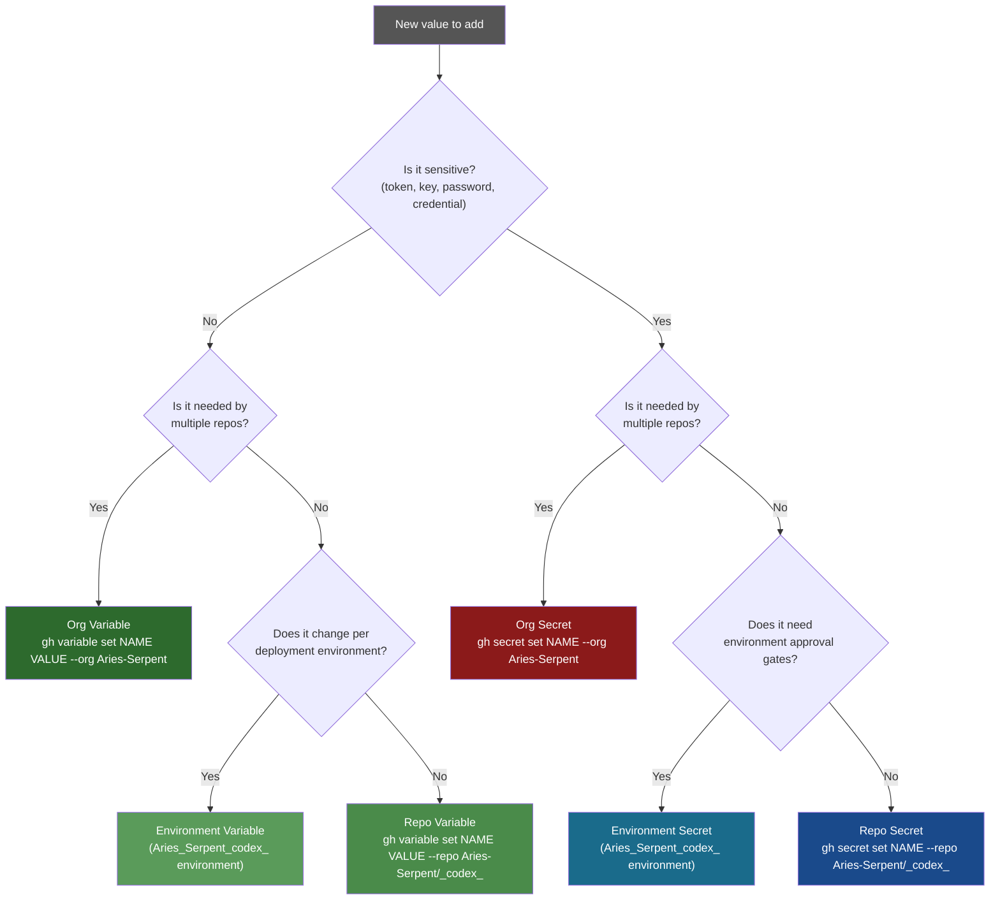

#### 10.7.2 Naming Conventions

Follow these patterns when adding new variables or secrets to maintain consistency:

| Category | Pattern | Examples |
|----------|---------|---------|
| Environment version pins | `CODEX_ENV_{LANG}_VERSION` | `CODEX_ENV_PYTHON_VERSION`, `CODEX_ENV_NODE_VERSION` |
| Feature flags (boolean) | `{FEATURE}_ENABLED` or `{FEATURE}_DRY_RUN` | `COGNITIVE_BRAIN_INJECTION_ENABLED`, `AGENT_RUNNER_DRY_RUN` |
| Resource budgets | `{SYSTEM}_BUDGET_SECONDS` or `{SYSTEM}_MAX_{UNIT}` | `AUTONOMY_BUDGET_SECONDS`, `COGNITIVE_BRAIN_MAX_CONTEXT_TOKENS` |
| Path configs | `CODEX_{COMPONENT}_PATH` or `CODEX_{COMPONENT}_DIR` | `CODEX_SESSION_LOG_DIR`, `CODEX_D365_POLICIES_PATH` |
| Rate limits | `{SERVICE}_RATE_LIMIT` | `ZENDESK_RATE_LIMIT`, `CODEX_LLM_RATE_LIMIT_DELAY` |
| Retention windows | `{SYSTEM}_RETENTION_DAYS` | `AUDIT_RETENTION_DAYS`, `COGNITIVE_BRAIN_LTM_RETENTION_DAYS` |
| Agent tokens (org secrets) | `CODEX_{PURPOSE}_KEY` or `_{SYSTEM}_PRIVATE_KEY` | `CODEX_MASTER_KEY`, `_GITHUB_APP_PRIVATE_KEY` |
| Service API keys | `{SERVICE}_API_KEY` or `{SERVICE}_TOKEN` | `OPENAI_API_KEY`, `PYPI_TOKEN`, `HF_TOKEN` |

#### 10.7.3 Adding a New Repo Variable

```bash
# 1. Add the variable
GH_TOKEN=$CODEX_MASTER_KEY gh variable set MY_NEW_VARIABLE \
  --repo Aries-Serpent/_codex_ \
  --body "my_value"

# 2. Verify it was created
GH_TOKEN=$CODEX_MASTER_KEY gh api \
  /repos/Aries-Serpent/_codex_/actions/variables/MY_NEW_VARIABLE \
  --jq '.name + " = " + .value'

# 3. Reference it in a workflow:
# jobs:
#   my-job:
#     env:
#       MY_VAR: ${{ vars.MY_NEW_VARIABLE }}

# 4. Update agent_context.json if the CB CLI needs to read it:
# Add to .codex/agent_context.json:
#   "MY_NEW_VARIABLE": "my_value"
# Then run:
python scripts/ci/sync_tracked_files.py --fix
```

#### 10.7.4 Adding a New Repository Secret

```bash
# 1. Add the secret (never echo raw value — use file or stdin)
GH_TOKEN=$CODEX_MASTER_KEY gh secret set MY_NEW_SECRET \
  --repo Aries-Serpent/_codex_ \
  < /path/to/secret/file

# 2. Verify the secret exists (values are never readable back)
GH_TOKEN=$CODEX_MASTER_KEY gh api \
  /repos/Aries-Serpent/_codex_/actions/secrets/MY_NEW_SECRET \
  --jq '"Secret: " + .name + " (updated: " + .updated_at + ")"'

# 3. Reference it in a workflow:
# jobs:
#   my-job:
#     steps:
#       - name: Use secret
#         env:
#           MY_SECRET: ${{ secrets.MY_NEW_SECRET }}
#         run: echo "Secret is set"  # never echo the value

# 4. Add to post_rotation_verify.sh scan list if token-like
# 5. Document in §10.3 above
```

#### 10.7.5 Promoting a Repo Secret to Org Secret

Org secrets are preferred for values shared across multiple repos. To promote:

```bash
# 1. Add at org level with selected repo visibility
GH_TOKEN=$CODEX_MASTER_KEY gh secret set MY_ORG_SECRET \
  --org Aries-Serpent \
  --visibility selected \
  --repos _codex_ \
  < /path/to/secret/file

# 2. Remove the repo-level duplicate (to avoid shadowing confusion)
GH_TOKEN=$CODEX_MASTER_KEY gh api \
  --method DELETE \
  /repos/Aries-Serpent/_codex_/actions/secrets/MY_ORG_SECRET

# 3. Verify the org secret is accessible from this repo:
# The value will appear as ${{ secrets.MY_ORG_SECRET }} in workflows
# (org secrets automatically fall through to selected repos)
```

---

### 10.8 Auto-Managed Variables — Never Edit Manually

These variables are **written by CI workflows** and will be overwritten on the next run.
Manual edits will be silently reverted.

| Variable | Written by | Frequency | What it tracks |
|----------|-----------|-----------|---------------|
| `CODEX_CI_FAILURE_RATE` | `copilot-agent-checkin.yml` | Every push | Current CI failure rate `{rate}:ok` |
| `CODEX_CI_LAST_GREEN_SHA` | `copilot-agent-checkin.yml` | Every push | Last commit with all required checks green |
| `COGNITIVE_BRAIN_SESSION_NUMBER` | `copilot-agent-checkin.yml` | Every session | Monotonically incrementing session counter |
| `COPILOT_ACTIVE_SESSION` | `agent-auth-delegation.yml` | On approval | `PR|RUN_ID|APPROVAL_RUN_ID` of active session |
| `COPILOT_SESSION_QUEUE` | `copilot-agent-checkin.yml` | Every push | Queue of pending session PR numbers |
| `COPILOT_AGENT_AUTH_ENABLED` | `agent-auth-delegation.yml` | On owner approval | `true` when elevated auth is active |
| `COGNITIVE_BRAIN_ALLOWED_ACTORS` | `agent-auth-delegation.yml` | On owner approval | Comma-separated delegated actor logins |

---

### 10.9 Improving the Current Variable Set — Recommendations

Based on the current variable inventory, these improvements would increase security, observability, and maintainability:

#### 10.9.1 Suggested New Variables (not yet present)

| Suggested Variable | Value | Rationale |
|-------------------|-------|-----------|
| `CODEX_MASTER_KEY_LAST_VERIFIED` | `2026-05-08T01:00:00Z:ok` | Timestamp of last successful MASTER_KEY health check. Enables the `token-expiry-monitor.yml` (T-02 gap). |
| `CODEX_MASTER_KEY_EXPIRY_DATE` | `2026-08-06` | ISO date when current MASTER_KEY PAT expires. Enables proactive rotation reminders 14 days before expiry. |
| `CODEX_BACKUP_KEY_EXPIRY_DATE` | `2026-08-06` | Same for BACKUP_KEY. |
| `CODEX_AAIS_LAST_SCORE` | `100.0` | Last computed AAIS composite score. Enables score regression detection without running the full scorer. |
| `CODEX_AAIS_LAST_SCORED_SHA` | *(SHA)* | Commit SHA when AAIS was last scored. Detects score staleness. |
| `CODEX_WEC_TEMPLATE_VERSION` | `S293` | Version of the WEC template currently in use. Detects template drift. |
| `CODEX_SECRETS_BASELINE_SHA` | *(sha256)* | SHA-256 of `.secrets.baseline`. Detects out-of-band baseline modifications. |
| `COPILOT_MAX_CONCURRENT_SESSIONS` | `1` | Enforce single active Copilot session at a time. Prevent session collision. |

#### 10.9.2 Variables That Should Be Reviewed / Potentially Removed

| Variable | Issue | Recommendation |
|----------|-------|----------------|
| `CODEX_GHP_TOKEN_BASE64` | Encoded token stored as secret — doubles rotation surface | ✅ Keep only if a workflow *requires* base64 input; otherwise replace callers with direct secret reference |
| `CODEX_GHP_TOKEN_HEX` | Same issue as BASE64 | ✅ Audit callers; remove if unused |
| `WEBHOOK_RECEIVER_URL` | Contains `${CODESPACE_NAME}` — only valid in Codespaces | ✅ Move to environment variable scoped to Codespaces environment |
| `CODEX_FORCE_CPU` | Duplicate of `GPU_OPT=""` | ✅ Consider replacing with a single `USE_GPU=true/false` flag |
| `COPILOT_AGENT_FIREWALL_ALLOW_LIST_ADDITIONS` | Very long JSON blob in variable | ✅ Move to a config file in `.codex/config/firewall_allowlist.json` |
| `COPILOT_BOT_COMMENT_KNOWN_ISSUES` | Large JSON in variable — hard to maintain | ✅ Move to `.codex/config/bot_comment_known_issues.json` |
| `COPILOT_WEC_TEMPLATE_DRIFT` | Stale — last audited `2026-04-06` | ✅ Re-audit and update or automate via WEC gate |

#### 10.9.3 Security Hardening Recommendations

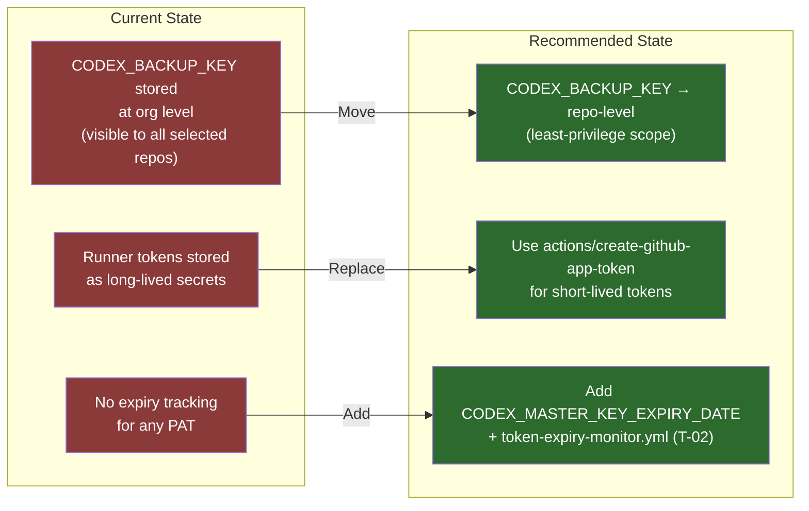

---

### 10.10 Variable Access Patterns in Workflows

Reference guide for how to read variables and secrets in GitHub Actions YAML:

```yaml
jobs:
  example:
    env:
      # ── Repo Variables (plain text, visible in logs) ─────────────────────
      PYTHON_VER:      ${{ vars.CODEX_ENV_PYTHON_VERSION }}
      LLM_MODEL:       ${{ vars.CODEX_LLM_MODEL }}
      CI_FAILURE_RATE: ${{ vars.CODEX_CI_FAILURE_RATE }}

      # ── Repo/Org Secrets (masked in logs) ────────────────────────────────
      # ALWAYS use the fallback chain for token operations:
      GH_TOKEN: ${{ secrets.CODEX_MASTER_KEY || secrets.CODEX_BACKUP_KEY || github.token }}

      # For CodeQL / security_events scope:
      SECURITY_TOKEN: ${{ secrets.CODEX_MASTER_KEY }}

      # For GitHub App short-lived token (preferred for write ops):
      # Use actions/create-github-app-token@v1 — see §5.3

      # ── Environment Variables (set via env: at job/step level) ───────────
      # Environment variables from the named environment are automatically
      # injected when the job targets that environment:
      # environment: Aries_Serpent_codex_

    steps:
      - name: Read a variable in a script
        run: |
          echo "Python: $PYTHON_VER"  # from env: block above
          echo "Model: ${{ vars.CODEX_LLM_MODEL }}"  # inline expression

      - name: Use a secret (never echo raw value)
        env:
          MY_KEY: ${{ secrets.OPENAI_API_KEY }}
        run: |
          # ✅ Pass to tool that reads from env:
          python my_script.py  # reads MY_KEY from os.environ
          # ❌ NEVER do: echo $MY_KEY

      - name: Update a variable from within a workflow
        env:
          GH_TOKEN: ${{ secrets.CODEX_MASTER_KEY }}
        run: |
          gh api --method PATCH \
            /repos/${{ github.repository }}/actions/variables/MY_VAR \
            -f name=MY_VAR \
            -f value="new_value"
```

---

### 10.11 Rotation Coverage Matrix

Cross-reference: for each token rotation scenario, which variables and secrets need updating.

| Rotation Event | Secrets to Update | Variables to Update | Scripts to Re-run |
|---------------|------------------|--------------------|--------------------|
| **Rotate CODEX_MASTER_KEY** | `CODEX_MASTER_KEY` (org) · `CODEX_GHP_TOKEN_BASE64` · `CODEX_GHP_TOKEN_HEX` · `CODEX_GHP_TOKEN_SHA256` | `CODEX_MASTER_KEY_LAST_VERIFIED` (new) | `post_rotation_verify.sh` |
| **Rotate CODEX_BACKUP_KEY** | `CODEX_BACKUP_KEY` (org) | None required | Verify fallback: `post_rotation_verify.sh` |
| **Rotate GitHub App key** | `_GITHUB_APP_PRIVATE_KEY` (org) | None required | Test App token mint (§3.3 Step 5) |
| **Rotate OPENAI_API_KEY** | `OPENAI_API_KEY` (repo) | None | Verify LLM calls succeed |
| **Rotate RAG_OPENAI_KEY** | `RAG_OPENAI_KEY` (org) | None | Re-run RAG index build to confirm |
| **Rotate HF_TOKEN** | `HF_TOKEN` (org) | None | Trigger `test-rag.yml` |
| **Rotate PYPI_TOKEN** | `PYPI_TOKEN` (org) | None | Dry-run `pypi-publishing-operations-agent` |
| **Rotate NPM_TOKEN** | `NPM_TOKEN` (org) | None | Run `npm publish --dry-run` |
| **Rotate CODEX_WEBHOOK_SECRET** | `CODEX_WEBHOOK_SECRET` (repo) | None | Update webhook receiver + GitHub webhook HMAC setting |
| **Rotate runner tokens** | `CODEX_RUNNER_TOKEN` · `CODEX_ENVIRONMENT_RUNNER` · `CODEX_RUNNER_SHA256` · `_CODEX_BOT_RUNNER` · `_CODEX_ACTION_RUNNER` | None | Re-register runners |
| **Rotate CODEX_ADMIN_KEY** | `CODEX_ADMIN_KEY` (org) | None | Verify admin ops succeed |
| **Rotate CODECOV_TOKEN** | `CODECOV_TOKEN` (org) | None | Trigger coverage upload workflow |

---

## 11. Workflow Configuration Catalog — Variable & Secret Management

> **Purpose:** Every workflow that can be manually triggered to implement the recommendations
> from §10, perform token rotation, synchronise variables, or audit secrets.
> Organised by function. Use the "Configure for §10.x" column to see which §10 sub-tasks
> each workflow directly addresses.

---

### 11.1 Workflow Overview Map

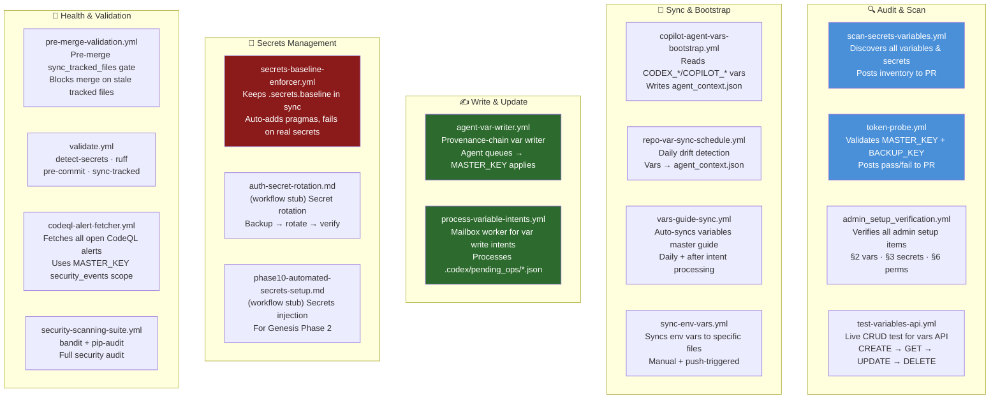

---

### 11.2 Detailed Workflow Catalog

#### 11.2.1 `scan-secrets-variables.yml` — Inventory & Audit

| Field | Value |
|-------|-------|
| **Trigger** | `workflow_dispatch` (manual) · push to `main`/`develop` · PR |
| **Inputs** | `include_env_vars` (boolean, default `true`) |
| **Token needed** | `CODEX_MASTER_KEY` (variables read) |
| **Permissions** | `contents: read`, `issues: write`, `pull-requests: write` |
| **Output** | Full inventory of all variables and secrets posted to PR/issue |
| **§10 addresses** | §10.2, §10.3, §10.4, §10.5, §10.6 — generates live snapshot |
| **Implementation gap** | Requires script update to add §10.9.1 suggested variables check |

**How to trigger manually:**
```bash
GH_TOKEN=$CODEX_MASTER_KEY gh workflow run scan-secrets-variables.yml \
  --repo Aries-Serpent/_codex_ \
  --field include_env_vars=true
```

---

#### 11.2.2 `token-probe.yml` — Token Health Validation

| Field | Value |
|-------|-------|
| **Trigger** | `workflow_dispatch` only |
| **Inputs** | `pr_number` (required), `require_both_keys` (default `true`) |
| **Token needed** | `CODEX_MASTER_KEY`, `CODEX_BACKUP_KEY` |
| **Permissions** | `contents: read`, `pull-requests: write` |
| **Output** | Pass/fail summary comment on the target PR |
| **§10 addresses** | §10.2 org secrets — validates MASTER_KEY + BACKUP_KEY are functional |
| **Run after** | Every token rotation (§9.2, §10.11) |

**How to trigger manually:**
```bash
GH_TOKEN=$CODEX_MASTER_KEY gh workflow run token-probe.yml \
  --repo Aries-Serpent/_codex_ \
  --field pr_number=4346 \
  --field require_both_keys=true
```

---

#### 11.2.3 `admin_setup_verification.yml` — Full Admin Setup Check

| Field | Value |
|-------|-------|
| **Trigger** | `workflow_dispatch` · push to `admin_setup_verification.yml` · `repository_dispatch` |
| **Inputs** | `pr_number` (optional — posts summary to PR) |
| **Token needed** | `CODEX_MASTER_KEY` |
| **Permissions** | `contents: read`, `pull-requests: write` |
| **Output** | Verifies §2 repo variables, §3 secrets existence, §6 workflow permissions |
| **§10 addresses** | §10.2–§10.6 — confirms all variables and secrets are present |
| **Use case** | Run immediately after any rotation or new variable/secret addition |

**How to trigger manually:**
```bash
GH_TOKEN=$CODEX_MASTER_KEY gh workflow run admin_setup_verification.yml \
  --repo Aries-Serpent/_codex_ \
  --field pr_number=4346
```

---

#### 11.2.4 `test-variables-api.yml` — Live Variables API CRUD Test

| Field | Value |
|-------|-------|
| **Trigger** | `workflow_dispatch` only |
| **Inputs** | `run_org_tests` (boolean, default `false`), `dry_run` (boolean, default `false`) |
| **Token needed** | `CODEX_MASTER_KEY` (repo scope), `CODEX_BACKUP_KEY` (fallback) |
| **Permissions** | `contents: read` |
| **Output** | Live CREATE → GET → UPDATE → DELETE test results |
| **§10 addresses** | §10.7.3, §10.7.4 — verifies variable API is functional before bulk updates |
| **Use case** | Run before `process-variable-intents.yml` to confirm token is working |

**How to trigger manually:**
```bash
GH_TOKEN=$CODEX_MASTER_KEY gh workflow run test-variables-api.yml \
  --repo Aries-Serpent/_codex_ \
  --field run_org_tests=false \
  --field dry_run=false
```

---

#### 11.2.5 `copilot-agent-vars-bootstrap.yml` — Agent Context Injection

| Field | Value |
|-------|-------|
| **Trigger** | Push to PR branches · `workflow_dispatch` |
| **Inputs** | None |
| **Token needed** | `CODEX_MASTER_KEY` (variables read) |
| **Permissions** | `contents: write` |
| **Output** | Writes `.codex/agent_context.json` with all CODEX_*/COPILOT_* variable values |
| **§10 addresses** | §10.8 — keeps auto-managed variable snapshot current |
| **Use case** | Automatically runs; manually trigger to force refresh after variable changes |

**How to trigger manually:**
```bash
GH_TOKEN=$CODEX_MASTER_KEY gh workflow run copilot-agent-vars-bootstrap.yml \
  --repo Aries-Serpent/_codex_
```

---

#### 11.2.6 `repo-var-sync-schedule.yml` — Daily Variable Drift Detection

| Field | Value |
|-------|-------|
| **Trigger** | `schedule: cron: '0 6 * * *'` (daily 06:00 UTC) · `workflow_dispatch` |
| **Inputs** | None |
| **Token needed** | `CODEX_MASTER_KEY` (falls back to `GITHUB_TOKEN`) |
| **Permissions** | `contents: write` |
| **Output** | Detects drift between live variables and `agent_context.json`; auto-commits if changed |
| **§10 addresses** | §10.6 (all groups) — daily consistency enforcement |
| **Configure for §10.9.1** | Add new suggested variables to tracked prefixes list |

**How to trigger manually:**
```bash
GH_TOKEN=$CODEX_MASTER_KEY gh workflow run repo-var-sync-schedule.yml \
  --repo Aries-Serpent/_codex_
```

---

#### 11.2.7 `vars-guide-sync.yml` — Auto-Sync Variables Master Guide

| Field | Value |
|-------|-------|
| **Trigger** | `schedule: cron: '0 6 * * *'` · `workflow_dispatch` · after `process-variable-intents.yml` completes |
| **Inputs** | `layers` (comma-separated: `org-secrets,repo-secrets,repo-vars,env-vars` or `all`), `dry_run` |
| **Token needed** | `CODEX_MASTER_KEY` |
| **Permissions** | `contents: write`, `pull-requests: write` |
| **Output** | Refreshes `docs/reference/GITHUB_VARIABLES_SECRETS_REFERENCE.md` with live data |
| **§10 addresses** | §10.2–§10.6 — keeps reference doc current; §10.9.2 — flags stale variables |
| **Use case** | Run after bulk variable changes to regenerate the reference doc |

**How to trigger manually:**
```bash
# Refresh all layers
GH_TOKEN=$CODEX_MASTER_KEY gh workflow run vars-guide-sync.yml \
  --repo Aries-Serpent/_codex_ \
  --field layers=all \
  --field dry_run=false

# Dry-run preview only
GH_TOKEN=$CODEX_MASTER_KEY gh workflow run vars-guide-sync.yml \
  --repo Aries-Serpent/_codex_ \
  --field layers=all \
  --field dry_run=true
```

---

#### 11.2.8 `sync-env-vars.yml` — Environment Variable Sync

| Field | Value |
|-------|-------|
| **Trigger** | Push (specific source file changes) · `workflow_dispatch` |
| **Inputs** | `environment` (`production`/`staging`/`development`), `dry_run` (default `true`) |
| **Token needed** | `CODEX_MASTER_KEY` |
| **Permissions** | `contents: write` |
| **Output** | Syncs environment-scoped variables for the target environment |
| **§10 addresses** | §10.5 — updates `Aries_Serpent_codex_` environment variables |
| **Use case** | After updating language version pins (§10.5 table) |

**How to trigger manually:**
```bash
# Sync to production (live)
GH_TOKEN=$CODEX_MASTER_KEY gh workflow run sync-env-vars.yml \
  --repo Aries-Serpent/_codex_ \
  --field environment=production \
  --field dry_run=false

# Preview only
GH_TOKEN=$CODEX_MASTER_KEY gh workflow run sync-env-vars.yml \
  --repo Aries-Serpent/_codex_ \
  --field environment=production \
  --field dry_run=true
```

---

#### 11.2.9 `agent-var-writer.yml` — Provenance-Chain Autonomous Variable Writer

| Field | Value |
|-------|-------|
| **Trigger** | PR comment: `@agent-var-writer apply` |
| **Inputs** | None (reads `.codex/pending_var_updates.json`) |
| **Token needed** | `CODEX_MASTER_KEY` or `CODEX_ADMIN_KEY` (variables write) |
| **Permissions** | `contents: write`, `pull-requests: write` |
| **Output** | Applies pending variable updates; writes audit log to `.codex/evidence/var_write_audit.jsonl` |
| **§10 addresses** | §10.7.3 — autonomous variable creation within allowed list |
| **Security** | Session token expiry enforced; allowlist of variable names checked before write |

**How to use (agent workflow):**
```bash
# 1. Write intent file
cat > .codex/pending_var_updates.json << 'EOF'
[
  {"name": "CODEX_MASTER_KEY_EXPIRY_DATE", "value": "2026-08-06"},
  {"name": "CODEX_AAIS_LAST_SCORE", "value": "100.0"}
]
EOF

# 2. Commit and push
git add .codex/pending_var_updates.json
git commit -m "chore: queue variable updates for agent-var-writer"

# 3. Post trigger comment on the PR:
# @agent-var-writer apply
```

---

#### 11.2.10 `process-variable-intents.yml` — Mailbox Variable Intent Worker

| Field | Value |
|-------|-------|
| **Trigger** | Push (when `.codex/pending_ops/variable_set_*.json` files are present) |
| **Inputs** | None (processes all pending intent files) |
| **Token needed** | `CODEX_MASTER_KEY` |
| **Permissions** | `contents: write` |
| **Output** | Applies queued variable sets/deletes; self-cleans processed intent files |
| **§10 addresses** | §10.7.3, §10.7.4 — implements the recommended variable additions from §10.9.1 |
| **Use case** | Preferred mechanism for Copilot agent to queue bulk variable changes |

**Intent file format (`.codex/pending_ops/variable_set_001.json`):**
```json
{
  "operation": "set",
  "name": "CODEX_MASTER_KEY_EXPIRY_DATE",
  "value": "2026-08-06",
  "reason": "Track MASTER_KEY expiry for proactive rotation reminders",
  "requested_by": "copilot-swe-agent[bot]",
  "session": "S859"
}
```

---

#### 11.2.11 `secrets-baseline-enforcer.yml` — Continuous Secrets Scanning

| Field | Value |
|-------|-------|
| **Trigger** | Push to `automated/**`, `copilot/**`, `0D_base_`, `main` · PR · `workflow_dispatch` |
| **Inputs** | None |
| **Token needed** | `github.token` |
| **Permissions** | `contents: write`, `pull-requests: write`, `issues: write` |
| **Output** | Keeps `.secrets.baseline` in sync; auto-adds `# pragma: allowlist secret`; fails on genuine new secrets |
| **§10 addresses** | §10.3 `CODEX_WEBHOOK_SECRET`, §10.9.3 security hardening — continuous baseline enforcement |

---

#### 11.2.12 `validate.yml` — Full Validation Pipeline

| Field | Value |
|-------|-------|
| **Trigger** | `workflow_dispatch` · push paths |
| **Inputs** | None |
| **Token needed** | `CODEX_MASTER_KEY` |
| **Permissions** | `contents: read`, `pull-requests: write` |
| **Output** | detect-secrets · ruff · pre-commit · sync_tracked_files |
| **§10 addresses** | §10.9.3 — confirms `.secrets.baseline` is clean after changes |

```bash
GH_TOKEN=$CODEX_MASTER_KEY gh workflow run validate.yml \
  --repo Aries-Serpent/_codex_
```

---

#### 11.2.13 `codeql-alert-fetcher.yml` — CodeQL Security Scan (MASTER_KEY Required)

| Field | Value |
|-------|-------|
| **Trigger** | WEC checkbox · `workflow_dispatch` |
| **Inputs** | None |
| **Token needed** | `CODEX_MASTER_KEY` (security_events scope — T-03 gap) |
| **Permissions** | `security-events: read`, `contents: read` |
| **Output** | 4 artefacts in `.codex/artifacts/codeql_alerts/` |
| **§10 addresses** | §10.2 MASTER_KEY scope — demonstrates need for `security_events` scope (T-03) |

---

#### 11.2.14 `security-scanning-suite.yml` — Full Security Audit

| Field | Value |
|-------|-------|
| **Trigger** | `workflow_dispatch` · schedule |
| **Inputs** | None |
| **Token needed** | `CODEX_MASTER_KEY` |
| **Permissions** | `security-events: write`, `contents: read` |
| **Output** | bandit SAST results, pip-audit dependency scan, SARIF upload |
| **§10 addresses** | §10.3 `OPENAI_API_KEY`, `CODEX_WEBHOOK_SECRET` — detects hardcoded secrets |

```bash
GH_TOKEN=$CODEX_MASTER_KEY gh workflow run security-scanning-suite.yml \
  --repo Aries-Serpent/_codex_
```

---

#### 11.2.15 Stub Workflows (Require Completion — See §11.3)

These workflow stubs exist as `.md` documentation files but need their `.yml` counterparts updated:

| Stub File | Intended Function | §10 Coverage | Priority |
|-----------|------------------|--------------|----------|
| `auth-secret-rotation.md` | Automated secret rotation (backup → rotate → verify) | §10.2, §10.3, §10.11 | P1 |
| `auth-token-rotation.md` | Automated JWT/PAT token rotation | §10.2, §10.11 | P1 |
| `phase10-automated-secrets-setup.md` | Genesis Phase 2 secrets injection | §10.2–§10.4 | P2 |
| `scan-secrets-variables.md` | Enhanced variable scan with §10.9.1 new variables | §10.6, §10.9.1 | P2 |
| `sync-env-vars.md` | Environment variable sync documentation | §10.5 | P3 |

---

### 11.3 Recommended Workflow Execution Order for a Full Refresh

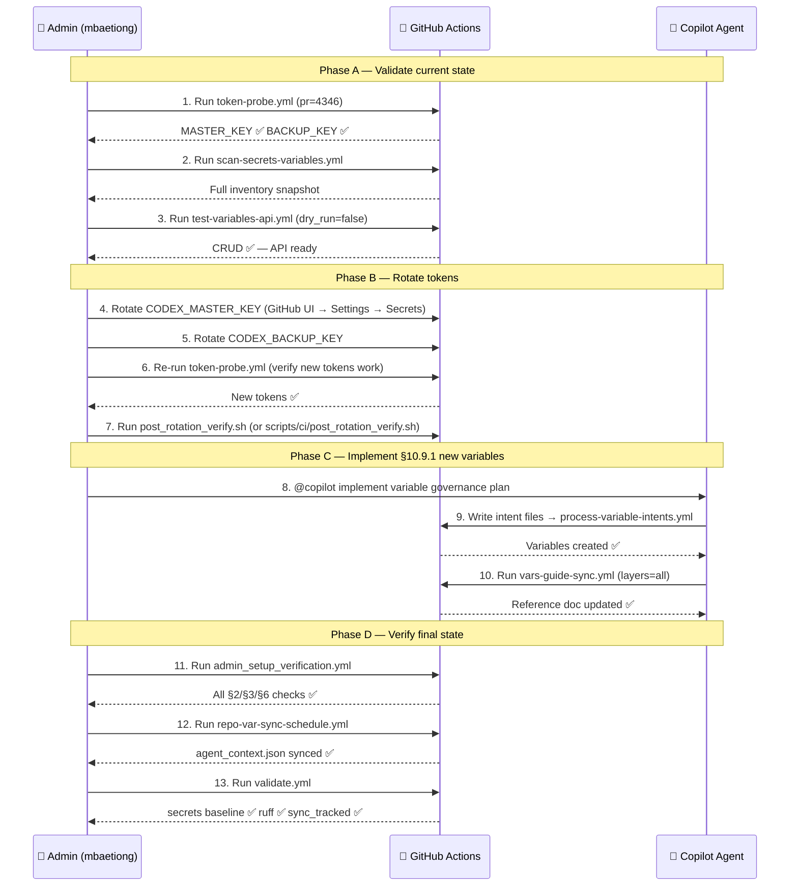

---

> **Maintainer:** @mbaetiong
> **Next review:** 2026-06-08 (monthly cadence)
> **Last updated:** 2026-05-08 — Sections 10 and 11 added (Variable & Secret Governance + Workflow Catalog)
> **Auto-update:** This document is updated by `copilot-swe-agent[bot]` at session start when token state changes.

---

## 12. Rate-Limit Awareness — Workflow Improvement Guide

> **Purpose:** Every GitHub API call made by a workflow consumes quota from a shared
> per-token hourly pool. When that pool is exhausted, every further call returns HTTP 429
> or 403 until the reset epoch. This section catalogues which workflows need improvement,
> what patterns to apply, and how the existing rate-limit infrastructure can be reused.

---

### 12.1 Token Pools & Limits Reference

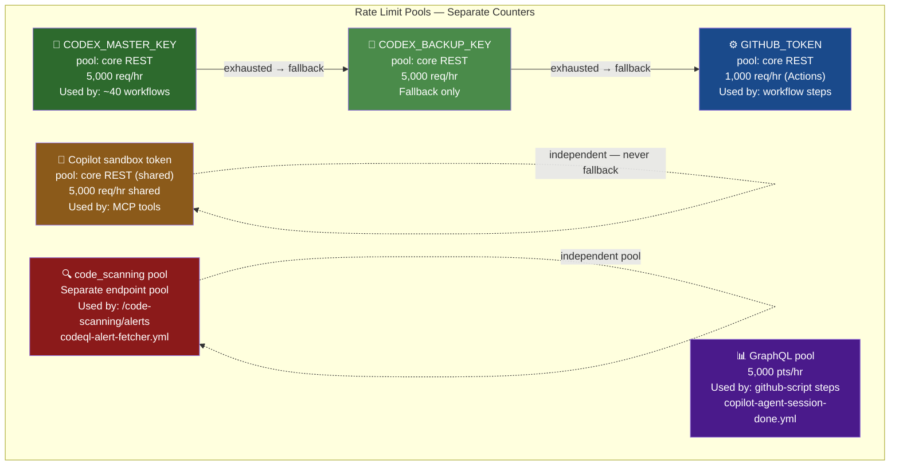

**Key facts:**
- A failed API call (403/429) **still consumes 1 request** from your quota.
- Never retry before `x-ratelimit-reset` epoch — doing so multiplies consumption.
- The MCP `list_code_scanning_alerts` tool uses the Copilot sandbox token — a
  **different pool** from `CODEX_MASTER_KEY`. Both can exhaust independently.
- Paginated calls (`--paginate`, `per_page=100`) can consume **10–50× more requests**
  than single-page calls. Each page = 1 request.

---

### 12.2 Existing Rate-Limit Infrastructure

The repository already has a full rate-limit toolkit. **All new improvements should
reuse these — do not reinvent:**

| Tool / Script | Location | What it does |
|--------------|----------|-------------|
| `github_api_trickle.py` | `scripts/ci/github_api_trickle.py` | 5-method trickle-down fetcher: REST → GraphQL → `gh` CLI → artifact → local CodeQL DB. Token rotation, per-page sleep, exponential backoff, `Retry-After` respect. |
| `github_api_trickle.py --status` | Same | Pre-call check: exit 0=ready, exit 1=ALL tokens exhausted. Writes `.codex/rate_limit_state.json`. |
| `.codex/rate_limit_state.json` | Auto-written by trickle | Cached rate limit state. Re-use if age < 60 s. Contains `ok`, `earliest_reset_epoch`, `earliest_reset_human`. |
| `RATE_LIMIT_AWARENESS.md` | `.codex/docs/RATE_LIMIT_AWARENESS.md` | Protocol reference — read before writing any API-calling workflow. |
| `ratelimit_history_prune.yml` | `.github/workflows/ratelimit_history_prune.yml` | Monthly pruning of rate-limit history logs (90-day retention). |
| `GH_TRICKLE_POLITE_SLEEP` | Env var | Seconds between trickle calls (default `0.5`). Set per workflow. |
| `GH_TRICKLE_MIN_REMAINING` | Env var | Switch token when remaining drops below this (default `10`). |
| `GH_TRICKLE_MAX_WAIT` | Env var | Max seconds to wait for rate-limit recovery (default `120`). |
| `GH_TRICKLE_RETRIES` | Env var | Max retries per method per token (default `3`). |

---

### 12.3 Workflow Audit — Rate-Limit Gap Register

The following workflows were audited for rate-limit handling completeness.
Workflows are ranked by **gap score** = (API calls) − (guards present).

#### Priority 1 — High Gap, High Frequency (Fix First)

| Workflow | API Calls | Guards | Gap | Trigger Frequency | Key Risk |
|----------|----------:|-------:|----:|-------------------|---------|
| `workflow-execution-gate.yml` | 5 | 0 | **5** | Every push (all PRs) | Paginated PR comment fetch — can hit 429 mid-run, silently truncating WEC parse |
| `auto-approve-workflows.yml` | 6 | 1 | **5** | Every push + cron `*/5 * * * *` | `--paginate` on open PRs × 5/min schedule = burst risk; only 1 `continue-on-error` guard |
| `promote-integration-branch.yml` | 5 | 0 | **5** | On merge to `main` | Sequential `gh api PATCH` ref updates with no retry — a 429 mid-sequence leaves branch in partial state |
| `copilot-agent-session-done.yml` | 3 REST + GraphQL | 0 | **5** | `workflow_run` completion | Multiple paginated GraphQL queries (`per_page:100` × 5 page loops) with zero rate-limit handling |

#### Priority 2 — Medium Gap, Scheduled or Self-Healing

| Workflow | API Calls | Guards | Gap | Trigger Frequency | Key Risk |
|----------|----------:|-------:|----:|-------------------|---------|
| `copilot-iterative-self-healing.yml` | 5 | 1 | **4** | `workflow_run` + schedule | Paginated comment scan (100/page × multiple pages) — partial `continue-on-error` but no pre-call check |
| `codeql.yml` | 4 | 0 | **4** | Schedule (weekly) + push | No guards; competes with `codeql-analysis.yml` for `code_scanning` pool in same window |
| `codebase-health-sweep.yml` | 3 | 0 | **3** | Schedule (daily) | Paginated `gh api` PR queries with no backoff |

#### Priority 3 — Lower Gap, Event-Driven

| Workflow | API Calls | Guards | Gap | Trigger Frequency | Key Risk |
|----------|----------:|-------:|----:|-------------------|---------|
| `iterative-self-healing-ci.yml` | 4 | 3 | **1** | `workflow_run` | Good guards but missing pre-call `github_api_trickle.py --status` check |
| `codeql-analysis.yml` | 5 | 0 | **5** | Schedule + push | Scheduled alongside `codeql.yml` — double `code_scanning` pool consumption |

#### Currently Well-Handled (Reference Implementations)

| Workflow | API Calls | Guards | Notes |
|----------|----------:|-------:|-------|
| `agent-auth-delegation.yml` | 1 | 16 | Best-in-class: full `Retry-After` handling, token chain, `continue-on-error` on every API step |
| `codeql-alert-fetcher.yml` | — | 4 | Uses `github_api_trickle.py` natively; configurable `page_sleep_ms`; exits 0 on exhaustion |
| `artifact-monitoring.yml` | 1 | 2 | Explicit `gh api rate_limit` check step + summary |
| `iterative-self-healing-ci.yml` | 4 | 3 | Best self-healing example; use as template for P1/P2 improvements |

---

### 12.4 Improvement Patterns — Reusable Recipes

Apply these patterns to all P1/P2 gap workflows. Each is self-contained and can be
copy-pasted as a workflow step.

#### Pattern A — Pre-Call Rate-Limit Check (Single Step)

Add before any step that makes ≥ 2 API calls:

```yaml
- name: 🔋 Rate-limit pre-check
  env:
    CODEX_MASTER_KEY: ${{ secrets.CODEX_MASTER_KEY }}
    CODEX_BACKUP_KEY: ${{ secrets.CODEX_BACKUP_KEY }}
  run: |
    python scripts/ci/github_api_trickle.py --status || {
      echo "::warning::All GitHub API tokens exhausted — skipping API steps"
      echo "RATE_LIMITED=true" >> "$GITHUB_ENV"
    }

# Then on each API step:
- name: My API step
  if: env.RATE_LIMITED != 'true'
  run: gh api ...
```

#### Pattern B — Polite Sleep Between Batched Calls

For workflows making 3+ sequential `gh api` calls in a single `run:` block:

```yaml
- name: Batch API operations (rate-limit aware)
  env:
    GH_TOKEN: ${{ secrets.CODEX_MASTER_KEY || secrets.CODEX_BACKUP_KEY || github.token }}
    GH_TRICKLE_POLITE_SLEEP: "0.5"   # seconds between calls
  run: |
    # After each gh api call, check remaining quota
    _rl_check() {
      local remaining
      remaining=$(gh api rate_limit --jq '.resources.core.remaining' 2>/dev/null || echo "999")
      if [ "$remaining" -lt 50 ]; then
        local reset
        reset=$(gh api rate_limit --jq '.resources.core.reset' 2>/dev/null || echo "0")
        local now
        now=$(date +%s)
        local wait=$(( reset - now + 5 ))
        if [ "$wait" -gt 0 ] && [ "$wait" -lt 3600 ]; then
          echo "::warning::Rate limit low ($remaining remaining) — sleeping ${wait}s until reset"
          sleep "$wait"
        fi
      fi
      sleep "${GH_TRICKLE_POLITE_SLEEP:-0.5}"
    }

    gh api "repos/${REPO}/..." ; _rl_check
    gh api "repos/${REPO}/..." ; _rl_check
    gh api "repos/${REPO}/..." ; _rl_check
```

#### Pattern C — Retry with Exponential Backoff (for PATCH/POST)

For `gh api --method POST/PATCH` calls where partial failure leaves state inconsistent:

```yaml
- name: API write with retry
  env:
    GH_TOKEN: ${{ secrets.CODEX_MASTER_KEY || secrets.CODEX_BACKUP_KEY || github.token }}
  run: |
    _api_with_retry() {
      local attempt=0
      local max_attempts=3
      while [ $attempt -lt $max_attempts ]; do
        if "$@"; then
          return 0
        fi
        attempt=$(( attempt + 1 ))
        local backoff=$(( 2 ** attempt * 5 ))   # 10s, 20s, 40s
        echo "::warning::API call failed (attempt $attempt/$max_attempts) — retrying in ${backoff}s"
        sleep "$backoff"
      done
      echo "::error::API call failed after $max_attempts attempts"
      return 1
    }

    _api_with_retry gh api --method PATCH \
      "repos/${REPO}/git/refs/heads/${BRANCH}" \
      -f sha="${NEW_SHA}"
```

#### Pattern D — Paginated Fetch with Rate-Limit Guard

For `--paginate` or manual page loops:

```yaml
- name: Paginated fetch (rate-limit safe)
  env:
    GH_TOKEN: ${{ secrets.CODEX_MASTER_KEY || secrets.CODEX_BACKUP_KEY || github.token }}
  run: |
    page=1
    all_items="[]"
    while true; do
      # Check remaining before each page
      remaining=$(gh api rate_limit --jq '.resources.core.remaining' 2>/dev/null || echo "999")
      if [ "$remaining" -lt 20 ]; then
        echo "::warning::Rate limit low ($remaining) — stopping pagination at page $page"
        break
      fi

      batch=$(gh api "repos/${REPO}/pulls?per_page=100&page=${page}" 2>/dev/null || break)
      count=$(echo "$batch" | jq 'length')
      [ "$count" -eq 0 ] && break
      all_items=$(echo "$all_items $batch" | jq -s '.[0] + .[1]')
      page=$(( page + 1 ))
      sleep 0.5   # polite sleep between pages
    done
    echo "$all_items" | jq '.'
```

#### Pattern E — Respect `Retry-After` Header (for 429 responses)

```yaml
- name: API call with Retry-After respect
  env:
    GH_TOKEN: ${{ secrets.CODEX_MASTER_KEY || secrets.CODEX_BACKUP_KEY || github.token }}
  run: |
    _call_with_retry_after() {
      local http_code
      local response
      response=$(curl -sS -w "\n%{http_code}" \
        -H "Authorization: Bearer ${GH_TOKEN}" \
        -H "Accept: application/vnd.github+json" \
        -H "X-GitHub-Api-Version: 2022-11-28" \
        "$1")
      http_code=$(echo "$response" | tail -1)
      body=$(echo "$response" | sed '$d')
      if [ "$http_code" = "429" ] || [ "$http_code" = "403" ]; then
        retry_after=$(echo "$body" | jq -r '.message // empty' | grep -oP '\d+(?= seconds)' || echo "60")
        echo "::warning::Rate limited (HTTP $http_code) — waiting ${retry_after}s"
        sleep "$retry_after"
        return 1
      fi
      echo "$body"
    }
```

---

### 12.5 Per-Workflow Improvement Specifications

#### 12.5.1 `workflow-execution-gate.yml` — Priority 1

**Current gap:** 5 API calls, 0 rate-limit guards. Runs on every push across all PRs.
Paginated PR comment fetch at lines ~465 and ~641 can silently hit 429 mid-page, causing
the WEC parser to receive truncated data and skip WEC-checked workflows.

**Required improvements:**
1. Add **Pattern A** pre-call check before the `detect-wec-changes` job's API steps
2. Add `continue-on-error: true` on the comment-fetch loop steps (already fragile)
3. Replace inline `gh api --paginate` with call to `github_api_trickle.py` for comment fetching
4. Add `GH_TRICKLE_POLITE_SLEEP: "0.3"` env at job level

```yaml
# Add to dispatch-checked job, before first API call:
env:
  GH_TOKEN: ${{ secrets.CODEX_MASTER_KEY || secrets.CODEX_BACKUP_KEY || github.token }}
  GH_TRICKLE_POLITE_SLEEP: "0.3"
  GH_TRICKLE_MIN_REMAINING: "50"   # higher threshold — this workflow runs on every push
```

---

#### 12.5.2 `auto-approve-workflows.yml` — Priority 1

**Current gap:** 6 API calls, 1 guard. Runs every 5 minutes via cron. The `--paginate`
on open PRs (line 186) + 5 API calls per PR × potentially many PRs = burst risk.

**Required improvements:**
1. Add **Pattern D** (paginated fetch guard) to the `--paginate` loop
2. Add pre-call rate check: skip job entirely if `remaining < 100`
3. Add `GH_TRICKLE_POLITE_SLEEP: "1.0"` (1 s between calls) — scheduled workflow,
   not time-critical
4. Add a circuit-breaker variable: if rate-limited, write `COPILOT_AUTO_APPROVE_PAUSED=true`
   to env and skip the job, re-enabling on next run

```yaml
# Add to job-level env:
env:
  GH_TRICKLE_POLITE_SLEEP: "1.0"
  GH_TRICKLE_MIN_REMAINING: "100"   # generous — runs every 5 min
```

---

#### 12.5.3 `promote-integration-branch.yml` — Priority 1

**Current gap:** 5 sequential `gh api PATCH` ref update calls with no retry. A 429 on
call #3 leaves refs in a split state (some updated, some not) with no recovery path.

**Required improvements:**
1. Wrap each `gh api PATCH` in **Pattern C** (retry with exponential backoff)
2. Add pre-call check before the ref update sequence
3. Add a rollback step: if any PATCH fails after retries, revert previously-updated refs

---

#### 12.5.4 `copilot-agent-session-done.yml` — Priority 1

**Current gap:** Multiple paginated GraphQL queries (`per_page:50–100`, looping up to
5 pages per query) across 4 separate `github-script` steps. Zero rate-limit handling.

**Required improvements:**
1. Add rate-limit pre-check at job level using `github_api_trickle.py --status`
2. For each `github-script` step with pagination: add `await github.rest.rateLimit.get()`
   check before the page loop
3. Add `octokit` retry plugin (already available via `github-script`):
   ```javascript
   // In github-script:
   const { throttling } = require('@octokit/plugin-throttling');
   // OR use built-in retry via context.octokit.rest with retry plugin
   ```
4. Set `GH_TRICKLE_POLITE_SLEEP: "0.5"` between GraphQL calls

**GraphQL rate check pattern for `github-script`:**
```javascript
// Add before page loops in github-script steps:
const rateLimit = await github.rest.rateLimit.get();
const remaining = rateLimit.data.resources.graphql.remaining;
if (remaining < 100) {
  const resetAt = new Date(rateLimit.data.resources.graphql.reset * 1000);
  core.warning(`GraphQL rate limit low: ${remaining} remaining, resets at ${resetAt.toISOString()}`);
  // Skip pagination if critically low:
  if (remaining < 20) {
    core.warning('Skipping pagination — rate limit critically low');
    break;
  }
}
```

---

#### 12.5.5 `copilot-iterative-self-healing.yml` — Priority 2

**Current gap:** 5 API calls, 1 `continue-on-error` guard. Paginated comment scan
(100/page × multiple pages) can exhaust quota during high-activity periods.

**Required improvements:**
1. Add **Pattern A** pre-call check at job start
2. Replace manual `page=1` while loop with `github_api_trickle.py` call:
   ```bash
   python scripts/ci/github_api_trickle.py \
     --rest "/repos/${GITHUB_REPOSITORY}/issues/${PR_NUMBER}/comments?per_page=100" \
     > /tmp/comments.json
   ```
3. Add polite sleep between page iterations
4. Add circuit breaker: if pre-call check fails, skip the healing loop and post a
   "⏳ Rate limited — healing deferred until quota resets" summary comment

---

#### 12.5.6 `codebase-health-sweep.yml` — Priority 2

**Current gap:** 3 paginated `gh api` calls, 0 guards. Runs on a schedule that may
overlap with other scheduled workflows.

**Required improvements:**
1. Add **Pattern A** pre-call check
2. Add `continue-on-error: true` on all API steps (health sweep is advisory)
3. Stagger the cron schedule away from `codeql.yml` and `auto-approve-workflows.yml`
   to avoid competing for the same token pool in the same minute

---

#### 12.5.7 `codeql.yml` + `codeql-analysis.yml` — Priority 2 (Deduplication)

**Current gap:** Both workflows run on similar schedules and both consume the
`code_scanning` pool. Zero guards in either.

**Required improvements:**
1. Add `continue-on-error: true` on all API steps in both workflows
2. Stagger schedules: `codeql.yml` on Monday, `codeql-analysis.yml` on Thursday
3. Add a pre-check step that reads `CODEX_CI_FAILURE_RATE` — skip if `> 5.0` (don't
   run CodeQL when CI is already unhealthy)
4. Consider consolidating into one workflow that decides which scanner to use

---

### 12.6 Rate-Limit Monitoring — New Variable Recommendations

Add these variables to complement the §10.9.1 suggestions:

| Variable | Value | Purpose |
|----------|-------|---------|
| `CODEX_RL_POLITE_SLEEP_DEFAULT` | `0.5` | Default polite sleep (seconds) injected via `GH_TRICKLE_POLITE_SLEEP` |
| `CODEX_RL_MIN_REMAINING_DEFAULT` | `50` | Default minimum remaining before token switch |
| `CODEX_RL_MAX_WAIT_DEFAULT` | `120` | Default max recovery wait (seconds) |
| `CODEX_RL_CIRCUIT_BREAKER_ENABLED` | `true` | Master switch for circuit-breaker pattern |
| `CODEX_RL_LAST_EXHAUSTION_TIME` | *(auto-set)* | ISO timestamp of last rate-limit exhaustion; auto-set by `github_api_trickle.py` |
| `CODEX_RL_EXHAUSTION_COUNT_7D` | `0` | Count of exhaustion events in last 7 days; tracked by trickle script |

---

### 12.7 Implementation Order Diagram

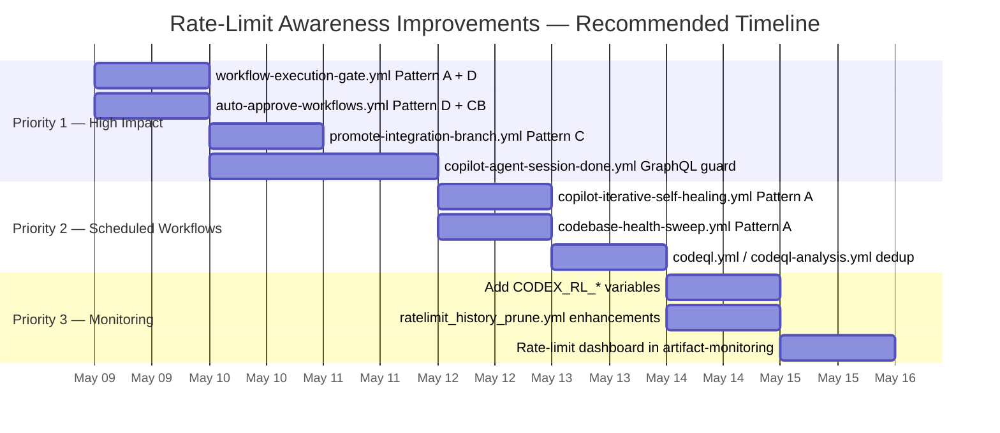

---

> **Maintainer:** @mbaetiong
> **Next review:** 2026-06-08 (monthly cadence)
> **Last updated:** 2026-05-08 — Section 12 (Rate-Limit Awareness Workflow Improvements) added
> **Auto-update:** This document is updated by `copilot-swe-agent[bot]` at session start when token state changes.
