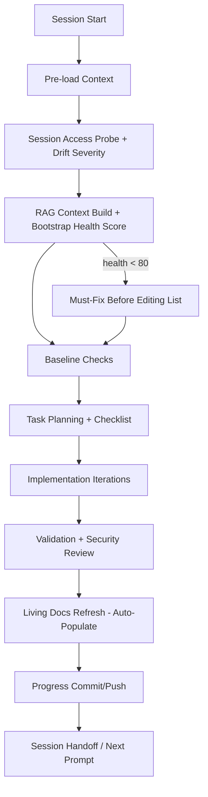

# Copilot Agent Session — Standard Operating Model

> **Cross-reference (Canonical Planset):** [.codex/plans/LEAN_WORKFLOW_OS_PLANSET.md](../../.codex/plans/LEAN_WORKFLOW_OS_PLANSET.md)
> **Lifecycle:** ACTIVE OPERATIONAL

## Purpose

Define the standard operation of a Copilot coding/cloud agent session, the required living docs,
and a planset to simplify session entry and continuity. This document is the primary human-facing
reference; the machine-readable canonical planset lives at
`.codex/plans/LEAN_WORKFLOW_OS_PLANSET.md`.

## Session Lifecycle (Standard Operation)



## Expected Living Docs (Required)

| Artifact | Path Pattern | Purpose | Update Cadence |
|---|---|---|---|
| Accountability report | `docs/accountability/AGENT_ACCOUNTABILITY_REPORT.md` | Session log of completed work, validation, policy compliance | Every session |
| Changelog | `CHANGELOG.md` | Human-readable repository change history | Every session with file edits |
| PR “what’s next” doc | `docs/roadmap/PR<PR_NUMBER>_whats_next.md` | Active workstream status and immediate next actions | Per PR / per major update |
| PR session diagram | `docs/roadmap/PR<PR_NUMBER>_session_diagram.mmd` | Visual execution trace for handoff and rapid re-entry | Per PR / major flow change |
| Workflow reporting table | `docs/reporting/workflow_portfolio_7d_table.csv` + `.md` | Structured workflow operational state and mapping context | When workflow analytics are refreshed |
| Workflow analysis narrative | `docs/reporting/workflow_portfolio_7d_analysis.md` | Strategic findings, quick wins, conflict analysis | When analytics are refreshed |
| PDA loop feed | `.codex/aftermath/pda_iterations.jsonl` | Iteration-level memory signal and recency for operational patterns | Every session |

## Tokenized Session Variable Contract

Use tokenized variable aliases in living docs and session handoffs to keep references stable and grep-friendly:

| Token | Canonical Variable | Session Use |
|---|---|---|
| `TVAR_COPILOT_AGENT_AUTH_ENABLED` | `COPILOT_AGENT_AUTH_ENABLED` | Confirms delegated session authority |
| `TVAR_COPILOT_AGENT_MAX_AUTONOMY_LEVEL` | `COPILOT_AGENT_MAX_AUTONOMY_LEVEL` | Determines expected automation depth |
| `TVAR_COGNITIVE_BRAIN_SESSION_NUMBER` | `COGNITIVE_BRAIN_SESSION_NUMBER` | Session continuity indexing |
| `TVAR_CODEX_CI_FAILURE_RATE` | `CODEX_CI_FAILURE_RATE` | Live CI-risk signal for triage |
| `TVAR_CODEX_CI_LAST_GREEN_SHA` | `CODEX_CI_LAST_GREEN_SHA` | Baseline for drift/failure comparison |
| `TVAR_CODEX_SWEEP_SKIP_MAIN` | `CODEX_SWEEP_SKIP_MAIN` | Conflict mitigation when main is moving |
| `TVAR_CODEX_MAX_HEALER_RUNS_PER_HOUR` | `CODEX_MAX_HEALER_RUNS_PER_HOUR` | Healer pressure/rate control |
| `TVAR_CODEX_HEALER_SKIP_SKIPCI` | `CODEX_HEALER_SKIP_SKIPCI` | Prevents skip-ci feedback loops |
| `TSEC_CODEX_MASTER_KEY` | `CODEX_MASTER_KEY` | Primary write token in workflow auth chain |
| `TSEC_CODEX_BACKUP_KEY` | `CODEX_BACKUP_KEY` | Fallback write token |
| `TENV_PYTHON_VERSION` | `CODEX_ENV_PYTHON_VERSION` | Environment Python version |
| `TENV_NODE_VERSION` | `CODEX_ENV_NODE_VERSION` | Environment Node version |

## 🚨 Branch-Update Conflict — Session Quick Reference

> Full per-workflow mitigation cards: [`workflow_portfolio_7d_analysis.md → Branch-Update Conflict Dashboard`](workflow_portfolio_7d_analysis.md#-branch-update-conflict-dashboard)

```
Detect drift:  git log main..HEAD --oneline | wc -l
  0      → LOW     → proceed normally
  1–3    → MEDIUM  → set CODEX_SWEEP_SKIP_MAIN=true before any write op
  4+     → HIGH    → rebase first, then re-run session probe
  force  → CRITICAL→ abort session; fetch main; restart bootstrap
```

**HIGH-risk workflows to guard (write-capable; conflict immediately if main drifts):**

| 🔴 Workflow | Runs/7d | Required mitigation |
|---|---:|---|
| `iterative-self-healing-ci.yml` | 413 | `CODEX_SWEEP_SKIP_MAIN=true` + `CODEX_MAX_HEALER_RUNS_PER_HOUR≤3` + `CODEX_HEALER_SKIP_SKIPCI=true` |
| `copilot-evolution-suite.yml` | 10 | `CODEX_SWEEP_SKIP_MAIN=true`; do not trigger during HIGH drift |
| `copilot-agent-session-done.yml` | 10 | Verify triggering run targets current branch HEAD before auto-post |
| `agent-var-writer.yml` | 5 | Serialize with healer; confirm var value after write |
| `copilot-session-chain.yml` | 0 | Only trigger at drift=LOW; add merge-base pre-check in job |
| `agent-orchestration-unified.yml` | 0 | Inject `branch_drift_severity` before dispatching sub-agents |

## Expected Entry Checklist (Streamlined)

1. Load mandatory context files + latest PDA entries.
2. Check branch drift: `git log main..HEAD --oneline | wc -l` → apply conflict protocol above.
3. Check bootstrap health score (`SESSION_BOOTSTRAP_HEALTH` in `GITHUB_ENV`); if < 80, resolve "Must-Fix" list first.
4. Read unresolved maintainer/bot comments and failing checks.
5. Run baseline validation (`nox -s precommit`, `nox -s tests`) and capture pre-existing failures.
6. Publish a checklist plan via progress reporting.
7. Execute minimal scoped edits.
8. Re-run targeted validations.
9. Refresh living docs + accountability + changelog (auto-populated by `living_doc_sync.py`).
10. Commit/push and provide next-session continuation pointers.

## Planset — Simplify and Streamline Copilot Session Entries

> **Full machine-readable planset (Plans A–F):** [LEAN_WORKFLOW_OS_PLANSET.md](../../.codex/plans/LEAN_WORKFLOW_OS_PLANSET.md)

### Plan A — Entry Contract Standardization
- Create a single "session entry contract" section template reused across PR living docs.
- Require tokenized variable block (`TVAR_*`, `TSEC_*`) in each PR `whats_next` update.
- Add a short "current branch drift status" line in every session handoff.

### Plan B — Living Doc Consolidation
- Keep one canonical PR status page (`PR<id>_whats_next.md`) and one canonical diagram (`PR<id>_session_diagram.mmd`).
- Move transient/noisy status notes to accountability history only.
- Add a fixed "Current Head / Mergeability / Critical Checks" table at top of each PR status page.

### Plan C — Friction Reduction Automation (Living-Doc Auto-Population)
- Auto-generate starter blocks for new `PR<id>_whats_next.md` and `PR<id>_session_diagram.mmd`.
- Auto-append session metadata to accountability/changelog with standardized fields via `living_doc_sync.py`.
- Add a pre-commit helper that warns when required living docs are missing for the active PR.
- Session logger emits normalized `session_start` / `session_end` / `validation_gate` events into SQLite; aftermath updater (`update_cognitive_brain.py`) transforms these into deterministic living-doc updates.

### Plan D — Conflict-Resilient Session Flow ⬅ PRIORITY
- **Conflict dashboard** is the first lookup before any write operation — see section above.
- For write-capable workflow chains, include drift mitigation variables in handoff docs (`TVAR_CODEX_SWEEP_SKIP_MAIN`, `TVAR_CODEX_MAX_HEALER_RUNS_PER_HOUR`, `TVAR_CODEX_HEALER_SKIP_SKIPCI`).
- Gate HIGH-risk workflows with branch-scoped concurrency + timeout (see per-workflow cards in `workflow_portfolio_7d_analysis.md`).
- Conflict index table in `workflow_portfolio_7d_analysis.md` is the maintained ground truth; refresh it whenever the workflow portfolio is updated.

---

## Auto-Populated Logging System

This section describes how session events flow into living docs without manual effort.

### Event Flow

```
Copilot Agent Session
  |
  +- session_logger.log_event(session_id, role="system", message="...", meta={...})
  |       |  emits events to: .codex/session_logs.db (SQLite)
  |
  v
update_cognitive_brain.py living_doc_sync()
  |  reads: session_events WHERE session_id = latest AND role = "system"
  |  queries: session_start event (context), session_end event (summary)
  |  builds: structured delta blocks per target doc
  |
  +- docs/accountability/AGENT_ACCOUNTABILITY_REPORT.md  <- session summary block
  +- CHANGELOG.md                                         <- [Unreleased] entry
  +- docs/roadmap/PR<id>_whats_next.md                   <- status table update
  +- .codex/aftermath/pda_iterations.jsonl               <- PDA loop feed
```

### Required Meta Fields (session_start event)

```python
meta = {
    "session_id":                  "S1035-lean-workflow-os",
    "branch":                      "copilot/lean-workflow-os",
    "pr_number":                   4470,
    "context_load_status":         "complete",   # complete | partial | failed
    "drift_severity":              "LOW",         # LOW | MEDIUM | HIGH | CRITICAL
    "policy_version":              "CODEBASE_AGENCY_POLICY.md s3a",
    "repo_variables_snapshot_sha": "35d136b",
}
```

### Required Meta Fields (session_end event)

```python
meta = {
    "session_id":          "S1035-lean-workflow-os",
    "completed_tasks":     ["Plan A consolidation", "Phase 6 added"],
    "pending_tasks":       ["Plan B token contracts"],
    "pattern_compliance":  {"P25": "pass", "P30": "pass"},
    "living_docs_updated": ["AGENT_ACCOUNTABILITY_REPORT.md", "CHANGELOG.md"],
}
```

### CLI Tools

```bash
# Check freshness of all living docs (no writes)
python scripts/aftermath/living_doc_sync.py --check-freshness-only

# Sync living docs from latest session events
python scripts/aftermath/living_doc_sync.py

# Dry run (show what would be written, no actual writes)
python scripts/aftermath/living_doc_sync.py --dry-run

# Full aftermath update (living doc sync + CB knowledge update)
python scripts/aftermath/update_cognitive_brain.py --mode living-doc-sync
```

### Bootstrap Health Score

```
health_score = 100
- 30  if drift_severity == CRITICAL
- 15  if drift_severity == HIGH
- 10  if any required check is failing
- 10  if ci_failure_rate > threshold (TVAR_CODEX_CI_FAILURE_RATE)
- 10  if any living doc is stale (> 24h from latest session_end)
- 5   if token contract block missing from any session-critical doc
- 5   if repo variables snapshot is > 1h old
```

Score >= 80 = GREEN (proceed). Score 50-79 = YELLOW (fix listed items first). Score < 50 = RED.

---

## Environment Setup Enhancement Opportunities

| Enhancement | Step to Add/Modify | Priority |
|---|---|---|
| Branch drift severity in startup packet | `session_access_probe.py` -> write `branch_drift_severity` | HIGH |
| Bootstrap health score | `autonomous_rag_context.py` -> compute + export `SESSION_BOOTSTRAP_HEALTH` | HIGH |
| Living-doc freshness check | New step after RAG context build | HIGH |
| Conflict dashboard link in startup context | `session_context_latest.md` template -> add conflict section link | HIGH |
| Token contract validation | New step after Session Context Pre-load (non-blocking) | MEDIUM |
| Must-fix list generation | `session_context_latest.md` template | MEDIUM |
| Startup quality confidence markers | All mandatory fields with `confidence: high/cached/unknown` | LOW |

---

## Success Criteria

- New Copilot sessions can enter context in <5 minutes using only living docs.
- Required living docs are always present and updated in each session with file edits.
- Session handoffs consistently include tokenized variable mapping and branch drift status.
- Branch-update conflict workflows are visible with per-workflow step-by-step mitigation guidance.
- `SESSION_BOOTSTRAP_HEALTH` is exported every session startup.
- Living docs are auto-populated from `session_end` events without manual effort.
