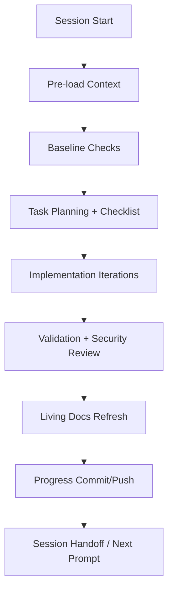

# Copilot Agent Session — Standard Operating Model

## Purpose

Define the standard operation of a Copilot coding/cloud agent session, the required living docs, and a planset to simplify session entry and continuity.

## Session Lifecycle (Standard Operation)

## Expected Living Docs (Required)

| Artifact | Path Pattern | Purpose | Update Cadence |
|---|---|---|---|
| Accountability report | `docs/accountability/AGENT_ACCOUNTABILITY_REPORT.md` | Session log of completed work, validation, policy compliance | Every session |
| Changelog | `CHANGELOG.md` | Human-readable repository change history | Every session with file edits |
| PR “what’s next” doc | `docs/roadmap/PR<PR_NUMBER>_whats_next.md` | Active workstream status and immediate next actions | Per PR / per major update |
| PR session diagram | `docs/roadmap/PR<PR_NUMBER>_session_diagram.mmd` | Visual execution trace for handoff and rapid re-entry | Per PR / major flow change |
| Workflow reporting table | `docs/reporting/workflow_portfolio_7d_table.csv` + `.md` | Structured workflow operational state and mapping context | When workflow analytics are refreshed |
| Workflow analysis narrative | `docs/reporting/workflow_portfolio_7d_analysis.md` | Strategic findings, quick wins, conflict analysis | When analytics are refreshed |
| PDA loop feed | `.codex/aftermath/pda_iterations.jsonl` | Iteration-level memory signal and recency for operational patterns | Every session |

## Tokenized Session Variable Contract

Use tokenized variable aliases in living docs and session handoffs to keep references stable and grep-friendly:

| Token | Canonical Variable | Session Use |
|---|---|---|
| `TVAR_COPILOT_AGENT_AUTH_ENABLED` | `COPILOT_AGENT_AUTH_ENABLED` | Confirms delegated session authority |
| `TVAR_COPILOT_AGENT_MAX_AUTONOMY_LEVEL` | `COPILOT_AGENT_MAX_AUTONOMY_LEVEL` | Determines expected automation depth |
| `TVAR_COGNITIVE_BRAIN_SESSION_NUMBER` | `COGNITIVE_BRAIN_SESSION_NUMBER` | Session continuity indexing |
| `TVAR_CODEX_CI_FAILURE_RATE` | `CODEX_CI_FAILURE_RATE` | Live CI-risk signal for triage |
| `TVAR_CODEX_CI_LAST_GREEN_SHA` | `CODEX_CI_LAST_GREEN_SHA` | Baseline for drift/failure comparison |
| `TVAR_CODEX_SWEEP_SKIP_MAIN` | `CODEX_SWEEP_SKIP_MAIN` | Conflict mitigation when main is moving |
| `TVAR_CODEX_MAX_HEALER_RUNS_PER_HOUR` | `CODEX_MAX_HEALER_RUNS_PER_HOUR` | Healer pressure/rate control |
| `TVAR_CODEX_HEALER_SKIP_SKIPCI` | `CODEX_HEALER_SKIP_SKIPCI` | Prevents skip-ci feedback loops |
| `TSEC_CODEX_MASTER_KEY` | `CODEX_MASTER_KEY` | Primary write token in workflow auth chain |
| `TSEC_CODEX_BACKUP_KEY` | `CODEX_BACKUP_KEY` | Fallback write token |

## Expected Entry Checklist (Streamlined)

1. Load mandatory context files + latest PDA entries.
2. Read unresolved maintainer/bot comments and failing checks.
3. Run baseline validation (`nox -s precommit`, `nox -s tests`) and capture pre-existing failures.
4. Publish a checklist plan via progress reporting.
5. Execute minimal scoped edits.
6. Re-run targeted validations.
7. Refresh living docs + accountability + changelog.
8. Commit/push and provide next-session continuation pointers.

## Planset — Simplify and Streamline Copilot Session Entries

### Plan A — Entry Contract Standardization
- Create a single “session entry contract” section template reused across PR living docs.
- Require tokenized variable block (`TVAR_*`, `TSEC_*`) in each PR `whats_next` update.
- Add a short “current branch drift status” line in every session handoff.

### Plan B — Living Doc Consolidation
- Keep one canonical PR status page (`PR<id>_whats_next.md`) and one canonical diagram (`PR<id>_session_diagram.mmd`).
- Move transient/noisy status notes to accountability history only.
- Add a fixed “Current Head / Mergeability / Critical Checks” table at top of each PR status page.

### Plan C — Friction Reduction Automation
- Auto-generate starter blocks for new `PR<id>_whats_next.md` and `PR<id>_session_diagram.mmd`.
- Auto-append session metadata to accountability/changelog with standardized fields.
- Add a pre-commit helper that warns when required living docs are missing for the active PR.

### Plan D — Conflict-Resilient Session Flow
- For write-capable workflow chains, include drift mitigation variables in handoff docs (`TVAR_CODEX_SWEEP_SKIP_MAIN`, `TVAR_CODEX_MAX_HEALER_RUNS_PER_HOUR`).
- Gate high-conflict workflows with explicit branch-scoped concurrency and timeout defaults.
- Keep a maintained table of branch-update conflict workflows in workflow reporting docs.

## Success Criteria

- New Copilot sessions can enter context in <5 minutes using only living docs.
- Required living docs are always present and updated in each session with file edits.
- Session handoffs consistently include tokenized variable mapping and branch drift status.
- Branch-update conflict workflows are visible with mitigation guidance.
