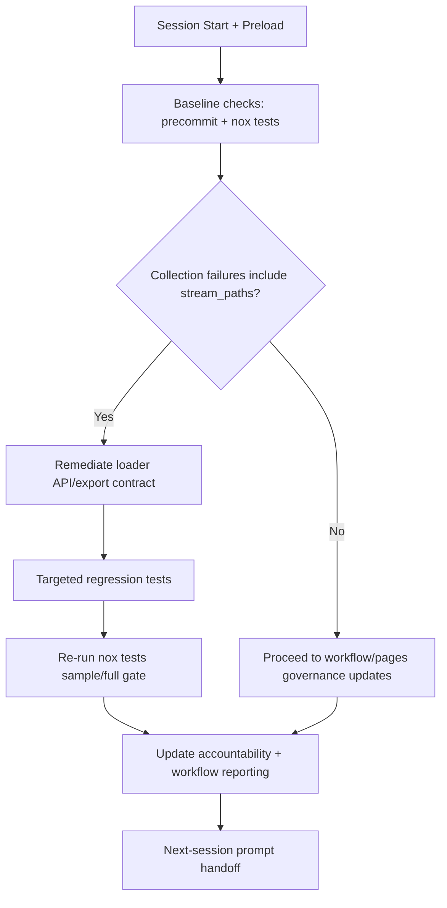

# Next Expected Codebase Change (48-Hour Alignment)

Generated: 2026-05-17T07:39:30Z  
Repository: `Aries-Serpent/_codex_`  
Window reviewed: last 48 hours

## 1) Recent Change Alignment Summary

The most recent sessions concentrated on:
- GitHub Pages reliability hardening (`pages-mkdocs.yml` deploy action fix, `pages-health-guard.yml` telemetry directory creation).
- WEC/workflow governance tightening (`wec_enforcer.py` active-state validation, token-chain usage hardening).
- Reporting expansion (`workflow_portfolio_7d_{table,analysis}` and session SOP updates with tokenized mapping and mermaid flows).
- Baseline test stabilization work: the quantum conftest hard-stop was removed in S1042, and S1043 reduced baseline `nox -s tests` collection failures from **143 → 56** by repairing the loader import contract behind `codex_ml.data._core_loaders.stream_paths`.

## 2) Next Expected Codebase Change

**Expected next change:** normalize the baseline nox dependency contract now that the `stream_paths` collection cascade is repaired — specifically, either install or gate tests requiring `pydantic`, `click`, `fastapi.testclient`, `httpx`, and `cryptography` so baseline CI collects cleanly and runtime failures are no longer masked by import-time dependency gaps.

## 3) Mermaid Mapping Outline

## 4) Expected Results

- Eliminated the `stream_paths` collection cascade in the baseline nox environment.
- Reduced baseline nox collection errors from **143 → 56**.
- Cleaner differentiation between infra/workflow issues vs. Python runtime/import issues.
- More reliable signal for WEC merge-required workflow selection and session planning.
- Updated reporting artifacts capturing post-fix risk posture and next operational priorities.

## 5) Quantum-Inspired Formulation (Tokenized Variables)

\[
\Psi_{CI} = \alpha_1 \cdot TVAR\_CODEX\_CI\_FAILURE\_RATE
          + \alpha_2 \cdot \mathbb{I}(ERR\_STREAM\_PATHS)
          + \alpha_3 \cdot METRIC\_COMMITS\_SINCE\_LAST\_GREEN
\]

\[
R_{session} = \beta_1 \cdot DRIFT_{branch}
            + \beta_2 \cdot \mathbb{I}(TVAR\_CODEX\_SWEEP\_SKIP\_MAIN=0)
            + \beta_3 \cdot \mathbb{I}(WEC_{nonactive}>0)
\]

\[
U_{next} = \gamma_1 \cdot FIX_{stream\_paths}
         + \gamma_2 \cdot PASS_{targeted\_tests}
         - \gamma_3 \cdot \Psi_{CI}
         - \gamma_4 \cdot R_{session}
\]

Coefficient interpretation (normalized scoring model):
- \(\alpha_1,\alpha_2,\alpha_3 \in [0,1]\), \(\sum \alpha_i = 1\): CI instability weighting.
- \(\beta_1,\beta_2,\beta_3 \in [0,1]\), \(\sum \beta_i = 1\): session risk weighting.
- \(\gamma_1,\gamma_2,\gamma_3,\gamma_4 \in [0,1]\), \(\sum \gamma_i = 1\): utility tradeoff weighting.
- If no calibrated data is available, initialize as uniform weights and tune per session evidence.

### Token/Variable Descriptions

| Token | Meaning |
|---|---|
| `TVAR_CODEX_CI_FAILURE_RATE` | Current CI instability pressure signal |
| `ERR_STREAM_PATHS` | Indicator that collection failures contain `stream_paths` attribute errors |
| `METRIC_COMMITS_SINCE_LAST_GREEN` | Numeric distance from latest commit to `TVAR_CODEX_CI_LAST_GREEN_SHA` baseline |
| `DRIFT_branch` | Branch divergence pressure from moving base |
| `TVAR_CODEX_SWEEP_SKIP_MAIN` | Main-branch sweep conflict mitigation switch |
| `WEC_nonactive` | Count of WEC-checked workflows in non-active states |
| `FIX_stream_paths` | Binary/score signal for remediation completion |
| `PASS_targeted_tests` | Targeted regression validation success signal |

## 6) Iterative Expected Session Promptset (Outline)

1. **Session A — Loader Contract Remediation** ✅ COMPLETE (S1042-2026-05-17)
   - Root cause confirmed: `pytest_plugins` in non-root `tests/quantum/conftest.py` caused a hard pytest collection interrupt blocking all 16,373 tests.
   - Fix applied: removed deprecated `pytest_plugins`, directly imported `quantum_plugin_fixture` in conftest.
   - Before: `Interrupted: 1 error during collection` — 0 tests collected.
   - After: **0 collection errors — 16,373 tests collected**.
   - Targeted suite: 95/95 quantum tests pass; 105/106 in broader targeted set (1 pre-existing flaky isolation-dependent test unrelated to this fix).

2. **Session B — CI Signal Stabilization** ✅ COMPLETE (S1043-2026-05-17)
   - Re-ran `nox -s tests`: quantum conftest fix held, but collection did **not** reach zero.
   - Applied minimal loader/import remediation:
     - removed eager `from . import dataloader, loaders` imports from `src/codex_ml/data/__init__.py`
     - added optional monitoring fallback in `src/codex_ml/connectors/remote.py`
   - Post-fix baseline `nox -s tests` delta:
     - **143 → 56** collection errors
     - **340 → 349** skipped
     - **1 → 12** deselected
     - runtime never reached because collection still stopped
   - Remaining collection blockers are now dominated by missing optional dependencies in the baseline nox environment:
     - `pydantic`: 26
     - `click`: 23
     - `fastapi.testclient`: 2
     - `httpx`: 1
     - `cryptography`: 1
     - plus pydantic symbol imports (`ConfigDict`, `ValidationError`): 3
   - Targeted regression validation passed in the nox environment:
     - `tests/test_loaders.py tests/data/test_loaders.py tests/safety/test_safety_filter_integration.py` → **16 passed**
     - `tests/quantum/test_quantum_testing.py` → **14 passed**

3. **Session C — Baseline Dep Normalization + SHA-Branch Workflow** ✅ COMPLETE (S1044-2026-05-17)
   - Added missing baseline test deps to `requirements-dev.txt`: `pydantic>=2.4,<3`, `click>=8.1,<9`, `fastapi>=0.135.3,<1`, `httpx>=0.26,<1`, `cryptography>=42.0.0,<47.0.0`.
   - Targeted `collect-only` nox run: **0 ModuleNotFoundError** instances (nox session marked successful).
   - Full `nox -s tests` runtime run: started, runtime failures visible (partial at session end — see Session D).
   - Extended `.github/workflows/promote-integration-branch.yml` with `target_branch` (default `0D_base_`), `pr_base_branch` (default `main`), `create_or_update_pr` boolean inputs, enabling UI-triggered SHA→branch promotion for files from `copilot/review-codebase-and-next-changes` or any source SHA to any branch.
   - YAML validated clean via `python -c "import yaml; yaml.safe_load(open(...))"`.

4. **Session D — Full Runtime Failure Triage** 🔄 PENDING
   - Verify Pages deploy/health telemetry remains stable with latest changes.
   - Confirm reporting docs/nav reflect current operational status.
   - Publish final continuation prompt for the next 48-hour cycle.

## 7) Groundwork Package for the Next Session

### A. Startup Checklist (Ready-to-Run)

1. Load policy/accountability/session context packet.
2. Run `nox -s precommit` and `nox -s tests` to capture current baseline.
3. Confirm the loader import fix remains in place:
   - `src/codex_ml/data/__init__.py` no longer eagerly imports `.loaders`
   - `src/codex_ml/connectors/remote.py` degrades without monitoring extras
4. Baseline `nox -s tests` should now fail on dependency-gating gaps, not `_core_loaders.stream_paths`.
5. Decide the next minimal action for the remaining 56 collection blockers: install baseline deps vs. add import guards / markers.
6. Run targeted test set for any changed area.
7. Refresh accountability/changelog/reporting artifacts with measured deltas.

### B. Execution Guardrails

- Keep remediation scoped to loader contract compatibility and direct downstream callsites.
- Prefer additive/backward-compatible fixes over broad refactors.
- Re-check WEC non-active workflow state before final handoff notes.
- Preserve token-chain assumptions (`CODEX_MASTER_KEY || CODEX_BACKUP_KEY || github.token`) in workflow-related commentary.

### C. Promptset Pack (Iterative)

**Prompt 1 — Baseline Capture** ✅ DONE
> Baseline captured: `pytest_plugins` in `tests/quantum/conftest.py` caused hard collection interrupt (0/16,373 tests collected).

**Prompt 2 — Minimal Remediation** ✅ DONE
> Fixes applied: replaced `pytest_plugins` with direct quantum fixture import, then repaired the loader import contract in `src/codex_ml/data/__init__.py` and `src/codex_ml/connectors/remote.py`. Post-fix nox collection delta: 143 → 56.

**Prompt 3 — Stability Verification** ✅ DONE
> `nox -s tests` rerun after the import-contract fix: `_core_loaders.stream_paths` collection cascade is gone; remaining collection blockers are baseline dependency gaps (`pydantic`, `click`, `fastapi.testclient`, `httpx`, `cryptography`). Reporting/accountability updated with exact counts and targeted-pass evidence.

**Prompt 4 — Handoff Closure**
> “Normalize the baseline nox dependency contract (install or gate `pydantic` / `click` / `fastapi.testclient` / `httpx` / `cryptography` requirements), then re-run `nox -s tests` and update reporting/accountability with the next collection delta.”
