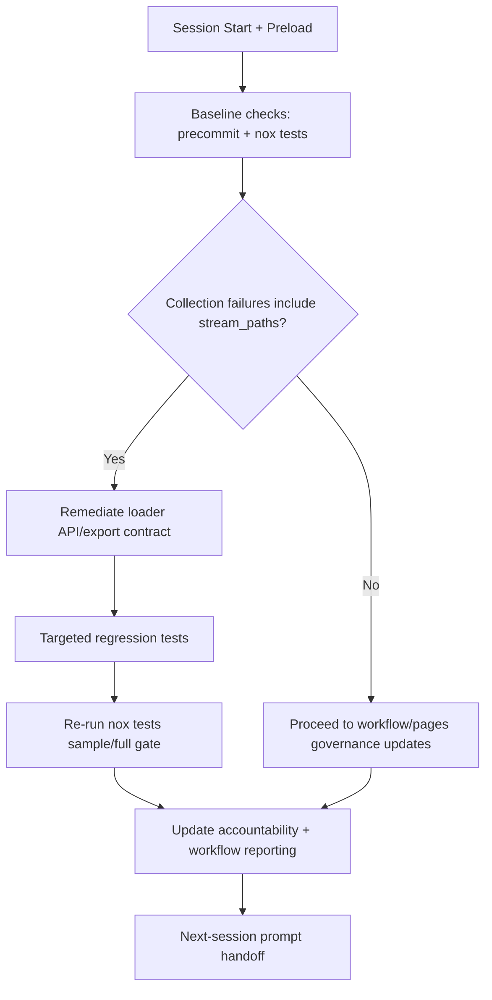

# Next Expected Codebase Change (48-Hour Alignment)

Generated: 2026-05-17T07:39:30Z  
Repository: `Aries-Serpent/_codex_`  
Window reviewed: last 48 hours

## 1) Recent Change Alignment Summary

The most recent sessions concentrated on:
- GitHub Pages reliability hardening (`pages-mkdocs.yml` deploy action fix, `pages-health-guard.yml` telemetry directory creation).
- WEC/workflow governance tightening (`wec_enforcer.py` active-state validation, token-chain usage hardening).
- Reporting expansion (`workflow_portfolio_7d_{table,analysis}` and session SOP updates with tokenized mapping and mermaid flows).
- Persistent baseline test instability (`nox -s tests` collection failures centered on `codex_ml.data._core_loaders.stream_paths`).

## 2) Next Expected Codebase Change

**Expected next change:** implement and validate a focused remediation path for the recurring `stream_paths` collection failure class, then reflect the fix status in workflow/reporting docs so WEC validation and session handoffs operate on cleaner CI signals.

## 3) Mermaid Mapping Outline

## 4) Expected Results

- Reduced or eliminated `stream_paths`-driven pytest collection errors.
- Cleaner differentiation between infra/workflow issues vs. Python runtime/import issues.
- More reliable signal for WEC merge-required workflow selection and session planning.
- Updated reporting artifacts capturing post-fix risk posture and next operational priorities.

## 5) Quantum-Inspired Formulation (Tokenized Variables)

\[
\Psi_{CI} = \alpha_1 \cdot TVAR\_CODEX\_CI\_FAILURE\_RATE
          + \alpha_2 \cdot \mathbb{I}(ERR\_STREAM\_PATHS)
          + \alpha_3 \cdot METRIC\_COMMITS\_SINCE\_LAST\_GREEN
\]

\[
R_{session} = \beta_1 \cdot DRIFT_{branch}
            + \beta_2 \cdot \mathbb{I}(TVAR\_CODEX\_SWEEP\_SKIP\_MAIN=0)
            + \beta_3 \cdot \mathbb{I}(WEC_{nonactive}>0)
\]

\[
U_{next} = \gamma_1 \cdot FIX_{stream\_paths}
         + \gamma_2 \cdot PASS_{targeted\_tests}
         - \gamma_3 \cdot \Psi_{CI}
         - \gamma_4 \cdot R_{session}
\]

Coefficient interpretation (normalized scoring model):
- \(\alpha_1,\alpha_2,\alpha_3 \in [0,1]\), \(\sum \alpha_i = 1\): CI instability weighting.
- \(\beta_1,\beta_2,\beta_3 \in [0,1]\), \(\sum \beta_i = 1\): session risk weighting.
- \(\gamma_1,\gamma_2,\gamma_3,\gamma_4 \in [0,1]\), \(\sum \gamma_i = 1\): utility tradeoff weighting.
- If no calibrated data is available, initialize as uniform weights and tune per session evidence.

### Token/Variable Descriptions

| Token | Meaning |
|---|---|
| `TVAR_CODEX_CI_FAILURE_RATE` | Current CI instability pressure signal |
| `ERR_STREAM_PATHS` | Indicator that collection failures contain `stream_paths` attribute errors |
| `METRIC_COMMITS_SINCE_LAST_GREEN` | Numeric distance from latest commit to `TVAR_CODEX_CI_LAST_GREEN_SHA` baseline |
| `DRIFT_branch` | Branch divergence pressure from moving base |
| `TVAR_CODEX_SWEEP_SKIP_MAIN` | Main-branch sweep conflict mitigation switch |
| `WEC_nonactive` | Count of WEC-checked workflows in non-active states |
| `FIX_stream_paths` | Binary/score signal for remediation completion |
| `PASS_targeted_tests` | Targeted regression validation success signal |

## 6) Iterative Expected Session Promptset (Outline)

1. **Session A — Loader Contract Remediation**
   - Verify all `stream_paths` call/export sites.
   - Apply minimal compatibility fix.
   - Run targeted tests and capture failure delta.

2. **Session B — CI Signal Stabilization**
   - Re-run baseline checks.
   - Confirm reduction in collection errors.
   - Update accountability + reporting with measured outcomes.

3. **Session C — Workflow/WEC Follow-Through**
   - Reassess merge-required workflow set post-stabilization.
   - Validate active-state and token-chain assumptions.
   - Refresh handoff prompt and next priority matrix.

4. **Session D — Pages + Reporting Reliability Confirmation**
   - Verify Pages deploy/health telemetry remains stable with latest changes.
   - Confirm reporting docs/nav reflect current operational status.
   - Publish final continuation prompt for the next 48-hour cycle.

## 7) Groundwork Package for the Next Session

### A. Startup Checklist (Ready-to-Run)

1. Load policy/accountability/session context packet.
2. Run `nox -s precommit` and `nox -s tests` to capture current baseline.
3. Confirm current `stream_paths` failure count from pytest collection output.
4. Identify top import/export callsites tied to `codex_ml.data._core_loaders`.
5. Define minimal remediation scope and expected regression tests.
6. Execute fix + targeted tests first, then broader validation pass.
7. Refresh accountability/changelog/reporting artifacts with measured deltas.

### B. Execution Guardrails

- Keep remediation scoped to loader contract compatibility and direct downstream callsites.
- Prefer additive/backward-compatible fixes over broad refactors.
- Re-check WEC non-active workflow state before final handoff notes.
- Preserve token-chain assumptions (`CODEX_MASTER_KEY || CODEX_BACKUP_KEY || github.token`) in workflow-related commentary.

### C. Promptset Pack (Iterative)

**Prompt 1 — Baseline Capture**
> “Run baseline checks, quantify current `stream_paths` collection failures, and return a ranked remediation shortlist with exact impacted modules.”

**Prompt 2 — Minimal Remediation**
> “Apply the smallest compatible fix for the `stream_paths` contract break, then run targeted regression tests and summarize before/after failure deltas.”

**Prompt 3 — Stability Verification**
> “Re-run broad validation, separate remaining pre-existing failures from fixed signatures, and update reporting/accountability artifacts with evidence.”

**Prompt 4 — Handoff Closure**
> “Produce next-session continuation notes: unresolved risks, required workflow checks, and a prioritized follow-up matrix for the next 48-hour window.”
