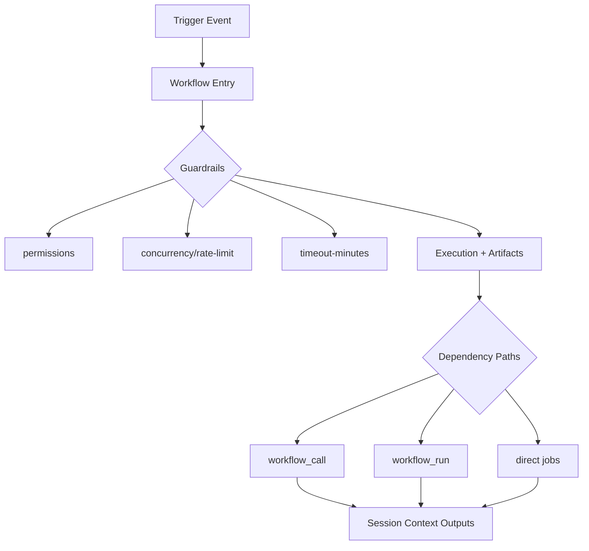
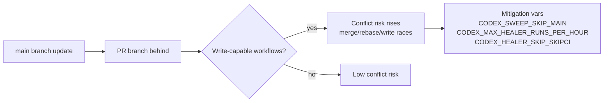
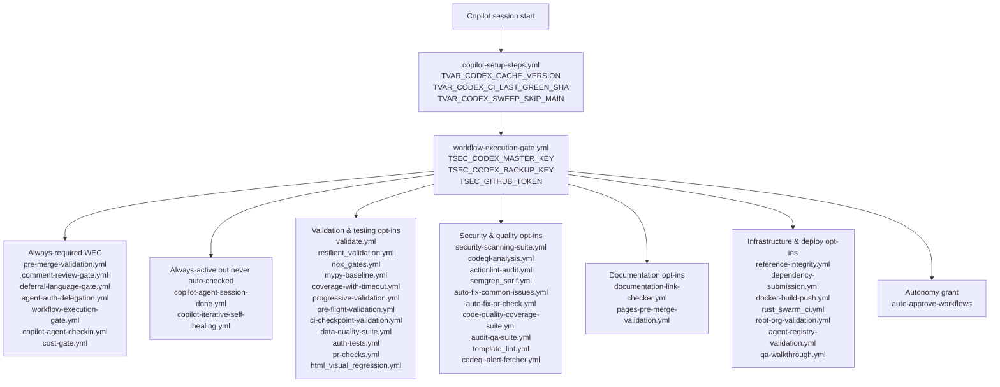
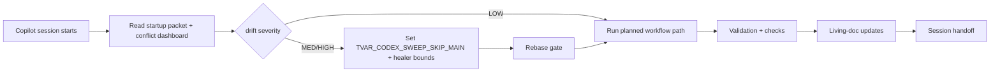
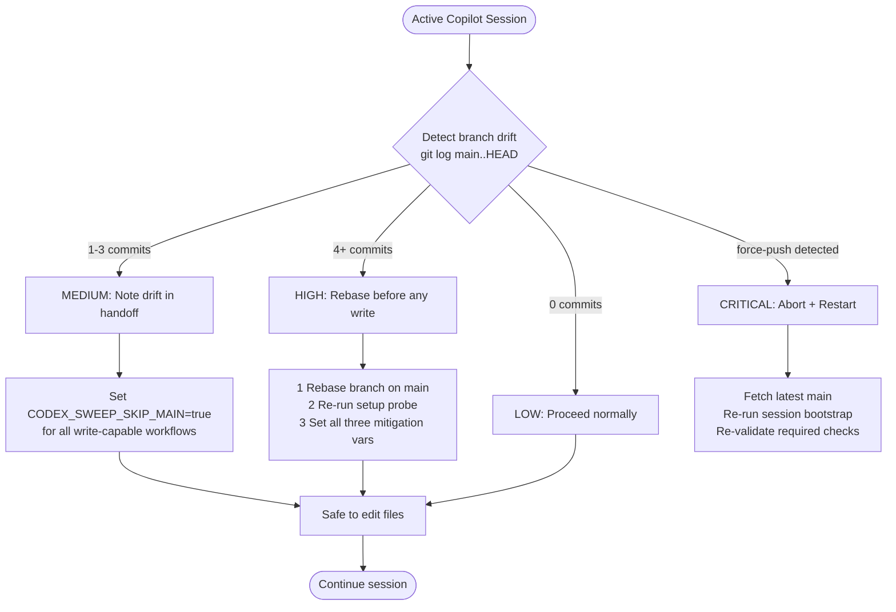

# Workflow Portfolio Analysis (7-Day Window)

Generated at: 2026-05-16T15:26:16.938000+00:00  
Repository: `Aries-Serpent/_codex_`

## Dataset Artifacts

- `docs/reporting/workflow_portfolio_7d_table.csv`
- `docs/reporting/workflow_portfolio_7d_table.md`
- `docs/reporting/copilot_agent_session_standard_operation.md` (standard Copilot session lifecycle, required living docs, and streamlining planset)

## Executive Snapshot

- Total workflows discovered: **180**
- Workflows currently active in GitHub Actions: **153**
- Workflows currently non-active in GitHub Actions: **27**
- Workflows active in last 7 days: **82**
- Active workflows not utilized in the last 7 days: **73**
- Workflows not utilized in 7 days (including disabled): **100**
- Workflows with rate-limit controls/signals: **155**
- Workflows with variable mappings detected: **144**
- Branch-update conflict risk counts: **high=10**, **medium=38**
- Aggregate run conclusions (7 days): success=361, failure=50, action_required=78

## Portfolio Action Snapshot

- The refreshed portfolio table now carries three Copilot-facing decision columns:
  `recommended_portfolio_action`, `copilot_smoke_posture`, and `portfolio_note`.
- **Do not treat 7-day inactivity by itself as a disable signal.** Historical run counts matter:
  several 7-day-idle workflows still have deep lifetime usage (`actionlint-audit.yml` 908 runs,
  `agent-registry-validation.yml` 992, `api-documentation.yml` 139, `admin_setup_verification.yml` 70).
- **Validated immediate disable/archive targets:** three active orphan workflows that no longer exist
  on `main`, so keeping them active only clutters Actions:
  - `documentation-quality-check.yml` (workflow id `232765053`)
  - `cache-validation.yml` (workflow id `232765010`)
  - `cache-health-monitor.yml` (workflow id `232765030`)
- **Disable attempt result:** direct REST `PUT /actions/workflows/{id}/disable` calls returned
  `HTTP 403 Resource not accessible by integration` when authenticated only with `github.token`.
  The operation requires `CODEX_MASTER_KEY` or `CODEX_BACKUP_KEY`.
- **Archive-review bucket:** workflows that are low-usage but still intentional/manual utilities
  (for example `app-package-download.yml`) should be reviewed for product value before disablement.

## Mermaid Mapping — Workflow + Variable + Conflict Logic





## Tokenized Variable Mapping (Top Frequency)

| Token | Referencing workflows |
|---|---:|
| `TSEC_CODEX_MASTER_KEY` | 119 |
| `TSEC_CODEX_BACKUP_KEY` | 114 |
| `TSEC_GITHUB_TOKEN` | 93 |
| `TVAR_CODEX_CACHE_VERSION` | 29 |
| `TENV_PYTHON_VERSION` | 8 |
| `TVAR_COPILOT_AGENT_AUTH_ENABLED` | 7 |
| `TVAR_COGNITIVE_BRAIN_SESSION_NUMBER` | 6 |
| `TENV_PR_NUMBER` | 5 |
| `TVAR_COGNITIVE_BRAIN_ALLOWED_ACTORS` | 4 |
| `TENV_DRY_RUN` | 4 |
| `TSEC_CODECOV_TOKEN` | 3 |
| `TVAR_CODEX_CI_LAST_GREEN_SHA` | 3 |
| `TVAR_CODEX_HEALER_SKIP_SKIPCI` | 3 |
| `TVAR_CODEX_MAX_HEALER_RUNS_PER_HOUR` | 3 |
| `TVAR_CODEX_SWEEP_SKIP_MAIN` | 3 |
| `TVAR_AUTONOMOUS_ACTIONS_ENABLED` | 2 |
| `TVAR_COGNITIVE_BRAIN_INJECTION_ENABLED` | 2 |
| `TVAR_AGENT_HANDOFF_TIMEOUT_SECONDS` | 2 |
| `TVAR_EMBEDDING_INDEX_AUTO_REBUILD` | 2 |
| `TVAR_CODEX_CI_FAILURE_THRESHOLD` | 2 |
| `TENV_REF` | 2 |
| `TENV_SHA` | 2 |
| `TVAR_CODEX_CI_FAILURE_RATE` | 2 |
| `TVAR_CODEX_COVERAGE_THRESHOLD` | 2 |
| `TVAR_COPILOT_AGENT_STATE` | 2 |

## WEC Workflow Mapping — Groups + Token Contracts



| WEC group | Workflow set | Primary tokenized variables | How Copilot uses it |
|---|---|---|---|
| Always-required gates | `pre-merge-validation.yml`, `comment-review-gate.yml`, `deferral-language-gate.yml`, `agent-auth-delegation.yml`, `workflow-execution-gate.yml`, `copilot-agent-checkin.yml`, `cost-gate.yml` | `TSEC_CODEX_MASTER_KEY`, `TSEC_CODEX_BACKUP_KEY`, `TSEC_GITHUB_TOKEN`, `TVAR_COPILOT_AGENT_AUTH_ENABLED`, `TVAR_COGNITIVE_BRAIN_SESSION_NUMBER` | Keeps the PR executable, preserves WEC state, and maintains delegated autonomy. |
| Validation/testing opt-ins | `validate.yml`, `resilient_validation.yml`, `nox_gates.yml`, `mypy-baseline.yml`, `coverage-with-timeout.yml`, `progressive-validation.yml`, `pre-flight-validation.yml`, `ci-checkpoint-validation.yml`, `data-quality-suite.yml`, `auth-tests.yml`, `pr-checks.yml`, `html_visual_regression.yml` | `TVAR_CODEX_CACHE_VERSION`, `TENV_PYTHON_VERSION`, `TVAR_CODEX_COVERAGE_THRESHOLD` | Used when the current task needs deeper correctness evidence than the always-required gates provide. |
| Security/quality opt-ins | `security-scanning-suite.yml`, `codeql-analysis.yml`, `actionlint-audit.yml`, `semgrep_sarif.yml`, `auto-fix-common-issues.yml`, `auto-fix-pr-check.yml`, `code-quality-coverage-suite.yml`, `audit-qa-suite.yml`, `template_lint.yml`, `codeql-alert-fetcher.yml` | `TSEC_CODEX_MASTER_KEY`, `TSEC_CODEX_BACKUP_KEY`, `TSEC_GITHUB_TOKEN`, `TVAR_CODEX_CACHE_VERSION`, `TVAR_CODEX_CI_FAILURE_RATE` | Used to tighten review quality, surface security findings, and auto-fix common regressions. |
| Documentation opt-ins | `documentation-link-checker.yml`, `pages-pre-merge-validation.yml` | `TSEC_GITHUB_TOKEN`, `TVAR_CODEX_CACHE_VERSION` | Used when the change touches docs/Pages and the session needs docs-specific validation. |
| Infrastructure/deploy opt-ins | `reference-integrity.yml`, `dependency-submission.yml`, `docker-build-push.yml`, `rust_swarm_ci.yml`, `root-org-validation.yml`, `agent-registry-validation.yml`, `qa-walkthrough.yml` | `TSEC_CODEX_MASTER_KEY`, `TSEC_CODEX_BACKUP_KEY`, `TVAR_CODEX_CACHE_VERSION`, `TVAR_CODEX_SWEEP_SKIP_MAIN` | Used for structure, packaging, deployment, and agent-registry correctness. |
| Autonomy grant | `auto-approve-workflows` | `TVAR_COPILOT_AGENT_AUTH_ENABLED`, `TSEC_CODEX_MASTER_KEY`, `TSEC_CODEX_BACKUP_KEY` | Clears `action_required` fanout runs without waiting for a human maintainer. |

## Quantum-Inspired Equations Depicting Workflow Logic (Tokenized)

\[
\left|\Psi_{workflow}\right\rangle =
\sum_{i=1}^{N} \alpha_i \left|w_i\right\rangle
+ \beta_1 \cdot TVAR\_COPILOT\_AGENT\_AUTH\_ENABLED
+ \beta_2 \cdot TVAR\_COGNITIVE\_BRAIN\_SESSION\_NUMBER
\]

\[
U_i = \lambda_1 A_i + \lambda_2 D_i + \lambda_3 V_i - \lambda_4 R_i
+ \lambda_5 \cdot \mathbb{I}(TVAR\_CODEX\_SWEEP\_SKIP\_MAIN=1)
\]

\[
Q_i = \mu_1(1-A_i) + \mu_2R_i + \mu_3C_i + \mu_4B_i
+ \mu_5 \cdot TVAR\_CODEX\_CI\_FAILURE\_RATE
+ \mu_6 \cdot \mathbb{I}(TVAR\_CODEX\_HEALER\_SKIP\_SKIPCI=0)
\]

Where:
- \(A_i\): 7-day activity utility
- \(D_i\): dependency centrality
- \(V_i\): variable observability/tokenization quality
- \(R_i\): missing guardrail risk
- \(C_i\): Copilot cloud/coding-session relevance
- \(B_i\): branch-update conflict exposure
- `TVAR_CODEX_SWEEP_SKIP_MAIN`: branch-drift safety gate
- `TVAR_CODEX_CI_FAILURE_RATE`: live instability pressure signal
- `TVAR_CODEX_HEALER_SKIP_SKIPCI`: skip-ci bypass risk control

## Copilot Session Intended Process (Codeless, Workflow-Centric)



## Copilot Session Operating Envelope

- **Session budget:** treat each Copilot coding/cloud-agent session as a hard **60-minute** window.
- **Suggested time slices:**
  - **0–10 min:** environment setup, repo preload, drift/rate-limit probe, WEC review.
  - **10–50 min:** scoped implementation + targeted validation.
  - **50–55 min:** final checks, artifact refresh, accountability/changelog updates.
  - **55–60 min:** `report_progress`, handoff prompt, next-session continuation notes.
- **Do not start broad workflow fanout after minute 50.** Long matrix or `workflow_run` chains will
  often outlive the active session and produce stale handoff context.
- **Rate-limit posture:** prefer read-only MCP queries first, throttle repeated GitHub REST calls,
  and keep `auto-approve-workflows` / `workflow-execution-gate` fanout bounded to the workflows
  actually needed for the current task.

## Smoke-Test Posture and Expected Edge Cases

- This portfolio uses **observed smoke posture** rather than re-dispatching every workflow. The
  `copilot_smoke_posture` column records whether the latest 7-day evidence is:
  - `observed-green`
  - `observed-failures`
  - `approval-gated-or-mixed`
  - `unobserved-7d`
  - `disabled`
- Full live smoke-dispatch of all workflows was intentionally **not** performed: it would create
  unnecessary queue pressure, mutate live PR state, and requires `actions:write` for approval-gated
  runs.
- Expected edge cases:
  1. **Approval-gated fanout:** WEC-selected workflows can stall in `action_required` unless
     `auto-approve-workflows` is active.
  2. **Branch drift:** `workflow_run` listeners and write-capable workflows can act on stale SHAs.
  3. **Token scope mismatch:** `github.token` can read inventory but cannot enable/disable workflows.
  4. **Historical orphan records:** some workflows remain active in Actions even when the backing
     workflow file is gone from `main`.

## Requested Findings Summary

### What works

- Strong automation breadth and policy controls across core workflows.
- High adoption of guardrails (permissions/concurrency/timeout) in many active paths.
- Variable ecosystem (`CODEX_*`, `COPILOT_*`, `COGNITIVE_BRAIN_*`) is present and exploitable for session optimization.

### What does not work

- Workflow sprawl and mixed orchestration modes increase debugging overhead.
- Some high-value active workflows are under-utilized in the recent 7-day window.
- Branch-update conflict exposure remains in write-capable, event-driven workflows.
- 7-day inactivity alone is a weak pruning heuristic; historical run counts are required.
- Workflow disablement is blocked in this session without an `actions:write` token.

### What is missing

- Canonical owner/criticality metadata contract per workflow.
- Unified variable token registry and enforcement policy.
- Automated conflict-risk scoring artifact in CI outputs.
- A write-scoped token in this runtime for workflow state changes (`disable` / `enable`).

### What needs to be improved

1. Standardize tokenized variable contracts in all Copilot/agent workflows.
2. Apply branch-scoped concurrency + timeout parity to lagging workflows.
3. Harden write-capable automation against main-branch drift.
4. Consolidate overlapping pipelines to reduce fanout complexity.
5. Publish conflict-risk and quick-win rankings as default Copilot session context.
6. Disable orphan active workflows that no longer exist on `main`.
7. Distinguish **disable-now**, **archive-review**, and **keep-enabled** buckets in the portfolio table.

## Validated Disable / Keep / Archive Decisions

### Disable-now (validated)

These workflows are still active in GitHub Actions but the workflow files do not exist on `main`,
so disabling them will not interrupt a current repository process:

| Workflow id | Workflow path in Actions | Why safe to disable now |
|---:|---|---|
| `232765053` | `.github/workflows/documentation-quality-check.yml` | Backing file absent on `main`; only 1 lifetime run; historical orphan. |
| `232765010` | `.github/workflows/cache-validation.yml` | Backing file absent on `main`; historical orphan. |
| `232765030` | `.github/workflows/cache-health-monitor.yml` | Backing file absent on `main`; historical orphan. |

### Keep-enabled after lifetime review

| Workflow | Why it stays enabled despite 7-day inactivity |
|---|---|
| `actionlint-audit.yml` | 908 lifetime runs; still a valid workflow compliance gate. |
| `agent-registry-validation.yml` | 992 lifetime runs; still part of agent/repo integrity checks. |
| `api-documentation.yml` | 139 lifetime runs; still supports documentation publishing. |
| `admin_setup_verification.yml` | 70 lifetime runs; still used for setup/auth verification. |
| `app-package-download.yml` | Only 2 lifetime runs, but it is a standalone end-user packaging utility with maintained docs. |

### Archive-review bucket

- Manual niche workflows with very low lifetime usage but still-documented product value should
  move to an explicit archive review, not an automatic disable. `app-package-download.yml` is the
  clearest current example.

## Similar Logic / Overlap Groups

| Group | Representative workflows | Consolidation note |
|---|---|---|
| WEC and PR gates | `pre-merge-validation.yml`, `comment-review-gate.yml`, `deferral-language-gate.yml`, `agent-auth-delegation.yml`, `workflow-execution-gate.yml`, `auto-approve-workflows.yml` | Keep distinct, but document as one operating cluster for Copilot sessions. |
| Auto-fix and rescue | `auto-fix-common-issues.yml`, `auto-fix-pr-check.yml`, `ci-rescue.yml`, `self-healing.yml`, `iterative-self-healing-ci.yml` | Highest overlap area; prune duplicate auto-fix surfaces before adding more rescue paths. |
| Validation suites | `validate.yml`, `resilient_validation.yml`, `nox_gates.yml`, `mypy-baseline.yml`, `progressive-validation.yml`, `pre-flight-validation.yml`, `ci-checkpoint-validation.yml`, `pr-checks.yml` | Large fanout with overlapping confidence goals; best place for future reduction. |
| Security and code scanning | `codeql-analysis.yml`, `codeql-alert-fetcher.yml`, `semgrep_sarif.yml`, `security-scanning-suite.yml`, `actionlint-audit.yml` | Keep as layered controls, but unify reporting and activation language. |
| Docs and Pages | `documentation-link-checker.yml`, `pages-pre-merge-validation.yml`, `pages-scheduled-validation.yml`, `pages-mkdocs.yml`, `workflow-link-validation.yml` | Several docs workflows share similar signal paths and can likely be simplified. |
| Agent and cognitive orchestration | `agent-orchestration-unified.yml`, `copilot-session-chain.yml`, `copilot-pr-session-injector.yml`, `copilot-setup-steps.yml`, `chatops_copilot_trigger.yml` | Highest coordination risk when branch drift or rate limits appear mid-session. |

## 🚨 Branch-Update Conflict Dashboard

> **Priority section — read before editing any file during an active session.**
> When `main` receives commits while your branch session is active, the workflows below
> can race, produce stale-head writes, or cascade into each other via `workflow_run`.
> **Total conflict-risk workflows: HIGH=10, MEDIUM=38.**
>
> Cross-reference: [.codex/plans/LEAN_WORKFLOW_OS_PLANSET.md → Plan C](../../.codex/plans/LEAN_WORKFLOW_OS_PLANSET.md)

### Active Session Conflict Protocol

```
Detect drift (git log main..HEAD --oneline | wc -l):
  0 commits → LOW   → proceed normally
  1–3       → MEDIUM → add drift note to handoff; set CODEX_SWEEP_SKIP_MAIN=true if writing
  4+        → HIGH   → rebase first; run steps below before ANY write operation
  force-push→ CRITICAL → abort session; fetch main; restart from baseline
```



### Mitigation Variables — Quick Reference

| Variable | Purpose | Set when |
|---|---|---|
| `CODEX_SWEEP_SKIP_MAIN` | Stops write-capable sweeps from touching main during drift | Drift ≥ MEDIUM |
| `CODEX_MAX_HEALER_RUNS_PER_HOUR` | Caps self-healer firing rate to prevent cascades | Any active session with high run volume |
| `CODEX_HEALER_SKIP_SKIPCI` | Prevents healer from ignoring `[skip ci]` tags | Drift ≥ MEDIUM to avoid feedback loops |

### HIGH-Risk Workflows — Mandatory Mitigation

> These workflows **write to the repo or dispatch other workflows** and will race with branch
> drift if not guarded. Apply all three mitigation variables before running these during an
> active session.

---

#### 🔴 `iterative-self-healing-ci.yml` — Iterative Self-Healing CI
- **Runs (7d):** 413 &nbsp;|&nbsp; **Risk:** HIGH
- **Why it conflicts:** Write-capable + event-driven; fires on every push and can race with
  main-branch updates during active sessions, producing concurrent writes to the same files.
- **Mitigation steps:**
  1. Set repo variable `CODEX_SWEEP_SKIP_MAIN=true` before running or triggering this workflow.
  2. Set `CODEX_MAX_HEALER_RUNS_PER_HOUR` to `3` or lower to cap cascade rate.
  3. Set `CODEX_HEALER_SKIP_SKIPCI=true` to prevent skip-ci bypass during drift.
  4. Rebase your branch on latest `main` before committing any healer-initiated changes.
  5. After rebase, re-run the session access probe to confirm drift is cleared.
- **Required workflow controls:**
  ```yaml
  concurrency:
    group: "${{ github.workflow }}-${{ github.head_ref }}"
    cancel-in-progress: true
  timeout-minutes: 30
  ```

---

#### 🔴 `copilot-evolution-suite.yml` — Copilot Evolution & Review (Unified)
- **Runs (7d):** 10 &nbsp;|&nbsp; **Risk:** HIGH
- **Why it conflicts:** Dispatches review + write operations; if `main` moved since checkout,
  the "evolution" diff will target a stale base and can produce incorrect PR edits.
- **Mitigation steps:**
  1. Confirm `main` HEAD SHA matches your branch's merge-base before triggering.
  2. Set `CODEX_SWEEP_SKIP_MAIN=true`.
  3. Do not trigger manually during HIGH drift; wait for rebase to complete.
  4. After rebase, confirm no open review comments from a prior run target stale lines.
- **Required workflow controls:**
  ```yaml
  concurrency:
    group: "${{ github.workflow }}-${{ github.head_ref }}"
    cancel-in-progress: true
  timeout-minutes: 45
  ```

---

#### 🔴 `copilot-agent-session-done.yml` — Auto-Post @copilot Review After Agent Session
- **Runs (7d):** 10 &nbsp;|&nbsp; **Risk:** HIGH
- **Why it conflicts:** Fires on `workflow_run` completion; if the triggering run targeted a
  stale SHA, the auto-post will reference an outdated diff and can confuse subsequent sessions.
- **Mitigation steps:**
  1. Verify the triggering workflow ran against your current branch HEAD (not a prior SHA).
  2. Set `CODEX_SWEEP_SKIP_MAIN=true` when drift is detected.
  3. If auto-post fires against a stale SHA, manually close the generated comment and re-trigger
     after rebase.
- **Required workflow controls:**
  ```yaml
  concurrency:
    group: "${{ github.workflow }}-${{ github.head_ref }}"
    cancel-in-progress: false  # allow completion but gate new runs
  timeout-minutes: 15
  ```

---

#### 🔴 `agent-var-writer.yml` — Agent Variable Writer (Provenance-Chain)
- **Runs (7d):** 5 &nbsp;|&nbsp; **Risk:** HIGH
- **Why it conflicts:** Writes directly to GitHub Repo Variables using `CODEX_MASTER_KEY`;
  concurrent writes during drift can overwrite a value set by a prior healer run.
- **Mitigation steps:**
  1. Never trigger in parallel with `iterative-self-healing-ci.yml` on the same branch.
  2. Confirm `CODEX_CI_LAST_GREEN_SHA` matches the last known-good commit before writing.
  3. Set `CODEX_SWEEP_SKIP_MAIN=true` to prevent the variable writer from broadcasting to `main`.
  4. After any variable write, re-read the value via the GitHub API to confirm it was not
     overwritten by a concurrent run.
- **Required workflow controls:**
  ```yaml
  concurrency:
    group: "var-writer-${{ github.repository }}"
    cancel-in-progress: false  # variable writes must not be interrupted mid-write
  timeout-minutes: 10
  ```

---

#### 🔴 `copilot-session-chain.yml` — Copilot Session Chain
- **Runs (7d):** 0 (active, not triggered recently) &nbsp;|&nbsp; **Risk:** HIGH
- **Why it conflicts:** Chains multiple session workflows in sequence; if `main` moves between
  chain steps, later steps will operate on a branch that is already behind, producing
  incorrect artifacts or triggering redundant self-healing cycles.
- **Mitigation steps:**
  1. Only trigger when branch drift is LOW (0 commits behind `main`).
  2. Add a `git fetch origin main && git merge-base --is-ancestor main HEAD` pre-check to the
     first job; fail fast if the check fails.
  3. Set all three mitigation variables before any chain run when drift is MEDIUM or higher.
- **Required workflow controls:**
  ```yaml
  concurrency:
    group: "${{ github.workflow }}-${{ github.head_ref }}"
    cancel-in-progress: true
  timeout-minutes: 60
  ```

---

#### 🔴 `agent-orchestration-unified.yml` — Agent Orchestration (Unified)
- **Runs (7d):** 0 (active) &nbsp;|&nbsp; **Risk:** HIGH (elevated from medium by write scope)
- **Why it conflicts:** Orchestrates multiple write-capable sub-agents; stale-branch execution
  will propagate stale context to all sub-agents simultaneously.
- **Mitigation steps:**
  1. Inject `branch_drift_severity` from startup probe into the orchestration context before
     dispatching sub-agents.
  2. Add a drift gate: if `drift_severity != LOW`, sub-agents that write should be skipped.
  3. Set `CODEX_SWEEP_SKIP_MAIN=true` and `CODEX_MAX_HEALER_RUNS_PER_HOUR=2`.
- **Required workflow controls:**
  ```yaml
  concurrency:
    group: "${{ github.workflow }}-${{ github.head_ref }}"
    cancel-in-progress: true
  timeout-minutes: 60
  ```

---

### MEDIUM-Risk Workflows — Standard Mitigation

Apply `CODEX_SWEEP_SKIP_MAIN=true` and branch-scoped concurrency when drift is MEDIUM or higher.
No immediate abort required, but monitor for `workflow_run` ordering anomalies.

| Workflow file | Workflow name | Runs 7d | Conflict reason | Action |
|---|---|---:|---|---|
| `ci-rescue.yml` | CI Rescue — Auto-Fix & @copilot RCA | 55 | `workflow_run` chain ordering; stale-head auto-fix applies to wrong base | Set `CODEX_SWEEP_SKIP_MAIN=true`; verify triggering run SHA matches branch HEAD |
| `copilot-iterative-self-healing.yml` | Copilot Iterative Self-Healing Auto-Poster | 55 | Fires on `workflow_run`; stale-head post targets wrong diff | Confirm triggering run HEAD before allowing auto-post |
| `cleanup-stale-pr-comments.yml` | Cleanup Stale PR Comments | 12 | Writes PR comment deletions; can conflict if PR metadata changed mid-drift | Run only after rebase when drift ≥ MEDIUM |
| `codebase-health-sweep.yml` | Codebase Health Sweep | 7 | Write-capable sweep; stale-head run touches wrong file versions | Set `CODEX_SWEEP_SKIP_MAIN=true`; re-run post-rebase |
| `audit-qa-suite.yml` | Audit & QA Suite (Unified) | 6 | Writes audit artifacts; stale base produces mismatched diff | Confirm base SHA before triggering |
| `pr-followup-generator.yml` | Generate PR Follow-Up Prompt | 6 | Writes follow-up prompt file; stale PR state produces wrong next-action list | Rebase + re-trigger |
| `agent_infrastructure_manager.yml` | Agent Infrastructure Manager | 5 | Infrastructure writes conflict with concurrent healer changes | Serialize with `iterative-self-healing-ci.yml` via concurrency group |
| `agent-auth-delegation.yml` | Agent Token Delegation | 5 | Token delegation writes can race with healer variable writes | Set concurrency group shared with `agent-var-writer.yml` |
| `copilot-agent-vars-bootstrap.yml` | Agent Vars Bootstrap | 5 | Variable bootstrap conflicts with mid-session variable mutations | Only run at session start before any writes |
| `chatops_copilot_trigger.yml` | Chat-Ops @copilot Webhook Trigger | 5 | Dispatches other workflows; stale trigger context propagates | Validate branch HEAD SHA in webhook payload |
| `session-watchdog.yml` | Session Watchdog | 5 | Timebox enforcement may cancel work mid-rebase | Set generous timeout when rebase is in progress |
| `workflow-execution-gate.yml` | Workflow Execution Gate | 5 | Gate parses PR body; stale PR body from drift produces wrong gate state | Re-push after rebase to refresh PR body parse |
| `secrets-baseline-enforcer.yml` | Secrets Baseline Enforcer | 5 | Writes baseline file; concurrent writes corrupt the baseline | Serialize via `secrets-baseline-enforcer` concurrency group |
| `copilot-agent-checkin.yml` | Agent Check-In | 5 | Check-in fires on push; stale-head check-in logs wrong context | Acceptable; log only — no write action needed |
| `copilot-review-responder.yml` | Copilot Review Responder | 5 | Responds to review events; stale PR state produces mismatched response | Re-trigger after rebase if response targets stale diff |
| `codex-manifest-refresh.yml` | CODEX Manifest Auto-Refresh | 4 | Writes manifest; stale-head manifest references removed files | Run post-rebase; add `main` merge-base check |

---

### Workflows That Conflict (or Could Conflict) When Main Updates During Active Branch Sessions

> Legacy flat table retained for grep/tooling compatibility. The expanded cards above
> are the authoritative reference for step-by-step mitigation.

| Workflow file | Workflow name | Risk | Runs 7d | Conflict reason | Suggested mitigation variables |
|---|---|---|---:|---|---|
| `.github/workflows/iterative-self-healing-ci.yml` | Iterative Self-Healing CI | **HIGH** | 413 | write-capable + event-driven; races with branch/main drift | `CODEX_SWEEP_SKIP_MAIN`, `CODEX_MAX_HEALER_RUNS_PER_HOUR`, `CODEX_HEALER_SKIP_SKIPCI` |
| `.github/workflows/copilot-evolution-suite.yml` | Copilot Evolution & Review (Unified) | **HIGH** | 10 | write-capable + event-driven; stale base diff | `CODEX_SWEEP_SKIP_MAIN`, `CODEX_MAX_HEALER_RUNS_PER_HOUR`, `CODEX_HEALER_SKIP_SKIPCI` |
| `.github/workflows/copilot-agent-session-done.yml` | Auto-Post @copilot review After Agent Session | **HIGH** | 10 | workflow_run stale-SHA auto-post | `CODEX_SWEEP_SKIP_MAIN`, `CODEX_MAX_HEALER_RUNS_PER_HOUR`, `CODEX_HEALER_SKIP_SKIPCI` |
| `.github/workflows/agent-var-writer.yml` | Agent Variable Writer (Provenance-Chain) | **HIGH** | 5 | concurrent variable writes with healer | `CODEX_SWEEP_SKIP_MAIN`, `CODEX_MAX_HEALER_RUNS_PER_HOUR`, `CODEX_HEALER_SKIP_SKIPCI` |
| `.github/workflows/copilot-session-chain.yml` | Copilot Session Chain | **HIGH** | 0 | chained workflows amplify stale-head errors | `CODEX_SWEEP_SKIP_MAIN`, `CODEX_MAX_HEALER_RUNS_PER_HOUR`, `CODEX_HEALER_SKIP_SKIPCI` |
| `.github/workflows/agent-orchestration-unified.yml` | Agent Orchestration (Unified) | **HIGH** | 0 | stale context propagated to all sub-agents | `CODEX_SWEEP_SKIP_MAIN`, `CODEX_MAX_HEALER_RUNS_PER_HOUR`, `CODEX_HEALER_SKIP_SKIPCI` |
| `.github/workflows/ci-rescue.yml` | CI Rescue — Auto-Fix & @copilot RCA | medium | 55 | workflow_run ordering; stale-head auto-fix | `CODEX_SWEEP_SKIP_MAIN`, `CODEX_MAX_HEALER_RUNS_PER_HOUR`, `CODEX_HEALER_SKIP_SKIPCI` |
| `.github/workflows/copilot-iterative-self-healing.yml` | Copilot Iterative Self-Healing Auto-Poster | medium | 55 | workflow_run stale-head post | `CODEX_SWEEP_SKIP_MAIN`, `CODEX_MAX_HEALER_RUNS_PER_HOUR`, `CODEX_HEALER_SKIP_SKIPCI` |
| `.github/workflows/cleanup-stale-pr-comments.yml` | Cleanup Stale PR Comments | medium | 12 | comment writes on stale PR state | `CODEX_SWEEP_SKIP_MAIN`, `CODEX_MAX_HEALER_RUNS_PER_HOUR`, `CODEX_HEALER_SKIP_SKIPCI` |
| `.github/workflows/codebase-health-sweep.yml` | Codebase Health Sweep | medium | 7 | write-capable; stale-head sweep | `CODEX_SWEEP_SKIP_MAIN`, `CODEX_MAX_HEALER_RUNS_PER_HOUR`, `CODEX_HEALER_SKIP_SKIPCI` |
| `.github/workflows/audit-qa-suite.yml` | Audit & QA Suite (Unified) | medium | 6 | stale base audit artifacts | `CODEX_SWEEP_SKIP_MAIN`, `CODEX_MAX_HEALER_RUNS_PER_HOUR`, `CODEX_HEALER_SKIP_SKIPCI` |
| `.github/workflows/pr-followup-generator.yml` | Generate PR Follow-Up Prompt | medium | 6 | stale PR next-action file | `CODEX_SWEEP_SKIP_MAIN`, `CODEX_MAX_HEALER_RUNS_PER_HOUR`, `CODEX_HEALER_SKIP_SKIPCI` |
| `.github/workflows/agent_infrastructure_manager.yml` | Agent Infrastructure Manager | medium | 5 | concurrent infrastructure writes | `CODEX_SWEEP_SKIP_MAIN`, `CODEX_MAX_HEALER_RUNS_PER_HOUR`, `CODEX_HEALER_SKIP_SKIPCI` |
| `.github/workflows/agent-auth-delegation.yml` | Agent Token Delegation | medium | 5 | token delegation races with variable writes | `CODEX_SWEEP_SKIP_MAIN`, `CODEX_MAX_HEALER_RUNS_PER_HOUR`, `CODEX_HEALER_SKIP_SKIPCI` |
| `.github/workflows/copilot-agent-vars-bootstrap.yml` | Agent Vars Bootstrap | medium | 5 | mid-session variable mutation conflicts | `CODEX_SWEEP_SKIP_MAIN`, `CODEX_MAX_HEALER_RUNS_PER_HOUR`, `CODEX_HEALER_SKIP_SKIPCI` |
| `.github/workflows/chatops_copilot_trigger.yml` | Chat-Ops @copilot Webhook Trigger | medium | 5 | stale trigger context propagated | `CODEX_SWEEP_SKIP_MAIN`, `CODEX_MAX_HEALER_RUNS_PER_HOUR`, `CODEX_HEALER_SKIP_SKIPCI` |
| `.github/workflows/session-watchdog.yml` | Session Watchdog | medium | 5 | cancels work mid-rebase | `CODEX_SWEEP_SKIP_MAIN`, `CODEX_MAX_HEALER_RUNS_PER_HOUR`, `CODEX_HEALER_SKIP_SKIPCI` |
| `.github/workflows/workflow-execution-gate.yml` | Workflow Execution Gate | medium | 5 | stale PR body parse | `CODEX_SWEEP_SKIP_MAIN`, `CODEX_MAX_HEALER_RUNS_PER_HOUR`, `CODEX_HEALER_SKIP_SKIPCI` |
| `.github/workflows/secrets-baseline-enforcer.yml` | Secrets Baseline Enforcer | medium | 5 | concurrent baseline file writes | `CODEX_SWEEP_SKIP_MAIN`, `CODEX_MAX_HEALER_RUNS_PER_HOUR`, `CODEX_HEALER_SKIP_SKIPCI` |
| `.github/workflows/copilot-agent-checkin.yml` | Agent Check-In | medium | 5 | stale-head check-in log | `CODEX_SWEEP_SKIP_MAIN`, `CODEX_MAX_HEALER_RUNS_PER_HOUR`, `CODEX_HEALER_SKIP_SKIPCI` |
| `.github/workflows/copilot-review-responder.yml` | Copilot Review Responder | medium | 5 | stale diff review response | `CODEX_SWEEP_SKIP_MAIN`, `CODEX_MAX_HEALER_RUNS_PER_HOUR`, `CODEX_HEALER_SKIP_SKIPCI` |
| `.github/workflows/codex-manifest-refresh.yml` | CODEX Manifest Auto-Refresh | medium | 4 | stale-head manifest | `CODEX_SWEEP_SKIP_MAIN`, `CODEX_MAX_HEALER_RUNS_PER_HOUR`, `CODEX_HEALER_SKIP_SKIPCI` |

## Top 20 Quick-Win Workflows to Update (Copilot Session First)

| Rank | Workflow file | Workflow name | State | Runs 7d | Conflict risk | Quick-win updates | Copilot variable refs |
|---:|---|---|---|---:|---|---|---|
| 1 | `dynamic/agents/anthropic-code-agent` | Claude | active | 0 | unknown | Review trigger scope and remove stale fanout; Add timeout-minutes to jobs; Add branch-scoped concurrency group | n/a |
| 2 | `dynamic/anthropic-code-agent/claude` | Claude | active | 0 | unknown | Review trigger scope and remove stale fanout; Add timeout-minutes to jobs; Add branch-scoped concurrency group | n/a |
| 3 | `.github/workflows/copilot-automation.yml` | Copilot Automation Suite | active | 0 | unknown | Review trigger scope and remove stale fanout; Add timeout-minutes to jobs; Add branch-scoped concurrency group | n/a |
| 4 | `dynamic/copilot-pull-request-reviewer/copilot-pull-request-reviewer` | Copilot code review | active | 0 | unknown | Review trigger scope and remove stale fanout; Add timeout-minutes to jobs; Add branch-scoped concurrency group | n/a |
| 5 | `dynamic/agents/openai-code-agent` | OpenAI Codex | active | 0 | unknown | Review trigger scope and remove stale fanout; Add timeout-minutes to jobs; Add branch-scoped concurrency group | n/a |
| 6 | `.github/workflows/copilot-session-chain.yml` | 🔗 Copilot Session Chain | active | 0 | high | Review trigger scope and remove stale fanout; Harden against main-update drift (rebase gate + write isolation) | n/a |
| 7 | `dynamic/copilot-swe-agent/copilot` | Copilot cloud agent | active | 6 | unknown | Add timeout-minutes to jobs; Add branch-scoped concurrency group; Add explicit rate-limit/throughput guard | n/a |
| 8 | `.github/workflows/agent-orchestration-unified.yml` | Agent Orchestration (Unified) | active | 0 | medium | Review trigger scope and remove stale fanout; Harden against main-update drift (rebase gate + write isolation) | CODEX_CACHE_VERSION |
| 9 | `.github/workflows/ci-rescue.yml` | CI Rescue — Auto-Fix & @copilot RCA | disabled_manually | 55 | medium | Review trigger scope and remove stale fanout; Harden against main-update drift (rebase gate + write isolation) | COPILOT_AGENT_AUTH_ENABLED |
| 10 | `.github/workflows/cognitive_brain_ci_feedback.yml` | Cognitive Brain CI Feedback | disabled_manually | 0 | medium | Review trigger scope and remove stale fanout; Harden against main-update drift (rebase gate + write isolation) | CODEX_CACHE_VERSION |
| 11 | `.github/workflows/copilot-setup-steps.yml` | Copilot Agent Environment Setup | active | 0 | medium | Review trigger scope and remove stale fanout; Harden against main-update drift (rebase gate + write isolation) | CODEX_CACHE_VERSION,CODEX_CI_LAST_GREEN_SHA,CODEX_HEALER_SKIP_SKIPCI,CODEX_MAX_HEALER_RUNS_PER_HOUR,CODEX_SWEEP_SKIP_MAIN,COPILOT_AGENT_STATE,COPILOT_RUNNER_PROFILE |
| 12 | `.github/workflows/copilot-iterative-self-healing.yml` | Copilot Iterative Self-Healing Auto-Poster | disabled_manually | 55 | medium | Review trigger scope and remove stale fanout; Harden against main-update drift (rebase gate + write isolation) | COGNITIVE_BRAIN_SESSION_NUMBER |
| 13 | `.github/workflows/copilot-pr-session-injector.yml` | Copilot PR Session Injector | active | 0 | medium | Review trigger scope and remove stale fanout; Harden against main-update drift (rebase gate + write isolation) | n/a |
| 14 | `.github/workflows/d-capable-promotion-gate.yml` | D_CAPABLE Agent Promotion Gate | active | 0 | medium | Review trigger scope and remove stale fanout; Harden against main-update drift (rebase gate + write isolation) | n/a |
| 15 | `.github/workflows/agent-registry-validation.yml` | Agent Registry Validation | active | 0 | low | Review trigger scope and remove stale fanout | CODEX_CACHE_VERSION |
| 16 | `.github/workflows/build-agent-env-cache.yml` | Build Agent Environment Cache | active | 0 | low | Review trigger scope and remove stale fanout | CODEX_CACHE_VERSION |
| 17 | `.github/workflows/create-sub-pr-to-0D_base_.yml` | 🔀 Create Sub-PR: Session Branch → 0D_base_ | active | 0 | low | Review trigger scope and remove stale fanout | n/a |
| 18 | `.github/workflows/agent-var-writer.yml` | Agent Variable Writer (Provenance-Chain) | active | 5 | high | Harden against main-update drift (rebase gate + write isolation) | n/a |
| 19 | `.github/workflows/copilot-evolution-suite.yml` | Copilot Evolution & Review (Unified) | active | 10 | high | Harden against main-update drift (rebase gate + write isolation) | n/a |
| 20 | `.github/workflows/copilot-agent-session-done.yml` | 🔄 Auto-Post @copilot review After Agent Session | active | 10 | high | Harden against main-update drift (rebase gate + write isolation) | COPILOT_AGENT_AUTH_ENABLED |

## Perspective: Capability + Future Vision

### What this codebase is capable of doing well

The repository can already function as a policy-aware CI/CD and agent-orchestration platform with strong guardrail patterns and reusable workflow composition.

### Future vision and path improvement

Move toward a lean, high-signal workflow operating system for Copilot sessions: standardized tokenized variable contracts, explicit conflict-risk controls for branch drift, and continuous pruning/consolidation of stale or overlapping automation paths.
