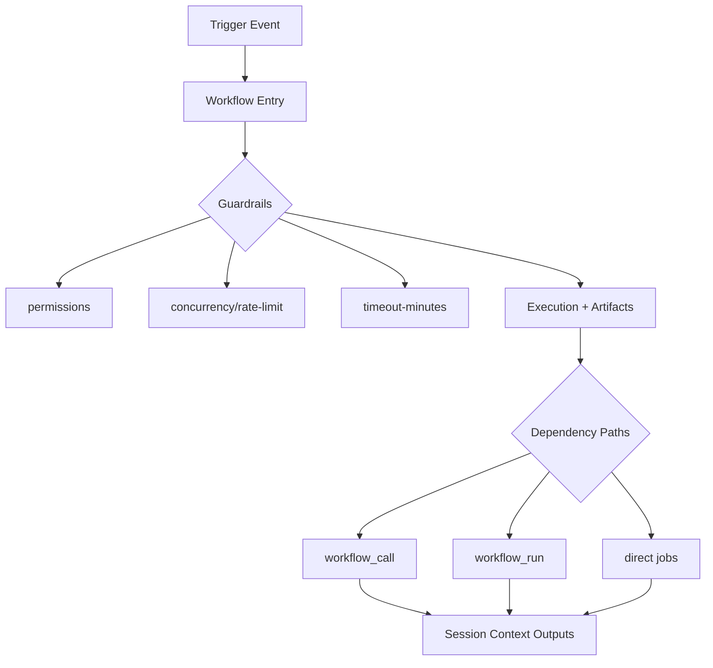
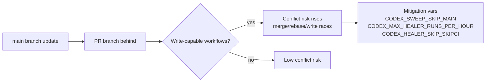

# Workflow Portfolio Analysis (7-Day Window)

Generated at: 2026-05-16T04:13:40.786806+00:00  
Repository: `Aries-Serpent/_codex_`

## Dataset Artifacts

- `docs/reporting/workflow_portfolio_7d_table.csv`
- `docs/reporting/workflow_portfolio_7d_table.md`
- `docs/reporting/copilot_agent_session_standard_operation.md` (standard Copilot session lifecycle, required living docs, and streamlining planset)

## Executive Snapshot

- Total workflows discovered: **180**
- Workflows active in last 7 days: **82**
- Workflows not utilized in 7 days (including disabled): **100**
- Workflows with rate-limit controls/signals: **155**
- Workflows with variable mappings detected: **144**
- Branch-update conflict risk counts: **high=10**, **medium=38**
- Aggregate run conclusions (7 days): success=361, failure=50, action_required=78

## Mermaid Mapping — Workflow + Variable + Conflict Logic

## Tokenized Variable Mapping (Top Frequency)

| Token | Referencing workflows |
|---|---:|
| `TSEC_CODEX_MASTER_KEY` | 119 |
| `TSEC_CODEX_BACKUP_KEY` | 114 |
| `TSEC_GITHUB_TOKEN` | 93 |
| `TVAR_CODEX_CACHE_VERSION` | 29 |
| `TENV_PYTHON_VERSION` | 8 |
| `TVAR_COPILOT_AGENT_AUTH_ENABLED` | 7 |
| `TVAR_COGNITIVE_BRAIN_SESSION_NUMBER` | 6 |
| `TENV_PR_NUMBER` | 5 |
| `TVAR_COGNITIVE_BRAIN_ALLOWED_ACTORS` | 4 |
| `TENV_DRY_RUN` | 4 |
| `TSEC_CODECOV_TOKEN` | 3 |
| `TVAR_CODEX_CI_LAST_GREEN_SHA` | 3 |
| `TVAR_CODEX_HEALER_SKIP_SKIPCI` | 3 |
| `TVAR_CODEX_MAX_HEALER_RUNS_PER_HOUR` | 3 |
| `TVAR_CODEX_SWEEP_SKIP_MAIN` | 3 |
| `TVAR_AUTONOMOUS_ACTIONS_ENABLED` | 2 |
| `TVAR_COGNITIVE_BRAIN_INJECTION_ENABLED` | 2 |
| `TVAR_AGENT_HANDOFF_TIMEOUT_SECONDS` | 2 |
| `TVAR_EMBEDDING_INDEX_AUTO_REBUILD` | 2 |
| `TVAR_CODEX_CI_FAILURE_THRESHOLD` | 2 |
| `TENV_REF` | 2 |
| `TENV_SHA` | 2 |
| `TVAR_CODEX_CI_FAILURE_RATE` | 2 |
| `TVAR_CODEX_COVERAGE_THRESHOLD` | 2 |
| `TVAR_COPILOT_AGENT_STATE` | 2 |

## Quantum-Inspired Equations Depicting Workflow Logic

\[
\left|\Psi_{workflow}\right\rangle = \sum_{i=1}^{N} \alpha_i \left|w_i\right\rangle
\]

\[
U_i = \lambda_1 A_i + \lambda_2 D_i + \lambda_3 V_i - \lambda_4 R_i
\]

\[
Q_i = \mu_1(1-A_i) + \mu_2R_i + \mu_3C_i + \mu_4B_i
\]

Where:
- \(A_i\): 7-day activity utility
- \(D_i\): dependency centrality
- \(V_i\): variable observability/tokenization quality
- \(R_i\): missing guardrail risk
- \(C_i\): Copilot cloud/coding-session relevance
- \(B_i\): branch-update conflict exposure

## Requested Findings Summary

### What works

- Strong automation breadth and policy controls across core workflows.
- High adoption of guardrails (permissions/concurrency/timeout) in many active paths.
- Variable ecosystem (`CODEX_*`, `COPILOT_*`, `COGNITIVE_BRAIN_*`) is present and exploitable for session optimization.

### What does not work

- Workflow sprawl and mixed orchestration modes increase debugging overhead.
- Some high-value active workflows are under-utilized in the recent 7-day window.
- Branch-update conflict exposure remains in write-capable, event-driven workflows.

### What is missing

- Canonical owner/criticality metadata contract per workflow.
- Unified variable token registry and enforcement policy.
- Automated conflict-risk scoring artifact in CI outputs.

### What needs to be improved

1. Standardize tokenized variable contracts in all Copilot/agent workflows.
2. Apply branch-scoped concurrency + timeout parity to lagging workflows.
3. Harden write-capable automation against main-branch drift.
4. Consolidate overlapping pipelines to reduce fanout complexity.
5. Publish conflict-risk and quick-win rankings as default Copilot session context.

## Workflows That Conflict (or Could Conflict) When Main Updates During Active Branch Sessions

| Workflow file | Workflow name | Risk | Runs 7d | Conflict reason | Suggested mitigation variables |
|---|---|---|---:|---|---|
| `.github/workflows/iterative-self-healing-ci.yml` | Iterative Self-Healing CI | high | 413 | write-capable + event-driven workflow; may race with branch/main drift during active sessions | CODEX_SWEEP_SKIP_MAIN,CODEX_MAX_HEALER_RUNS_PER_HOUR,CODEX_HEALER_SKIP_SKIPCI |
| `.github/workflows/ci-rescue.yml` | CI Rescue — Auto-Fix & @copilot RCA | medium | 55 | orchestration-sensitive chain; can conflict via workflow_run ordering when branch becomes behind | CODEX_SWEEP_SKIP_MAIN,CODEX_MAX_HEALER_RUNS_PER_HOUR,CODEX_HEALER_SKIP_SKIPCI |
| `.github/workflows/copilot-iterative-self-healing.yml` | Copilot Iterative Self-Healing Auto-Poster | medium | 55 | orchestration-sensitive chain; can conflict via workflow_run ordering when branch becomes behind | CODEX_SWEEP_SKIP_MAIN,CODEX_MAX_HEALER_RUNS_PER_HOUR,CODEX_HEALER_SKIP_SKIPCI |
| `.github/workflows/cleanup-stale-pr-comments.yml` | 🧹 Cleanup Stale PR Comments | medium | 12 | orchestration-sensitive chain; can conflict via workflow_run ordering when branch becomes behind | CODEX_SWEEP_SKIP_MAIN,CODEX_MAX_HEALER_RUNS_PER_HOUR,CODEX_HEALER_SKIP_SKIPCI |
| `.github/workflows/copilot-evolution-suite.yml` | Copilot Evolution & Review (Unified) | high | 10 | write-capable + event-driven workflow; may race with branch/main drift during active sessions | CODEX_SWEEP_SKIP_MAIN,CODEX_MAX_HEALER_RUNS_PER_HOUR,CODEX_HEALER_SKIP_SKIPCI |
| `.github/workflows/copilot-agent-session-done.yml` | 🔄 Auto-Post @copilot review After Agent Session | high | 10 | write-capable + event-driven workflow; may race with branch/main drift during active sessions | CODEX_SWEEP_SKIP_MAIN,CODEX_MAX_HEALER_RUNS_PER_HOUR,CODEX_HEALER_SKIP_SKIPCI |
| `.github/workflows/codebase-health-sweep.yml` | 🧹 Codebase Health Sweep | medium | 7 | write-capable and event-triggered; potential merge or stale-head conflict during main updates | CODEX_SWEEP_SKIP_MAIN,CODEX_MAX_HEALER_RUNS_PER_HOUR,CODEX_HEALER_SKIP_SKIPCI |
| `.github/workflows/audit-qa-suite.yml` | Audit & QA Suite (Unified) | medium | 6 | write-capable and event-triggered; potential merge or stale-head conflict during main updates | CODEX_SWEEP_SKIP_MAIN,CODEX_MAX_HEALER_RUNS_PER_HOUR,CODEX_HEALER_SKIP_SKIPCI |
| `.github/workflows/pr-followup-generator.yml` | Generate PR Follow-Up Prompt | medium | 6 | write-capable and event-triggered; potential merge or stale-head conflict during main updates | CODEX_SWEEP_SKIP_MAIN,CODEX_MAX_HEALER_RUNS_PER_HOUR,CODEX_HEALER_SKIP_SKIPCI |
| `.github/workflows/agent_infrastructure_manager.yml` | Agent Infrastructure Manager | medium | 5 | write-capable and event-triggered; potential merge or stale-head conflict during main updates | CODEX_SWEEP_SKIP_MAIN,CODEX_MAX_HEALER_RUNS_PER_HOUR,CODEX_HEALER_SKIP_SKIPCI |
| `.github/workflows/agent-auth-delegation.yml` | Agent Token Delegation | medium | 5 | write-capable and event-triggered; potential merge or stale-head conflict during main updates | CODEX_SWEEP_SKIP_MAIN,CODEX_MAX_HEALER_RUNS_PER_HOUR,CODEX_HEALER_SKIP_SKIPCI |
| `.github/workflows/agent-var-writer.yml` | Agent Variable Writer (Provenance-Chain) | high | 5 | write-capable + event-driven workflow; may race with branch/main drift during active sessions | CODEX_SWEEP_SKIP_MAIN,CODEX_MAX_HEALER_RUNS_PER_HOUR,CODEX_HEALER_SKIP_SKIPCI |
| `.github/workflows/copilot-agent-vars-bootstrap.yml` | Agent Vars Bootstrap | medium | 5 | orchestration-sensitive chain; can conflict via workflow_run ordering when branch becomes behind | CODEX_SWEEP_SKIP_MAIN,CODEX_MAX_HEALER_RUNS_PER_HOUR,CODEX_HEALER_SKIP_SKIPCI |
| `.github/workflows/chatops_copilot_trigger.yml` | Chat-Ops — @copilot Webhook Trigger | medium | 5 | orchestration-sensitive chain; can conflict via workflow_run ordering when branch becomes behind | CODEX_SWEEP_SKIP_MAIN,CODEX_MAX_HEALER_RUNS_PER_HOUR,CODEX_HEALER_SKIP_SKIPCI |
| `.github/workflows/session-watchdog.yml` | Session Watchdog — Timebox & Continuity Enforcement | medium | 5 | orchestration-sensitive chain; can conflict via workflow_run ordering when branch becomes behind | CODEX_SWEEP_SKIP_MAIN,CODEX_MAX_HEALER_RUNS_PER_HOUR,CODEX_HEALER_SKIP_SKIPCI |
| `.github/workflows/workflow-execution-gate.yml` | Workflow Execution Gate | medium | 5 | orchestration-sensitive chain; can conflict via workflow_run ordering when branch becomes behind | CODEX_SWEEP_SKIP_MAIN,CODEX_MAX_HEALER_RUNS_PER_HOUR,CODEX_HEALER_SKIP_SKIPCI |
| `.github/workflows/secrets-baseline-enforcer.yml` | 🔐 Secrets Baseline Enforcer | medium | 5 | write-capable and event-triggered; potential merge or stale-head conflict during main updates | CODEX_SWEEP_SKIP_MAIN,CODEX_MAX_HEALER_RUNS_PER_HOUR,CODEX_HEALER_SKIP_SKIPCI |
| `.github/workflows/copilot-agent-checkin.yml` | 🤖 Agent Check-In — Q&A Bridge (Discussion #3756) | medium | 5 | orchestration-sensitive chain; can conflict via workflow_run ordering when branch becomes behind | CODEX_SWEEP_SKIP_MAIN,CODEX_MAX_HEALER_RUNS_PER_HOUR,CODEX_HEALER_SKIP_SKIPCI |
| `.github/workflows/copilot-review-responder.yml` | 🤖 Copilot Review Responder | medium | 5 | orchestration-sensitive chain; can conflict via workflow_run ordering when branch becomes behind | CODEX_SWEEP_SKIP_MAIN,CODEX_MAX_HEALER_RUNS_PER_HOUR,CODEX_HEALER_SKIP_SKIPCI |
| `.github/workflows/codex-manifest-refresh.yml` | CODEX Manifest Auto-Refresh | medium | 4 | write-capable and event-triggered; potential merge or stale-head conflict during main updates | CODEX_SWEEP_SKIP_MAIN,CODEX_MAX_HEALER_RUNS_PER_HOUR,CODEX_HEALER_SKIP_SKIPCI |

## Top 20 Quick-Win Workflows to Update (Copilot Session First)

| Rank | Workflow file | Workflow name | State | Runs 7d | Conflict risk | Quick-win updates | Copilot variable refs |
|---:|---|---|---|---:|---|---|---|
| 1 | `dynamic/agents/anthropic-code-agent` | Claude | active | 0 | unknown | Review trigger scope and remove stale fanout; Add timeout-minutes to jobs; Add branch-scoped concurrency group | n/a |
| 2 | `dynamic/anthropic-code-agent/claude` | Claude | active | 0 | unknown | Review trigger scope and remove stale fanout; Add timeout-minutes to jobs; Add branch-scoped concurrency group | n/a |
| 3 | `.github/workflows/copilot-automation.yml` | Copilot Automation Suite | active | 0 | unknown | Review trigger scope and remove stale fanout; Add timeout-minutes to jobs; Add branch-scoped concurrency group | n/a |
| 4 | `dynamic/copilot-pull-request-reviewer/copilot-pull-request-reviewer` | Copilot code review | active | 0 | unknown | Review trigger scope and remove stale fanout; Add timeout-minutes to jobs; Add branch-scoped concurrency group | n/a |
| 5 | `dynamic/agents/openai-code-agent` | OpenAI Codex | active | 0 | unknown | Review trigger scope and remove stale fanout; Add timeout-minutes to jobs; Add branch-scoped concurrency group | n/a |
| 6 | `.github/workflows/copilot-session-chain.yml` | 🔗 Copilot Session Chain | active | 0 | high | Review trigger scope and remove stale fanout; Harden against main-update drift (rebase gate + write isolation) | n/a |
| 7 | `dynamic/copilot-swe-agent/copilot` | Copilot cloud agent | active | 6 | unknown | Add timeout-minutes to jobs; Add branch-scoped concurrency group; Add explicit rate-limit/throughput guard | n/a |
| 8 | `.github/workflows/agent-orchestration-unified.yml` | Agent Orchestration (Unified) | active | 0 | medium | Review trigger scope and remove stale fanout; Harden against main-update drift (rebase gate + write isolation) | CODEX_CACHE_VERSION |
| 9 | `.github/workflows/ci-rescue.yml` | CI Rescue — Auto-Fix & @copilot RCA | disabled_manually | 55 | medium | Review trigger scope and remove stale fanout; Harden against main-update drift (rebase gate + write isolation) | COPILOT_AGENT_AUTH_ENABLED |
| 10 | `.github/workflows/cognitive_brain_ci_feedback.yml` | Cognitive Brain CI Feedback | disabled_manually | 0 | medium | Review trigger scope and remove stale fanout; Harden against main-update drift (rebase gate + write isolation) | CODEX_CACHE_VERSION |
| 11 | `.github/workflows/copilot-setup-steps.yml` | Copilot Agent Environment Setup | active | 0 | medium | Review trigger scope and remove stale fanout; Harden against main-update drift (rebase gate + write isolation) | CODEX_CACHE_VERSION,CODEX_CI_LAST_GREEN_SHA,CODEX_HEALER_SKIP_SKIPCI,CODEX_MAX_HEALER_RUNS_PER_HOUR,CODEX_SWEEP_SKIP_MAIN,COPILOT_AGENT_STATE,COPILOT_RUNNER_PROFILE |
| 12 | `.github/workflows/copilot-iterative-self-healing.yml` | Copilot Iterative Self-Healing Auto-Poster | disabled_manually | 55 | medium | Review trigger scope and remove stale fanout; Harden against main-update drift (rebase gate + write isolation) | COGNITIVE_BRAIN_SESSION_NUMBER |
| 13 | `.github/workflows/copilot-pr-session-injector.yml` | Copilot PR Session Injector | active | 0 | medium | Review trigger scope and remove stale fanout; Harden against main-update drift (rebase gate + write isolation) | n/a |
| 14 | `.github/workflows/d-capable-promotion-gate.yml` | D_CAPABLE Agent Promotion Gate | active | 0 | medium | Review trigger scope and remove stale fanout; Harden against main-update drift (rebase gate + write isolation) | n/a |
| 15 | `.github/workflows/agent-registry-validation.yml` | Agent Registry Validation | active | 0 | low | Review trigger scope and remove stale fanout | CODEX_CACHE_VERSION |
| 16 | `.github/workflows/build-agent-env-cache.yml` | Build Agent Environment Cache | active | 0 | low | Review trigger scope and remove stale fanout | CODEX_CACHE_VERSION |
| 17 | `.github/workflows/create-sub-pr-to-0D_base_.yml` | 🔀 Create Sub-PR: Session Branch → 0D_base_ | active | 0 | low | Review trigger scope and remove stale fanout | n/a |
| 18 | `.github/workflows/agent-var-writer.yml` | Agent Variable Writer (Provenance-Chain) | active | 5 | high | Harden against main-update drift (rebase gate + write isolation) | n/a |
| 19 | `.github/workflows/copilot-evolution-suite.yml` | Copilot Evolution & Review (Unified) | active | 10 | high | Harden against main-update drift (rebase gate + write isolation) | n/a |
| 20 | `.github/workflows/copilot-agent-session-done.yml` | 🔄 Auto-Post @copilot review After Agent Session | active | 10 | high | Harden against main-update drift (rebase gate + write isolation) | COPILOT_AGENT_AUTH_ENABLED |

## Perspective: Capability + Future Vision

### What this codebase is capable of doing well

The repository can already function as a policy-aware CI/CD and agent-orchestration platform with strong guardrail patterns and reusable workflow composition.

### Future vision and path improvement

Move toward a lean, high-signal workflow operating system for Copilot sessions: standardized tokenized variable contracts, explicit conflict-risk controls for branch drift, and continuous pruning/consolidation of stale or overlapping automation paths.
