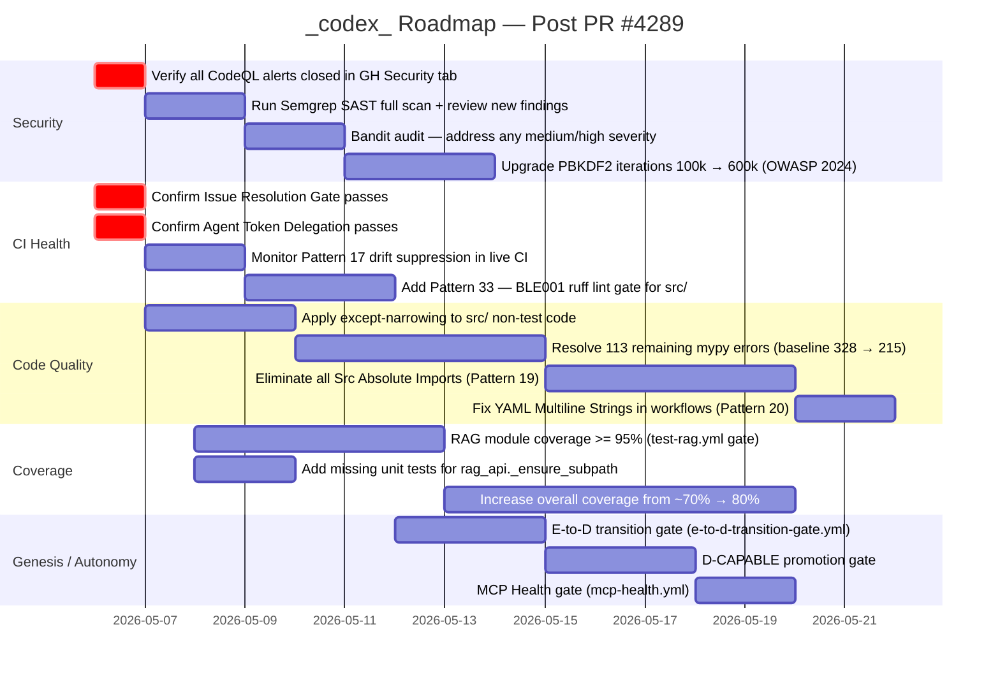
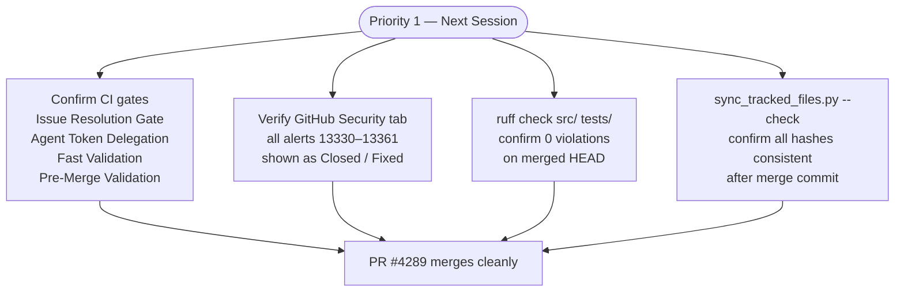
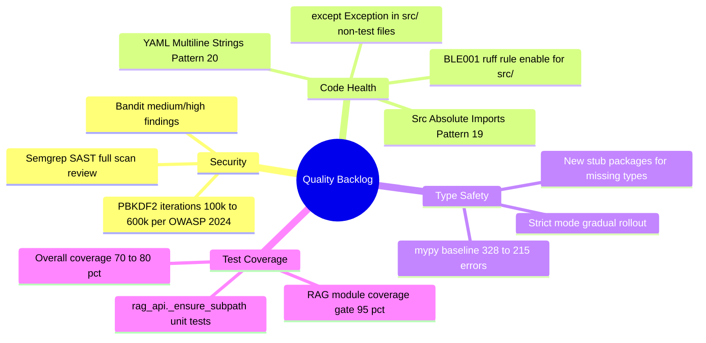
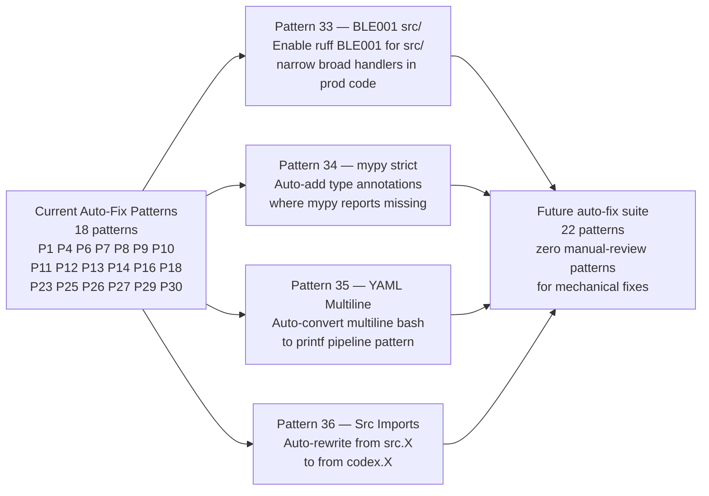
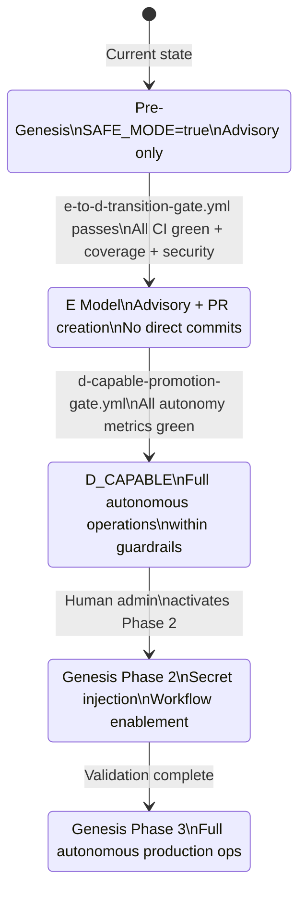
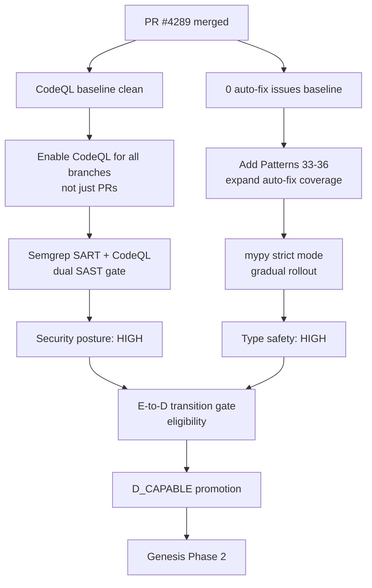

# _codex_ — What's Next: Roadmap After PR #4289

> **Status as of 2026-05-05** · Merge Readiness: 100/100 · CI Issues: 0 · CodeQL Alerts: 0

---

## Roadmap Overview

---

## Priority 1 — Immediate (Next Session)

---

## Priority 2 — Near-Term Quality

---

## Priority 3 — Auto-Fix Pipeline Expansion

---

## Priority 4 — Genesis Protocol

---

## Dependency Map

---

## Key Metrics to Track

| Metric | Current | Target | Owner Pattern |
|--------|---------|--------|---------------|
| `auto_fix_common_issues --check-only` exit code | **0** ✅ | 0 forever | Patterns 1–32 |
| CodeQL open alerts | **0** ✅ | 0 forever | SAST workflow |
| Merge Readiness Score | **100/100** ✅ | ≥ 95/100 | Pattern 30 |
| mypy error count | ~282 (full env) | ≤ 215 | Pattern 15 |
| Test coverage (overall) | ~70% | ≥ 80% | coverage-with-timeout |
| RAG module coverage | unknown | ≥ 95% | test-rag.yml |
| `except Exception:` in `src/` | unknown | 0 | Pattern 33 (new) |
| `from src.X` imports | unknown | 0 | Pattern 19 |
