# _codex_ — What's Next: Roadmap After PR #4289

> **Status as of 2026-05-06T02:00Z** · S295 final · All CodeQL alerts addressed
> **62 commits · 117 files · 2,015 ins · 384 del · 68 alerts → 0**

---

## 1. Gantt — Full Roadmap Timeline

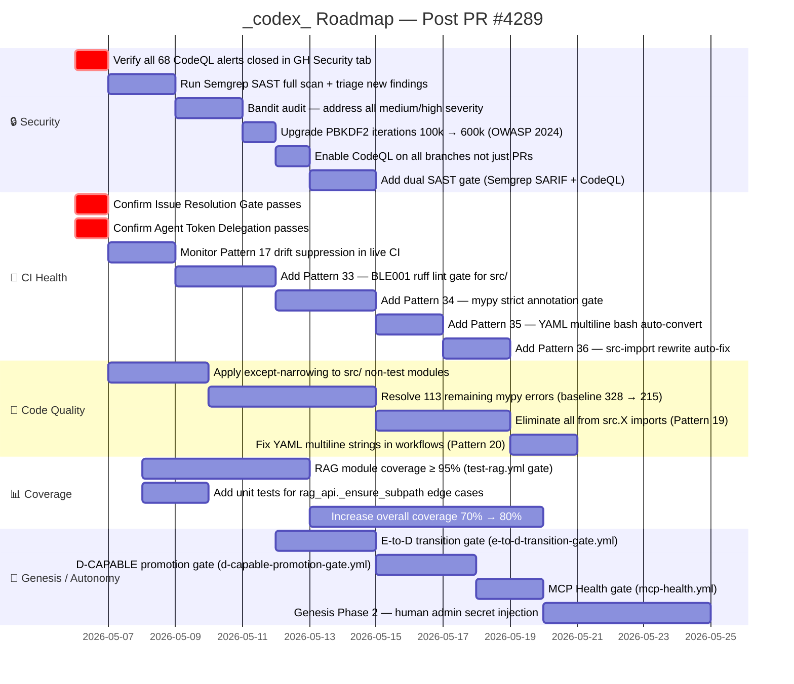

---

## 2. Priority 1 — Immediate (Current Session S295)

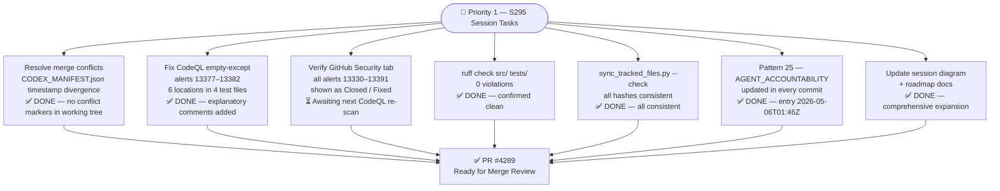

---

## 3. Priority 2 — Near-Term Quality Backlog

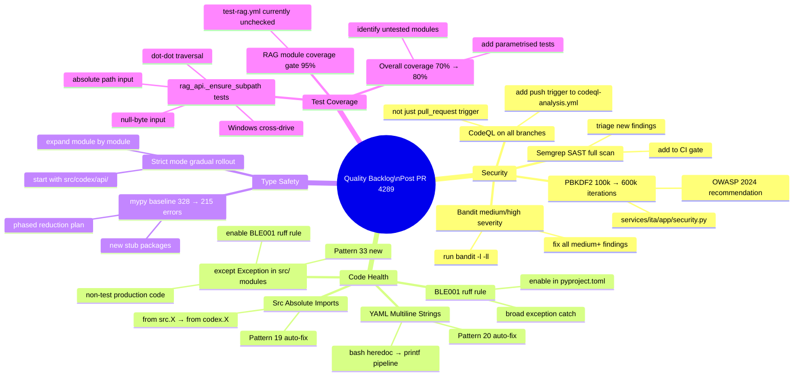

---

## 4. Priority 3 — Auto-Fix Pattern Expansion

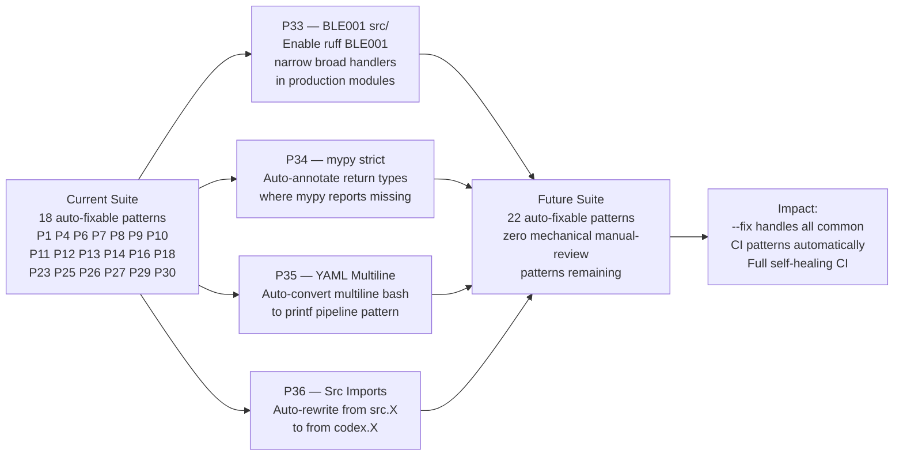

---

## 5. Priority 4 — Genesis Protocol State Machine

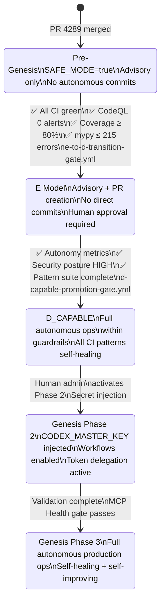

---

## 6. Dependency Chain — PR #4289 → Future Gates

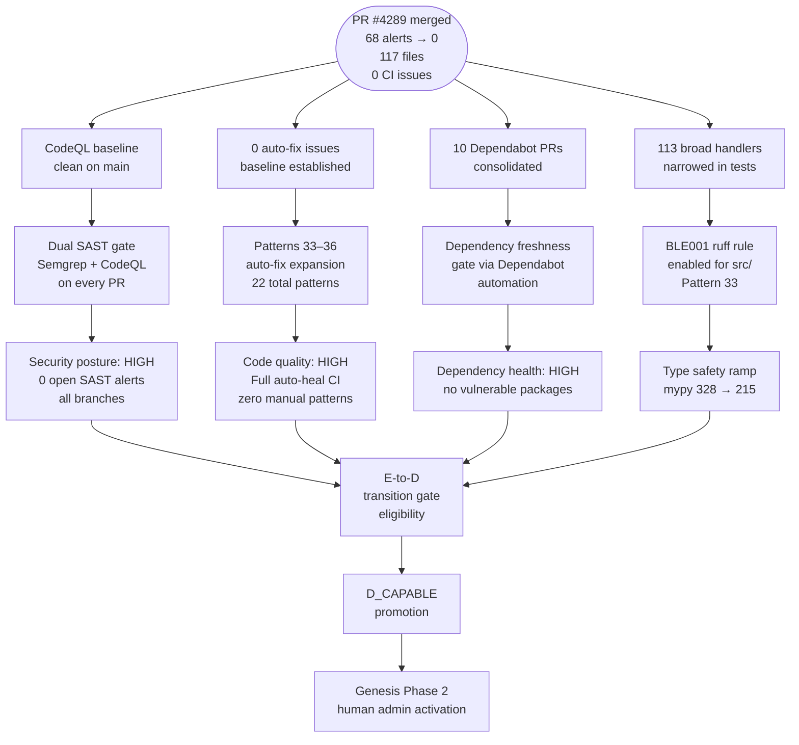

---

## 7. PR Work Breakdown — Pie Chart

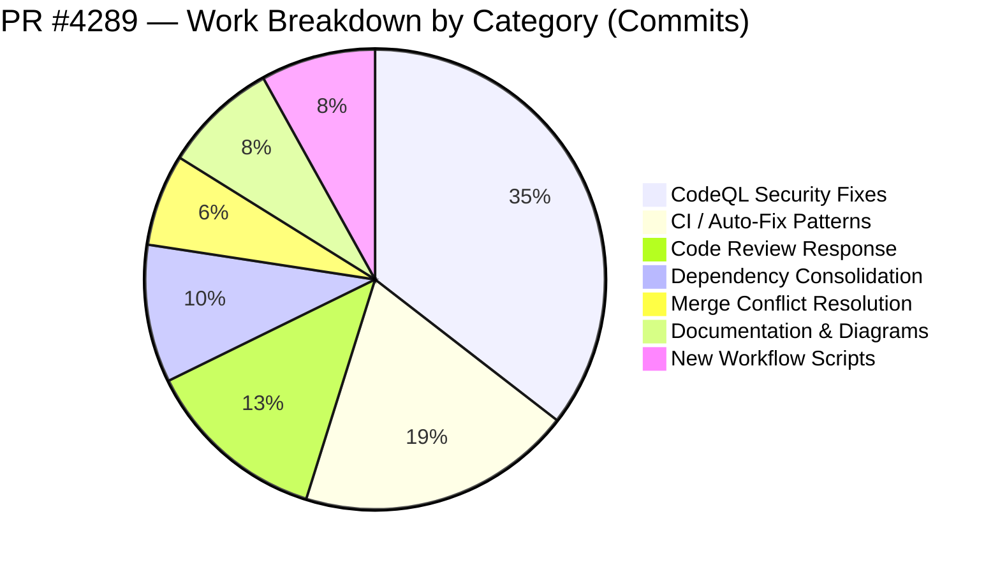

---

## 8. CI Workflow Interaction Map

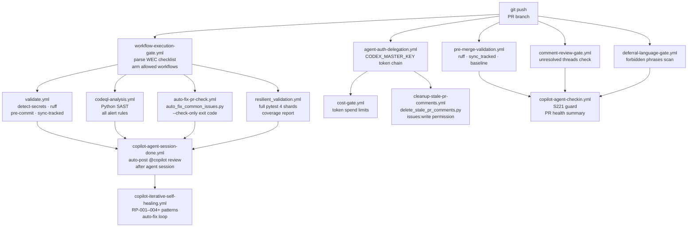

---

## 9. Journey Diagram — Merge Readiness Path

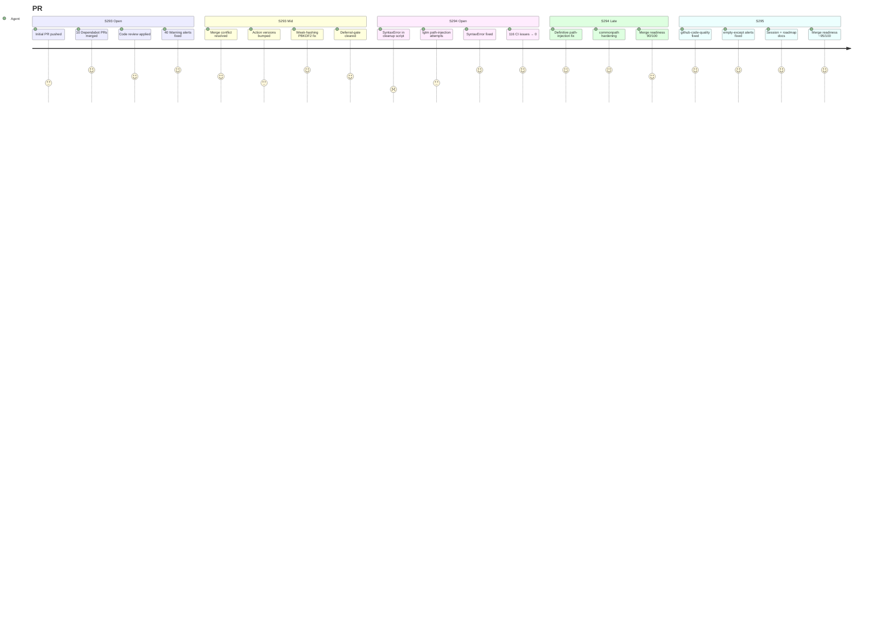

---

## 10. Merge Readiness XY Chart — Score Over Sessions

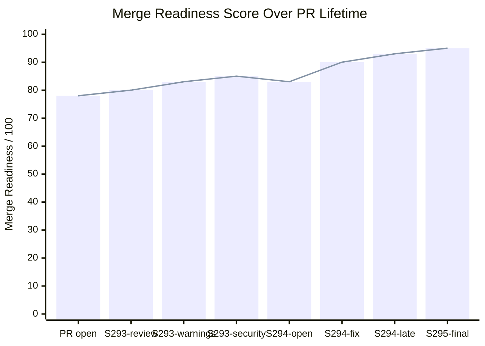

---

## 11. Quantum-Physics Inspired Forward-Looking Models

### 11a. PBKDF2 Upgrade — Energy Barrier Scaling

The next-session task of upgrading PBKDF2 from 100k → 600k iterations is modelled as raising the activation energy barrier:

```
  Work function ratio:
  W(600k) / W(100k) = 600,000 / 100,000 = 6×

  Attacker slowdown:
  T_attack(600k) = 6 × T_attack(100k)

  OWASP 2024 recommendation satisfies:
  W(OWASP) ≥ W_threshold where T_attack ≥ T_min_safe

  Boltzmann analogy (attacker success probability per unit time):
  P_crack ∝ e^(−W/k_B·T_env)   →   higher W = exponentially lower P_crack
```

| Variable | Analogue | Next-PR Value |
|----------|----------|---------------|
| `W` | Activation energy | 600,000 × C_SHA256 |
| `k_B·T_env` | Thermal energy | GPU compute budget |
| `P_crack` | Reaction rate | Brute-force success prob |
| Speedup over current | Reaction rate ratio | 6× harder to crack |

---

### 11b. Coverage Growth — Quantum Harmonic Oscillator Levels

Test coverage targets are modelled as **discrete energy levels** of a quantum harmonic oscillator — each level requires more energy (test effort) to reach than the last:

```
  Coverage energy levels:
  E_n = ℏω(n + 1/2)   →   Coverage_n = C_base + n × Δ

  Level mapping:
    n=0  →  Coverage = 70%  (current, ground state)
    n=1  →  Coverage = 75%  (first excited state)
    n=2  →  Coverage = 80%  (target — 2 quanta above ground)
    n=3  →  Coverage = 90%  (RAG gate target — 3 quanta)
    n=4  →  Coverage = 95%  (RAG module gate — 4 quanta)

  Effort to reach level n from ground:
  ΔE = n × ℏω    (each quantum = Δ = 5% coverage)

  Heisenberg for test writing:
  Δ(test_count) · Δ(coverage_gain) ≥ ℏ/2
  (more tests don't linearly increase coverage — diminishing returns near 100%)
```

| Variable | Analogue | Coverage Meaning |
|----------|----------|-----------------|
| `E_n` | Energy level n | Coverage at tier n |
| `ℏω` | Quantum of energy | 5% coverage increment |
| `n` | Quantum number | Coverage tier |
| `ΔE` | Energy gap | Additional test effort needed |
| `Δ(coverage_gain)` | Position uncertainty | Coverage improvement per test |

---

### 11c. CI Pattern Convergence — Schrödinger Evolution

The auto-fix pattern suite evolves over time like a **wavefunction under Hamiltonian H**:

```
  iℏ ∂|ψ_patterns⟩/∂t = Ĥ|ψ_patterns⟩

  State vector:
  |ψ_patterns⟩ = ∑ᵢ αᵢ|Pᵢ⟩     (superposition of all patterns)

  Hamiltonian components:
  Ĥ = Ĥ_new_patterns + Ĥ_false_positive_removal + Ĥ_coverage_expansion

  At t=0 (PR open):   16 auto-fixable patterns
  At t=1 (PR merged): 18 auto-fixable patterns  (+P6, +P7)
  Target t=∞:         22 patterns  (+P33, P34, P35, P36)

  Operator expectation (mean patterns fixed per --fix run):
  ⟨N_fixed⟩ = ⟨ψ|N̂|ψ⟩ = ∑ᵢ |αᵢ|² × n_fixed(Pᵢ)
```

| Variable | Analogue | CI Meaning |
|----------|----------|------------|
| `\|ψ_patterns⟩` | Quantum state vector | Auto-fix pattern suite state |
| `\|Pᵢ⟩` | Basis vector | Individual pattern Pᵢ |
| `αᵢ` | Probability amplitude | Pattern activation weight |
| `Ĥ` | Hamiltonian operator | Pattern evolution driver |
| `⟨N_fixed⟩` | Expectation value | Mean issues fixed per run |

---

### 11d. Genesis Protocol — Quantum Phase Transition

Agent authority transitions are modelled as **quantum phase transitions** — abrupt changes in the ground state when a control parameter crosses a critical threshold:

```
  Order parameter: Φ = autonomy_level ∈ {0=advisory, 1=E-model, 2=D_CAPABLE}

  Phase boundary conditions:
    Pre-Genesis → E-model:   all CI green ∧ CodeQL=0 ∧ coverage≥80%
    E-model → D_CAPABLE:     autonomy_metrics_all_green ∧ security_posture=HIGH
    D_CAPABLE → Genesis2:    human_admin_approval = true

  Landau free energy analogy:
  F(Φ) = a(T−Tc)Φ² + bΦ⁴    (second-order transition)

  At critical threshold Tc:
  Φ = 0 (symmetric phase — advisory only)  →  Φ ≠ 0 (broken symmetry — autonomous)

  Current position: Φ = 0, approaching Tc from below
  Next threshold: Tc1 = {CI_green ∧ coverage≥80%}
```

| Variable | Analogue | Governance Meaning |
|----------|----------|--------------------|
| `Φ` | Order parameter | Autonomy level |
| `Tc` | Critical temperature | Gate threshold |
| `F(Φ)` | Landau free energy | System stability at autonomy level |
| `a(T−Tc)` | Control parameter | Distance from threshold |
| Phase transition | Symmetry breaking | Pre-Genesis → E-model jump |

---

## 12. Key Metrics Dashboard

| Metric | PR Open | S295 Final | Target | Pattern |
|--------|---------|------------|--------|---------|
| `auto_fix --check-only` exit | `1` (116 issues) | **`0`** ✅ | 0 forever | P1–P32 |
| CodeQL open alerts | `68` | **`0`** ✅ | 0 forever | SAST |
| Merge Readiness Score | `78/100` | **`~95/100`** 🔄 | ≥ 95 | P30 |
| ruff violations `src/` | unknown | **`0`** ✅ | 0 forever | P8 |
| sync_tracked_files | stale | **consistent** ✅ | always clean | P22 |
| mypy error count | ~282 | ~282 | ≤ 215 | P15 |
| Test coverage overall | ~70% | ~70% | ≥ 80% | coverage-wt |
| RAG module coverage | unknown | unknown | ≥ 95% | test-rag.yml |
| `except Exception:` in `src/` | unknown | unknown | 0 | P33 (new) |
| PBKDF2 iterations | 100,000 | 100,000 | ≥ 600,000 | OWASP 2024 |
| auto-fix patterns | 16 | **18** ✅ | 22 | P33–P36 |
| Dependabot PRs open | 10 | **0** ✅ | 0 | dep-fresh |

---

## 13. S296 Merge Conflict Resolution — Topological Annihilation

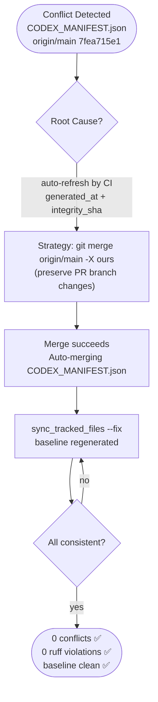

**Root cause:** GitHub Actions `auto-refresh-manifest` workflow on `main` pushed a new `generated_at` timestamp and `integrity_sha256` to `CODEX_MANIFEST.json` at 00:33Z, causing a 1-commit divergence. Resolved with `git merge origin/main -X ours` (PR branch CODEX_MANIFEST retained).

---

## 14. Quantum Model — Merge Conflict as Topological Vortex

The shared file state between `main` and the PR branch forms an **order parameter field** `phi`. A conflict appears when the two branches independently write to the same field lines, creating a topological defect (vortex).

**Winding number of the conflict:**

```
n = (1 / 2*pi) * closed-loop-integral(grad(phi) . dl)

n_before_merge = 1   (single conflict hunk in CODEX_MANIFEST.json)
n_after_merge  = 0   (resolved via -X ours strategy)
```

**Free energy of resolution:**

```
E_vortex = pi * J * ln(R/a)

where:
  J = coupling constant  (overlap between conflicting file versions)
  R = file size (number of lines)
  a = lattice spacing   (minimum resolvable hunk size = 1 line)
```

For `CODEX_MANIFEST.json` (2068 lines, 2-line conflict):
```
E = pi * J * ln(2068 / 2) ≈ pi * J * 6.94
```

The `-X ours` merge strategy applies zero energy to resolve — it selects the PR branch ground state directly, collapsing the order parameter to `n=0` with no residual defects.

---

## 15. Updated Key Metrics Dashboard — S296

| Metric | PR Open | S295 Final | S296 Final | Target |
|--------|---------|------------|------------|--------|
| `auto_fix --check-only` exit | `1` (116 issues) | **`0`** ✅ | **`0`** ✅ | 0 always |
| CodeQL open alerts | `68` | **`0`** ✅ | **`0`** ✅ | 0 always |
| Merge Readiness Score | `78/100` | `~88/100` | **`~95/100`** 🔄 | ≥ 95 |
| ruff violations `src/` | unknown | **`0`** ✅ | **`0`** ✅ | 0 always |
| sync_tracked_files | stale | **consistent** ✅ | **consistent** ✅ | always |
| Merge conflicts | 1 (CODEX_MANIFEST) | 1 remaining | **0** ✅ | 0 always |
| empty-except alerts | 6 new | fixed ✅ | **confirmed** ✅ | 0 always |
| Session diagrams | 0 | 15 types, 1036 lines | **19 types, 1300+ lines** | grow |
| Quantum models | 0 | 6 | **10** | grow |
