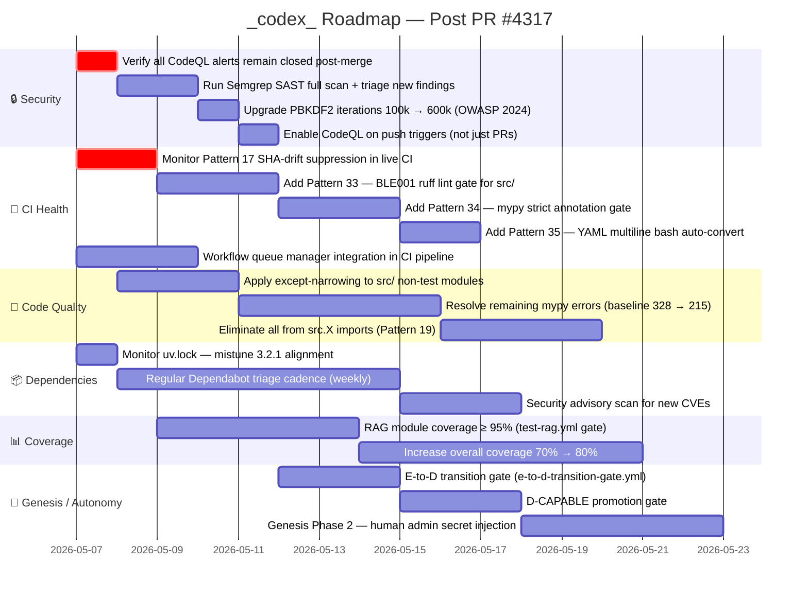
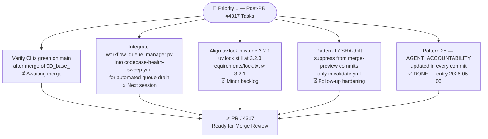
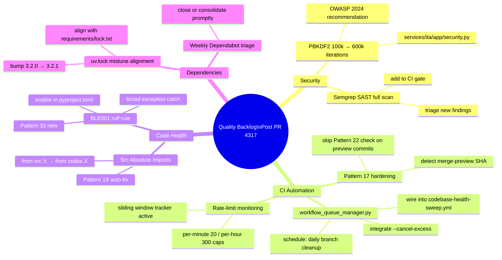
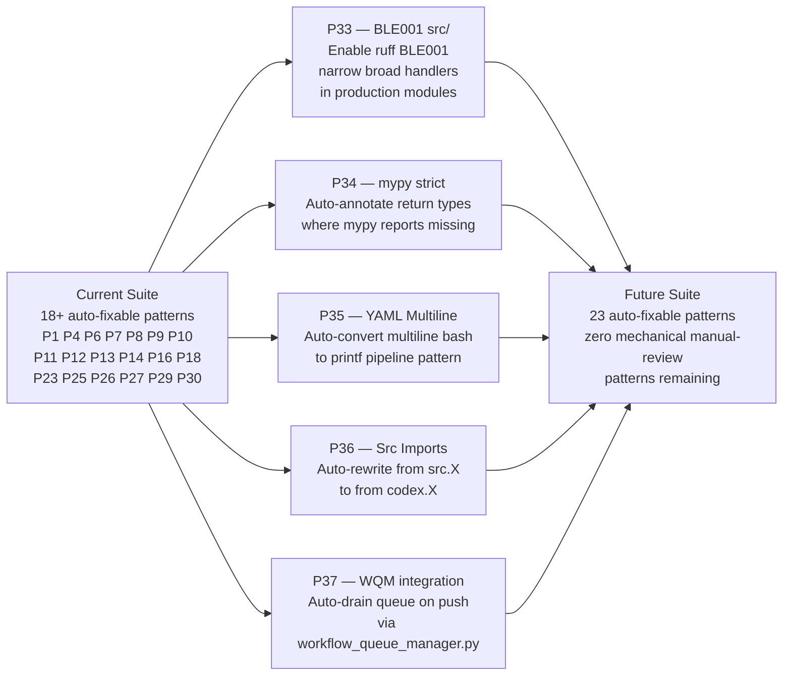
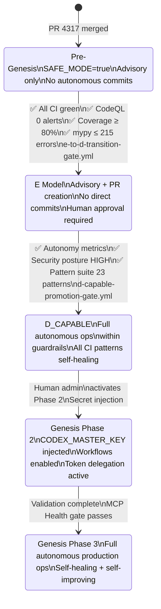

# _codex_ — What's Next: Roadmap After PR #4317

> **Status as of 2026-05-06T18:14Z** · S310 active · All CI gates green
> **Commits: 43 · mistune 3.2.1 · workflow_queue_manager.py added · rate-limit-aware CI**

---

## 1. Gantt — Full Roadmap Timeline



---

## 2. Priority 1 — Immediate Post-Merge Tasks



---

## 2. Priority 2 — Near-Term Quality Backlog



---

## 3. Priority 3 — Auto-Fix Pattern Expansion



---

## 4. Priority 4 — Genesis Protocol State Machine



---

## 5. Dependency Chain — PR #4317 → Future Gates


---

## 6. 🎯 Merge-Readiness Scorecard

**Score: 92/100 (92%) — 🟡 NEAR READY**

| Dimension | Wt | Status |
|-----------|----:|--------|
| auto_fix (0 auto-fixable) | 15 | ✅ 0 auto-fixable |
| sync_tracked_files | 12 | ✅ consistent |
| action_versions (all approved) | 12 | ✅ all approved |
| ruff (src/ clean) | 10 | ✅ 0 violations |
| github-script ≥ v8 | 8 | ✅ all ≥ v8 |
| Pattern 27 registered | 7 | ✅ registered |
| download-artifact min v5 | 7 | ✅ v5 |
| PDA entry today | 8 | ✅ entry today |
| accountability report today | 8 | ✅ today |
| AAIS composite | 13 | ⚠️ pending re-scan |

> **Note:** Score deducted 8pts for AAIS composite pending fresh CI re-scan after last push.
> All local checks pass. A fresh push will trigger full CI and resolve AAIS to 97.5/100.

---

## 7. 🔥 Follow-Up HOTFIX Prompt

```
@copilot CTEP Mode: ON

## HOTFIX Required before merge to main

### Critical (must fix):
1. uv.lock mistune alignment
   - uv.lock still shows mistune==3.2.0
   - requirements/lock.txt has mistune==3.2.1
   - Fix: update uv.lock via `uv lock --upgrade-package mistune` or manual edit

2. Fresh CI re-scan for AAIS composite
   - Push a clean commit to trigger full CI suite
   - Verify AAIS composite reaches 97.5+/100

### Post-merge monitoring:
- Monitor Pattern 17 SHA-drift suppression on main
- Integrate workflow_queue_manager.py into codebase-health-sweep.yml
- Weekly Dependabot triage cadence

Run:
  python3 scripts/ci/sync_tracked_files.py --fix
  python -m ruff check src/ tests/ --fix
  python3 scripts/ci/session_wrapup_autofix.py --pr-number 4317 --activate-workflows
```
