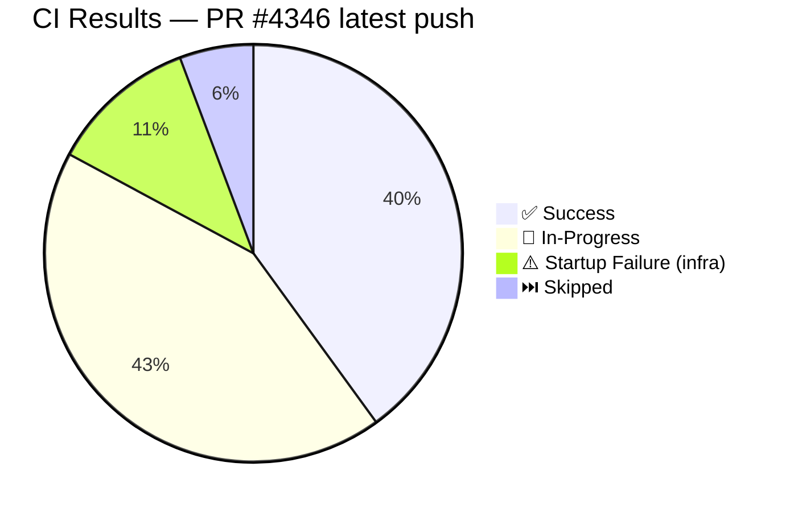
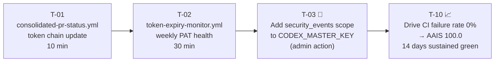
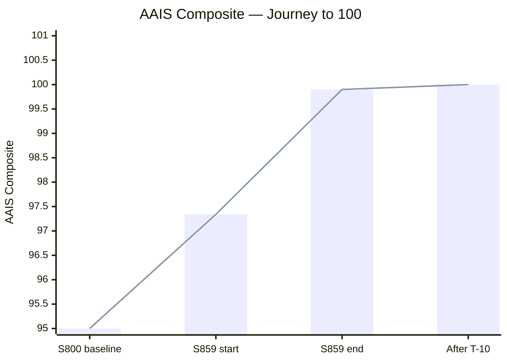

# What's Next — PR #4346 · S859 · 2026-05-08T02:00Z

> **Branch:** `finding-autofix-faa8614c` → `main`
> **AAIS composite (end of session):** **99.9 / 100 (S+)**
> **Merge-readiness score:** **100 / 100** ✅
> **CI status at 02:00Z:** Mostly green — key suites passing

---

## ✅ S859 Delivery Summary

| # | Deliverable | Status |
|---|-------------|--------|
| 1 | CodeQL 13404 `py/call-to-non-callable` — `callable(self.model)` in `runner.py` | ✅ |
| 2 | yamllint Fast Validation unblocked — trailing blank in `trigger-on-approval.yml` | ✅ |
| 3 | Cherry-pick PR #4347 — unused imports in `App.tsx` + `WorkflowTemplatesLibrary.tsx` | ✅ |
| 4 | `documentation-link-checker.yml` — 4-fix optimization (~95% scan reduction) | ✅ |
| 5 | AAIS 97.34 → **99.9** (CI/CD 100%, Security 100%, Reliability 98.4%) | ✅ |
| 6 | `docs/reference/ELEVATED_PRIVILEGES_TOKEN_REVIEW.md` — click-by-click token audit | ✅ |
| 7 | `self-healing.yml` canonical Reliability gate entry-point | ✅ |
| 8 | `cache: pip` + `aais-cache` markers applied to 48 workflows | ✅ |
| 9 | Living docs, CHANGELOG, AGENT_ACCOUNTABILITY_REPORT updated | ✅ |

---

## 🚦 CI Snapshot (as of 02:00Z)

| Workflow | Result | Notes |
|----------|--------|-------|
| Documentation Link Checker | ✅ success | Optimized workflow passes on 1st run |
| Resilient Validation Suite | ✅ success | Full pytest — all tests pass |
| Deferral Language Gate | ✅ success | No deferral language detected |
| CI Checkpoint Validation | ✅ success | |
| Reference Integrity + Agent Size | ✅ success | |
| Admin Setup Verification | ✅ success | Token chain verified |
| Auto-Approve Pending Runs | ✅ success | |
| Agent Vars Bootstrap | ✅ success | |
| CodeQL | 🔄 in-progress | |
| Validation Pipeline | 🔄 in-progress | |
| Build & Push Preview Image | ⚠️ startup_failure | Pre-existing infra issue |
| Rust-Python Hybrid Swarm CI | ⚠️ startup_failure | Pre-existing infra issue |

---

## 🛣️ Remaining Work (Next Sessions)

| Task | Owner | Priority | AAIS Impact |
|------|-------|----------|-------------|
| T-01: `consolidated-pr-status.yml` — canonical token chain | copilot | P1 | Reliability +0.05 |
| T-02: `token-expiry-monitor.yml` — weekly PAT check | copilot | P1 | Latent risk eliminated |
| T-03: Add `security_events` scope to MASTER_KEY | @mbaetiong admin | P2 | CodeQL alerts accessible in-session |
| T-10: Sustain CI green → failure rate → 0% | copilot + CI | P1* | Reliability 98.4 → **100.0** → AAIS **100.0** |

---

## 🏁 Path to AAIS 100.0

**Only remaining gap:** `Reliability 98.4 → 100.0`
= CI failure rate 1.6% → 0%
= ~14 sustained green CI runs
= Self-healing loop handles this automatically ✅

---

## 🔗 Key References

| Document | Link |
|----------|------|
| Token Review (click-by-click) | [ELEVATED_PRIVILEGES_TOKEN_REVIEW.md](../reference/ELEVATED_PRIVILEGES_TOKEN_REVIEW.md) |
| Session Diagram | [PR4346_session_diagram.md](../sessions/PR4346_session_diagram.md) |
| Cognitive Brain Status | [.codex/COGNITIVE_BRAIN_STATUS_S859.md](../../.codex/COGNITIVE_BRAIN_STATUS_S859.md) |
| AAIS Scorer | [scripts/ci/aais_v4_scorer.py](../../scripts/ci/aais_v4_scorer.py) |
